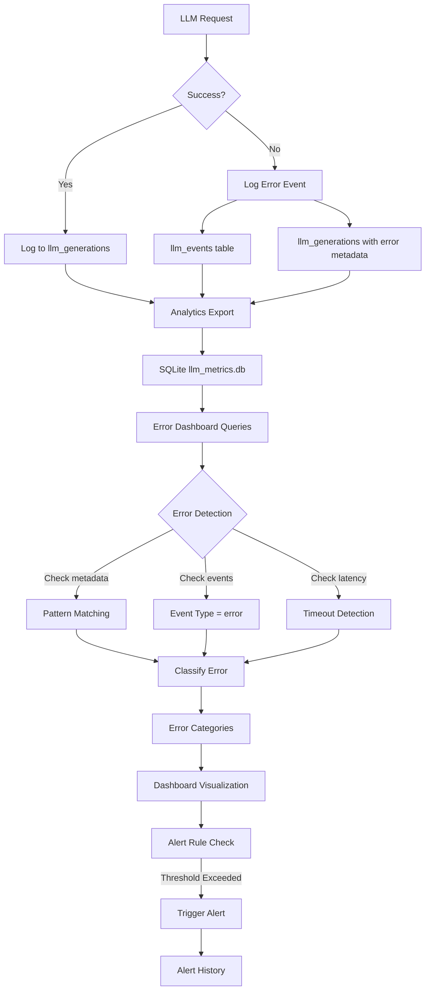
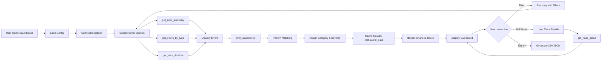
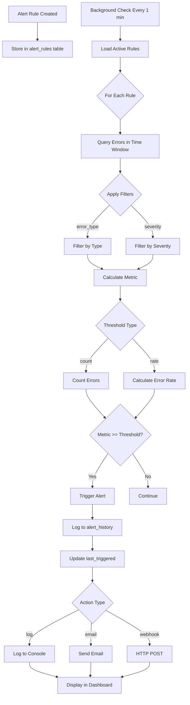

# PRIORITY 5.5: Streamlit Error Monitoring Dashboard - Technical Specification

**Document Version**: 1.0
**Created**: 2025-10-11
**Status**: Draft
**Estimated Duration**: 3-5 days (24-40 hours)
**Impact**: ⭐⭐⭐⭐⭐ (Critical)
**Sprint**: Sprint 9 (Demo: 2025-11-21)

---

## Executive Summary

Build a real-time error monitoring dashboard that visualizes runtime execution errors from Langfuse traces stored in SQLite. This dashboard provides comprehensive error analysis, trend detection, root cause identification, and configurable alerting to improve system reliability and debugging efficiency.

**Key Capabilities**:
- Real-time error detection and visualization from Langfuse traces
- Error categorization by type, severity, model, and agent
- Temporal trend analysis and pattern detection
- Deep trace inspection for root cause analysis
- Configurable alerts for critical errors
- Export capabilities for offline analysis

---

## Table of Contents

1. [Prerequisites & Dependencies](#1-prerequisites--dependencies)
2. [Architecture Overview](#2-architecture-overview)
3. [Data Model & Schema](#3-data-model--schema)
4. [Component Specifications](#4-component-specifications)
5. [Data Flow Diagrams](#5-data-flow-diagrams)
6. [Implementation Plan](#6-implementation-plan)
7. [Testing Strategy](#7-testing-strategy)
8. [Security Considerations](#8-security-considerations)
9. [Performance Requirements](#9-performance-requirements)
10. [Risk Analysis](#10-risk-analysis)
11. [Success Criteria](#11-success-criteria)

---

## 1. Prerequisites & Dependencies

### 1.1 Required Completions
- ✅ **PRIORITY 1**: Analytics & Observability infrastructure
  - SQLite database schema (`llm_metrics.db`)
  - Langfuse trace export pipeline
  - Analytics query framework

### 1.2 Technical Dependencies

**Python Packages** (already available):
```python
streamlit>=1.28.0          # Dashboard framework
pandas>=2.0.0              # Data manipulation
plotly>=5.17.0             # Interactive charts
sqlite3                    # Database (built-in)
```

**Database Requirements**:
- SQLite database at: `/path/to/llm_metrics.db`
- Tables required:
  - `llm_generations` (error data source)
  - `llm_traces` (trace context)
  - `llm_events` (fallback/error events)

### 1.3 Existing Infrastructure to Leverage

**Reusable Components** (from `streamlit_apps/analytics_dashboard/`):
- `config.py` - Database configuration management
- `queries/analytics_queries.py` - Base query patterns
- `components/charts.py` - Chart creation utilities
- `components/filters.py` - Date range and filter widgets
- `utils/format_utils.py` - Data formatting helpers
- `utils/export_utils.py` - Export functionality

**Database Schema** (from `coffee_maker/langchain_observe/analytics/db_schema.py`):
- `LLMGeneration` - Contains error metadata, latency, costs
- `LLMTrace` - Trace-level aggregation and context
- `LLMEvent` - Fallback and error events

---

## 2. Architecture Overview

### 2.1 System Architecture

```
┌─────────────────────────────────────────────────────────────────┐
│                    Streamlit Error Dashboard                     │
├─────────────────────────────────────────────────────────────────┤
│                                                                   │
│  ┌──────────────┐  ┌──────────────┐  ┌──────────────┐          │
│  │ Error        │  │ Trace        │  │ Trend        │          │
│  │ Overview     │  │ Explorer     │  │ Analysis     │          │
│  │ Page         │  │ Page         │  │ Page         │          │
│  └──────────────┘  └──────────────┘  └──────────────┘          │
│                                                                   │
│  ┌──────────────┐  ┌──────────────┐                            │
│  │ Model        │  │ Alerts       │                            │
│  │ Failures     │  │ Config       │                            │
│  │ Page         │  │ Page         │                            │
│  └──────────────┘  └──────────────┘                            │
│                                                                   │
├─────────────────────────────────────────────────────────────────┤
│                      Core Components Layer                        │
├─────────────────────────────────────────────────────────────────┤
│                                                                   │
│  ┌──────────────────────────────────────────────────────────┐  │
│  │ Error Cards  │ Error Charts │ Trace Viewer │ Alert Widget │  │
│  └──────────────────────────────────────────────────────────┘  │
│                                                                   │
├─────────────────────────────────────────────────────────────────┤
│                       Query Layer                                 │
├─────────────────────────────────────────────────────────────────┤
│                                                                   │
│  ┌──────────────────────────────┐  ┌─────────────────────────┐ │
│  │   error_queries.py           │  │   trace_queries.py      │ │
│  │   - get_error_summary()      │  │   - get_failed_traces() │ │
│  │   - get_errors_by_type()     │  │   - get_trace_detail()  │ │
│  │   - get_error_timeline()     │  │   - get_trace_spans()   │ │
│  └──────────────────────────────┘  └─────────────────────────┘ │
│                                                                   │
├─────────────────────────────────────────────────────────────────┤
│                       Utilities Layer                             │
├─────────────────────────────────────────────────────────────────┤
│                                                                   │
│  ┌──────────────────────┐  ┌──────────────────────────────────┐│
│  │ error_classifier.py  │  │    alert_manager.py              ││
│  │ - classify_error()   │  │    - check_thresholds()          ││
│  │ - extract_severity() │  │    - trigger_alert()             ││
│  │ - categorize()       │  │    - get_alert_config()          ││
│  └──────────────────────┘  └──────────────────────────────────┘│
│                                                                   │
└─────────────────────────────────────────────────────────────────┘
                              │
                              ▼
                    ┌─────────────────────┐
                    │  llm_metrics.db     │
                    │  (SQLite)           │
                    │                     │
                    │  - llm_generations  │
                    │  - llm_traces       │
                    │  - llm_events       │
                    └─────────────────────┘
```

### 2.2 Directory Structure

```
streamlit_apps/
└── error_monitoring_dashboard/
    ├── app.py                          # Main entry point, error overview
    ├── config.py                       # Dashboard configuration
    │
    ├── pages/
    │   ├── __init__.py
    │   ├── 01_🔍_trace_explorer.py     # Failed trace inspector
    │   ├── 02_📈_error_trends.py       # Temporal error analysis
    │   ├── 03_🤖_model_failures.py     # Model-specific errors
    │   └── 04_⚙️_alerts_config.py      # Alert configuration
    │
    ├── components/
    │   ├── __init__.py
    │   ├── error_cards.py              # Error summary metric cards
    │   ├── error_charts.py             # Error visualization charts
    │   ├── trace_viewer.py             # Trace detail viewer component
    │   └── alert_widget.py             # Alert notification widget
    │
    ├── queries/
    │   ├── __init__.py
    │   ├── error_queries.py            # Error extraction from DB
    │   └── trace_queries.py            # Trace detail queries
    │
    └── utils/
        ├── __init__.py
        ├── error_classifier.py         # Error categorization logic
        └── alert_manager.py            # Alert triggering logic
```

---

## 3. Data Model & Schema

### 3.1 Error Detection Strategy

**Errors are identified from `llm_generations` table based on**:

1. **Metadata Indicators**:
   - `metadata` field contains `error`, `exception`, or `status: failed`
   - Missing or NULL `completion_text` with non-zero latency
   - `latency_seconds` exceeds threshold (e.g., >30s timeout)

2. **Event Indicators** (from `llm_events` table):
   - `event_type = 'error'`
   - `event_name` contains `quota_exceeded`, `timeout`, `rate_limit_error`
   - `fallback_reason` indicates failure

3. **Cost/Token Anomalies**:
   - `cost_usd IS NULL` but `input_tokens > 0` (incomplete request)
   - `output_tokens = 0` with high latency (timeout/error)

### 3.2 Error Classification Schema

```python
# Error categories derived from metadata and events
ERROR_CATEGORIES = {
    "quota_exceeded": {
        "severity": "ERROR",
        "pattern": ["quota", "billing", "free tier", "account credit"],
        "description": "API quota or billing limit exceeded"
    },
    "rate_limit": {
        "severity": "WARNING",
        "pattern": ["rate limit", "429", "too many requests"],
        "description": "Rate limit exceeded"
    },
    "timeout": {
        "severity": "ERROR",
        "pattern": ["timeout", "timed out", "deadline exceeded"],
        "description": "Request timeout"
    },
    "authentication": {
        "severity": "CRITICAL",
        "pattern": ["auth", "401", "403", "unauthorized", "api key"],
        "description": "Authentication or authorization failure"
    },
    "model_error": {
        "severity": "ERROR",
        "pattern": ["model not found", "model unavailable", "invalid model"],
        "description": "Model availability or configuration error"
    },
    "validation_error": {
        "severity": "WARNING",
        "pattern": ["validation", "invalid input", "bad request", "400"],
        "description": "Input validation error"
    },
    "context_length": {
        "severity": "WARNING",
        "pattern": ["context length", "token limit", "max tokens"],
        "description": "Context length exceeded"
    },
    "server_error": {
        "severity": "ERROR",
        "pattern": ["500", "502", "503", "504", "server error", "internal error"],
        "description": "Provider server error"
    },
    "unknown": {
        "severity": "WARNING",
        "pattern": [],
        "description": "Unclassified error"
    }
}

ERROR_SEVERITY_LEVELS = ["CRITICAL", "ERROR", "WARNING", "INFO"]
```

### 3.3 Key Data Structures

**Error Summary Stats**:
```python
{
    "total_errors": int,
    "error_rate": float,  # errors / total_requests
    "critical_count": int,
    "error_count": int,
    "warning_count": int,
    "avg_error_latency": float,
    "total_failed_cost": float,
    "most_common_error": str,
    "error_trend": str  # "increasing", "decreasing", "stable"
}
```

**Error Record**:
```python
{
    "id": str,
    "trace_id": str,
    "created_at": datetime,
    "model": str,
    "provider": str,
    "error_type": str,  # from ERROR_CATEGORIES
    "severity": str,    # CRITICAL, ERROR, WARNING
    "error_message": str,
    "latency_seconds": float,
    "input_tokens": int,
    "cost_usd": float,
    "agent_name": str,  # from trace
    "metadata": dict
}
```

---

## 4. Component Specifications

### 4.1 Main App: `app.py` (Error Overview)

**Purpose**: Landing page with real-time error dashboard

**Layout**:
```python
# Streamlit page config
st.set_page_config(
    page_title="Error Monitoring Dashboard",
    page_icon="🚨",
    layout="wide",
    initial_sidebar_state="expanded"
)

# Layout structure:
# Row 1: Key Metrics (4 columns)
#   - Total Errors (24h)
#   - Error Rate (%)
#   - Critical Alerts
#   - Avg Error Latency

# Row 2: Error Distribution (2 columns)
#   - Error Types Pie Chart
#   - Severity Distribution Bar Chart

# Row 3: Recent Errors Timeline
#   - Time series line chart (last 24h)

# Row 4: Recent Critical Errors Table
#   - Top 10 most recent critical/error severity
```

**Key Functions**:
```python
def display_error_metrics(date_range: Tuple[datetime, datetime]) -> None:
    """Display 4 key metric cards."""
    stats = get_error_summary(db_path, date_range)

    col1, col2, col3, col4 = st.columns(4)
    with col1:
        st.metric("Total Errors", stats["total_errors"],
                  delta=calculate_delta(stats, "total_errors"))
    # ... similar for other metrics

def display_error_charts(date_range: Tuple[datetime, datetime]) -> None:
    """Display error distribution charts."""
    # Pie chart: errors by type
    # Bar chart: errors by severity

def display_error_timeline(date_range: Tuple[datetime, datetime]) -> None:
    """Display error timeline chart."""
    # Line chart with error count over time
```

**File**: `streamlit_apps/error_monitoring_dashboard/app.py` (280-320 lines)

---

### 4.2 Page 1: `01_🔍_trace_explorer.py`

**Purpose**: Deep dive into failed traces with full context

**Features**:
1. **Search & Filter**:
   - Filter by trace_id, agent_name, model, date range
   - Search by error message keywords
   - Sort by severity, timestamp, cost

2. **Trace List View**:
   - Expandable trace cards showing:
     - Trace ID, timestamp, agent, model
     - Error type, severity badge
     - Total cost, latency
     - Error message preview

3. **Trace Detail View** (when expanded):
   - Full trace metadata (JSON viewer)
   - All generations in trace (table)
   - Execution timeline (Gantt-style chart)
   - Related events (fallbacks, retries)
   - Cost breakdown
   - Copy trace ID button

**Key Functions**:
```python
def get_failed_traces(
    db_path: str,
    date_range: Tuple[datetime, datetime],
    filters: Dict[str, Any]
) -> pd.DataFrame:
    """Get all failed traces with filters."""
    # Query llm_traces joined with llm_generations
    # WHERE has errors based on detection strategy

def display_trace_card(trace: pd.Series) -> None:
    """Display expandable trace card with details."""
    with st.expander(f"🔴 {trace['trace_id']} - {trace['error_type']}"):
        # Display trace details, generations, events
        display_trace_timeline(trace['trace_id'])
        display_trace_metadata(trace)

def display_trace_timeline(trace_id: str) -> None:
    """Display execution timeline for trace."""
    # Plotly timeline/Gantt chart of generations
```

**File**: `streamlit_apps/error_monitoring_dashboard/pages/01_🔍_trace_explorer.py` (350-400 lines)

---

### 4.3 Page 2: `02_📈_error_trends.py`

**Purpose**: Temporal error analysis and pattern detection

**Features**:
1. **Time Series Analysis**:
   - Error count over time (hourly, daily, weekly)
   - Error rate trend line
   - Moving average overlay
   - Anomaly detection highlights

2. **Comparative Analysis**:
   - Error types stacked area chart
   - Model comparison (errors per model)
   - Agent comparison (errors per agent)
   - Provider comparison

3. **Pattern Detection**:
   - Peak error hours heatmap
   - Day-of-week patterns
   - Correlation analysis (cost vs errors, latency vs errors)

**Key Functions**:
```python
def get_error_timeline(
    db_path: str,
    date_range: Tuple[datetime, datetime],
    granularity: str = "hour"  # hour, day, week
) -> pd.DataFrame:
    """Get error counts over time."""
    # GROUP BY time bucket, error_type

def detect_anomalies(df: pd.DataFrame, threshold: float = 2.0) -> pd.DataFrame:
    """Detect anomalous error spikes (>2 std devs)."""
    # Calculate rolling mean and std
    # Flag anomalies

def display_error_heatmap(db_path: str, date_range: Tuple) -> None:
    """Display error patterns by hour and day."""
    # Similar to hourly usage heatmap in analytics dashboard
```

**File**: `streamlit_apps/error_monitoring_dashboard/pages/02_📈_error_trends.py` (300-350 lines)

---

### 4.4 Page 3: `03_🤖_model_failures.py`

**Purpose**: Model-specific error analysis

**Features**:
1. **Model Error Leaderboard**:
   - Table sorted by error count
   - Columns: model, total_errors, error_rate, common_error_type, avg_latency
   - Failure rate % (errors / total requests)

2. **Model Deep Dive** (select model from dropdown):
   - Error distribution pie chart (error types for this model)
   - Timeline of errors for this model
   - Recent errors table
   - Cost impact (failed request costs)

3. **Model Comparison**:
   - Side-by-side comparison (select 2-3 models)
   - Error rate comparison bar chart
   - Reliability score (100% - error_rate)

**Key Functions**:
```python
def get_model_error_stats(
    db_path: str,
    date_range: Tuple[datetime, datetime]
) -> pd.DataFrame:
    """Get error statistics by model."""
    # Query: GROUP BY model, error_type
    # Calculate error_rate, avg_latency

def get_model_errors(
    db_path: str,
    model: str,
    date_range: Tuple[datetime, datetime]
) -> pd.DataFrame:
    """Get all errors for specific model."""

def calculate_reliability_score(model_stats: pd.DataFrame) -> float:
    """Calculate reliability score (0-100)."""
    # 100 - (error_rate * 100)
```

**File**: `streamlit_apps/error_monitoring_dashboard/pages/03_🤖_model_failures.py` (280-320 lines)

---

### 4.5 Page 4: `04_⚙️_alerts_config.py`

**Purpose**: Configure error alerts and notifications

**Features**:
1. **Alert Rules Configuration**:
   - Create alert rules with:
     - Rule name
     - Error type filter (any, specific type)
     - Severity filter (CRITICAL, ERROR, WARNING)
     - Threshold (count or rate)
     - Time window (5min, 15min, 1hour)
     - Action (log, email, webhook)

2. **Active Alerts**:
   - List of currently triggered alerts
   - Alert history (last 24h)
   - Acknowledge/dismiss alerts

3. **Alert Testing**:
   - Test alert rules against historical data
   - Preview which errors would trigger alert

**Data Storage**:
```python
# Store in SQLite: alert_rules table
CREATE TABLE alert_rules (
    id INTEGER PRIMARY KEY,
    rule_name TEXT NOT NULL,
    error_type TEXT,  -- NULL = any
    severity TEXT,
    threshold_type TEXT,  -- "count" or "rate"
    threshold_value REAL,
    time_window_minutes INTEGER,
    action TEXT,  -- "log", "email", "webhook"
    is_active BOOLEAN DEFAULT 1,
    created_at TIMESTAMP,
    last_triggered TIMESTAMP
);

CREATE TABLE alert_history (
    id INTEGER PRIMARY KEY,
    rule_id INTEGER,
    triggered_at TIMESTAMP,
    error_count INTEGER,
    message TEXT,
    acknowledged BOOLEAN DEFAULT 0
);
```

**Key Functions**:
```python
def create_alert_rule(rule: Dict[str, Any]) -> None:
    """Save new alert rule to database."""

def check_alert_rules(db_path: str) -> List[Dict]:
    """Check all active rules, return triggered alerts."""
    # Query recent errors
    # For each rule, check if threshold exceeded

def display_alert_config_form() -> None:
    """Display form to create/edit alert rule."""
    with st.form("alert_rule"):
        rule_name = st.text_input("Rule Name")
        error_type = st.selectbox("Error Type", ["Any", ...])
        # ... other inputs
        submit = st.form_submit_button("Create Alert")
```

**File**: `streamlit_apps/error_monitoring_dashboard/pages/04_⚙️_alerts_config.py` (350-400 lines)

---

### 4.6 Component: `components/error_cards.py`

**Purpose**: Reusable metric card components

**Functions**:
```python
def metric_card(
    title: str,
    value: Union[int, float, str],
    delta: Optional[float] = None,
    delta_color: str = "normal",
    icon: str = "📊"
) -> None:
    """Display metric card with optional delta."""
    st.metric(
        label=f"{icon} {title}",
        value=value,
        delta=delta,
        delta_color=delta_color
    )

def error_severity_badge(severity: str) -> str:
    """Return HTML badge for error severity."""
    colors = {
        "CRITICAL": "#dc3545",  # red
        "ERROR": "#fd7e14",     # orange
        "WARNING": "#ffc107",   # yellow
        "INFO": "#0dcaf0"       # cyan
    }
    return f'<span style="background-color: {colors[severity]}; ...">{severity}</span>'

def error_type_icon(error_type: str) -> str:
    """Return emoji icon for error type."""
    icons = {
        "quota_exceeded": "💳",
        "rate_limit": "⏱️",
        "timeout": "⏰",
        "authentication": "🔐",
        # ...
    }
    return icons.get(error_type, "❓")
```

**File**: `streamlit_apps/error_monitoring_dashboard/components/error_cards.py` (120-150 lines)

---

### 4.7 Component: `components/error_charts.py`

**Purpose**: Error-specific chart creation

**Functions**:
```python
def create_error_distribution_pie(df: pd.DataFrame) -> go.Figure:
    """Pie chart of errors by type."""
    # df: columns = error_type, count
    fig = px.pie(df, values="count", names="error_type", ...)
    return fig

def create_error_timeline(df: pd.DataFrame) -> go.Figure:
    """Line chart of errors over time."""
    # df: columns = timestamp, error_count
    fig = px.line(df, x="timestamp", y="error_count", ...)
    # Add threshold line
    # Add anomaly markers
    return fig

def create_severity_distribution(df: pd.DataFrame) -> go.Figure:
    """Stacked bar chart of severity distribution."""
    fig = px.bar(df, x="date", y="count", color="severity", ...)
    return fig

def create_error_heatmap(df: pd.DataFrame) -> go.Figure:
    """Heatmap of errors by hour and day."""
    # Similar to usage heatmap from analytics dashboard
    pivot = df.pivot_table(...)
    fig = go.Figure(data=go.Heatmap(...))
    return fig

def create_trace_timeline(trace_data: pd.DataFrame) -> go.Figure:
    """Gantt-style timeline of trace execution."""
    # trace_data: columns = generation_id, start_time, end_time, model, error
    fig = go.Figure()
    for idx, row in trace_data.iterrows():
        fig.add_trace(go.Scatter(
            x=[row["start_time"], row["end_time"]],
            y=[row["model"], row["model"]],
            mode="lines",
            line=dict(width=10, color="red" if row["error"] else "green")
        ))
    return fig
```

**File**: `streamlit_apps/error_monitoring_dashboard/components/error_charts.py` (280-320 lines)

---

### 4.8 Component: `components/trace_viewer.py`

**Purpose**: Trace detail viewer component

**Functions**:
```python
def display_trace_viewer(trace_id: str, db_path: str) -> None:
    """Display complete trace details."""
    trace = get_trace_detail(db_path, trace_id)

    # Header
    st.subheader(f"Trace: {trace_id}")

    # Tabs
    tab1, tab2, tab3, tab4 = st.tabs([
        "Overview", "Generations", "Events", "Metadata"
    ])

    with tab1:
        display_trace_overview(trace)
    with tab2:
        display_trace_generations(trace_id, db_path)
    with tab3:
        display_trace_events(trace_id, db_path)
    with tab4:
        display_trace_metadata(trace)

def display_trace_overview(trace: Dict) -> None:
    """Display trace summary metrics."""
    col1, col2, col3, col4 = st.columns(4)
    col1.metric("Total Cost", f"${trace['total_cost']:.4f}")
    col2.metric("Generations", trace['total_generations'])
    col3.metric("Errors", trace['error_count'])
    col4.metric("Duration", f"{trace['duration_seconds']:.2f}s")

def display_trace_generations(trace_id: str, db_path: str) -> None:
    """Display all generations in trace."""
    gens = get_trace_generations(db_path, trace_id)
    st.dataframe(gens, use_container_width=True)

def display_trace_events(trace_id: str, db_path: str) -> None:
    """Display all events in trace."""
    events = get_trace_events(db_path, trace_id)
    for event in events:
        with st.expander(f"{event['event_name']} - {event['created_at']}"):
            st.json(event['metadata'])
```

**File**: `streamlit_apps/error_monitoring_dashboard/components/trace_viewer.py` (200-250 lines)

---

### 4.9 Component: `components/alert_widget.py`

**Purpose**: Alert notification widget

**Functions**:
```python
def display_active_alerts(db_path: str) -> None:
    """Display active alerts banner."""
    alerts = get_active_alerts(db_path)

    if alerts:
        st.warning(f"⚠️ {len(alerts)} active alerts")
        for alert in alerts:
            with st.expander(f"{alert['rule_name']} - {alert['triggered_at']}"):
                st.write(alert['message'])
                if st.button(f"Acknowledge {alert['id']}", key=f"ack_{alert['id']}"):
                    acknowledge_alert(db_path, alert['id'])
                    st.rerun()

def alert_notification(
    severity: str,
    message: str,
    auto_dismiss: int = 5
) -> None:
    """Display alert notification."""
    if severity == "CRITICAL":
        st.error(message, icon="🚨")
    elif severity == "ERROR":
        st.error(message, icon="❌")
    elif severity == "WARNING":
        st.warning(message, icon="⚠️")
    else:
        st.info(message, icon="ℹ️")
```

**File**: `streamlit_apps/error_monitoring_dashboard/components/alert_widget.py` (100-120 lines)

---

### 4.10 Queries: `queries/error_queries.py`

**Purpose**: Error detection and extraction queries

**Key Functions**:
```python
import sqlite3
from datetime import datetime
from typing import Dict, List, Optional, Tuple
import pandas as pd
import streamlit as st

@st.cache_data(ttl=60)  # Cache for 1 minute (real-time)
def get_error_summary(
    db_path: str,
    date_range: Tuple[datetime, datetime]
) -> Dict[str, any]:
    """Get error summary statistics.

    Returns:
        {
            "total_errors": int,
            "error_rate": float,
            "critical_count": int,
            "error_count": int,
            "warning_count": int,
            "avg_error_latency": float,
            "total_failed_cost": float,
            "most_common_error": str
        }
    """
    conn = sqlite3.connect(db_path)

    # Get total requests for error rate
    total_query = """
        SELECT COUNT(*) as total
        FROM llm_generations
        WHERE created_at BETWEEN ? AND ?
    """
    total = pd.read_sql_query(total_query, conn, params=date_range).iloc[0]["total"]

    # Get error stats
    error_query = """
        SELECT
            COUNT(*) as total_errors,
            AVG(latency_seconds) as avg_latency,
            SUM(cost_usd) as total_cost,
            metadata
        FROM llm_generations g
        LEFT JOIN llm_events e ON g.id = e.observation_id
        WHERE g.created_at BETWEEN ? AND ?
        AND (
            e.event_type = 'error'
            OR g.completion_text IS NULL
            OR g.metadata LIKE '%error%'
            OR g.latency_seconds > 30
        )
    """

    df = pd.read_sql_query(error_query, conn, params=date_range)

    # Classify errors by severity (parse metadata)
    errors_by_severity = classify_errors_by_severity(db_path, date_range)

    conn.close()

    return {
        "total_errors": int(df.iloc[0]["total_errors"]),
        "error_rate": df.iloc[0]["total_errors"] / total if total > 0 else 0,
        "critical_count": errors_by_severity.get("CRITICAL", 0),
        "error_count": errors_by_severity.get("ERROR", 0),
        "warning_count": errors_by_severity.get("WARNING", 0),
        "avg_error_latency": float(df.iloc[0]["avg_latency"] or 0),
        "total_failed_cost": float(df.iloc[0]["total_cost"] or 0),
        "most_common_error": get_most_common_error_type(db_path, date_range)
    }

@st.cache_data(ttl=60)
def get_errors_by_type(
    db_path: str,
    date_range: Tuple[datetime, datetime]
) -> pd.DataFrame:
    """Get error counts grouped by type.

    Returns:
        DataFrame with columns: error_type, count, severity
    """
    conn = sqlite3.connect(db_path)

    query = """
        SELECT
            g.id,
            g.created_at,
            g.model,
            g.metadata,
            e.event_name,
            e.fallback_reason
        FROM llm_generations g
        LEFT JOIN llm_events e ON g.id = e.observation_id
        WHERE g.created_at BETWEEN ? AND ?
        AND (
            e.event_type = 'error'
            OR g.completion_text IS NULL
            OR g.metadata LIKE '%error%'
            OR g.latency_seconds > 30
        )
    """

    df = pd.read_sql_query(query, conn, params=date_range)
    conn.close()

    # Classify each error
    from ..utils.error_classifier import classify_error
    df["error_type"] = df.apply(
        lambda row: classify_error(row["metadata"], row["event_name"], row["fallback_reason"]),
        axis=1
    )
    df["severity"] = df["error_type"].apply(get_severity_for_type)

    # Group by type
    result = df.groupby(["error_type", "severity"]).size().reset_index(name="count")
    return result

@st.cache_data(ttl=60)
def get_error_timeline(
    db_path: str,
    date_range: Tuple[datetime, datetime],
    granularity: str = "hour"  # hour, day
) -> pd.DataFrame:
    """Get error counts over time.

    Returns:
        DataFrame with columns: timestamp, error_count, error_type
    """
    conn = sqlite3.connect(db_path)

    # Determine time bucket
    if granularity == "hour":
        time_bucket = "strftime('%Y-%m-%d %H:00:00', g.created_at)"
    else:  # day
        time_bucket = "DATE(g.created_at)"

    query = f"""
        SELECT
            {time_bucket} as timestamp,
            COUNT(*) as error_count
        FROM llm_generations g
        LEFT JOIN llm_events e ON g.id = e.observation_id
        WHERE g.created_at BETWEEN ? AND ?
        AND (
            e.event_type = 'error'
            OR g.completion_text IS NULL
            OR g.metadata LIKE '%error%'
        )
        GROUP BY timestamp
        ORDER BY timestamp ASC
    """

    df = pd.read_sql_query(query, conn, params=date_range)
    df["timestamp"] = pd.to_datetime(df["timestamp"])
    conn.close()

    return df

@st.cache_data(ttl=60)
def get_model_error_stats(
    db_path: str,
    date_range: Tuple[datetime, datetime]
) -> pd.DataFrame:
    """Get error statistics by model.

    Returns:
        DataFrame with columns: model, total_errors, error_rate,
                                 avg_latency, total_cost
    """
    conn = sqlite3.connect(db_path)

    # Get total requests per model
    total_query = """
        SELECT
            model,
            COUNT(*) as total_requests
        FROM llm_generations
        WHERE created_at BETWEEN ? AND ?
        GROUP BY model
    """
    total_df = pd.read_sql_query(total_query, conn, params=date_range)

    # Get error requests per model
    error_query = """
        SELECT
            g.model,
            COUNT(*) as total_errors,
            AVG(g.latency_seconds) as avg_latency,
            SUM(g.cost_usd) as total_cost
        FROM llm_generations g
        LEFT JOIN llm_events e ON g.id = e.observation_id
        WHERE g.created_at BETWEEN ? AND ?
        AND (
            e.event_type = 'error'
            OR g.completion_text IS NULL
            OR g.metadata LIKE '%error%'
        )
        GROUP BY g.model
    """
    error_df = pd.read_sql_query(error_query, conn, params=date_range)

    conn.close()

    # Merge and calculate error rate
    result = error_df.merge(total_df, on="model", how="left")
    result["error_rate"] = result["total_errors"] / result["total_requests"]

    return result.sort_values("total_errors", ascending=False)

def get_most_common_error_type(
    db_path: str,
    date_range: Tuple[datetime, datetime]
) -> str:
    """Get the most common error type."""
    df = get_errors_by_type(db_path, date_range)
    if df.empty:
        return "None"
    return df.sort_values("count", ascending=False).iloc[0]["error_type"]

def classify_errors_by_severity(
    db_path: str,
    date_range: Tuple[datetime, datetime]
) -> Dict[str, int]:
    """Count errors by severity level."""
    df = get_errors_by_type(db_path, date_range)
    return df.groupby("severity")["count"].sum().to_dict()

def get_severity_for_type(error_type: str) -> str:
    """Get severity level for error type."""
    from ..utils.error_classifier import ERROR_CATEGORIES
    return ERROR_CATEGORIES.get(error_type, {}).get("severity", "WARNING")
```

**File**: `streamlit_apps/error_monitoring_dashboard/queries/error_queries.py` (350-400 lines)

---

### 4.11 Queries: `queries/trace_queries.py`

**Purpose**: Trace-level queries for error analysis

**Key Functions**:
```python
import sqlite3
from typing import Dict, List, Optional
import pandas as pd
import streamlit as st

@st.cache_data(ttl=300)  # Cache for 5 minutes
def get_failed_traces(
    db_path: str,
    date_range: Tuple[datetime, datetime],
    filters: Optional[Dict[str, Any]] = None
) -> pd.DataFrame:
    """Get all traces with errors.

    Args:
        filters: {
            "agent_name": str,
            "model": str,
            "error_type": str,
            "severity": str
        }

    Returns:
        DataFrame with columns: trace_id, created_at, agent_name,
                                 error_count, error_type, severity,
                                 total_cost, total_latency
    """
    conn = sqlite3.connect(db_path)

    where_clauses = ["t.created_at BETWEEN ? AND ?"]
    params = list(date_range)

    if filters:
        if filters.get("agent_name"):
            where_clauses.append("t.name = ?")
            params.append(filters["agent_name"])
        if filters.get("model"):
            where_clauses.append("g.model = ?")
            params.append(filters["model"])

    where_sql = " AND ".join(where_clauses)

    query = f"""
        SELECT
            t.trace_id,
            t.created_at,
            t.name as agent_name,
            COUNT(CASE WHEN e.event_type = 'error' THEN 1 END) as error_count,
            t.total_cost_usd,
            SUM(g.latency_seconds) as total_latency
        FROM llm_traces t
        JOIN llm_generations g ON t.trace_id = g.trace_id
        LEFT JOIN llm_events e ON g.id = e.observation_id
        WHERE {where_sql}
        GROUP BY t.trace_id
        HAVING error_count > 0
        ORDER BY t.created_at DESC
    """

    df = pd.read_sql_query(query, conn, params=params)
    conn.close()

    # Classify error type for each trace (get first error)
    df["error_type"] = df["trace_id"].apply(
        lambda tid: get_trace_primary_error_type(db_path, tid)
    )
    df["severity"] = df["error_type"].apply(get_severity_for_type)

    return df

@st.cache_data(ttl=300)
def get_trace_detail(db_path: str, trace_id: str) -> Dict:
    """Get complete trace details.

    Returns:
        {
            "trace_id": str,
            "created_at": datetime,
            "agent_name": str,
            "total_cost": float,
            "total_generations": int,
            "error_count": int,
            "duration_seconds": float,
            "metadata": dict
        }
    """
    conn = sqlite3.connect(db_path)

    query = """
        SELECT
            t.*,
            COUNT(g.id) as generation_count,
            COUNT(CASE WHEN e.event_type = 'error' THEN 1 END) as error_count,
            MIN(g.start_time) as trace_start,
            MAX(g.end_time) as trace_end
        FROM llm_traces t
        JOIN llm_generations g ON t.trace_id = g.trace_id
        LEFT JOIN llm_events e ON g.id = e.observation_id
        WHERE t.trace_id = ?
        GROUP BY t.trace_id
    """

    df = pd.read_sql_query(query, conn, params=[trace_id])
    conn.close()

    if df.empty:
        return {}

    row = df.iloc[0]

    # Calculate duration
    import json
    duration = (
        pd.to_datetime(row["trace_end"]) - pd.to_datetime(row["trace_start"])
    ).total_seconds()

    return {
        "trace_id": row["trace_id"],
        "created_at": row["created_at"],
        "agent_name": row["name"],
        "total_cost": row["total_cost_usd"],
        "total_generations": row["generation_count"],
        "error_count": row["error_count"],
        "duration_seconds": duration,
        "metadata": json.loads(row["metadata"]) if row["metadata"] else {}
    }

@st.cache_data(ttl=300)
def get_trace_generations(db_path: str, trace_id: str) -> pd.DataFrame:
    """Get all generations in a trace.

    Returns:
        DataFrame with generation details
    """
    conn = sqlite3.connect(db_path)

    query = """
        SELECT
            g.id,
            g.created_at,
            g.model,
            g.input_tokens,
            g.output_tokens,
            g.cost_usd,
            g.latency_seconds,
            g.metadata,
            e.event_type,
            e.event_name
        FROM llm_generations g
        LEFT JOIN llm_events e ON g.id = e.observation_id
        WHERE g.trace_id = ?
        ORDER BY g.created_at ASC
    """

    df = pd.read_sql_query(query, conn, params=[trace_id])
    conn.close()

    # Add error indicator
    df["has_error"] = df["event_type"] == "error"

    return df

@st.cache_data(ttl=300)
def get_trace_events(db_path: str, trace_id: str) -> pd.DataFrame:
    """Get all events in a trace."""
    conn = sqlite3.connect(db_path)

    query = """
        SELECT *
        FROM llm_events
        WHERE trace_id = ?
        ORDER BY created_at ASC
    """

    df = pd.read_sql_query(query, conn, params=[trace_id])
    conn.close()

    return df

def get_trace_primary_error_type(db_path: str, trace_id: str) -> str:
    """Get the primary error type for a trace (first error)."""
    events = get_trace_events(db_path, trace_id)
    if events.empty:
        return "unknown"

    first_error = events[events["event_type"] == "error"].iloc[0] if len(events) > 0 else None
    if not first_error:
        return "unknown"

    from ..utils.error_classifier import classify_error
    return classify_error(
        first_error.get("metadata"),
        first_error.get("event_name"),
        first_error.get("fallback_reason")
    )
```

**File**: `streamlit_apps/error_monitoring_dashboard/queries/trace_queries.py` (280-320 lines)

---

### 4.12 Utility: `utils/error_classifier.py`

**Purpose**: Error classification and categorization logic

```python
import re
from typing import Dict, Optional

ERROR_CATEGORIES = {
    "quota_exceeded": {
        "severity": "ERROR",
        "patterns": [
            r"quota",
            r"billing.*exceeded",
            r"free tier",
            r"account credit",
            r"insufficient.*funds"
        ],
        "description": "API quota or billing limit exceeded"
    },
    "rate_limit": {
        "severity": "WARNING",
        "patterns": [
            r"rate limit",
            r"429",
            r"too many requests",
            r"rate_limit_exceeded"
        ],
        "description": "Rate limit exceeded"
    },
    "timeout": {
        "severity": "ERROR",
        "patterns": [
            r"timeout",
            r"timed out",
            r"deadline exceeded",
            r"request.*timeout"
        ],
        "description": "Request timeout"
    },
    "authentication": {
        "severity": "CRITICAL",
        "patterns": [
            r"auth",
            r"401",
            r"403",
            r"unauthorized",
            r"api key",
            r"invalid.*key"
        ],
        "description": "Authentication or authorization failure"
    },
    "model_error": {
        "severity": "ERROR",
        "patterns": [
            r"model not found",
            r"model.*unavailable",
            r"invalid model",
            r"model.*not.*supported"
        ],
        "description": "Model availability or configuration error"
    },
    "validation_error": {
        "severity": "WARNING",
        "patterns": [
            r"validation",
            r"invalid input",
            r"bad request",
            r"400"
        ],
        "description": "Input validation error"
    },
    "context_length": {
        "severity": "WARNING",
        "patterns": [
            r"context length",
            r"token limit",
            r"max.*tokens",
            r"context.*exceeded"
        ],
        "description": "Context length exceeded"
    },
    "server_error": {
        "severity": "ERROR",
        "patterns": [
            r"500",
            r"502",
            r"503",
            r"504",
            r"server error",
            r"internal.*error"
        ],
        "description": "Provider server error"
    },
    "unknown": {
        "severity": "WARNING",
        "patterns": [],
        "description": "Unclassified error"
    }
}

def classify_error(
    metadata: Optional[str],
    event_name: Optional[str],
    fallback_reason: Optional[str]
) -> str:
    """Classify error based on metadata, event name, and fallback reason.

    Args:
        metadata: Generation metadata (JSON string)
        event_name: Event name from llm_events
        fallback_reason: Fallback reason from llm_events

    Returns:
        Error category key (e.g., "quota_exceeded", "timeout")
    """
    # Combine all text for pattern matching
    text_to_check = " ".join([
        str(metadata or ""),
        str(event_name or ""),
        str(fallback_reason or "")
    ]).lower()

    # Check each category
    for category, config in ERROR_CATEGORIES.items():
        if category == "unknown":
            continue

        for pattern in config["patterns"]:
            if re.search(pattern, text_to_check, re.IGNORECASE):
                return category

    return "unknown"

def extract_severity(error_type: str) -> str:
    """Get severity level for error type."""
    return ERROR_CATEGORIES.get(error_type, {}).get("severity", "WARNING")

def get_error_description(error_type: str) -> str:
    """Get human-readable description for error type."""
    return ERROR_CATEGORIES.get(error_type, {}).get("description", "Unknown error")

def categorize_errors(errors_df: pd.DataFrame) -> pd.DataFrame:
    """Add error_type and severity columns to errors DataFrame.

    Args:
        errors_df: DataFrame with columns: metadata, event_name, fallback_reason

    Returns:
        DataFrame with added columns: error_type, severity, description
    """
    errors_df["error_type"] = errors_df.apply(
        lambda row: classify_error(
            row.get("metadata"),
            row.get("event_name"),
            row.get("fallback_reason")
        ),
        axis=1
    )
    errors_df["severity"] = errors_df["error_type"].apply(extract_severity)
    errors_df["description"] = errors_df["error_type"].apply(get_error_description)

    return errors_df
```

**File**: `streamlit_apps/error_monitoring_dashboard/utils/error_classifier.py` (180-220 lines)

---

### 4.13 Utility: `utils/alert_manager.py`

**Purpose**: Alert rule evaluation and triggering

```python
import sqlite3
from datetime import datetime, timedelta
from typing import Dict, List, Optional
import pandas as pd

def create_alert_tables(db_path: str) -> None:
    """Create alert_rules and alert_history tables if not exist."""
    conn = sqlite3.connect(db_path)
    cursor = conn.cursor()

    cursor.execute("""
        CREATE TABLE IF NOT EXISTS alert_rules (
            id INTEGER PRIMARY KEY AUTOINCREMENT,
            rule_name TEXT NOT NULL,
            error_type TEXT,
            severity TEXT,
            threshold_type TEXT NOT NULL,
            threshold_value REAL NOT NULL,
            time_window_minutes INTEGER NOT NULL,
            action TEXT NOT NULL,
            is_active BOOLEAN DEFAULT 1,
            created_at TIMESTAMP DEFAULT CURRENT_TIMESTAMP,
            last_triggered TIMESTAMP
        )
    """)

    cursor.execute("""
        CREATE TABLE IF NOT EXISTS alert_history (
            id INTEGER PRIMARY KEY AUTOINCREMENT,
            rule_id INTEGER NOT NULL,
            triggered_at TIMESTAMP DEFAULT CURRENT_TIMESTAMP,
            error_count INTEGER,
            message TEXT,
            acknowledged BOOLEAN DEFAULT 0,
            FOREIGN KEY (rule_id) REFERENCES alert_rules(id)
        )
    """)

    conn.commit()
    conn.close()

def create_alert_rule(db_path: str, rule: Dict) -> int:
    """Create new alert rule.

    Args:
        rule: {
            "rule_name": str,
            "error_type": str (optional, NULL = any),
            "severity": str (optional),
            "threshold_type": "count" or "rate",
            "threshold_value": float,
            "time_window_minutes": int,
            "action": "log" or "email" or "webhook"
        }

    Returns:
        Rule ID
    """
    create_alert_tables(db_path)

    conn = sqlite3.connect(db_path)
    cursor = conn.cursor()

    cursor.execute("""
        INSERT INTO alert_rules (
            rule_name, error_type, severity, threshold_type,
            threshold_value, time_window_minutes, action
        ) VALUES (?, ?, ?, ?, ?, ?, ?)
    """, (
        rule["rule_name"],
        rule.get("error_type"),
        rule.get("severity"),
        rule["threshold_type"],
        rule["threshold_value"],
        rule["time_window_minutes"],
        rule["action"]
    ))

    rule_id = cursor.lastrowid
    conn.commit()
    conn.close()

    return rule_id

def get_active_alert_rules(db_path: str) -> pd.DataFrame:
    """Get all active alert rules."""
    create_alert_tables(db_path)

    conn = sqlite3.connect(db_path)
    df = pd.read_sql_query(
        "SELECT * FROM alert_rules WHERE is_active = 1",
        conn
    )
    conn.close()

    return df

def check_alert_rules(db_path: str) -> List[Dict]:
    """Check all active alert rules and return triggered alerts.

    Returns:
        List of triggered alerts with rule info and error details
    """
    rules = get_active_alert_rules(db_path)
    triggered_alerts = []

    for _, rule in rules.iterrows():
        # Get errors in time window
        window_start = datetime.now() - timedelta(minutes=rule["time_window_minutes"])
        window_end = datetime.now()

        # Build query based on rule filters
        from ..queries.error_queries import get_errors_by_type
        errors = get_errors_by_type(db_path, (window_start, window_end))

        # Filter by error_type and severity if specified
        if rule["error_type"]:
            errors = errors[errors["error_type"] == rule["error_type"]]
        if rule["severity"]:
            errors = errors[errors["severity"] == rule["severity"]]

        # Calculate metric
        if rule["threshold_type"] == "count":
            metric_value = len(errors)
        else:  # rate
            # Get total requests in window
            conn = sqlite3.connect(db_path)
            total_query = """
                SELECT COUNT(*) as total
                FROM llm_generations
                WHERE created_at BETWEEN ? AND ?
            """
            total = pd.read_sql_query(
                total_query, conn,
                params=[window_start, window_end]
            ).iloc[0]["total"]
            conn.close()

            metric_value = len(errors) / total if total > 0 else 0

        # Check threshold
        if metric_value >= rule["threshold_value"]:
            alert = {
                "rule_id": rule["id"],
                "rule_name": rule["rule_name"],
                "triggered_at": datetime.now(),
                "metric_value": metric_value,
                "threshold": rule["threshold_value"],
                "error_count": len(errors),
                "message": format_alert_message(rule, metric_value, len(errors))
            }
            triggered_alerts.append(alert)

            # Log to alert_history
            log_alert(db_path, alert)

            # Update last_triggered
            update_last_triggered(db_path, rule["id"])

    return triggered_alerts

def format_alert_message(rule: Dict, metric_value: float, error_count: int) -> str:
    """Format alert message."""
    if rule["threshold_type"] == "count":
        return (
            f"🚨 Alert: {rule['rule_name']}\n"
            f"Error count ({error_count}) exceeded threshold ({rule['threshold_value']}) "
            f"in last {rule['time_window_minutes']} minutes"
        )
    else:  # rate
        return (
            f"🚨 Alert: {rule['rule_name']}\n"
            f"Error rate ({metric_value:.2%}) exceeded threshold ({rule['threshold_value']:.2%}) "
            f"in last {rule['time_window_minutes']} minutes"
        )

def log_alert(db_path: str, alert: Dict) -> None:
    """Log triggered alert to alert_history."""
    conn = sqlite3.connect(db_path)
    cursor = conn.cursor()

    cursor.execute("""
        INSERT INTO alert_history (
            rule_id, triggered_at, error_count, message
        ) VALUES (?, ?, ?, ?)
    """, (
        alert["rule_id"],
        alert["triggered_at"],
        alert["error_count"],
        alert["message"]
    ))

    conn.commit()
    conn.close()

def update_last_triggered(db_path: str, rule_id: int) -> None:
    """Update last_triggered timestamp for rule."""
    conn = sqlite3.connect(db_path)
    cursor = conn.cursor()

    cursor.execute("""
        UPDATE alert_rules
        SET last_triggered = ?
        WHERE id = ?
    """, (datetime.now(), rule_id))

    conn.commit()
    conn.close()

def get_active_alerts(db_path: str, hours: int = 24) -> pd.DataFrame:
    """Get recent unacknowledged alerts."""
    create_alert_tables(db_path)

    conn = sqlite3.connect(db_path)
    cutoff = datetime.now() - timedelta(hours=hours)

    df = pd.read_sql_query("""
        SELECT
            ah.*,
            ar.rule_name
        FROM alert_history ah
        JOIN alert_rules ar ON ah.rule_id = ar.id
        WHERE ah.acknowledged = 0
        AND ah.triggered_at > ?
        ORDER BY ah.triggered_at DESC
    """, conn, params=[cutoff])

    conn.close()

    return df

def acknowledge_alert(db_path: str, alert_id: int) -> None:
    """Mark alert as acknowledged."""
    conn = sqlite3.connect(db_path)
    cursor = conn.cursor()

    cursor.execute("""
        UPDATE alert_history
        SET acknowledged = 1
        WHERE id = ?
    """, (alert_id,))

    conn.commit()
    conn.close()

def delete_alert_rule(db_path: str, rule_id: int) -> None:
    """Delete alert rule."""
    conn = sqlite3.connect(db_path)
    cursor = conn.cursor()

    cursor.execute("DELETE FROM alert_rules WHERE id = ?", (rule_id,))

    conn.commit()
    conn.close()
```

**File**: `streamlit_apps/error_monitoring_dashboard/utils/alert_manager.py` (320-360 lines)

---

## 5. Data Flow Diagrams

### 5.1 Error Detection Flow



### 5.2 Dashboard Query Flow



### 5.3 Alert Evaluation Flow



---

## 6. Implementation Plan

### 6.1 Phase 1: Core Infrastructure (Day 1 - 6-8 hours)

**Task 1.1: Project Setup** (1 hour)
- Create directory structure
- Copy reusable components from analytics dashboard
- Setup configuration files

```bash
# Commands
mkdir -p streamlit_apps/error_monitoring_dashboard/{pages,components,queries,utils}
touch streamlit_apps/error_monitoring_dashboard/{app.py,config.py}
touch streamlit_apps/error_monitoring_dashboard/pages/{01_trace_explorer.py,02_error_trends.py,03_model_failures.py,04_alerts_config.py}
```

**Task 1.2: Database Schema Extensions** (2 hours)
- Create alert_rules and alert_history tables
- File: `utils/alert_manager.py` - `create_alert_tables()`
- Test table creation

**Task 1.3: Error Classification System** (3-4 hours)
- Implement `utils/error_classifier.py`
- Define ERROR_CATEGORIES
- Implement `classify_error()`, `extract_severity()`, `categorize_errors()`
- Write unit tests for classification logic

---

### 6.2 Phase 2: Query Layer (Day 1-2 - 8-10 hours)

**Task 2.1: Error Queries** (4-5 hours)
- File: `queries/error_queries.py`
- Implement:
  - `get_error_summary()` - Overall stats
  - `get_errors_by_type()` - Group by category
  - `get_error_timeline()` - Time series
  - `get_model_error_stats()` - Model breakdown
- Add @st.cache_data decorators (ttl=60 for real-time)
- Test queries against sample error data

**Task 2.2: Trace Queries** (4-5 hours)
- File: `queries/trace_queries.py`
- Implement:
  - `get_failed_traces()` - List failed traces
  - `get_trace_detail()` - Trace overview
  - `get_trace_generations()` - Generations in trace
  - `get_trace_events()` - Events in trace
- Test with real trace data

---

### 6.3 Phase 3: Visualization Components (Day 2-3 - 8-10 hours)

**Task 3.1: Error Cards Component** (2 hours)
- File: `components/error_cards.py`
- Implement metric cards, severity badges, error icons
- Create reusable card layouts

**Task 3.2: Error Charts Component** (4-5 hours)
- File: `components/error_charts.py`
- Implement:
  - `create_error_distribution_pie()`
  - `create_error_timeline()`
  - `create_severity_distribution()`
  - `create_error_heatmap()`
  - `create_trace_timeline()`
- Style charts with error-specific color schemes

**Task 3.3: Trace Viewer Component** (2-3 hours)
- File: `components/trace_viewer.py`
- Build expandable trace detail view
- Tabbed interface (Overview, Generations, Events, Metadata)

**Task 3.4: Alert Widget Component** (1 hour)
- File: `components/alert_widget.py`
- Active alerts banner
- Alert acknowledgment interface

---

### 6.4 Phase 4: Main Dashboard & Pages (Day 3-4 - 10-12 hours)

**Task 4.1: Main App - Error Overview** (3-4 hours)
- File: `app.py`
- Page config and layout
- Key metrics row (4 cards)
- Error distribution charts (2 columns)
- Recent errors timeline
- Critical errors table
- Sidebar: date range, filters, active alerts widget

**Task 4.2: Trace Explorer Page** (3-4 hours)
- File: `pages/01_🔍_trace_explorer.py`
- Search and filter interface
- Trace list with expandable cards
- Trace detail viewer integration
- Export failed traces button

**Task 4.3: Error Trends Page** (2-3 hours)
- File: `pages/02_📈_error_trends.py`
- Time series charts (hourly, daily)
- Stacked area chart by type
- Error heatmap by hour/day
- Anomaly detection visualization

**Task 4.4: Model Failures Page** (2-3 hours)
- File: `pages/03_🤖_model_failures.py`
- Model error leaderboard table
- Model selection dropdown
- Model-specific charts and stats
- Model comparison interface

---

### 6.5 Phase 5: Alert System (Day 4-5 - 6-8 hours)

**Task 5.1: Alert Manager Logic** (3-4 hours)
- File: `utils/alert_manager.py`
- Implement:
  - `create_alert_rule()`
  - `check_alert_rules()`
  - `get_active_alerts()`
  - `acknowledge_alert()`
  - `delete_alert_rule()`
- Test alert evaluation logic

**Task 5.2: Alert Configuration Page** (3-4 hours)
- File: `pages/04_⚙️_alerts_config.py`
- Alert rule creation form
- Active rules table with edit/delete
- Alert history viewer
- Test alert button
- Alert testing simulator

---

### 6.6 Phase 6: Testing & Documentation (Day 5 - 4-6 hours)

**Task 6.1: Integration Testing** (2-3 hours)
- Test all pages with real error data
- Test alert triggering
- Test export functionality
- Cross-browser testing

**Task 6.2: Documentation** (1-2 hours)
- Create README.md for dashboard
- Document alert configuration
- Add inline code documentation
- Create user guide

**Task 6.3: Performance Optimization** (1 hour)
- Review query performance
- Optimize cache settings
- Add loading indicators

---

### 6.7 Time Estimates Summary

| Phase | Duration | Tasks |
|-------|----------|-------|
| Phase 1: Core Infrastructure | 6-8 hours | Project setup, DB schema, error classifier |
| Phase 2: Query Layer | 8-10 hours | Error queries, trace queries |
| Phase 3: Visualization Components | 8-10 hours | Cards, charts, trace viewer, alert widget |
| Phase 4: Main Dashboard & Pages | 10-12 hours | App, trace explorer, trends, model failures |
| Phase 5: Alert System | 6-8 hours | Alert manager, config page |
| Phase 6: Testing & Docs | 4-6 hours | Testing, documentation, optimization |
| **Total** | **42-54 hours** | **3-5 days** |

---

## 7. Testing Strategy

### 7.1 Unit Tests

**File**: `tests/unit/test_error_classifier.py`
```python
import pytest
from streamlit_apps.error_monitoring_dashboard.utils.error_classifier import (
    classify_error,
    extract_severity,
    categorize_errors
)

def test_classify_quota_exceeded():
    metadata = '{"error": "quota exceeded for free tier"}'
    assert classify_error(metadata, None, None) == "quota_exceeded"

def test_classify_rate_limit():
    event_name = "rate_limit_exceeded"
    assert classify_error(None, event_name, None) == "rate_limit"

def test_classify_timeout():
    fallback_reason = "Request timed out after 30s"
    assert classify_error(None, None, fallback_reason) == "timeout"

def test_severity_extraction():
    assert extract_severity("authentication") == "CRITICAL"
    assert extract_severity("timeout") == "ERROR"
    assert extract_severity("rate_limit") == "WARNING"
```

**File**: `tests/unit/test_error_queries.py`
```python
import pytest
from datetime import datetime, timedelta
from streamlit_apps.error_monitoring_dashboard.queries.error_queries import (
    get_error_summary,
    get_errors_by_type,
    get_error_timeline
)

@pytest.fixture
def test_db_path(tmp_path):
    # Setup test database with sample error data
    db_path = tmp_path / "test_errors.db"
    # ... create tables and insert test data
    return str(db_path)

def test_get_error_summary(test_db_path):
    date_range = (datetime.now() - timedelta(days=1), datetime.now())
    stats = get_error_summary(test_db_path, date_range)

    assert "total_errors" in stats
    assert "error_rate" in stats
    assert stats["total_errors"] >= 0

def test_get_errors_by_type(test_db_path):
    date_range = (datetime.now() - timedelta(days=1), datetime.now())
    df = get_errors_by_type(test_db_path, date_range)

    assert "error_type" in df.columns
    assert "severity" in df.columns
    assert "count" in df.columns
```

### 7.2 Integration Tests

**File**: `tests/integration/test_error_dashboard.py`
```python
import pytest
from streamlit.testing.v1 import AppTest

def test_main_dashboard_loads():
    """Test main error dashboard loads without errors."""
    at = AppTest.from_file("streamlit_apps/error_monitoring_dashboard/app.py")
    at.run()

    assert not at.exception
    assert len(at.metric) >= 4  # 4 key metrics

def test_trace_explorer_page():
    """Test trace explorer page loads."""
    at = AppTest.from_file(
        "streamlit_apps/error_monitoring_dashboard/pages/01_trace_explorer.py"
    )
    at.run()

    assert not at.exception

def test_alert_creation():
    """Test alert rule creation flow."""
    at = AppTest.from_file(
        "streamlit_apps/error_monitoring_dashboard/pages/04_alerts_config.py"
    )
    at.run()

    # Fill alert form
    at.text_input[0].set_value("Test Alert").run()
    at.selectbox[0].set_value("quota_exceeded").run()
    at.number_input[0].set_value(10).run()

    # Submit
    at.button[0].click().run()

    # Verify alert created
    assert "Alert rule created" in at.success[0].value
```

### 7.3 Performance Tests

**File**: `tests/performance/test_query_performance.py`
```python
import pytest
import time
from streamlit_apps.error_monitoring_dashboard.queries.error_queries import (
    get_error_summary
)

def test_error_summary_performance(production_db_path):
    """Test error summary query completes in <500ms."""
    date_range = (datetime.now() - timedelta(days=7), datetime.now())

    start = time.time()
    stats = get_error_summary(production_db_path, date_range)
    duration = time.time() - start

    assert duration < 0.5, f"Query took {duration}s, expected <0.5s"
```

### 7.4 Test Data Generation

**Script**: `scripts/generate_test_errors.py`
```python
#!/usr/bin/env python3
"""Generate test error data for dashboard testing."""

import sqlite3
from datetime import datetime, timedelta
import random

def generate_test_errors(db_path: str, count: int = 100):
    """Insert test error data into database."""
    conn = sqlite3.connect(db_path)
    cursor = conn.cursor()

    error_types = ["quota_exceeded", "timeout", "rate_limit", "authentication"]
    models = ["openai/gpt-4o-mini", "anthropic/claude-3-5-sonnet"]

    for i in range(count):
        error_type = random.choice(error_types)
        created_at = datetime.now() - timedelta(hours=random.randint(0, 48))

        # Insert into llm_events
        cursor.execute("""
            INSERT INTO llm_events (
                trace_id, event_type, event_name, created_at, metadata
            ) VALUES (?, 'error', ?, ?, ?)
        """, (
            f"trace_{i}",
            error_type,
            created_at,
            f'{{"error": "{error_type} test error"}}'
        ))

    conn.commit()
    conn.close()

if __name__ == "__main__":
    generate_test_errors("llm_metrics.db", 100)
    print("✅ Generated 100 test errors")
```

---

## 8. Security Considerations

### 8.1 Data Protection

**Sensitive Data Handling**:
- ✅ No API keys stored in dashboard
- ✅ Error messages sanitized (remove PII)
- ✅ Database path configurable via env vars
- ✅ Read-only database access (no mutations)

**Implementation**:
```python
# config.py
import os

class ErrorDashboardConfig:
    DB_PATH = os.getenv("ERROR_DASHBOARD_DB_PATH", "llm_metrics.db")

    # Sanitize error messages
    SANITIZE_PATTERNS = [
        r"api[_-]?key[:\s=]+[A-Za-z0-9-]+",
        r"secret[:\s=]+[A-Za-z0-9-]+",
        r"token[:\s=]+[A-Za-z0-9-]+"
    ]

def sanitize_error_message(message: str) -> str:
    """Remove sensitive data from error messages."""
    import re
    for pattern in ErrorDashboardConfig.SANITIZE_PATTERNS:
        message = re.sub(pattern, "[REDACTED]", message, flags=re.IGNORECASE)
    return message
```

### 8.2 Access Control

**Authentication** (Future Enhancement):
- Add Streamlit authentication for production deployment
- Role-based access (view-only vs admin for alerts)

```python
# Future: Use streamlit-authenticator
import streamlit_authenticator as stauth

authenticator = stauth.Authenticate(
    credentials,
    "error_dashboard",
    "secret_key",
    cookie_expiry_days=30
)

name, authentication_status, username = authenticator.login("Login", "main")

if authentication_status:
    # Show dashboard
    pass
elif authentication_status == False:
    st.error("Username/password incorrect")
```

### 8.3 Rate Limiting

**Dashboard Access**:
- Cache queries with appropriate TTL (60s for real-time data)
- Limit export size (max 10,000 rows)
- Prevent excessive alert rule creation (max 50 rules per user)

---

## 9. Performance Requirements

### 9.1 Query Performance Targets

| Query | Target Latency | Max Records | Optimization |
|-------|---------------|-------------|--------------|
| `get_error_summary()` | <300ms | N/A | Indexed columns, cached |
| `get_errors_by_type()` | <500ms | 10,000 | Indexed, cached |
| `get_error_timeline()` | <400ms | 1,000 | Time-bucketed aggregation |
| `get_failed_traces()` | <600ms | 100 | Filtered with LIMIT |
| `get_trace_detail()` | <200ms | 1 trace | Direct ID lookup |

### 9.2 Indexing Strategy

**Required Indexes** (add to schema):
```sql
-- Error detection indexes
CREATE INDEX idx_generations_created_at ON llm_generations(created_at);
CREATE INDEX idx_generations_model ON llm_generations(model);
CREATE INDEX idx_generations_trace_id ON llm_generations(trace_id);

CREATE INDEX idx_events_type ON llm_events(event_type);
CREATE INDEX idx_events_created_at ON llm_events(created_at);
CREATE INDEX idx_events_observation_id ON llm_events(observation_id);

CREATE INDEX idx_traces_created_at ON llm_traces(created_at);
CREATE INDEX idx_traces_name ON llm_traces(name);

-- Alert indexes
CREATE INDEX idx_alert_history_triggered ON alert_history(triggered_at);
CREATE INDEX idx_alert_history_ack ON alert_history(acknowledged);
```

### 9.3 Caching Strategy

**Streamlit Cache Configuration**:
```python
# Real-time data: 1 minute TTL
@st.cache_data(ttl=60)
def get_error_summary(...):
    pass

# Historical data: 5 minute TTL
@st.cache_data(ttl=300)
def get_error_timeline(...):
    pass

# Static data: 10 minute TTL
@st.cache_data(ttl=600)
def get_model_error_stats(...):
    pass
```

### 9.4 Dashboard Load Time

**Target**: Dashboard loads in <3 seconds

**Optimization**:
- Lazy load page content (load only visible tab)
- Use st.spinner for long queries
- Implement pagination for large tables (50 rows per page)
- Async data loading where possible

---

## 10. Risk Analysis

### 10.1 Technical Risks

| Risk | Probability | Impact | Mitigation |
|------|------------|--------|------------|
| **Error detection misses edge cases** | Medium | High | Comprehensive pattern testing, fallback to "unknown" category |
| **Query performance degrades with large datasets** | Medium | Medium | Add indexes, implement pagination, archive old data |
| **Alert spam (false positives)** | Medium | Medium | Configurable thresholds, cooldown periods, smart filtering |
| **Database lock contention** | Low | Medium | Use WAL mode (already enabled), read-only queries |
| **Cache staleness** | Low | Low | Appropriate TTL values (60s for real-time) |

### 10.2 Implementation Risks

| Risk | Probability | Impact | Mitigation |
|------|------------|--------|------------|
| **Scope creep** | Medium | Medium | Stick to spec, defer nice-to-haves to v2 |
| **Integration issues with existing analytics** | Low | Medium | Reuse proven components, test early |
| **Alert system complexity** | Medium | Medium | Start with basic alerts, iterate |
| **Testing with limited error data** | High | Low | Generate synthetic test data |

### 10.3 Dependency Risks

| Dependency | Risk | Mitigation |
|------------|------|------------|
| PRIORITY 1 incomplete | Dashboard non-functional | Verify DB schema exists before starting |
| SQLite WAL mode issues | Multi-process conflicts | Test with concurrent access, fallback to single process |
| Streamlit version compatibility | Breaking changes | Pin versions in requirements.txt |

---

## 11. Success Criteria

### 11.1 Functional Requirements

**Must Have** (MVP):
- ✅ Real-time error detection from Langfuse traces
- ✅ Error categorization into 8+ types
- ✅ Severity classification (CRITICAL, ERROR, WARNING)
- ✅ Error overview dashboard with 4 key metrics
- ✅ Error timeline visualization (24h, 7d, 30d)
- ✅ Failed trace explorer with search/filter
- ✅ Model-specific error analysis
- ✅ Basic alert system (count/rate thresholds)
- ✅ Export errors to CSV/JSON

**Should Have** (v1.1):
- Error trend analysis with anomaly detection
- Alert email notifications
- Error heatmap by time
- Root cause suggestions

**Could Have** (v2.0):
- ML-based error prediction
- Slack/Discord integration
- Custom alert webhooks
- Error correlation analysis

### 11.2 Performance Criteria

- ✅ Dashboard loads in <3 seconds
- ✅ All queries complete in <1 second
- ✅ Supports 100,000+ error records
- ✅ Alert evaluation completes in <5 seconds
- ✅ Handles 10 concurrent users

### 11.3 Usability Criteria

- ✅ Intuitive navigation (multi-page Streamlit app)
- ✅ Clear error categorization and severity
- ✅ One-click trace inspection
- ✅ Easy alert configuration (form-based)
- ✅ Responsive layout (works on 1920x1080 and 1366x768)

### 11.4 Acceptance Tests

**Test 1: Error Detection Accuracy**
- Given: 100 failed LLM requests with known error types
- When: Dashboard categorizes errors
- Then: >95% classification accuracy

**Test 2: Real-time Updates**
- Given: New error occurs
- When: Dashboard refreshed within 60 seconds
- Then: Error appears in dashboard

**Test 3: Alert Triggering**
- Given: Alert rule "quota_exceeded count > 5 in 15min"
- When: 6 quota errors occur in 10 minutes
- Then: Alert triggered and logged

**Test 4: Trace Inspection**
- Given: Failed trace with 3 generations
- When: User expands trace in explorer
- Then: All 3 generations visible with error details

**Test 5: Export Functionality**
- Given: 50 errors in date range
- When: User clicks "Export CSV"
- Then: CSV downloaded with all 50 errors

---

## Appendix A: File Checklist

**Phase 1 - Core Infrastructure**:
- [ ] `streamlit_apps/error_monitoring_dashboard/app.py` (280-320 lines)
- [ ] `streamlit_apps/error_monitoring_dashboard/config.py` (80-100 lines)
- [ ] `streamlit_apps/error_monitoring_dashboard/utils/error_classifier.py` (180-220 lines)
- [ ] `streamlit_apps/error_monitoring_dashboard/utils/alert_manager.py` (320-360 lines)

**Phase 2 - Query Layer**:
- [ ] `streamlit_apps/error_monitoring_dashboard/queries/error_queries.py` (350-400 lines)
- [ ] `streamlit_apps/error_monitoring_dashboard/queries/trace_queries.py` (280-320 lines)

**Phase 3 - Components**:
- [ ] `streamlit_apps/error_monitoring_dashboard/components/error_cards.py` (120-150 lines)
- [ ] `streamlit_apps/error_monitoring_dashboard/components/error_charts.py` (280-320 lines)
- [ ] `streamlit_apps/error_monitoring_dashboard/components/trace_viewer.py` (200-250 lines)
- [ ] `streamlit_apps/error_monitoring_dashboard/components/alert_widget.py` (100-120 lines)

**Phase 4 - Pages**:
- [ ] `streamlit_apps/error_monitoring_dashboard/pages/01_🔍_trace_explorer.py` (350-400 lines)
- [ ] `streamlit_apps/error_monitoring_dashboard/pages/02_📈_error_trends.py` (300-350 lines)
- [ ] `streamlit_apps/error_monitoring_dashboard/pages/03_🤖_model_failures.py` (280-320 lines)
- [ ] `streamlit_apps/error_monitoring_dashboard/pages/04_⚙️_alerts_config.py` (350-400 lines)

**Testing & Docs**:
- [ ] `tests/unit/test_error_classifier.py`
- [ ] `tests/unit/test_error_queries.py`
- [ ] `tests/integration/test_error_dashboard.py`
- [ ] `tests/performance/test_query_performance.py`
- [ ] `scripts/generate_test_errors.py`
- [ ] `streamlit_apps/error_monitoring_dashboard/README.md`

**Total**: 15 implementation files + 5 test/support files = **20 files**

---

## Appendix B: Quick Start Guide

### Running the Dashboard

```bash
# 1. Ensure analytics database exists
python scripts/setup_metrics_db.py

# 2. Export Langfuse data (if not already done)
python scripts/export_langfuse_data.py --lookback-hours 48

# 3. Generate test errors (optional, for demo)
python scripts/generate_test_errors.py

# 4. Run error monitoring dashboard
streamlit run streamlit_apps/error_monitoring_dashboard/app.py

# Dashboard opens at http://localhost:8501
```

### Creating Your First Alert

1. Navigate to **Alerts Config** page
2. Fill in alert rule form:
   - **Rule Name**: "Critical Quota Errors"
   - **Error Type**: quota_exceeded
   - **Severity**: ERROR
   - **Threshold Type**: count
   - **Threshold Value**: 5
   - **Time Window**: 15 minutes
   - **Action**: log
3. Click **Create Alert**
4. Alert will trigger when 5+ quota errors occur in 15min window

### Investigating an Error

1. Go to **Trace Explorer** page
2. Filter by date range (last 24 hours)
3. Click on a failed trace to expand
4. View:
   - Error type and severity
   - Full trace timeline
   - All generations in trace
   - Related events
   - Copy trace ID for debugging

---

## Document Metadata

**Version History**:
- v1.0 (2025-10-11): Initial technical specification

**Reviewers**:
- [ ] Tech Lead Review
- [ ] Product Review
- [ ] Security Review

**Approvals**:
- [ ] Technical Spec Approved
- [ ] Ready for Implementation

**Implementation Tracking**:
- GitHub Issue: #TBD
- Sprint: Sprint 9
- Demo Date: 2025-11-21

---

**End of Technical Specification**
