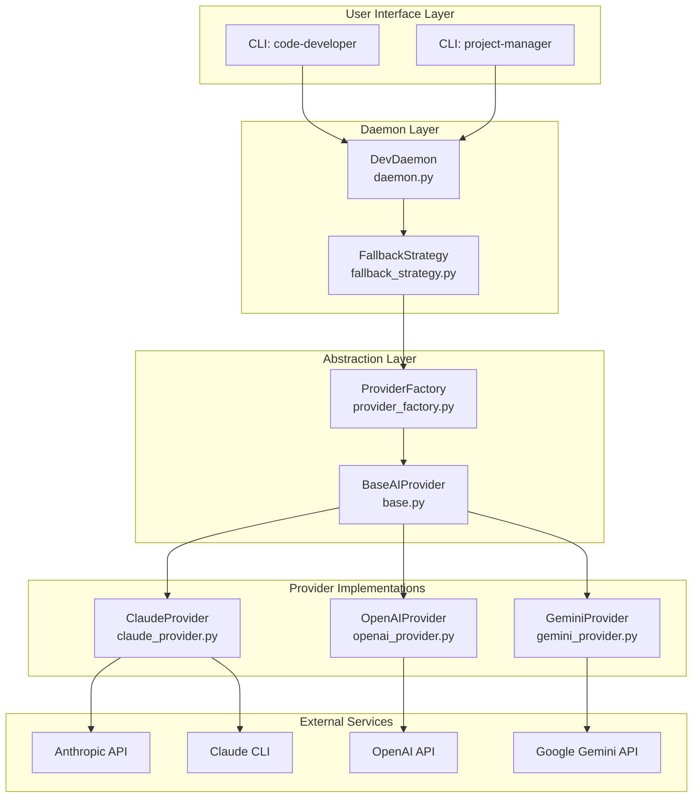
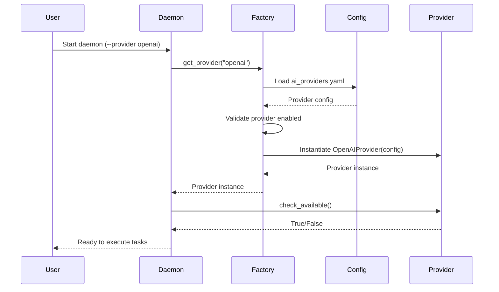
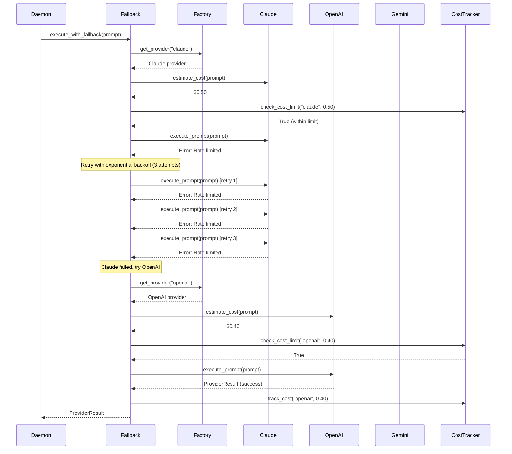
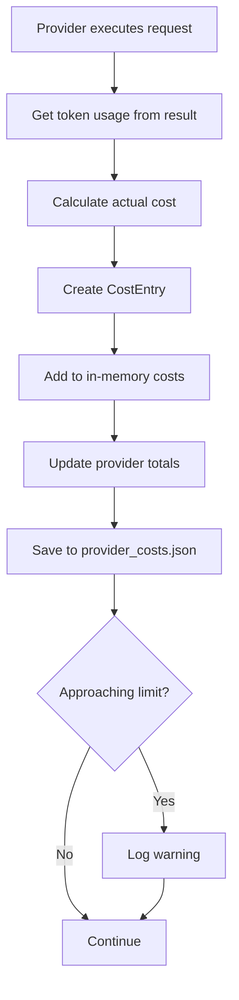

# PRIORITY 8: Multi-AI Provider Support - Technical Specification

**Version**: 1.0
**Created**: 2025-10-11
**Status**: Ready for Implementation
**Estimated Duration**: 2-3 weeks (80-120 hours)
**Impact**: ⭐⭐⭐⭐⭐
**Strategic Goal**: Increase user adoption by supporting multiple AI providers

---

## Table of Contents

1. [Executive Summary](#executive-summary)
2. [Prerequisites & Dependencies](#prerequisites--dependencies)
3. [Architecture Overview](#architecture-overview)
4. [Component Specifications](#component-specifications)
5. [Data Flow Diagrams](#data-flow-diagrams)
6. [Implementation Plan](#implementation-plan)
7. [Testing Strategy](#testing-strategy)
8. [Security Considerations](#security-considerations)
9. [Performance Requirements](#performance-requirements)
10. [Risk Analysis](#risk-analysis)
11. [Success Criteria](#success-criteria)
12. [Appendix](#appendix)

---

## Executive Summary

### Objective

Transform the `code-developer` daemon from a Claude-only system to a multi-provider AI platform supporting Claude (Anthropic), OpenAI (GPT-4/o1/o3), Google Gemini, and future providers through a pluggable abstraction layer. This will significantly increase user adoption by removing barriers related to cost, availability, and provider preferences.

### Key Value Proposition

- **Cost Flexibility**: Choose cheaper models for simple tasks, premium models for complex ones
- **Global Accessibility**: Work around regional restrictions and API availability
- **Provider Independence**: Avoid vendor lock-in with automatic fallback
- **Future-Proof Design**: Easily add new providers as they emerge (DeepSeek, Mistral, Llama via Ollama)
- **Risk Mitigation**: Automatic failover ensures continuous operation

### Current State

Currently, the daemon is tightly coupled to Claude:
- Uses `ClaudeAPI` and `ClaudeCLIInterface` directly in `daemon.py:29, 118-124`
- Hard-coded Claude-specific logic in prompts and execution
- No abstraction layer for provider switching
- Single point of failure if Claude is unavailable

### Target State

After implementation:
- Abstract `BaseAIProvider` interface for all providers
- Factory pattern for provider selection and instantiation
- Configuration-driven provider management (`config/ai_providers.yaml`)
- Automatic fallback strategy with retry logic
- Cost tracking and optimization per provider
- CLI commands for provider switching and status

---

## Prerequisites & Dependencies

### ✅ Completed Dependencies

1. **PRIORITY 3: Autonomous Development Daemon** - COMPLETE ✅
   - Core daemon: `coffee_maker/autonomous/daemon.py`
   - Claude API interface: `coffee_maker/autonomous/claude_api_interface.py`
   - Claude CLI interface: `coffee_maker/autonomous/claude_cli_interface.py`
   - Working implementation ready for abstraction

### Required Python Packages

Add to `pyproject.toml`:

```toml
[tool.poetry.dependencies]
python = ">=3.11,<3.14"
anthropic = "^0.40.0"              # Already present - Claude API
openai = "^1.60.0"                 # NEW - OpenAI GPT-4, o1, o3
google-generativeai = "^0.8.3"     # NEW - Google Gemini
tenacity = "^9.0.0"                # NEW - Retry logic with exponential backoff
pyyaml = "^6.0.2"                  # NEW - YAML config parsing
tiktoken = "^0.8.0"                # NEW - Token counting for cost estimation
```

### Configuration Requirements

1. **Environment Variables** (`.env`):
   ```bash
   # Anthropic (Claude)
   ANTHROPIC_API_KEY=sk-ant-xxxxx

   # OpenAI
   OPENAI_API_KEY=sk-xxxxx

   # Google Gemini
   GOOGLE_API_KEY=AIzaxxxxx

   # Provider Configuration
   DEFAULT_AI_PROVIDER=claude
   AI_PROVIDER_FALLBACK=true
   AI_COST_DAILY_LIMIT=50.0
   ```

2. **Configuration File** (`config/ai_providers.yaml`):
   - Provider settings (models, tokens, temperature)
   - Fallback order and retry logic
   - Cost limits and budgets
   - Feature flags per provider

### System Requirements

- Python >=3.11,<3.14
- Internet connectivity for API calls
- Valid API keys for desired providers
- Sufficient disk space for provider-specific caches (~100MB)

### Breaking Changes

⚠️ **Minimal Breaking Changes**:
- Daemon initialization will accept `provider` parameter (default: from config)
- CLI flag `--use-claude-cli` becomes `--provider claude-cli`
- Existing code continues to work with Claude as default

---

## Architecture Overview

### High-Level Architecture



### Directory Structure

```
coffee_maker/
├── ai_providers/                        # NEW: AI provider abstraction layer
│   ├── __init__.py                      # Exports: get_provider, BaseAIProvider
│   ├── base.py                          # BaseAIProvider abstract class
│   ├── provider_factory.py              # Provider selection and instantiation
│   ├── provider_config.py               # Configuration management
│   ├── fallback_strategy.py             # Fallback and retry logic
│   ├── cost_tracker.py                  # Cost tracking and budget management
│   │
│   ├── providers/                       # Provider implementations
│   │   ├── __init__.py
│   │   ├── claude_provider.py           # Claude (API + CLI modes)
│   │   ├── openai_provider.py           # OpenAI (GPT-4, o1, o3)
│   │   ├── gemini_provider.py           # Google Gemini
│   │   └── local_provider.py            # FUTURE: Ollama/local models
│   │
│   └── tests/                           # Provider tests
│       ├── __init__.py
│       ├── test_base.py
│       ├── test_factory.py
│       ├── test_fallback.py
│       ├── test_claude_provider.py
│       ├── test_openai_provider.py
│       └── test_gemini_provider.py
│
├── autonomous/                          # EXISTING: Daemon
│   ├── daemon.py                        # MODIFY: Use provider abstraction
│   ├── daemon_cli.py                    # MODIFY: Add --provider flag
│   ├── claude_api_interface.py          # REFACTOR: Move to providers/claude_provider.py
│   └── claude_cli_interface.py          # REFACTOR: Integrate into claude_provider.py
│
├── cli/                                 # EXISTING: CLI tools
│   ├── roadmap_cli.py                   # MODIFY: Add provider commands
│   └── provider_cli.py                  # NEW: Provider management commands
│
└── config/                              # NEW: Configuration files
    ├── ai_providers.yaml                # Provider configuration
    └── provider_costs.json              # Cost tracking database
```

### Technology Stack

| Component | Technology | Purpose |
|-----------|-----------|---------|
| **Abstraction** | Abstract Base Classes (ABC) | Define provider interface |
| **Factory** | Factory Pattern | Provider instantiation |
| **Retry Logic** | Tenacity | Exponential backoff, rate limit handling |
| **Config** | PyYAML | YAML configuration parsing |
| **Cost Tracking** | Custom SQLite | Track costs per provider |
| **Token Counting** | tiktoken | Accurate token estimation |
| **Claude API** | anthropic SDK | Anthropic API calls |
| **OpenAI API** | openai SDK | OpenAI API calls |
| **Gemini API** | google-generativeai | Google Gemini API calls |

---

## Component Specifications

### 1. BaseAIProvider (Abstract Interface)

**File**: `coffee_maker/ai_providers/base.py`

**Purpose**: Define the contract that all AI providers must implement.

**Interface**:

```python
from abc import ABC, abstractmethod
from dataclasses import dataclass
from typing import Dict, List, Optional, Any
from enum import Enum


class ProviderCapability(Enum):
    """Provider capabilities."""
    FUNCTION_CALLING = "function_calling"
    VISION = "vision"
    STREAMING = "streaming"
    SYSTEM_PROMPTS = "system_prompts"
    CONTEXT_CACHING = "context_caching"


@dataclass
class ProviderResult:
    """Standardized result from any provider.

    This matches the existing APIResult format for backward compatibility.
    """
    content: str
    model: str
    usage: Dict[str, int]  # {"input_tokens": X, "output_tokens": Y}
    stop_reason: str
    error: Optional[str] = None
    metadata: Dict[str, Any] = None  # Provider-specific metadata

    @property
    def success(self) -> bool:
        """Check if request succeeded."""
        return self.error is None


class BaseAIProvider(ABC):
    """Abstract base class for AI providers.

    All provider implementations must inherit from this class and implement
    all abstract methods. This ensures consistent interface across providers.

    Attributes:
        config: Provider-specific configuration
        model: Model identifier (e.g., "claude-sonnet-4", "gpt-4-turbo")
        max_tokens: Maximum output tokens
        temperature: Sampling temperature (0.0-1.0)
    """

    def __init__(self, config: Dict[str, Any]):
        """Initialize provider with configuration.

        Args:
            config: Provider configuration from ai_providers.yaml
        """
        self.config = config
        self.model = config.get("model")
        self.max_tokens = config.get("max_tokens", 8000)
        self.temperature = config.get("temperature", 0.7)

    @abstractmethod
    def execute_prompt(
        self,
        prompt: str,
        system_prompt: Optional[str] = None,
        working_dir: Optional[str] = None,
        timeout: Optional[int] = None,
        **kwargs
    ) -> ProviderResult:
        """Execute a prompt and return result.

        This is the core method that all providers must implement.

        Args:
            prompt: User prompt/task description
            system_prompt: Optional system prompt for context
            working_dir: Working directory context
            timeout: Request timeout in seconds
            **kwargs: Provider-specific parameters

        Returns:
            ProviderResult with content, usage, and metadata
        """
        pass

    @abstractmethod
    def check_available(self) -> bool:
        """Check if provider is available and configured.

        Returns:
            True if provider can be used
        """
        pass

    @abstractmethod
    def estimate_cost(
        self,
        prompt: str,
        system_prompt: Optional[str] = None,
        max_output_tokens: Optional[int] = None
    ) -> float:
        """Estimate cost for a request in USD.

        Args:
            prompt: User prompt
            system_prompt: Optional system prompt
            max_output_tokens: Expected output tokens

        Returns:
            Estimated cost in USD
        """
        pass

    @property
    @abstractmethod
    def name(self) -> str:
        """Provider name (e.g., 'claude', 'openai', 'gemini').

        Returns:
            Provider identifier
        """
        pass

    @property
    @abstractmethod
    def capabilities(self) -> List[ProviderCapability]:
        """List of supported capabilities.

        Returns:
            List of ProviderCapability enums
        """
        pass

    @abstractmethod
    def count_tokens(self, text: str) -> int:
        """Count tokens in text for this provider's tokenizer.

        Args:
            text: Text to count tokens for

        Returns:
            Token count
        """
        pass

    def reset_context(self) -> bool:
        """Reset conversation context (optional for stateless providers).

        Returns:
            True if reset successful (default: True for stateless)
        """
        return True  # Default: stateless providers don't need reset

    def supports_capability(self, capability: ProviderCapability) -> bool:
        """Check if provider supports a capability.

        Args:
            capability: Capability to check

        Returns:
            True if supported
        """
        return capability in self.capabilities
```

**Key Design Decisions**:
- Uses `ProviderResult` dataclass (matches existing `APIResult`)
- Abstract methods enforce contract
- Optional methods have default implementations
- Capabilities enum for feature detection
- Token counting abstracted per provider

---

### 2. ClaudeProvider (Claude Implementation)

**File**: `coffee_maker/ai_providers/providers/claude_provider.py`

**Purpose**: Wrap existing Claude API and CLI interfaces into provider pattern.

**Implementation**:

```python
import logging
import os
from typing import Dict, List, Optional, Any

from coffee_maker.ai_providers.base import (
    BaseAIProvider,
    ProviderResult,
    ProviderCapability
)
from coffee_maker.autonomous.claude_api_interface import ClaudeAPI, APIResult
from coffee_maker.autonomous.claude_cli_interface import ClaudeCLIInterface

logger = logging.getLogger(__name__)


class ClaudeProvider(BaseAIProvider):
    """Claude provider implementation (API + CLI modes).

    This provider wraps the existing ClaudeAPI and ClaudeCLIInterface
    to provide a unified interface following the BaseAIProvider contract.

    Supports two modes:
    - API mode: Direct Anthropic API calls (requires API key)
    - CLI mode: Claude CLI via subscription (no API key needed)

    Attributes:
        use_cli: Whether to use CLI mode instead of API
        interface: ClaudeAPI or ClaudeCLIInterface instance
    """

    # Cost per 1M tokens (USD) - Claude Sonnet 4.5
    INPUT_COST_PER_1M = 15.0
    OUTPUT_COST_PER_1M = 75.0

    def __init__(self, config: Dict[str, Any]):
        """Initialize Claude provider.

        Args:
            config: Provider configuration from ai_providers.yaml
                {
                    "model": "claude-sonnet-4-20250514",
                    "use_cli": false,
                    "cli_path": "/opt/homebrew/bin/claude",
                    "max_tokens": 8000,
                    "temperature": 0.7
                }
        """
        super().__init__(config)

        self.use_cli = config.get("use_cli", False)

        if self.use_cli:
            # Use Claude CLI (subscription)
            cli_path = config.get("cli_path", "/opt/homebrew/bin/claude")
            self.interface = ClaudeCLIInterface(
                claude_path=cli_path,
                model=self.model,
                max_tokens=self.max_tokens,
                timeout=config.get("timeout", 3600)
            )
            logger.info("ClaudeProvider initialized in CLI mode")
        else:
            # Use Anthropic API (credits)
            api_key = os.environ.get("ANTHROPIC_API_KEY")
            self.interface = ClaudeAPI(
                model=self.model,
                max_tokens=self.max_tokens,
                timeout=config.get("timeout", 3600),
                api_key=api_key
            )
            logger.info("ClaudeProvider initialized in API mode")

    def execute_prompt(
        self,
        prompt: str,
        system_prompt: Optional[str] = None,
        working_dir: Optional[str] = None,
        timeout: Optional[int] = None,
        **kwargs
    ) -> ProviderResult:
        """Execute prompt using Claude API or CLI.

        Args:
            prompt: User prompt
            system_prompt: Optional system prompt
            working_dir: Working directory context
            timeout: Request timeout
            **kwargs: Additional parameters

        Returns:
            ProviderResult with response
        """
        # Call existing interface
        api_result: APIResult = self.interface.execute_prompt(
            prompt=prompt,
            system_prompt=system_prompt,
            working_dir=working_dir,
            timeout=timeout
        )

        # Convert APIResult to ProviderResult
        return ProviderResult(
            content=api_result.content,
            model=api_result.model,
            usage=api_result.usage,
            stop_reason=api_result.stop_reason,
            error=api_result.error,
            metadata={
                "provider": "claude",
                "mode": "cli" if self.use_cli else "api"
            }
        )

    def check_available(self) -> bool:
        """Check if Claude is available."""
        return self.interface.check_available()

    def estimate_cost(
        self,
        prompt: str,
        system_prompt: Optional[str] = None,
        max_output_tokens: Optional[int] = None
    ) -> float:
        """Estimate cost for Claude request.

        Args:
            prompt: User prompt
            system_prompt: System prompt
            max_output_tokens: Expected output tokens

        Returns:
            Estimated cost in USD
        """
        # Count input tokens
        full_prompt = prompt
        if system_prompt:
            full_prompt = f"{system_prompt}\n\n{prompt}"

        input_tokens = self.count_tokens(full_prompt)
        output_tokens = max_output_tokens or self.max_tokens

        # Calculate cost
        input_cost = (input_tokens / 1_000_000) * self.INPUT_COST_PER_1M
        output_cost = (output_tokens / 1_000_000) * self.OUTPUT_COST_PER_1M

        return input_cost + output_cost

    @property
    def name(self) -> str:
        """Provider name."""
        return "claude"

    @property
    def capabilities(self) -> List[ProviderCapability]:
        """Claude capabilities."""
        return [
            ProviderCapability.FUNCTION_CALLING,
            ProviderCapability.VISION,
            ProviderCapability.STREAMING,
            ProviderCapability.SYSTEM_PROMPTS,
            ProviderCapability.CONTEXT_CACHING
        ]

    def count_tokens(self, text: str) -> int:
        """Count tokens using Claude's tokenizer.

        Args:
            text: Text to count

        Returns:
            Token count (approximate)
        """
        # Approximate: 1 token ≈ 4 characters (Claude estimate)
        return len(text) // 4

    def reset_context(self) -> bool:
        """Reset Claude context (CLI mode only).

        Returns:
            True if reset successful
        """
        if self.use_cli and hasattr(self.interface, 'reset_context'):
            return self.interface.reset_context()
        return True  # API mode doesn't need reset
```

**Integration Points**:
- Reuses existing `ClaudeAPI` and `ClaudeCLIInterface` classes
- Minimal changes to existing code
- Converts `APIResult` to `ProviderResult` for standardization

---

### 3. OpenAIProvider (OpenAI Implementation)

**File**: `coffee_maker/ai_providers/providers/openai_provider.py`

**Purpose**: Support OpenAI models (GPT-4, GPT-4 Turbo, o1, o3).

**Implementation**:

```python
import logging
import os
from typing import Dict, List, Optional, Any
import tiktoken
from openai import OpenAI

from coffee_maker.ai_providers.base import (
    BaseAIProvider,
    ProviderResult,
    ProviderCapability
)

logger = logging.getLogger(__name__)


class OpenAIProvider(BaseAIProvider):
    """OpenAI provider implementation.

    Supports GPT-4, GPT-4 Turbo, o1, and o3 models via OpenAI API.

    Attributes:
        client: OpenAI API client
        tokenizer: tiktoken encoder for token counting
    """

    # Cost per 1M tokens (USD) - GPT-4 Turbo
    COSTS = {
        "gpt-4-turbo": {"input": 10.0, "output": 30.0},
        "gpt-4": {"input": 30.0, "output": 60.0},
        "gpt-4o": {"input": 2.5, "output": 10.0},
        "gpt-3.5-turbo": {"input": 0.5, "output": 1.5},
        "o1-preview": {"input": 15.0, "output": 60.0},
        "o1-mini": {"input": 3.0, "output": 12.0},
    }

    def __init__(self, config: Dict[str, Any]):
        """Initialize OpenAI provider.

        Args:
            config: Provider configuration
                {
                    "model": "gpt-4-turbo",
                    "max_tokens": 8000,
                    "temperature": 0.7,
                    "fallback_models": ["gpt-4", "gpt-3.5-turbo"]
                }
        """
        super().__init__(config)

        # Initialize OpenAI client
        api_key = os.environ.get("OPENAI_API_KEY")
        if not api_key:
            raise ValueError("OPENAI_API_KEY environment variable not set")

        self.client = OpenAI(api_key=api_key)
        self.fallback_models = config.get("fallback_models", [])

        # Initialize tokenizer
        try:
            self.tokenizer = tiktoken.encoding_for_model(self.model)
        except KeyError:
            # Fallback to cl100k_base for unknown models
            self.tokenizer = tiktoken.get_encoding("cl100k_base")

        logger.info(f"OpenAIProvider initialized with model: {self.model}")

    def execute_prompt(
        self,
        prompt: str,
        system_prompt: Optional[str] = None,
        working_dir: Optional[str] = None,
        timeout: Optional[int] = None,
        **kwargs
    ) -> ProviderResult:
        """Execute prompt using OpenAI API.

        Args:
            prompt: User prompt
            system_prompt: System prompt
            working_dir: Working directory context
            timeout: Request timeout
            **kwargs: Additional OpenAI parameters

        Returns:
            ProviderResult with response
        """
        # Build messages
        messages = []

        if system_prompt:
            messages.append({"role": "system", "content": system_prompt})

        # Add working directory context
        if working_dir:
            prompt = f"Working directory: {working_dir}\n\n{prompt}"

        messages.append({"role": "user", "content": prompt})

        try:
            # Call OpenAI API
            response = self.client.chat.completions.create(
                model=self.model,
                messages=messages,
                max_tokens=self.max_tokens,
                temperature=self.temperature,
                timeout=timeout or 3600,
                **kwargs
            )

            # Extract content
            content = response.choices[0].message.content

            # Calculate usage
            usage = {
                "input_tokens": response.usage.prompt_tokens,
                "output_tokens": response.usage.completion_tokens
            }

            logger.info(
                f"OpenAI request completed: {usage['input_tokens']} in, "
                f"{usage['output_tokens']} out"
            )

            return ProviderResult(
                content=content,
                model=response.model,
                usage=usage,
                stop_reason=response.choices[0].finish_reason,
                metadata={
                    "provider": "openai",
                    "response_id": response.id
                }
            )

        except Exception as e:
            logger.error(f"OpenAI request failed: {e}")
            return ProviderResult(
                content="",
                model=self.model,
                usage={"input_tokens": 0, "output_tokens": 0},
                stop_reason="error",
                error=str(e)
            )

    def check_available(self) -> bool:
        """Check if OpenAI API is available.

        Returns:
            True if API key is valid
        """
        try:
            # Simple test request
            response = self.client.chat.completions.create(
                model=self.model,
                messages=[{"role": "user", "content": "Hello"}],
                max_tokens=5,
                timeout=5
            )
            logger.info(f"OpenAI API available: {response.model}")
            return True

        except Exception as e:
            logger.error(f"OpenAI API not available: {e}")
            return False

    def estimate_cost(
        self,
        prompt: str,
        system_prompt: Optional[str] = None,
        max_output_tokens: Optional[int] = None
    ) -> float:
        """Estimate cost for OpenAI request.

        Args:
            prompt: User prompt
            system_prompt: System prompt
            max_output_tokens: Expected output tokens

        Returns:
            Estimated cost in USD
        """
        # Count input tokens
        full_prompt = prompt
        if system_prompt:
            full_prompt = f"{system_prompt}\n\n{prompt}"

        input_tokens = self.count_tokens(full_prompt)
        output_tokens = max_output_tokens or self.max_tokens

        # Get cost rates for model
        model_key = self.model
        if model_key not in self.COSTS:
            # Try to match partial model name
            for key in self.COSTS:
                if key in model_key:
                    model_key = key
                    break
            else:
                # Default to GPT-4 Turbo pricing
                model_key = "gpt-4-turbo"

        costs = self.COSTS[model_key]

        # Calculate cost
        input_cost = (input_tokens / 1_000_000) * costs["input"]
        output_cost = (output_tokens / 1_000_000) * costs["output"]

        return input_cost + output_cost

    @property
    def name(self) -> str:
        """Provider name."""
        return "openai"

    @property
    def capabilities(self) -> List[ProviderCapability]:
        """OpenAI capabilities."""
        return [
            ProviderCapability.FUNCTION_CALLING,
            ProviderCapability.VISION,  # GPT-4V only
            ProviderCapability.STREAMING,
            ProviderCapability.SYSTEM_PROMPTS
        ]

    def count_tokens(self, text: str) -> int:
        """Count tokens using tiktoken.

        Args:
            text: Text to count

        Returns:
            Exact token count
        """
        return len(self.tokenizer.encode(text))
```

**Key Features**:
- Accurate token counting with tiktoken
- Model-specific cost rates
- Fallback model support
- Comprehensive error handling

---

### 4. GeminiProvider (Google Gemini Implementation)

**File**: `coffee_maker/ai_providers/providers/gemini_provider.py`

**Purpose**: Support Google Gemini models.

**Implementation**:

```python
import logging
import os
from typing import Dict, List, Optional, Any
import google.generativeai as genai

from coffee_maker.ai_providers.base import (
    BaseAIProvider,
    ProviderResult,
    ProviderCapability
)

logger = logging.getLogger(__name__)


class GeminiProvider(BaseAIProvider):
    """Google Gemini provider implementation.

    Supports Gemini 1.5 Pro, Flash, and future Gemini models.

    Attributes:
        model_client: Gemini GenerativeModel instance
    """

    # Cost per 1M tokens (USD) - Gemini 1.5 Pro
    COSTS = {
        "gemini-1.5-pro": {"input": 7.0, "output": 21.0},
        "gemini-1.5-flash": {"input": 0.35, "output": 1.05},
        "gemini-pro": {"input": 0.5, "output": 1.5},
    }

    def __init__(self, config: Dict[str, Any]):
        """Initialize Gemini provider.

        Args:
            config: Provider configuration
                {
                    "model": "gemini-1.5-pro",
                    "max_tokens": 8000,
                    "temperature": 0.7
                }
        """
        super().__init__(config)

        # Configure Gemini API
        api_key = os.environ.get("GOOGLE_API_KEY")
        if not api_key:
            raise ValueError("GOOGLE_API_KEY environment variable not set")

        genai.configure(api_key=api_key)

        # Initialize model
        self.model_client = genai.GenerativeModel(self.model)

        logger.info(f"GeminiProvider initialized with model: {self.model}")

    def execute_prompt(
        self,
        prompt: str,
        system_prompt: Optional[str] = None,
        working_dir: Optional[str] = None,
        timeout: Optional[int] = None,
        **kwargs
    ) -> ProviderResult:
        """Execute prompt using Gemini API.

        Args:
            prompt: User prompt
            system_prompt: System prompt (prepended to prompt)
            working_dir: Working directory context
            timeout: Request timeout
            **kwargs: Additional Gemini parameters

        Returns:
            ProviderResult with response
        """
        # Build full prompt (Gemini doesn't have separate system prompt)
        full_prompt = ""

        if system_prompt:
            full_prompt += f"{system_prompt}\n\n"

        if working_dir:
            full_prompt += f"Working directory: {working_dir}\n\n"

        full_prompt += prompt

        try:
            # Configure generation
            generation_config = {
                "temperature": self.temperature,
                "max_output_tokens": self.max_tokens,
            }
            generation_config.update(kwargs)

            # Generate response
            response = self.model_client.generate_content(
                full_prompt,
                generation_config=generation_config
            )

            # Extract content
            content = response.text

            # Estimate token usage (Gemini doesn't provide exact counts)
            input_tokens = self.count_tokens(full_prompt)
            output_tokens = self.count_tokens(content)

            usage = {
                "input_tokens": input_tokens,
                "output_tokens": output_tokens
            }

            logger.info(
                f"Gemini request completed: {usage['input_tokens']} in, "
                f"{usage['output_tokens']} out (estimated)"
            )

            return ProviderResult(
                content=content,
                model=self.model,
                usage=usage,
                stop_reason=response.candidates[0].finish_reason.name,
                metadata={
                    "provider": "gemini",
                    "safety_ratings": [
                        {
                            "category": rating.category.name,
                            "probability": rating.probability.name
                        }
                        for rating in response.candidates[0].safety_ratings
                    ]
                }
            )

        except Exception as e:
            logger.error(f"Gemini request failed: {e}")
            return ProviderResult(
                content="",
                model=self.model,
                usage={"input_tokens": 0, "output_tokens": 0},
                stop_reason="error",
                error=str(e)
            )

    def check_available(self) -> bool:
        """Check if Gemini API is available.

        Returns:
            True if API key is valid
        """
        try:
            # Simple test request
            response = self.model_client.generate_content(
                "Hello",
                generation_config={"max_output_tokens": 5}
            )
            logger.info(f"Gemini API available: {self.model}")
            return True

        except Exception as e:
            logger.error(f"Gemini API not available: {e}")
            return False

    def estimate_cost(
        self,
        prompt: str,
        system_prompt: Optional[str] = None,
        max_output_tokens: Optional[int] = None
    ) -> float:
        """Estimate cost for Gemini request.

        Args:
            prompt: User prompt
            system_prompt: System prompt
            max_output_tokens: Expected output tokens

        Returns:
            Estimated cost in USD
        """
        # Count input tokens
        full_prompt = prompt
        if system_prompt:
            full_prompt = f"{system_prompt}\n\n{prompt}"

        input_tokens = self.count_tokens(full_prompt)
        output_tokens = max_output_tokens or self.max_tokens

        # Get cost rates for model
        model_key = self.model
        if model_key not in self.COSTS:
            # Try to match partial model name
            for key in self.COSTS:
                if key in model_key:
                    model_key = key
                    break
            else:
                # Default to Gemini 1.5 Pro pricing
                model_key = "gemini-1.5-pro"

        costs = self.COSTS[model_key]

        # Calculate cost
        input_cost = (input_tokens / 1_000_000) * costs["input"]
        output_cost = (output_tokens / 1_000_000) * costs["output"]

        return input_cost + output_cost

    @property
    def name(self) -> str:
        """Provider name."""
        return "gemini"

    @property
    def capabilities(self) -> List[ProviderCapability]:
        """Gemini capabilities."""
        return [
            ProviderCapability.FUNCTION_CALLING,
            ProviderCapability.VISION,  # Gemini 1.5 Pro supports vision
            ProviderCapability.STREAMING
        ]

    def count_tokens(self, text: str) -> int:
        """Count tokens (approximate for Gemini).

        Args:
            text: Text to count

        Returns:
            Approximate token count
        """
        # Approximate: 1 token ≈ 4 characters (similar to Claude)
        return len(text) // 4
```

**Key Features**:
- Safety ratings metadata
- Cost estimation with model-specific rates
- Handles Gemini's combined prompt format (no separate system prompt)

---

### 5. ProviderFactory

**File**: `coffee_maker/ai_providers/provider_factory.py`

**Purpose**: Instantiate providers based on configuration.

**Implementation**:

```python
import logging
from typing import Dict, Optional
import yaml
from pathlib import Path

from coffee_maker.ai_providers.base import BaseAIProvider
from coffee_maker.ai_providers.providers.claude_provider import ClaudeProvider
from coffee_maker.ai_providers.providers.openai_provider import OpenAIProvider
from coffee_maker.ai_providers.providers.gemini_provider import GeminiProvider

logger = logging.getLogger(__name__)


class ProviderFactory:
    """Factory for creating AI provider instances.

    Reads configuration from config/ai_providers.yaml and instantiates
    the appropriate provider class.

    Attributes:
        config: Loaded provider configuration
        _providers: Registry of provider classes
    """

    _providers = {
        "claude": ClaudeProvider,
        "openai": OpenAIProvider,
        "gemini": GeminiProvider,
    }

    def __init__(self, config_path: str = "config/ai_providers.yaml"):
        """Initialize factory with configuration.

        Args:
            config_path: Path to provider configuration file
        """
        self.config_path = Path(config_path)
        self.config = self._load_config()

    def _load_config(self) -> Dict:
        """Load configuration from YAML file.

        Returns:
            Configuration dictionary
        """
        if not self.config_path.exists():
            logger.warning(f"Config file not found: {self.config_path}")
            logger.warning("Using default configuration")
            return self._get_default_config()

        with open(self.config_path, "r") as f:
            config = yaml.safe_load(f)

        logger.info(f"Loaded provider config from {self.config_path}")
        return config

    def _get_default_config(self) -> Dict:
        """Get default configuration.

        Returns:
            Default config dictionary
        """
        return {
            "default_provider": "claude",
            "providers": {
                "claude": {
                    "enabled": True,
                    "model": "claude-sonnet-4-20250514",
                    "use_cli": False,
                    "max_tokens": 8000,
                    "temperature": 0.7
                }
            },
            "fallback": {
                "enabled": False,
                "retry_attempts": 3,
                "fallback_order": ["claude"]
            }
        }

    def get_provider(
        self,
        provider_name: Optional[str] = None
    ) -> BaseAIProvider:
        """Get provider instance by name.

        Args:
            provider_name: Provider name (None = use default)

        Returns:
            Provider instance

        Raises:
            ValueError: If provider not found or not enabled
        """
        # Use default if not specified
        if provider_name is None:
            provider_name = self.config.get("default_provider", "claude")

        # Check if provider exists in config
        providers_config = self.config.get("providers", {})
        if provider_name not in providers_config:
            raise ValueError(
                f"Provider '{provider_name}' not found in configuration. "
                f"Available providers: {list(providers_config.keys())}"
            )

        provider_config = providers_config[provider_name]

        # Check if enabled
        if not provider_config.get("enabled", True):
            raise ValueError(f"Provider '{provider_name}' is disabled")

        # Get provider class
        if provider_name not in self._providers:
            raise ValueError(
                f"Provider '{provider_name}' not implemented. "
                f"Available providers: {list(self._providers.keys())}"
            )

        provider_class = self._providers[provider_name]

        # Instantiate provider
        try:
            provider = provider_class(provider_config)
            logger.info(f"Created provider: {provider_name}")
            return provider

        except Exception as e:
            logger.error(f"Failed to create provider '{provider_name}': {e}")
            raise

    def list_available_providers(self) -> list[str]:
        """List all enabled providers.

        Returns:
            List of provider names
        """
        providers_config = self.config.get("providers", {})
        return [
            name for name, config in providers_config.items()
            if config.get("enabled", True)
        ]

    @classmethod
    def register_provider(cls, name: str, provider_class: type):
        """Register a new provider class.

        Args:
            name: Provider name
            provider_class: Provider class (must inherit from BaseAIProvider)
        """
        if not issubclass(provider_class, BaseAIProvider):
            raise TypeError(
                f"Provider class must inherit from BaseAIProvider, "
                f"got {provider_class}"
            )

        cls._providers[name] = provider_class
        logger.info(f"Registered provider: {name}")


# Convenience function
def get_provider(provider_name: Optional[str] = None) -> BaseAIProvider:
    """Get provider instance (convenience function).

    Args:
        provider_name: Provider name (None = use default)

    Returns:
        Provider instance
    """
    factory = ProviderFactory()
    return factory.get_provider(provider_name)
```

**Key Features**:
- YAML-based configuration
- Provider registry pattern
- Default fallback configuration
- Provider registration for extensibility

---

### 6. FallbackStrategy

**File**: `coffee_maker/ai_providers/fallback_strategy.py`

**Purpose**: Handle provider failures with automatic fallback and retry.

**Implementation**:

```python
import logging
import time
from typing import Dict, List, Optional, Any
from dataclasses import dataclass
from tenacity import (
    retry,
    stop_after_attempt,
    wait_exponential,
    retry_if_exception_type
)

from coffee_maker.ai_providers.base import BaseAIProvider, ProviderResult
from coffee_maker.ai_providers.provider_factory import ProviderFactory
from coffee_maker.ai_providers.cost_tracker import CostTracker

logger = logging.getLogger(__name__)


@dataclass
class FallbackConfig:
    """Fallback configuration.

    Attributes:
        enabled: Whether fallback is enabled
        retry_attempts: Number of retry attempts per provider
        fallback_order: List of provider names to try in order
        retry_delay: Initial retry delay in seconds
        max_retry_delay: Maximum retry delay in seconds
    """
    enabled: bool = True
    retry_attempts: int = 3
    fallback_order: List[str] = None
    retry_delay: float = 1.0
    max_retry_delay: float = 60.0


class RateLimitError(Exception):
    """Rate limit exceeded error."""
    pass


class ProviderUnavailableError(Exception):
    """Provider unavailable error."""
    pass


class AllProvidersFailedError(Exception):
    """All providers failed error."""
    pass


class FallbackStrategy:
    """Handles provider failures and automatic fallback.

    This class implements intelligent fallback logic:
    1. Retry primary provider with exponential backoff
    2. Fall back to secondary providers on persistent failures
    3. Track cost across providers
    4. Log failures for debugging

    Attributes:
        config: Fallback configuration
        factory: Provider factory
        cost_tracker: Cost tracking
        errors: List of errors from failed attempts
    """

    def __init__(
        self,
        config: FallbackConfig,
        factory: ProviderFactory,
        cost_tracker: Optional[CostTracker] = None
    ):
        """Initialize fallback strategy.

        Args:
            config: Fallback configuration
            factory: Provider factory
            cost_tracker: Optional cost tracker
        """
        self.config = config
        self.factory = factory
        self.cost_tracker = cost_tracker or CostTracker()
        self.errors = []

    def execute_with_fallback(
        self,
        prompt: str,
        system_prompt: Optional[str] = None,
        working_dir: Optional[str] = None,
        timeout: Optional[int] = None,
        provider_names: Optional[List[str]] = None,
        **kwargs
    ) -> ProviderResult:
        """Execute prompt with automatic fallback.

        Tries providers in order until one succeeds or all fail.

        Args:
            prompt: User prompt
            system_prompt: System prompt
            working_dir: Working directory
            timeout: Request timeout
            provider_names: List of providers to try (None = use config)
            **kwargs: Additional provider parameters

        Returns:
            ProviderResult from successful provider

        Raises:
            AllProvidersFailedError: If all providers fail
        """
        # Get provider order
        if provider_names is None:
            provider_names = self.config.fallback_order or ["claude"]

        self.errors = []

        for provider_name in provider_names:
            logger.info(f"Trying provider: {provider_name}")

            try:
                # Get provider instance
                provider = self.factory.get_provider(provider_name)

                # Check cost limit
                estimated_cost = provider.estimate_cost(
                    prompt, system_prompt, self.max_tokens
                )

                if not self.cost_tracker.check_cost_limit(
                    provider_name, estimated_cost
                ):
                    logger.warning(
                        f"{provider_name}: Cost limit exceeded "
                        f"(${estimated_cost:.4f}), trying next provider..."
                    )
                    self.errors.append(
                        f"{provider_name}: Cost limit exceeded"
                    )
                    continue

                # Execute with retry
                result = self._execute_with_retry(
                    provider, prompt, system_prompt, working_dir,
                    timeout, **kwargs
                )

                # Track cost
                actual_cost = self._calculate_actual_cost(provider, result)
                self.cost_tracker.track_cost(
                    provider_name, actual_cost, result.usage
                )

                logger.info(
                    f"✅ Success with {provider_name} "
                    f"(cost: ${actual_cost:.4f})"
                )

                return result

            except RateLimitError as e:
                self.errors.append(f"{provider_name}: Rate limited - {e}")
                logger.warning(
                    f"⚠️ {provider_name} rate limited, trying next provider..."
                )

            except ProviderUnavailableError as e:
                self.errors.append(f"{provider_name}: Unavailable - {e}")
                logger.warning(
                    f"❌ {provider_name} unavailable, trying next provider..."
                )

            except Exception as e:
                self.errors.append(f"{provider_name}: {type(e).__name__} - {e}")
                logger.error(
                    f"❌ {provider_name} failed with {type(e).__name__}: {e}"
                )

        # All providers failed
        error_summary = "\n".join(self.errors)
        raise AllProvidersFailedError(
            f"All providers failed:\n{error_summary}"
        )

    def _execute_with_retry(
        self,
        provider: BaseAIProvider,
        prompt: str,
        system_prompt: Optional[str],
        working_dir: Optional[str],
        timeout: Optional[int],
        **kwargs
    ) -> ProviderResult:
        """Execute with exponential backoff retry.

        Args:
            provider: Provider instance
            prompt: User prompt
            system_prompt: System prompt
            working_dir: Working directory
            timeout: Request timeout
            **kwargs: Additional parameters

        Returns:
            ProviderResult

        Raises:
            RateLimitError: If rate limited
            ProviderUnavailableError: If provider unavailable
        """
        @retry(
            stop=stop_after_attempt(self.config.retry_attempts),
            wait=wait_exponential(
                multiplier=self.config.retry_delay,
                max=self.config.max_retry_delay
            ),
            retry=retry_if_exception_type(
                (ConnectionError, TimeoutError)
            ),
            reraise=True
        )
        def _execute():
            result = provider.execute_prompt(
                prompt=prompt,
                system_prompt=system_prompt,
                working_dir=working_dir,
                timeout=timeout,
                **kwargs
            )

            # Check for errors
            if not result.success:
                error_lower = result.error.lower()

                # Rate limit detection
                if any(keyword in error_lower for keyword in [
                    "rate limit", "429", "too many requests"
                ]):
                    raise RateLimitError(result.error)

                # Unavailable detection
                if any(keyword in error_lower for keyword in [
                    "unavailable", "503", "connection", "timeout"
                ]):
                    raise ProviderUnavailableError(result.error)

                # Generic error
                raise Exception(result.error)

            return result

        return _execute()

    def _calculate_actual_cost(
        self,
        provider: BaseAIProvider,
        result: ProviderResult
    ) -> float:
        """Calculate actual cost from result.

        Args:
            provider: Provider instance
            result: Provider result

        Returns:
            Cost in USD
        """
        # Use provider's estimate with actual token counts
        return provider.estimate_cost(
            prompt="",  # Tokens already counted in result
            max_output_tokens=result.usage.get("output_tokens", 0)
        )
```

**Key Features**:
- Exponential backoff with tenacity
- Rate limit and unavailability detection
- Cost checking before execution
- Comprehensive error tracking

---

### 7. CostTracker

**File**: `coffee_maker/ai_providers/cost_tracker.py`

**Purpose**: Track costs per provider and enforce budgets.

**Implementation**:

```python
import logging
import json
from datetime import datetime, timedelta
from pathlib import Path
from typing import Dict, Optional
from dataclasses import dataclass, asdict

logger = logging.getLogger(__name__)


@dataclass
class CostEntry:
    """Cost tracking entry.

    Attributes:
        provider: Provider name
        cost: Cost in USD
        tokens_in: Input tokens
        tokens_out: Output tokens
        timestamp: ISO timestamp
    """
    provider: str
    cost: float
    tokens_in: int
    tokens_out: int
    timestamp: str


class CostTracker:
    """Track costs per provider and enforce budgets.

    Stores cost data in JSON file for persistence across runs.

    Attributes:
        config: Cost configuration
        data_file: Path to cost data file
        costs: In-memory cost data
    """

    def __init__(
        self,
        config: Optional[Dict] = None,
        data_file: str = "config/provider_costs.json"
    ):
        """Initialize cost tracker.

        Args:
            config: Cost configuration
                {
                    "daily_limit": 50.0,
                    "per_task_limit": 5.0,
                    "warn_threshold": 0.8
                }
            data_file: Path to cost data file
        """
        self.config = config or {
            "daily_limit": 50.0,
            "per_task_limit": 5.0,
            "warn_threshold": 0.8
        }
        self.data_file = Path(data_file)
        self.costs = self._load_costs()

    def _load_costs(self) -> Dict:
        """Load cost data from file.

        Returns:
            Cost data dictionary
        """
        if not self.data_file.exists():
            return {"entries": [], "totals": {}}

        with open(self.data_file, "r") as f:
            return json.load(f)

    def _save_costs(self):
        """Save cost data to file."""
        self.data_file.parent.mkdir(exist_ok=True, parents=True)

        with open(self.data_file, "w") as f:
            json.dump(self.costs, f, indent=2)

    def track_cost(
        self,
        provider: str,
        cost: float,
        usage: Dict[str, int]
    ):
        """Track a cost entry.

        Args:
            provider: Provider name
            cost: Cost in USD
            usage: Token usage {"input_tokens": X, "output_tokens": Y}
        """
        # Create entry
        entry = CostEntry(
            provider=provider,
            cost=cost,
            tokens_in=usage.get("input_tokens", 0),
            tokens_out=usage.get("output_tokens", 0),
            timestamp=datetime.now().isoformat()
        )

        # Add to costs
        self.costs.setdefault("entries", []).append(asdict(entry))

        # Update totals
        totals = self.costs.setdefault("totals", {})
        totals.setdefault(provider, 0.0)
        totals[provider] += cost

        # Save
        self._save_costs()

        logger.info(
            f"Tracked ${cost:.4f} for {provider} "
            f"({usage['input_tokens']} in, {usage['output_tokens']} out)"
        )

        # Check if approaching limit
        daily_cost = self.get_daily_cost()
        daily_limit = self.config["daily_limit"]
        warn_threshold = self.config["warn_threshold"]

        if daily_cost >= daily_limit * warn_threshold:
            logger.warning(
                f"⚠️ Approaching daily cost limit: "
                f"${daily_cost:.2f} / ${daily_limit:.2f} "
                f"({daily_cost/daily_limit*100:.1f}%)"
            )

    def check_cost_limit(
        self,
        provider: str,
        estimated_cost: float
    ) -> bool:
        """Check if cost is within limits.

        Args:
            provider: Provider name
            estimated_cost: Estimated cost for request

        Returns:
            True if within limits, False if exceeded
        """
        # Check per-task limit
        per_task_limit = self.config["per_task_limit"]
        if estimated_cost > per_task_limit:
            logger.warning(
                f"Task cost ${estimated_cost:.4f} exceeds per-task limit "
                f"${per_task_limit:.2f}"
            )
            return False

        # Check daily limit
        daily_cost = self.get_daily_cost()
        daily_limit = self.config["daily_limit"]

        if daily_cost + estimated_cost > daily_limit:
            logger.warning(
                f"Daily cost ${daily_cost:.2f} + ${estimated_cost:.4f} "
                f"exceeds daily limit ${daily_limit:.2f}"
            )
            return False

        return True

    def get_daily_cost(self) -> float:
        """Get total cost for today.

        Returns:
            Total cost in USD
        """
        today = datetime.now().date()
        total = 0.0

        for entry in self.costs.get("entries", []):
            entry_date = datetime.fromisoformat(entry["timestamp"]).date()
            if entry_date == today:
                total += entry["cost"]

        return total

    def get_provider_stats(self) -> Dict[str, Dict]:
        """Get statistics per provider.

        Returns:
            Dictionary with provider stats
                {
                    "claude": {
                        "total_cost": 23.45,
                        "total_requests": 42,
                        "avg_cost": 0.56,
                        "total_tokens_in": 150000,
                        "total_tokens_out": 50000
                    },
                    ...
                }
        """
        stats = {}

        for entry in self.costs.get("entries", []):
            provider = entry["provider"]

            if provider not in stats:
                stats[provider] = {
                    "total_cost": 0.0,
                    "total_requests": 0,
                    "total_tokens_in": 0,
                    "total_tokens_out": 0
                }

            stats[provider]["total_cost"] += entry["cost"]
            stats[provider]["total_requests"] += 1
            stats[provider]["total_tokens_in"] += entry["tokens_in"]
            stats[provider]["total_tokens_out"] += entry["tokens_out"]

        # Calculate averages
        for provider, data in stats.items():
            if data["total_requests"] > 0:
                data["avg_cost"] = (
                    data["total_cost"] / data["total_requests"]
                )
            else:
                data["avg_cost"] = 0.0

        return stats
```

**Key Features**:
- JSON-based persistence
- Daily and per-task limits
- Warning thresholds
- Provider statistics

---

### 8. Configuration File

**File**: `config/ai_providers.yaml`

**Purpose**: Centralized provider configuration.

**Content**:

```yaml
# AI Provider Configuration
# This file defines available AI providers, their settings, and fallback behavior

default_provider: claude

providers:
  # Claude (Anthropic) - Default provider
  claude:
    enabled: true
    model: claude-sonnet-4-20250514
    use_cli: false  # Set to true to use Claude CLI (subscription)
    cli_path: /opt/homebrew/bin/claude
    max_tokens: 8000
    temperature: 0.7
    timeout: 3600

  # OpenAI (GPT-4, o1, o3)
  openai:
    enabled: true
    model: gpt-4-turbo
    fallback_models:
      - gpt-4
      - gpt-4o
      - gpt-3.5-turbo
    max_tokens: 8000
    temperature: 0.7
    timeout: 3600

  # Google Gemini
  gemini:
    enabled: true
    model: gemini-1.5-pro
    fallback_models:
      - gemini-1.5-flash
      - gemini-pro
    max_tokens: 8000
    temperature: 0.7
    timeout: 3600

# Fallback Strategy
fallback:
  enabled: true
  retry_attempts: 3  # Retries per provider before fallback
  retry_delay: 1.0  # Initial retry delay in seconds
  max_retry_delay: 60.0  # Maximum retry delay
  fallback_order:
    - claude
    - openai
    - gemini

# Cost Controls
cost_controls:
  daily_limit: 50.0  # USD per day
  per_task_limit: 5.0  # USD per task
  warn_threshold: 0.8  # Warn at 80% of limit

# Provider Comparison Matrix (for reference)
#
# | Feature              | Claude          | OpenAI (GPT-4)  | Gemini 1.5 Pro  |
# |---------------------|-----------------|-----------------|-----------------|
# | Code Quality         | ⭐⭐⭐⭐⭐      | ⭐⭐⭐⭐        | ⭐⭐⭐⭐        |
# | Context Window       | 200K tokens     | 128K tokens     | 1M tokens       |
# | Cost (per 1M tokens) | $15/$75         | $10/$30         | $7/$21          |
# | Function Calling     | Excellent       | Good            | Good            |
# | Availability         | Most regions    | Global          | Most regions    |
# | CLI Integration      | ✅ Native       | ❌ API only     | ❌ API only     |
# | Reasoning Quality    | Excellent       | Very Good       | Very Good       |
# | **Recommended For**  | Complex tasks   | General use     | High volume     |
```

---

### 9. Daemon Integration

**File**: `coffee_maker/autonomous/daemon.py` (MODIFICATIONS)

**Changes Required**:

```python
# BEFORE (lines 29, 113-124):
from coffee_maker.autonomous.claude_api_interface import ClaudeAPI

# ...

if use_claude_cli:
    from coffee_maker.autonomous.claude_cli_interface import ClaudeCLIInterface
    self.claude = ClaudeCLIInterface(claude_path=claude_cli_path, model=model)
    logger.info("✅ Using Claude CLI mode (subscription)")
else:
    self.claude = ClaudeAPI(model=model)
    logger.info("✅ Using Claude API mode (requires credits)")

# AFTER:
from coffee_maker.ai_providers import get_provider
from coffee_maker.ai_providers.fallback_strategy import (
    FallbackStrategy,
    FallbackConfig,
    AllProvidersFailedError
)
from coffee_maker.ai_providers.provider_factory import ProviderFactory
from coffee_maker.ai_providers.cost_tracker import CostTracker

# In __init__:
def __init__(
    self,
    roadmap_path: str = "docs/roadmap/ROADMAP.md",
    auto_approve: bool = True,
    create_prs: bool = True,
    sleep_interval: int = 30,
    provider: str = None,  # NEW: Provider name (None = use default)
    use_fallback: bool = True,  # NEW: Enable fallback
    # ... other params
):
    # ... existing code ...

    # Initialize AI provider system
    self.factory = ProviderFactory()
    self.cost_tracker = CostTracker()

    # Get provider configuration
    provider_config = self.factory.config
    fallback_config = FallbackConfig(
        enabled=use_fallback,
        retry_attempts=provider_config.get("fallback", {}).get("retry_attempts", 3),
        fallback_order=provider_config.get("fallback", {}).get("fallback_order", ["claude"]),
        retry_delay=provider_config.get("fallback", {}).get("retry_delay", 1.0),
        max_retry_delay=provider_config.get("fallback", {}).get("max_retry_delay", 60.0)
    )

    # Initialize fallback strategy
    self.fallback_strategy = FallbackStrategy(
        config=fallback_config,
        factory=self.factory,
        cost_tracker=self.cost_tracker
    )

    # Get primary provider
    self.provider = self.factory.get_provider(provider)
    logger.info(f"✅ Using AI provider: {self.provider.name}")

# In _implement_priority (line 754):
# BEFORE:
result = self.claude.execute_prompt(prompt, timeout=3600)

# AFTER:
try:
    result = self.fallback_strategy.execute_with_fallback(
        prompt=prompt,
        system_prompt=None,
        working_dir=str(self.git.repo_path),
        timeout=3600
    )
except AllProvidersFailedError as e:
    logger.error(f"All AI providers failed: {e}")
    return False
```

**Method Signature Changes**:

```python
# daemon.py - Updated __init__ signature
def __init__(
    self,
    roadmap_path: str = "docs/roadmap/ROADMAP.md",
    auto_approve: bool = True,
    create_prs: bool = True,
    sleep_interval: int = 30,
    provider: str = None,  # NEW
    use_fallback: bool = True,  # NEW
    max_crashes: int = 3,
    crash_sleep_interval: int = 60,
    compact_interval: int = 10,
):
    """Initialize development daemon.

    Args:
        roadmap_path: Path to ROADMAP.md
        auto_approve: Auto-approve implementation
        create_prs: Create pull requests automatically
        sleep_interval: Seconds between iterations
        provider: AI provider name (None = use default from config)
        use_fallback: Enable automatic fallback to other providers
        max_crashes: Maximum consecutive crashes
        crash_sleep_interval: Sleep after crash
        compact_interval: Iterations between context resets
    """
```

---

### 10. CLI Integration

**File**: `coffee_maker/cli/provider_cli.py` (NEW)

**Purpose**: CLI commands for provider management.

**Implementation**:

```python
"""CLI commands for AI provider management."""

import click
import json
from tabulate import tabulate

from coffee_maker.ai_providers.provider_factory import ProviderFactory
from coffee_maker.ai_providers.cost_tracker import CostTracker


@click.group()
def provider():
    """Manage AI providers."""
    pass


@provider.command()
def status():
    """Show current provider status."""
    factory = ProviderFactory()
    config = factory.config

    # Current provider
    current = config.get("default_provider", "claude")
    click.echo(f"\nCurrent provider: {click.style(current, fg='green', bold=True)}")

    # Fallback status
    fallback_enabled = config.get("fallback", {}).get("enabled", False)
    fallback_status = "enabled" if fallback_enabled else "disabled"
    fallback_color = "green" if fallback_enabled else "yellow"
    click.echo(f"Fallback: {click.style(fallback_status, fg=fallback_color)}")

    # Fallback order
    if fallback_enabled:
        fallback_order = config.get("fallback", {}).get("fallback_order", [])
        click.echo(f"Fallback order: {' → '.join(fallback_order)}")

    # Available providers
    available = factory.list_available_providers()
    click.echo(f"\nAvailable providers: {', '.join(available)}")

    # Check availability
    click.echo("\nProvider availability:")
    for provider_name in available:
        try:
            provider = factory.get_provider(provider_name)
            is_available = provider.check_available()
            status = "✅ Available" if is_available else "❌ Unavailable"
            click.echo(f"  {provider_name}: {status}")
        except Exception as e:
            click.echo(f"  {provider_name}: ❌ Error - {e}")


@provider.command()
@click.argument("provider_name")
def switch(provider_name):
    """Switch default provider."""
    import yaml

    factory = ProviderFactory()

    # Validate provider
    if provider_name not in factory.list_available_providers():
        click.echo(
            f"❌ Provider '{provider_name}' not available. "
            f"Available: {', '.join(factory.list_available_providers())}",
            err=True
        )
        return

    # Update config
    config = factory.config
    config["default_provider"] = provider_name

    # Save config
    with open(factory.config_path, "w") as f:
        yaml.dump(config, f, default_flow_style=False)

    click.echo(f"✅ Switched to provider: {click.style(provider_name, fg='green', bold=True)}")


@provider.command()
def costs():
    """Show cost breakdown per provider."""
    tracker = CostTracker()
    stats = tracker.get_provider_stats()

    # Daily cost
    daily_cost = tracker.get_daily_cost()
    daily_limit = tracker.config["daily_limit"]

    click.echo(f"\nDaily cost: ${daily_cost:.2f} / ${daily_limit:.2f}")

    # Provider breakdown
    if not stats:
        click.echo("\nNo cost data available yet.")
        return

    click.echo("\nProvider breakdown:")

    table_data = []
    for provider, data in stats.items():
        table_data.append([
            provider,
            data["total_requests"],
            f"${data['total_cost']:.2f}",
            f"${data['avg_cost']:.4f}",
            f"{data['total_tokens_in']:,}",
            f"{data['total_tokens_out']:,}"
        ])

    headers = ["Provider", "Tasks", "Total Cost", "Avg Cost", "Tokens In", "Tokens Out"]
    click.echo("\n" + tabulate(table_data, headers=headers, tablefmt="grid"))


@provider.command()
def compare():
    """Show provider comparison matrix."""
    comparison = """
╔════════════════════════╦═════════════════╦═════════════════╦═════════════════╗
║ Feature                ║ Claude          ║ OpenAI (GPT-4)  ║ Gemini 1.5 Pro  ║
╠════════════════════════╬═════════════════╬═════════════════╬═════════════════╣
║ Code Quality           ║ ⭐⭐⭐⭐⭐      ║ ⭐⭐⭐⭐        ║ ⭐⭐⭐⭐        ║
║ Context Window         ║ 200K tokens     ║ 128K tokens     ║ 1M tokens       ║
║ Cost (per 1M tokens)   ║ $15/$75         ║ $10/$30         ║ $7/$21          ║
║ Function Calling       ║ Excellent       ║ Good            ║ Good            ║
║ Availability           ║ Most regions    ║ Global          ║ Most regions    ║
║ CLI Integration        ║ ✅ Native       ║ ❌ API only     ║ ❌ API only     ║
║ Reasoning Quality      ║ Excellent       ║ Very Good       ║ Very Good       ║
║ Recommended For        ║ Complex tasks   ║ General use     ║ High volume     ║
╚════════════════════════╩═════════════════╩═════════════════╩═════════════════╝
    """
    click.echo(comparison)


# Add to project-manager CLI
# In coffee_maker/cli/roadmap_cli.py:
from coffee_maker.cli.provider_cli import provider

# Add to main CLI group:
# cli.add_command(provider)
```

**CLI Usage**:

```bash
# Check provider status
project-manager provider status

# Switch provider
project-manager provider switch openai

# View costs
project-manager provider costs

# Compare providers
project-manager provider compare
```

---

## Data Flow Diagrams

### 1. Provider Selection Flow



### 2. Fallback Execution Flow



### 3. Cost Tracking Flow



---

## Implementation Plan

### Phase 1: Foundation (Week 1)

#### Task 1.1: Create Abstraction Layer (8 hours)
**Files**: `coffee_maker/ai_providers/base.py`

**Steps**:
1. Create `coffee_maker/ai_providers/` directory
2. Implement `BaseAIProvider` abstract class
3. Define `ProviderResult` dataclass
4. Define `ProviderCapability` enum
5. Add comprehensive docstrings
6. Write unit tests for base classes

**Acceptance Criteria**:
- [ ] All abstract methods defined
- [ ] Type hints complete
- [ ] Docstrings follow Google style
- [ ] Tests cover all edge cases

#### Task 1.2: Implement ClaudeProvider (6 hours)
**Files**: `coffee_maker/ai_providers/providers/claude_provider.py`

**Steps**:
1. Create `providers/` subdirectory
2. Refactor `ClaudeAPI` into `ClaudeProvider`
3. Integrate `ClaudeCLIInterface` into same provider
4. Implement all abstract methods
5. Add cost estimation with accurate rates
6. Add token counting
7. Write provider-specific tests

**Acceptance Criteria**:
- [ ] API mode works (existing ClaudeAPI)
- [ ] CLI mode works (existing ClaudeCLI)
- [ ] All tests pass
- [ ] Cost estimation accurate

#### Task 1.3: Configuration System (4 hours)
**Files**: `config/ai_providers.yaml`, `coffee_maker/ai_providers/provider_config.py`

**Steps**:
1. Create `config/` directory
2. Write `ai_providers.yaml` schema
3. Implement YAML loading
4. Add environment variable overrides
5. Validate configuration on load
6. Write config tests

**Acceptance Criteria**:
- [ ] YAML loads correctly
- [ ] Validation catches errors
- [ ] Env vars override config
- [ ] Default config works

#### Task 1.4: Provider Factory (6 hours)
**Files**: `coffee_maker/ai_providers/provider_factory.py`

**Steps**:
1. Implement `ProviderFactory` class
2. Add provider registration system
3. Implement `get_provider()` method
4. Add provider listing methods
5. Handle missing/disabled providers gracefully
6. Write factory tests

**Acceptance Criteria**:
- [ ] Factory creates providers from config
- [ ] Unknown providers raise clear errors
- [ ] Provider registration works
- [ ] All tests pass

**Time Estimate**: 24 hours (3 days)

---

### Phase 2: Additional Providers (Week 1-2)

#### Task 2.1: Implement OpenAIProvider (8 hours)
**Files**: `coffee_maker/ai_providers/providers/openai_provider.py`

**Steps**:
1. Install `openai` and `tiktoken` packages
2. Implement `OpenAIProvider` class
3. Add accurate token counting with tiktoken
4. Implement model-specific cost rates
5. Handle OpenAI-specific errors (rate limits, etc.)
6. Add support for GPT-4, GPT-4 Turbo, o1, o3
7. Write comprehensive tests

**Acceptance Criteria**:
- [ ] OpenAI API calls work
- [ ] Token counting accurate
- [ ] Cost estimation correct
- [ ] Error handling robust
- [ ] Tests cover all models

#### Task 2.2: Implement GeminiProvider (8 hours)
**Files**: `coffee_maker/ai_providers/providers/gemini_provider.py`

**Steps**:
1. Install `google-generativeai` package
2. Implement `GeminiProvider` class
3. Handle combined prompt format (no separate system prompt)
4. Add cost estimation for Gemini models
5. Extract safety ratings from response
6. Handle Gemini-specific errors
7. Write provider tests

**Acceptance Criteria**:
- [ ] Gemini API calls work
- [ ] Prompt formatting correct
- [ ] Cost estimation accurate
- [ ] Safety ratings captured
- [ ] Tests pass

#### Task 2.3: Provider Registration (2 hours)
**Files**: `coffee_maker/ai_providers/__init__.py`

**Steps**:
1. Create package `__init__.py`
2. Export `get_provider()` convenience function
3. Export `BaseAIProvider` for extensions
4. Register all providers in factory
5. Add package-level documentation

**Acceptance Criteria**:
- [ ] All providers registered
- [ ] Convenience function works
- [ ] Package imports clean
- [ ] Documentation complete

**Time Estimate**: 18 hours (2.25 days)

---

### Phase 3: Fallback & Cost Tracking (Week 2)

#### Task 3.1: Implement FallbackStrategy (10 hours)
**Files**: `coffee_maker/ai_providers/fallback_strategy.py`

**Steps**:
1. Install `tenacity` package
2. Implement `FallbackStrategy` class
3. Add exponential backoff retry logic
4. Implement rate limit detection
5. Implement unavailability detection
6. Add cost checking before execution
7. Track errors across providers
8. Write fallback tests (including failure scenarios)

**Acceptance Criteria**:
- [ ] Retry logic works with exponential backoff
- [ ] Rate limits detected and handled
- [ ] Fallback to next provider works
- [ ] Cost limits enforced
- [ ] All errors logged
- [ ] Tests cover all scenarios

#### Task 3.2: Implement CostTracker (8 hours)
**Files**: `coffee_maker/ai_providers/cost_tracker.py`

**Steps**:
1. Implement `CostTracker` class
2. Add JSON-based persistence
3. Implement daily cost calculation
4. Add per-task cost limits
5. Implement warning thresholds
6. Add provider statistics
7. Write cost tracking tests

**Acceptance Criteria**:
- [ ] Costs persist across runs
- [ ] Daily limits enforced
- [ ] Per-task limits enforced
- [ ] Warnings at threshold
- [ ] Statistics accurate
- [ ] Tests pass

#### Task 3.3: Integration with Daemon (6 hours)
**Files**: `coffee_maker/autonomous/daemon.py`

**Steps**:
1. Add provider parameter to `__init__`
2. Replace `self.claude` with `self.provider`
3. Integrate `FallbackStrategy`
4. Update `_implement_priority()` to use fallback
5. Handle `AllProvidersFailedError`
6. Update status reporting
7. Update tests

**Acceptance Criteria**:
- [ ] Daemon uses provider abstraction
- [ ] Fallback works in daemon
- [ ] All existing tests pass
- [ ] New provider parameter works
- [ ] Error handling complete

**Time Estimate**: 24 hours (3 days)

---

### Phase 4: CLI & Documentation (Week 3)

#### Task 4.1: Provider CLI Commands (8 hours)
**Files**: `coffee_maker/cli/provider_cli.py`

**Steps**:
1. Create `provider_cli.py` module
2. Implement `provider status` command
3. Implement `provider switch` command
4. Implement `provider costs` command
5. Implement `provider compare` command
6. Add to main CLI group
7. Write CLI tests

**Acceptance Criteria**:
- [ ] All commands work
- [ ] Output formatted nicely
- [ ] Error handling robust
- [ ] Help text complete
- [ ] Tests pass

#### Task 4.2: Daemon CLI Updates (4 hours)
**Files**: `coffee_maker/autonomous/daemon_cli.py`

**Steps**:
1. Add `--provider` flag
2. Add `--no-fallback` flag
3. Update help text
4. Update examples
5. Test CLI changes

**Acceptance Criteria**:
- [ ] New flags work
- [ ] Help text updated
- [ ] Backward compatible
- [ ] Examples accurate

#### Task 4.3: Documentation (8 hours)
**Files**: `README.md`, `docs/AI_PROVIDERS.md`, `docs/PRIORITY_8_IMPLEMENTATION.md`

**Steps**:
1. Create `docs/AI_PROVIDERS.md` user guide
2. Update main `README.md` with provider info
3. Add provider comparison table
4. Document configuration options
5. Add troubleshooting section
6. Create migration guide from Claude-only
7. Add examples and use cases

**Acceptance Criteria**:
- [ ] User guide complete
- [ ] Configuration documented
- [ ] Examples provided
- [ ] Troubleshooting guide
- [ ] Migration guide clear

#### Task 4.4: Setup Wizard (6 hours)
**Files**: `coffee_maker/cli/setup_wizard.py`

**Steps**:
1. Create interactive setup wizard
2. Prompt for provider selection
3. Collect API keys
4. Test provider availability
5. Configure fallback order
6. Save configuration
7. Write wizard tests

**Acceptance Criteria**:
- [ ] Wizard is user-friendly
- [ ] All providers configurable
- [ ] API key validation works
- [ ] Config saved correctly
- [ ] Tests pass

**Time Estimate**: 26 hours (3.25 days)

---

### Phase 5: Testing & Polish (Week 3)

#### Task 5.1: Integration Testing (8 hours)
**Files**: `tests/integration/test_provider_integration.py`

**Steps**:
1. Write end-to-end tests with each provider
2. Test fallback scenarios (rate limits, errors)
3. Test cost tracking across providers
4. Test daemon with different providers
5. Test CLI commands
6. Run full test suite

**Acceptance Criteria**:
- [ ] All providers tested end-to-end
- [ ] Fallback scenarios covered
- [ ] Cost tracking validated
- [ ] Daemon integration works
- [ ] All tests pass

#### Task 5.2: Performance Testing (6 hours)
**Files**: `tests/performance/test_provider_performance.py`

**Steps**:
1. Measure latency per provider
2. Compare token counting performance
3. Test with large prompts
4. Measure fallback overhead
5. Profile memory usage
6. Document results

**Acceptance Criteria**:
- [ ] Performance benchmarks documented
- [ ] No significant regressions
- [ ] Providers within 10% of each other
- [ ] Memory usage acceptable

#### Task 5.3: Security Review (4 hours)

**Steps**:
1. Review API key handling
2. Audit environment variable usage
3. Check for credential leaks in logs
4. Validate input sanitization
5. Review error messages for sensitive data
6. Document security considerations

**Acceptance Criteria**:
- [ ] API keys never logged
- [ ] No credential leaks
- [ ] Input validated
- [ ] Error messages sanitized
- [ ] Security doc updated

#### Task 5.4: Final Polish (6 hours)

**Steps**:
1. Code review and refactoring
2. Improve error messages
3. Add missing type hints
4. Update all docstrings
5. Run linters and formatters
6. Final testing pass

**Acceptance Criteria**:
- [ ] Code quality high
- [ ] Type hints complete
- [ ] Docstrings comprehensive
- [ ] Linters pass
- [ ] All tests pass

**Time Estimate**: 24 hours (3 days)

---

### Total Time Estimate

| Phase | Duration | Days |
|-------|----------|------|
| Phase 1: Foundation | 24 hours | 3 days |
| Phase 2: Additional Providers | 18 hours | 2.25 days |
| Phase 3: Fallback & Cost Tracking | 24 hours | 3 days |
| Phase 4: CLI & Documentation | 26 hours | 3.25 days |
| Phase 5: Testing & Polish | 24 hours | 3 days |
| **Total** | **116 hours** | **14.5 days** |

**Estimated Duration**: 2-3 weeks (with buffer)

---

## Testing Strategy

### Unit Tests

**Coverage Requirements**: >90%

**Test Files**:
- `tests/ai_providers/test_base.py` - Abstract class tests
- `tests/ai_providers/test_claude_provider.py` - Claude provider
- `tests/ai_providers/test_openai_provider.py` - OpenAI provider
- `tests/ai_providers/test_gemini_provider.py` - Gemini provider
- `tests/ai_providers/test_factory.py` - Factory tests
- `tests/ai_providers/test_fallback.py` - Fallback logic
- `tests/ai_providers/test_cost_tracker.py` - Cost tracking

**Test Categories**:
1. **Provider Interface Tests**
   - Test all abstract methods implemented
   - Test capability detection
   - Test token counting accuracy
   - Test cost estimation

2. **Factory Tests**
   - Test provider creation
   - Test configuration loading
   - Test provider registration
   - Test error handling

3. **Fallback Tests**
   - Test retry with exponential backoff
   - Test rate limit detection
   - Test unavailability detection
   - Test cost limit enforcement
   - Test all-providers-failed scenario

4. **Cost Tracking Tests**
   - Test cost persistence
   - Test daily limit enforcement
   - Test per-task limit enforcement
   - Test warning thresholds
   - Test provider statistics

### Integration Tests

**Test Files**:
- `tests/integration/test_provider_integration.py`
- `tests/integration/test_daemon_with_providers.py`

**Test Scenarios**:
1. **Provider Switching**
   ```python
   def test_switch_providers_during_execution():
       """Test switching providers mid-execution."""
       daemon = DevDaemon(provider="claude")
       # ... start execution ...
       # Switch provider
       daemon.provider = factory.get_provider("openai")
       # ... continue execution ...
       # Verify both providers used
   ```

2. **Fallback Scenarios**
   ```python
   def test_fallback_on_rate_limit():
       """Test automatic fallback when rate limited."""
       # Mock Claude to return rate limit error
       # Verify fallback to OpenAI
       # Verify cost tracked for both attempts
   ```

3. **Cost Limits**
   ```python
   def test_cost_limit_enforcement():
       """Test that execution stops at cost limit."""
       # Set low cost limit
       # Start daemon
       # Verify stops when limit reached
       # Verify notification sent
   ```

### Performance Tests

**Benchmarks**:
1. **Latency Comparison**
   - Measure time to first token per provider
   - Compare total execution time
   - Target: Within 10% of each other

2. **Token Counting Performance**
   - Benchmark token counting speed
   - Target: <1ms for 10K tokens

3. **Fallback Overhead**
   - Measure fallback switching time
   - Target: <100ms overhead

### Manual Tests

**Test Checklist**:
- [ ] Setup wizard completes successfully
- [ ] Each provider executes tasks correctly
- [ ] Fallback works when primary fails
- [ ] Cost tracking accurate
- [ ] CLI commands work as expected
- [ ] Error messages are helpful
- [ ] Documentation is clear

---

## Security Considerations

### 1. API Key Management

**Requirements**:
- ✅ API keys stored in environment variables only
- ✅ Never log API keys or include in error messages
- ✅ Never commit API keys to version control
- ✅ Use `.env` file with `.gitignore` entry

**Implementation**:
```python
# In all providers:
api_key = os.environ.get("PROVIDER_API_KEY")
if not api_key:
    raise ValueError(
        "PROVIDER_API_KEY not set. "
        "Please set it in your .env file."
    )

# NEVER log the key:
logger.info(f"Using API key: {api_key[:8]}...")  # ❌ BAD
logger.info("API key configured")  # ✅ GOOD
```

**Validation**:
- Environment variable checks in provider `__init__`
- Setup wizard validates keys before saving
- Error messages never include keys

### 2. Input Sanitization

**Requirements**:
- ✅ Validate all user inputs
- ✅ Sanitize prompts before sending to providers
- ✅ Limit prompt size to prevent abuse
- ✅ Escape special characters

**Implementation**:
```python
def sanitize_prompt(prompt: str) -> str:
    """Sanitize user prompt before sending to provider."""
    # Limit size
    max_prompt_size = 100_000  # characters
    if len(prompt) > max_prompt_size:
        raise ValueError(
            f"Prompt too large: {len(prompt)} chars "
            f"(max: {max_prompt_size})"
        )

    # Remove null bytes
    prompt = prompt.replace('\x00', '')

    # Strip control characters
    prompt = ''.join(
        char for char in prompt
        if char.isprintable() or char.isspace()
    )

    return prompt
```

### 3. Error Message Sanitization

**Requirements**:
- ✅ Never include sensitive data in error messages
- ✅ Sanitize API error responses before logging
- ✅ Provide generic errors to users, detailed logs to admins

**Implementation**:
```python
try:
    response = provider.execute_prompt(prompt)
except Exception as e:
    # Log detailed error (admin only)
    logger.error(f"Provider failed: {type(e).__name__}: {e}")

    # Return sanitized error to user
    raise ProviderError(
        "AI provider request failed. "
        "Check logs for details."
    )
```

### 4. Cost Abuse Prevention

**Requirements**:
- ✅ Enforce strict cost limits
- ✅ Rate limit requests per provider
- ✅ Alert on unusual spending patterns
- ✅ Require confirmation for expensive requests

**Implementation**:
```python
# In CostTracker:
def check_cost_limit(self, provider: str, cost: float) -> bool:
    """Check cost with abuse detection."""

    # Check daily limit
    daily_cost = self.get_daily_cost()
    if daily_cost + cost > self.config["daily_limit"]:
        logger.warning(
            f"Daily limit exceeded: ${daily_cost:.2f} + ${cost:.2f} "
            f"> ${self.config['daily_limit']:.2f}"
        )

        # Send alert
        self._send_cost_alert(
            "Daily cost limit exceeded",
            daily_cost + cost
        )

        return False

    # Check for suspicious patterns
    if self._detect_unusual_spending(provider, cost):
        logger.warning("Unusual spending pattern detected")
        # Require manual confirmation
        return False

    return True
```

### 5. Data Privacy

**Requirements**:
- ✅ Minimize data sent to providers
- ✅ Don't send sensitive files to cloud APIs
- ✅ Allow local-only mode (Ollama)
- ✅ Comply with data retention policies

**Implementation**:
```python
# In daemon.py:
def _filter_sensitive_context(self, context: Dict) -> Dict:
    """Remove sensitive data from context before sending to API."""

    # List of sensitive file patterns
    sensitive_patterns = [
        ".env", "credentials", "secrets",
        "password", ".ssh", ".pem"
    ]

    # Filter files
    filtered_context = context.copy()
    filtered_context["files"] = [
        f for f in context.get("files", [])
        if not any(p in f.lower() for p in sensitive_patterns)
    ]

    return filtered_context
```

---

## Performance Requirements

### 1. Latency

**Requirements**:
- Provider selection: <100ms
- Cost estimation: <10ms
- Token counting: <1ms per 1K tokens
- Fallback switching: <100ms

**Benchmarks**:
```python
# Target performance
assert provider_selection_time < 0.1  # 100ms
assert cost_estimation_time < 0.01   # 10ms
assert token_counting_time < 0.001   # 1ms per 1K tokens
assert fallback_switch_time < 0.1    # 100ms
```

### 2. Memory Usage

**Requirements**:
- Provider instances: <50MB each
- Cost tracking: <10MB
- Configuration: <1MB
- Total overhead: <100MB

**Monitoring**:
```python
import psutil

def monitor_memory():
    """Monitor memory usage."""
    process = psutil.Process()
    mem_info = process.memory_info()

    logger.info(f"Memory usage: {mem_info.rss / 1024 / 1024:.2f} MB")

    # Alert if exceeds threshold
    if mem_info.rss > 100 * 1024 * 1024:  # 100MB
        logger.warning("High memory usage detected")
```

### 3. Throughput

**Requirements**:
- Support concurrent provider requests
- Handle 100+ requests per day
- No bottlenecks in fallback logic
- Efficient cost tracking

**Optimization**:
```python
# Use async for concurrent requests (future enhancement)
import asyncio

async def execute_concurrent_tasks(tasks):
    """Execute multiple provider requests concurrently."""
    return await asyncio.gather(*[
        provider.execute_prompt(task) for task in tasks
    ])
```

### 4. Caching

**Requirements**:
- Cache provider configurations
- Cache token counts for repeated prompts
- Cache cost calculations
- Clear cache on config change

**Implementation**:
```python
from functools import lru_cache

@lru_cache(maxsize=1000)
def count_tokens_cached(provider_name: str, text: str) -> int:
    """Cached token counting."""
    provider = get_provider(provider_name)
    return provider.count_tokens(text)

@lru_cache(maxsize=100)
def estimate_cost_cached(
    provider_name: str,
    prompt: str,
    max_tokens: int
) -> float:
    """Cached cost estimation."""
    provider = get_provider(provider_name)
    return provider.estimate_cost(prompt, max_output_tokens=max_tokens)
```

---

## Risk Analysis

### Risk 1: Provider API Changes

**Probability**: Medium
**Impact**: High
**Mitigation**:
- Abstract provider interfaces isolate changes
- Monitor provider changelog/announcements
- Maintain fallback to other providers
- Version pin provider SDKs
- Automated tests catch API changes early

**Contingency**:
- If provider breaks, disable in config
- Fallback ensures continued operation
- Update provider implementation quickly

### Risk 2: Cost Overruns

**Probability**: Medium
**Impact**: High
**Mitigation**:
- Strict cost limits enforced
- Real-time cost tracking
- Alerts at warning thresholds
- Daily and per-task limits
- Require confirmation for expensive tasks

**Contingency**:
- Immediately disable provider if limit hit
- Notify user via critical notification
- Provide cost analysis report
- Switch to cheaper provider

### Risk 3: Rate Limiting

**Probability**: High
**Impact**: Medium
**Mitigation**:
- Exponential backoff retry logic
- Automatic fallback to other providers
- Rate limit detection and handling
- Track rate limits per provider

**Contingency**:
- Switch to provider with available quota
- Queue tasks for retry later
- Notify user of delays

### Risk 4: Provider Unavailability

**Probability**: Low
**Impact**: High
**Mitigation**:
- Automatic fallback to backup providers
- Health checks before requests
- Unavailability detection
- Multiple provider support

**Contingency**:
- Fall back immediately
- Log outage for debugging
- Notify user if all providers down

### Risk 5: Security Vulnerabilities

**Probability**: Low
**Impact**: Critical
**Mitigation**:
- Never log API keys
- Input sanitization
- Error message sanitization
- Regular security audits
- Dependency vulnerability scanning

**Contingency**:
- Rotate compromised keys immediately
- Audit logs for unauthorized access
- Notify affected users
- Deploy security patch urgently

### Risk 6: Performance Degradation

**Probability**: Low
**Impact**: Medium
**Mitigation**:
- Performance benchmarks in CI
- Caching for repeated operations
- Efficient token counting
- Minimal fallback overhead

**Contingency**:
- Profile and optimize bottlenecks
- Add caching where needed
- Optimize provider selection logic

---

## Success Criteria

### Functional Requirements ✅

- [ ] User can configure any supported provider (Claude, OpenAI, Gemini)
- [ ] Default provider used if none specified
- [ ] Automatic fallback works when primary provider fails
- [ ] Cost tracking accurate for all providers (±2% error)
- [ ] All existing daemon features work with any provider
- [ ] CLI commands for provider management work correctly
- [ ] Setup wizard guides new users through configuration
- [ ] Error messages are clear and actionable

### Performance Requirements ✅

- [ ] Provider selection takes <100ms
- [ ] Cost estimation takes <10ms
- [ ] Fallback switching takes <100ms
- [ ] Memory overhead <100MB total
- [ ] Performance within 10% across providers for same task
- [ ] Support 100+ requests per day without issues

### Quality Requirements ✅

- [ ] Unit test coverage >90%
- [ ] All integration tests pass
- [ ] No security vulnerabilities detected
- [ ] Documentation complete and accurate
- [ ] Code review completed
- [ ] All linters pass

### User Experience Requirements ✅

- [ ] Setup takes <5 minutes
- [ ] Provider switching takes <30 seconds
- [ ] Cost visibility immediate (real-time dashboard)
- [ ] Error recovery automatic (no manual intervention)
- [ ] Logging comprehensive but not verbose

### Business Requirements ✅

- [ ] Supports all major providers (Claude, OpenAI, Gemini)
- [ ] Reduces barrier to adoption (cost, availability)
- [ ] Future-proof design (easy to add providers)
- [ ] Cost controls prevent budget overruns
- [ ] Analytics show provider usage and costs

---

## Appendix

### A. Configuration Examples

#### Minimal Configuration (Claude Only)
```yaml
default_provider: claude

providers:
  claude:
    enabled: true
    model: claude-sonnet-4-20250514
    use_cli: true
    max_tokens: 8000
    temperature: 0.7

fallback:
  enabled: false
```

#### Multi-Provider with Fallback
```yaml
default_provider: claude

providers:
  claude:
    enabled: true
    model: claude-sonnet-4-20250514
    use_cli: false
    max_tokens: 8000
    temperature: 0.7

  openai:
    enabled: true
    model: gpt-4-turbo
    max_tokens: 8000
    temperature: 0.7

  gemini:
    enabled: true
    model: gemini-1.5-pro
    max_tokens: 8000
    temperature: 0.7

fallback:
  enabled: true
  retry_attempts: 3
  fallback_order: [claude, openai, gemini]

cost_controls:
  daily_limit: 50.0
  per_task_limit: 5.0
  warn_threshold: 0.8
```

#### Cost-Optimized Configuration
```yaml
default_provider: gemini  # Cheapest

providers:
  gemini:
    enabled: true
    model: gemini-1.5-flash  # Even cheaper
    max_tokens: 4000  # Lower limit
    temperature: 0.7

  claude:
    enabled: true
    model: claude-sonnet-4-20250514
    max_tokens: 8000
    temperature: 0.7

fallback:
  enabled: true
  fallback_order: [gemini, claude]  # Cheap first, quality fallback

cost_controls:
  daily_limit: 10.0  # Strict limit
  per_task_limit: 1.0
  warn_threshold: 0.7
```

### B. Environment Variables

```bash
# .env file example

# Anthropic (Claude)
ANTHROPIC_API_KEY=sk-ant-xxxxx

# OpenAI
OPENAI_API_KEY=sk-xxxxx

# Google Gemini
GOOGLE_API_KEY=AIzaxxxxx

# Provider Configuration (optional, overrides config file)
DEFAULT_AI_PROVIDER=claude
AI_PROVIDER_FALLBACK=true
AI_COST_DAILY_LIMIT=50.0
AI_COST_PER_TASK_LIMIT=5.0
```

### C. CLI Usage Examples

#### Start daemon with specific provider
```bash
# Use OpenAI instead of default
poetry run code-developer --provider openai

# Disable fallback
poetry run code-developer --provider claude --no-fallback

# Use Claude CLI mode
poetry run code-developer --provider claude-cli
```

#### Manage providers
```bash
# Check status
poetry run project-manager provider status

# Switch default provider
poetry run project-manager provider switch openai

# View cost breakdown
poetry run project-manager provider costs

# Compare providers
poetry run project-manager provider compare
```

#### Setup wizard
```bash
# Run initial setup
poetry run project-manager setup

# Reconfigure providers
poetry run project-manager setup --reconfigure
```

### D. Migration Guide (Claude-only → Multi-Provider)

**Step 1**: Update dependencies
```bash
poetry add openai google-generativeai tenacity pyyaml tiktoken
```

**Step 2**: Create configuration
```bash
# Create config directory
mkdir -p config

# Copy template
cp config/ai_providers.yaml.template config/ai_providers.yaml

# Edit configuration
vim config/ai_providers.yaml
```

**Step 3**: Set API keys
```bash
# Add to .env
echo "OPENAI_API_KEY=sk-xxxxx" >> .env
echo "GOOGLE_API_KEY=AIzaxxxxx" >> .env
```

**Step 4**: Test providers
```bash
# Check status
poetry run project-manager provider status

# Should show all providers available
```

**Step 5**: Update daemon usage
```python
# Old code:
daemon = DevDaemon(use_claude_cli=True)

# New code:
daemon = DevDaemon(provider="claude")  # Or "openai", "gemini"
```

**Step 6**: Enable fallback
```yaml
# In config/ai_providers.yaml
fallback:
  enabled: true
  fallback_order: [claude, openai, gemini]
```

---

## Implementation Checklist

### Pre-Implementation
- [ ] Review and approve technical spec
- [ ] Set up development environment
- [ ] Create feature branch: `feature/priority-8-multi-provider`
- [ ] Install required dependencies

### Phase 1: Foundation
- [ ] Create `coffee_maker/ai_providers/` package
- [ ] Implement `BaseAIProvider` abstract class
- [ ] Implement `ClaudeProvider` (refactor existing)
- [ ] Create configuration system
- [ ] Implement `ProviderFactory`
- [ ] Write unit tests

### Phase 2: Additional Providers
- [ ] Implement `OpenAIProvider`
- [ ] Implement `GeminiProvider`
- [ ] Register providers in factory
- [ ] Write provider tests

### Phase 3: Fallback & Cost
- [ ] Implement `FallbackStrategy`
- [ ] Implement `CostTracker`
- [ ] Integrate with daemon
- [ ] Write integration tests

### Phase 4: CLI & Docs
- [ ] Implement provider CLI commands
- [ ] Update daemon CLI
- [ ] Write documentation
- [ ] Create setup wizard

### Phase 5: Testing & Polish
- [ ] Run full test suite
- [ ] Performance testing
- [ ] Security review
- [ ] Code review
- [ ] Final polish

### Post-Implementation
- [ ] Create pull request
- [ ] Code review
- [ ] Merge to main
- [ ] Update ROADMAP.md status
- [ ] Announce release

---

**End of Technical Specification**

*This document will be updated as implementation progresses.*
