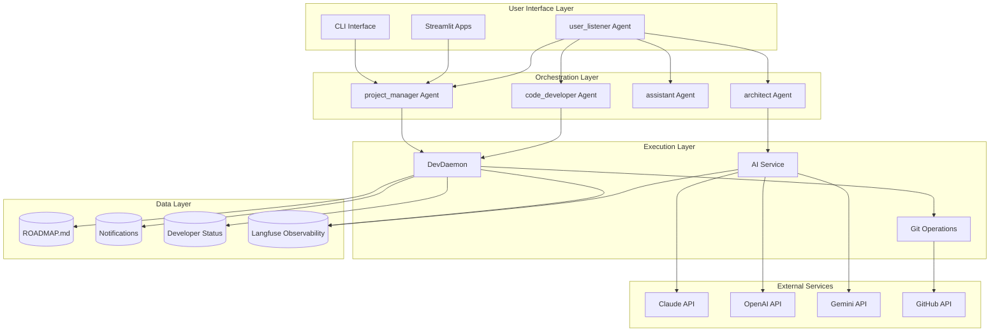
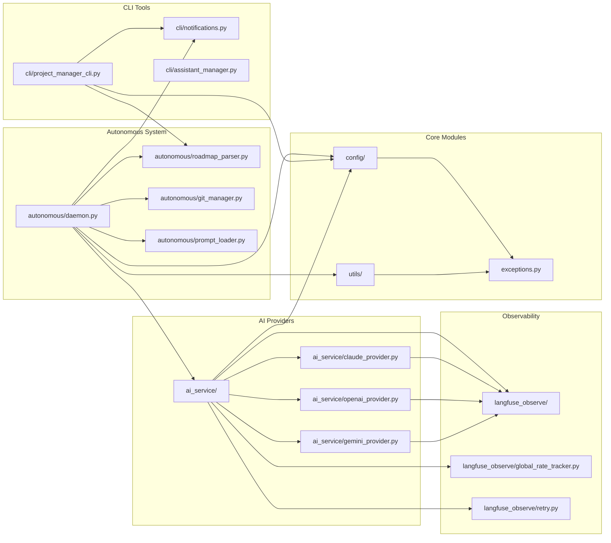
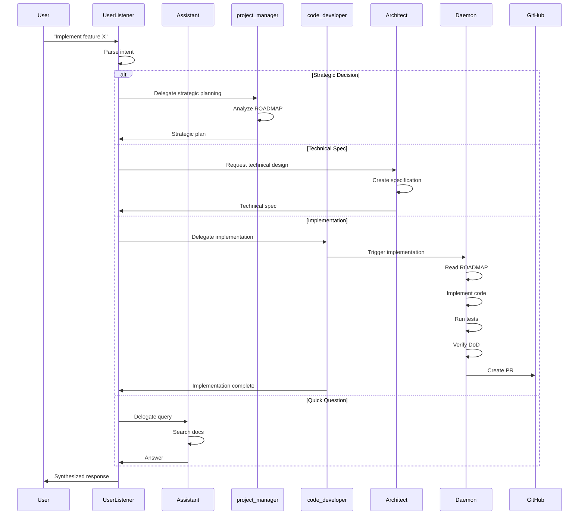
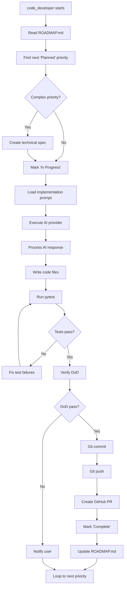
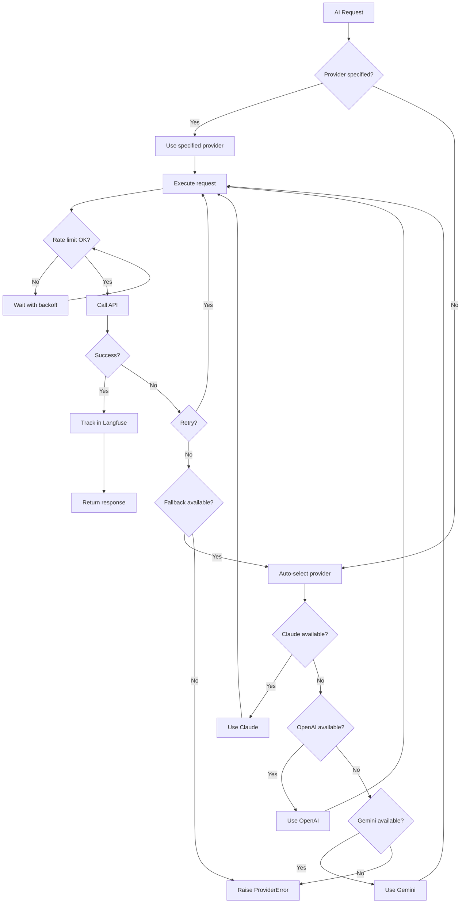
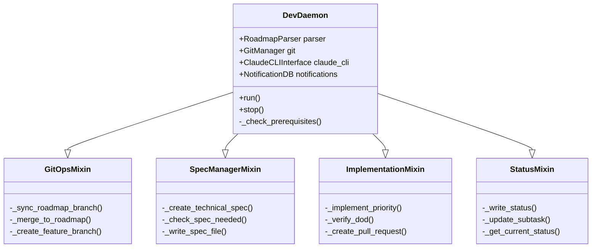
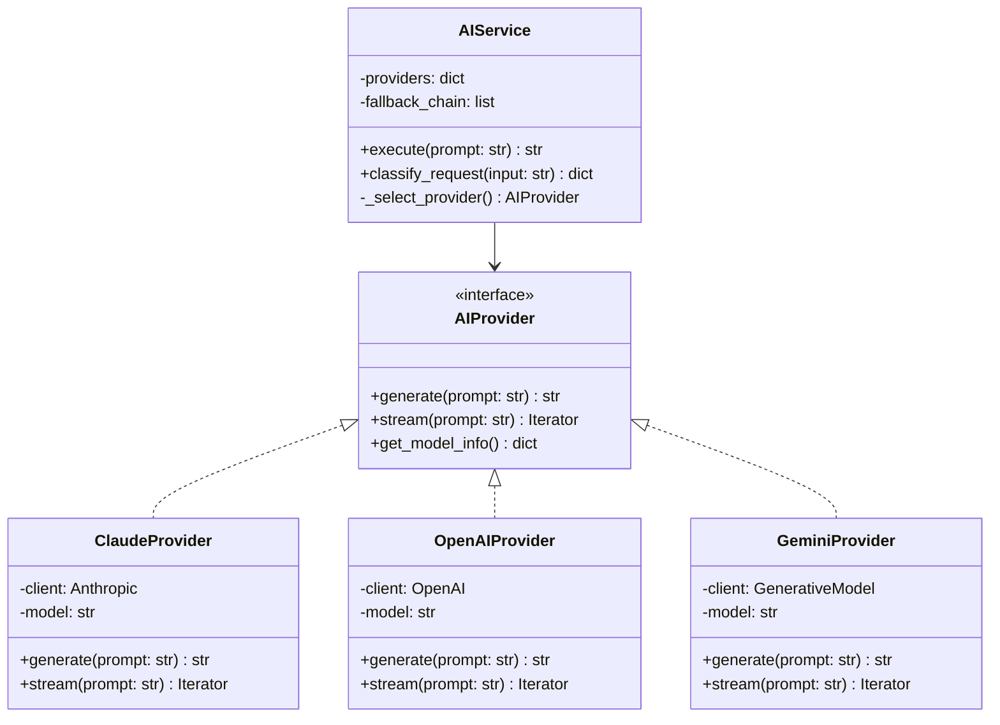
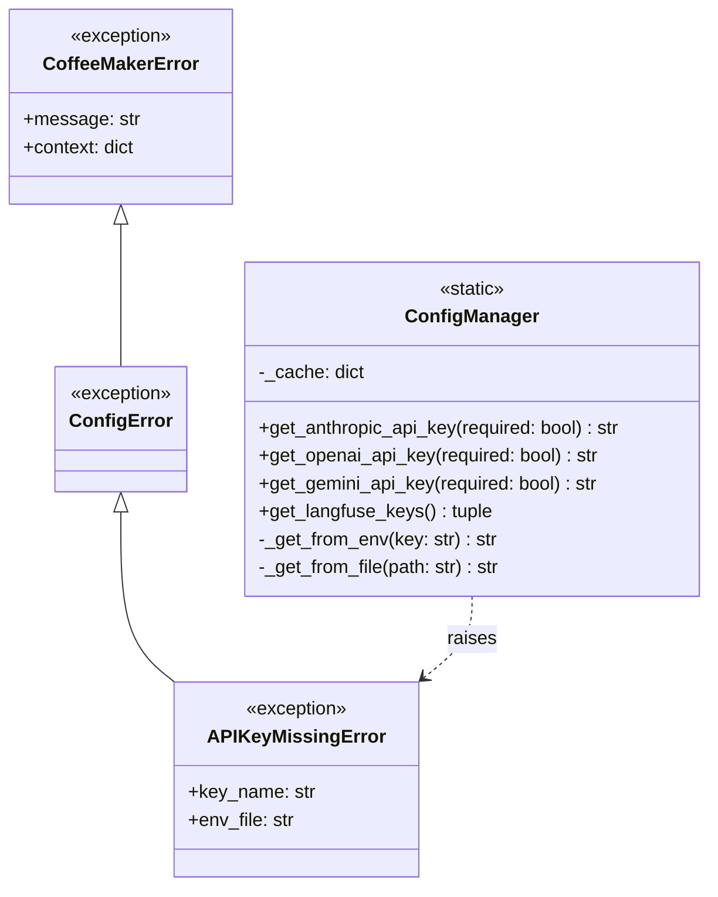
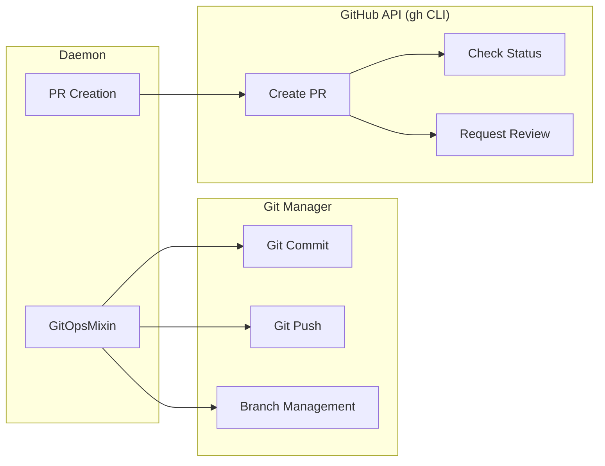

# System Architecture

**Version**: 1.0
**Last Updated**: 2025-10-16
**Status**: Living Document

This document provides visual architecture diagrams for the MonolithicCoffeeMakerAgent system.

---

## Table of Contents

1. [High-Level System Architecture](#high-level-system-architecture)
2. [Module Dependency Graph](#module-dependency-graph)
3. [Agent Interaction Flow](#agent-interaction-flow)
4. [Data Flow Diagrams](#data-flow-diagrams)
5. [Class Hierarchy](#class-hierarchy)

---

## High-Level System Architecture



**Description**:
- **User Interface Layer**: Entry points for user interaction
- **Orchestration Layer**: Autonomous agents coordinating work
- **Execution Layer**: Core business logic and automation
- **Data Layer**: Persistent storage and observability
- **External Services**: Third-party APIs and services

---

## Module Dependency Graph



**Key Dependencies**:
- All modules depend on `config/` and `utils/`
- AI providers are isolated and interchangeable
- Langfuse observability spans all AI operations
- CLI tools are independent of daemon logic

---

## Agent Interaction Flow



**Interaction Patterns**:
1. **user_listener is the ONLY UI agent** - All user interactions go through it
2. **Delegation based on task type** - Strategic, technical, implementation, or informational
3. **Autonomous execution** - code_developer works independently after delegation
4. **Synthesis** - user_listener combines responses from multiple agents

---

## Data Flow Diagrams

### Autonomous Implementation Flow



### AI Provider Selection Flow



---

## Class Hierarchy

### Daemon System



### AI Provider System



### Configuration System



---

## Integration Points

### Langfuse Observability

```mermaid
graph LR
    subgraph "Application Layer"
        Daemon[Daemon]
        AIService[AI Service]
        Providers[AI Providers]
    end

    subgraph "Observability Layer"
        Decorators[@observe decorators]
        Traces[Trace capture]
        Metrics[Metrics collection]
    end

    subgraph "External Service"
        Langfuse[(Langfuse Cloud)]
    end

    Daemon --> Decorators
    AIService --> Decorators
    Providers --> Decorators

    Decorators --> Traces
    Decorators --> Metrics

    Traces --> Langfuse
    Metrics --> Langfuse
```

**Key Features**:
- All AI calls automatically traced
- Cost tracking per provider
- Performance metrics (latency, tokens)
- Error rate monitoring
- Model comparison analytics

### GitHub Integration



---

## Design Patterns

### 1. Mixin Pattern (Daemon)

**Purpose**: Break down monolithic `DevDaemon` class into focused concerns

**Benefits**:
- Single Responsibility Principle
- Easier testing of individual mixins
- Better code organization
- Reusable components

**Example**:
```python
class DevDaemon(GitOpsMixin, SpecManagerMixin,
                ImplementationMixin, StatusMixin):
    """Main daemon composed from focused mixins."""
    pass
```

### 2. Strategy Pattern (AI Providers)

**Purpose**: Allow runtime selection of AI providers

**Benefits**:
- Provider agnostic code
- Easy to add new providers
- Fallback chain support
- Provider-specific optimization

**Example**:
```python
providers = {
    "claude": ClaudeProvider(),
    "openai": OpenAIProvider(),
    "gemini": GeminiProvider()
}
service.execute(prompt, provider="claude")  # Runtime selection
```

### 3. Singleton Pattern (ConfigManager)

**Purpose**: Centralize configuration with caching

**Benefits**:
- Single source of truth
- Cached API keys (performance)
- Consistent error handling
- Easy to mock in tests

**Example**:
```python
# All files use the same cached instance
api_key = ConfigManager.get_anthropic_api_key()
```

### 4. Observer Pattern (Langfuse)

**Purpose**: Track execution without coupling code to observability

**Benefits**:
- Non-invasive instrumentation
- Automatic trace capture
- Decorators for clean code
- Easy to disable for testing

**Example**:
```python
@observe(name="implement_priority")
def _implement_priority(self, priority):
    # Automatically traced without explicit calls
    pass
```

---

## Performance Considerations

### Test Suite Optimization

**Problem**: Original test suite took 169 seconds (2m 49s)

**Solution**:
- Marked slow tests with `@pytest.mark.slow`
- Created pytest.ini with marker configuration
- Run fast tests by default: `pytest -m "not slow"`

**Result**:
- Fast tests: 21.5 seconds (87% improvement!)
- Slow tests: Run separately for integration testing
- 757 tests pass in <30 seconds

### Rate Limiting Strategy

**Problem**: API rate limits can cause failures

**Solution**:
- Proactive rate tracking (not reactive)
- Safety margins (N-2 requests)
- Exponential backoff retry
- Per-model tracking

**Benefits**:
- Prevent rate limit errors before they happen
- Optimal API utilization
- Automatic recovery from transient failures

---

## Security Considerations

### API Key Management

**Requirements**:
1. Never commit API keys to git
2. Use environment variables or `.env` files
3. Fail fast on missing keys
4. Clear error messages for debugging

**Implementation**:
```python
# ConfigManager.get_anthropic_api_key(required=True)
# Raises APIKeyMissingError with helpful message:
#   "ANTHROPIC_API_KEY not found. Set in .env or environment."
```

### Code Isolation

**Daemon Safety**:
- Runs in isolated git branches
- Creates PRs for review (never direct push to main)
- User approval required for critical operations
- All changes tracked in Langfuse

---

## Appendix: Key Files

### Configuration
- `/Users/bobain/PycharmProjects/MonolithicCoffeeMakerAgent/coffee_maker/config/manager.py` - ConfigManager
- `/Users/bobain/PycharmProjects/MonolithicCoffeeMakerAgent/.env` - Environment variables
- `/Users/bobain/PycharmProjects/MonolithicCoffeeMakerAgent/pyproject.toml` - Dependencies

### Daemon System
- `/Users/bobain/PycharmProjects/MonolithicCoffeeMakerAgent/coffee_maker/autonomous/daemon.py` - Main daemon
- `/Users/bobain/PycharmProjects/MonolithicCoffeeMakerAgent/coffee_maker/autonomous/roadmap_parser.py` - ROADMAP parsing
- `/Users/bobain/PycharmProjects/MonolithicCoffeeMakerAgent/coffee_maker/autonomous/git_manager.py` - Git operations

### AI Service
- `/Users/bobain/PycharmProjects/MonolithicCoffeeMakerAgent/coffee_maker/ai_service/ai_service.py` - Main AI service
- `/Users/bobain/PycharmProjects/MonolithicCoffeeMakerAgent/coffee_maker/ai_service/claude_provider.py` - Claude integration
- `/Users/bobain/PycharmProjects/MonolithicCoffeeMakerAgent/coffee_maker/ai_service/openai_provider.py` - OpenAI integration
- `/Users/bobain/PycharmProjects/MonolithicCoffeeMakerAgent/coffee_maker/ai_service/gemini_provider.py` - Gemini integration

### Testing
- `/Users/bobain/PycharmProjects/MonolithicCoffeeMakerAgent/pytest.ini` - Test configuration
- `/Users/bobain/PycharmProjects/MonolithicCoffeeMakerAgent/tests/unit/` - Unit tests (<30s)
- `/Users/bobain/PycharmProjects/MonolithicCoffeeMakerAgent/tests/integration/` - Integration tests (slower)

---

**Document Maintainers**: code_developer
**Last Review**: 2025-10-16
**Next Review**: After major architecture changes

🤖 *Generated with [Claude Code](https://claude.com/claude-code) via code_developer*
