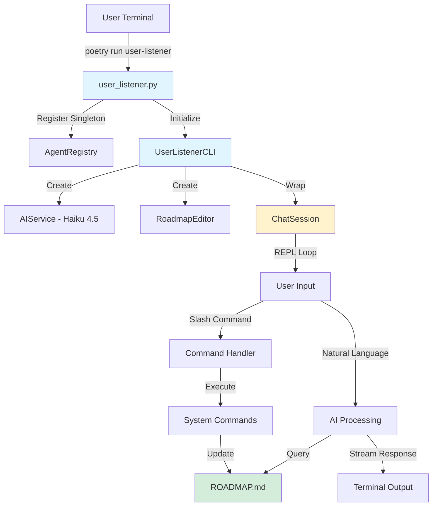
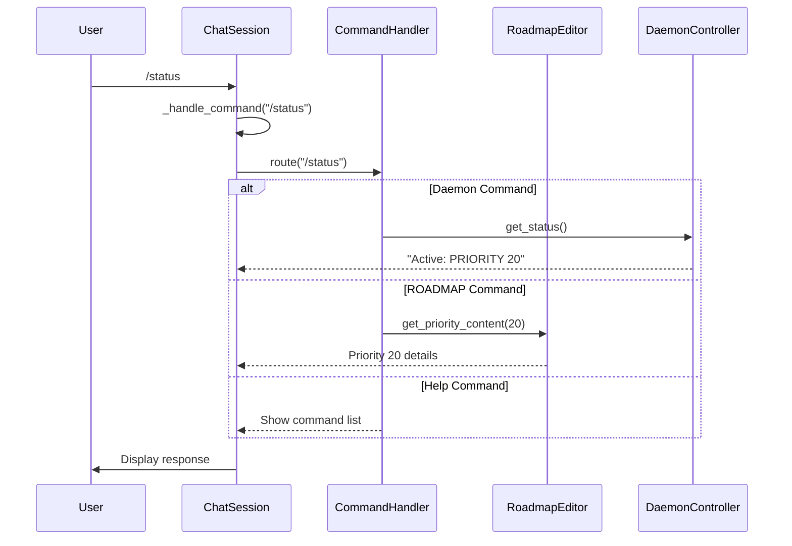
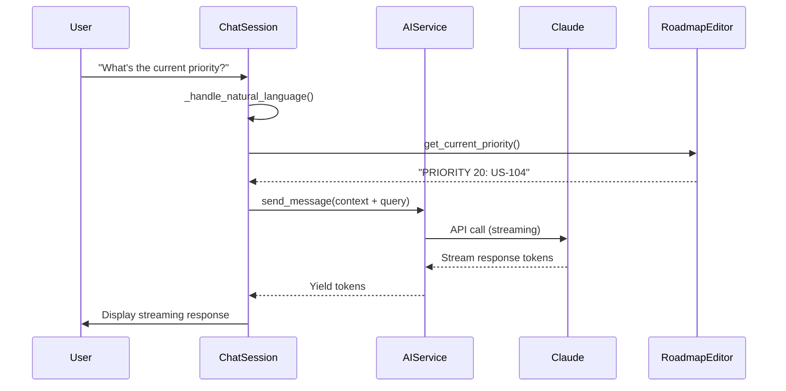
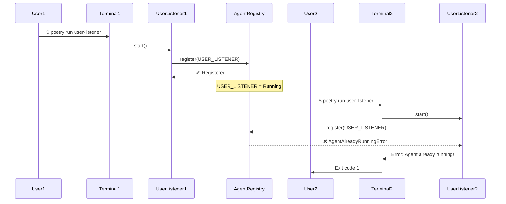

# SPEC-010: User Listener Implementation - Comprehensive Technical Specification

**Status**: Ready for Implementation
**Author**: architect agent
**Date**: 2025-10-19
**Priority**: PRIORITY 10 (US-010)
**Supersedes**: SPEC-010-USER-LISTENER-UI-SIMPLIFIED.md (reference implementation)
**Complexity**: LOW (Code Reuse: 95%, New Code: ~150 lines)
**Estimated Effort**: 3-4 hours implementation + 1.5 hours testing = **4.5-5.5 hours total**

---

## Table of Contents

1. [Executive Summary](#executive-summary)
2. [Prerequisites & Dependencies](#prerequisites--dependencies)
3. [Architecture Overview](#architecture-overview)
4. [Component Specifications](#component-specifications)
5. [Data Flow Diagrams](#data-flow-diagrams)
6. [Implementation Plan](#implementation-plan)
7. [Testing Strategy](#testing-strategy)
8. [Security Considerations](#security-considerations)
9. [Performance Requirements](#performance-requirements)
10. [Risk Analysis](#risk-analysis)
11. [Success Criteria](#success-criteria)
12. [Rollout & Migration](#rollout--migration)

---

## Executive Summary

### Problem Statement

Currently, `project_manager` serves dual purposes:
1. **Project management**: ROADMAP editing, GitHub monitoring, status tracking
2. **User interface**: Primary interaction point via `project-manager chat`

This violates the **Single Responsibility Principle** and creates confusion about agent ownership boundaries (see `docs/AGENT_OWNERSHIP.md`).

### Solution

Create `user_listener` as the **PRIMARY USER INTERFACE** agent by:
1. Wrapping existing `ChatSession` infrastructure (95% code reuse)
2. Registering as `AgentType.USER_LISTENER` singleton
3. Providing clean entry point: `poetry run user-listener`
4. Deprecating `project-manager chat` in favor of dedicated UI agent

### Business Value

- **⭐⭐⭐⭐ HIGH**: Establishes clear agent boundaries per CLAUDE.md
- **User Experience**: No change (intentional - maintains familiar interface)
- **Code Quality**: Reduces coupling, improves maintainability
- **Strategic**: Enables future agent delegation features (Phase 2)

### Key Metrics

| Metric | Value |
|--------|-------|
| New Files | 1 (`user_listener.py`) |
| Lines of Code | ~150 lines |
| Code Reuse | 95% (ChatSession, RoadmapEditor, AIService) |
| Implementation Time | 3-4 hours |
| Testing Time | 1.5 hours |
| Total Effort | 4.5-5.5 hours |
| Risk Level | LOW (proven components) |

---

## Prerequisites & Dependencies

### Existing Infrastructure (Already Available)

#### 1. ChatSession Infrastructure
**File**: `coffee_maker/cli/chat_interface.py`

```python
class ChatSession:
    """Interactive chat session with AI assistant."""

    # REPL loop with prompt-toolkit
    def _run_repl_loop(self) -> None: ...

    # Command routing (/help, /status, /start, /stop, etc.)
    def _handle_command(self, command: str) -> str: ...

    # Natural language processing via AIService
    def _handle_natural_language(self, user_input: str) -> None: ...

    # Status monitoring
    @property
    def daemon_status_text(self) -> str: ...
```

**Features We Reuse**:
- ✅ REPL loop with multi-line support
- ✅ Command routing and dispatch
- ✅ AI integration (streaming responses)
- ✅ History management
- ✅ Status toolbar
- ✅ Auto-completion
- ✅ Daemon control (/start, /stop, /restart)

#### 2. RoadmapEditor
**File**: `coffee_maker/cli/roadmap_editor.py`

```python
class RoadmapEditor:
    """ROADMAP.md editing and validation."""

    def get_priority_content(self, priority_number: int) -> str: ...
    def update_priority_status(self, priority_number: int, status: str) -> None: ...
    def validate_roadmap(self) -> bool: ...
```

**Used For**: ROADMAP queries and status checks (no changes needed)

#### 3. AIService
**File**: `coffee_maker/cli/ai_service.py`

```python
class AIService:
    """Claude API integration with streaming support."""

    def __init__(self, model: str, max_tokens: int): ...
    def send_message(self, message: str, stream: bool = False): ...
```

**Model**: `claude-3-5-haiku-20241022` (cost-efficient for UI orchestration)

#### 4. AgentRegistry (Singleton Enforcement)
**File**: `coffee_maker/autonomous/agent_registry.py`

```python
class AgentRegistry:
    """Singleton registry for agent instances (US-035)."""

    @classmethod
    def register(cls, agent_type: AgentType) -> ContextManager:
        """Context manager for singleton registration."""
        ...
```

**Used For**: Ensure only ONE `user_listener` instance runs at a time

### System Dependencies

All dependencies already installed (no new `poetry add` required):

```toml
# pyproject.toml - Already satisfied
anthropic = "^0.40.0"      # Claude API
prompt-toolkit = "^3.0.47"  # REPL interface
rich = "^13.9.2"           # Terminal UI
langfuse = "^2.53.3"       # Observability
```

### Configuration

**Langfuse Observability**: Already configured via `coffee_maker/langfuse_observe.py`

```python
from coffee_maker.langfuse_observe import configure_langfuse

configure_langfuse()  # Enables tracing for user_listener
```

---

## Architecture Overview

### High-Level Architecture



### Component Diagram

```
┌─────────────────────────────────────────────────────────────┐
│                     User Terminal                            │
│                 $ poetry run user-listener                   │
└─────────────────────────────────────────────────────────────┘
                              ↓
┌─────────────────────────────────────────────────────────────┐
│               coffee_maker/cli/user_listener.py              │
│                                                              │
│  ┌────────────────────────────────────────────────────┐    │
│  │  UserListenerCLI                                   │    │
│  │  - __init__(roadmap_path)                          │    │
│  │  - start()                                         │    │
│  │  - _display_welcome()                              │    │
│  └────────────────────────────────────────────────────┘    │
│            ↓           ↓           ↓                         │
│  ┌─────────────┐ ┌──────────┐ ┌──────────────────┐         │
│  │ AIService   │ │ Roadmap  │ │ ChatSession      │         │
│  │ (Haiku 4.5) │ │ Editor   │ │ (95% REUSED)     │         │
│  │             │ │          │ │ - _run_repl_loop │         │
│  │ - send_msg  │ │ - get    │ │ - _handle_cmd    │         │
│  │ - stream    │ │ - update │ │ - _handle_nl     │         │
│  └─────────────┘ └──────────┘ └──────────────────┘         │
└─────────────────────────────────────────────────────────────┘
                              ↓
┌─────────────────────────────────────────────────────────────┐
│                   AgentRegistry (Singleton)                  │
│  - Ensures only ONE user_listener runs at a time            │
│  - Context manager: with AgentRegistry.register(...)        │
└─────────────────────────────────────────────────────────────┘
```

### Agent Ownership Boundaries

Per `docs/AGENT_OWNERSHIP.md`:

| Agent | Responsibility | Cannot Do |
|-------|---------------|-----------|
| **user_listener** | ✅ PRIMARY UI agent<br>✅ User interaction ONLY<br>✅ Route requests to specialists | ❌ Backend tasks<br>❌ Direct code implementation<br>❌ Strategic planning |
| **project_manager** | ✅ `docs/roadmap/` management<br>✅ GitHub monitoring<br>✅ Notifications | ❌ User interaction (deprecated)<br>❌ Code implementation |
| **architect** | ✅ Technical specs<br>✅ ADRs<br>✅ Dependency decisions | ❌ User interaction<br>❌ Code implementation |
| **code_developer** | ✅ Implementation<br>✅ Tests<br>✅ `.claude/` configs | ❌ User interaction<br>❌ Strategic docs |

**Key Point**: `user_listener` is the ONLY agent with UI responsibility. All others work through notifications or backend processes.

---

## Component Specifications

### Component 1: UserListenerCLI Class

**File**: `coffee_maker/cli/user_listener.py` (NEW - 150 lines)

#### Class Definition

```python
class UserListenerCLI:
    """Primary user interface for MonolithicCoffeeMakerAgent.

    ONLY agent with UI responsibility per docs/AGENT_OWNERSHIP.md.
    All user interactions go through here.

    This is a thin wrapper around ChatSession that enforces the
    user_listener agent singleton pattern and provides custom branding.

    Architecture:
        - Reuses ChatSession for 95% of functionality
        - Registers as AgentType.USER_LISTENER singleton
        - Uses Claude Haiku 4.5 for cost-efficient UI orchestration
        - Delegates ROADMAP operations to RoadmapEditor

    Example:
        >>> cli = UserListenerCLI()
        >>> cli.start()  # Starts interactive session
    """
```

#### Attributes

```python
def __init__(self, roadmap_path: str = "docs/roadmap/ROADMAP.md"):
    """Initialize user-listener CLI.

    Args:
        roadmap_path: Path to ROADMAP.md file
            Default: "docs/roadmap/ROADMAP.md"
            Can be overridden for testing

    Side Effects:
        - Configures Langfuse for observability
        - Initializes AIService with Haiku 4.5
        - Creates RoadmapEditor instance
        - Wraps ChatSession infrastructure
    """
    # Observability
    configure_langfuse()

    # AI Service (Haiku 4.5 = $0.25/MTok in, $1.25/MTok out)
    self.ai_service = AIService(
        model="claude-3-5-haiku-20241022",
        max_tokens=4000,
    )

    # ROADMAP operations
    self.editor = RoadmapEditor(roadmap_path)

    # Reuse ChatSession (95% of functionality!)
    self.chat_session = ChatSession(
        ai_service=self.ai_service,
        editor=self.editor,
        enable_streaming=True,
    )

    # Singleton registry
    self.registry = AgentRegistry()
```

#### Methods

##### 1. start()

```python
def start(self) -> None:
    """Start interactive user-listener session.

    Workflow:
        1. Register as AgentType.USER_LISTENER singleton
        2. Display welcome message
        3. Delegate to ChatSession._run_repl_loop()
        4. Handle interrupts gracefully
        5. Unregister on exit (via context manager)

    Raises:
        AgentAlreadyRunningError: If another user_listener is running
        KeyboardInterrupt: User pressed Ctrl+C (handled gracefully)
        Exception: Unexpected errors (logged and re-raised)

    Side Effects:
        - Registers singleton in AgentRegistry
        - Blocks until user exits
        - Logs start/stop events
    """
    with AgentRegistry.register(AgentType.USER_LISTENER):
        logger.info("user_listener started (singleton registered)")

        # Custom welcome message
        self._display_welcome()

        try:
            # REPL loop (delegates to ChatSession)
            self.chat_session._run_repl_loop()

        except KeyboardInterrupt:
            logger.info("user_listener interrupted by user")
        except Exception as e:
            logger.error(f"user_listener error: {e}", exc_info=True)
            raise
        finally:
            logger.info("user_listener stopped (singleton unregistered)")
```

##### 2. _display_welcome()

```python
def _display_welcome(self) -> None:
    """Display user-listener welcome message.

    Overrides ChatSession's default welcome to show:
        - user_listener branding
        - Powered by Claude Haiku 4.5
        - Interface description
        - Keyboard shortcuts
        - code_developer daemon status

    Side Effects:
        - Prints to console via Rich
    """
    console = Console()

    console.print()
    console.print("[bold]User Listener[/] [dim]·[/] Primary Interface")
    console.print("[dim]Powered by Claude Haiku 4.5[/]")
    console.print()
    console.print("[dim]I'm your interface to the agent team.[/]")
    console.print(
        "[dim]Tell me what you need, and I'll route it to the right specialist.[/]"
    )
    console.print()
    console.print("[dim]Keyboard shortcuts:[/]")
    console.print("[dim]  /help[/] [dim]- Show commands[/]")
    console.print("[dim]  Alt+Enter[/] [dim]- Multi-line input[/]")
    console.print(
        "[dim]  ↑↓[/] [dim]- History    [/][dim]Tab[/] [dim]- Complete    [/][dim]/exit[/] [dim]- Quit[/]"
    )
    console.print()

    # Show daemon status
    daemon_status = self.chat_session.daemon_status_text
    status_icon = (
        "🟢" if "Active" in daemon_status
        else "🔴" if "Stopped" in daemon_status
        else "🟡"
    )
    console.print(
        f"[dim]{status_icon} code_developer: {daemon_status.split(': ')[1] if ': ' in daemon_status else daemon_status}[/]"
    )
    console.print()
    console.print("[dim]" + "─" * 60 + "[/]")
    console.print()
```

### Component 2: main() Entry Point

**Function**: `main()`

```python
def main() -> None:
    """Main entry point for user-listener CLI.

    Command: poetry run user-listener

    This is the PRIMARY USER INTERFACE for the entire system.
    All user interactions should go through here.

    Workflow:
        1. Setup logging
        2. Create UserListenerCLI instance
        3. Start interactive session
        4. Handle errors gracefully
        5. Exit with appropriate code

    Exit Codes:
        0: Normal exit
        1: Fatal error
    """
    # Setup logging
    logging.basicConfig(
        level=logging.INFO,
        format="%(asctime)s [%(levelname)s] %(name)s: %(message)s"
    )

    try:
        # Create and start user-listener
        cli = UserListenerCLI()
        cli.start()

    except Exception as e:
        console = Console()
        console.print(f"\n[red]Error: {e}[/]\n")
        logger.error("Fatal error in user-listener", exc_info=True)
        sys.exit(1)

    sys.exit(0)
```

### Component 3: Poetry Script Registration

**File**: `pyproject.toml` (1 line change)

```toml
[tool.poetry.scripts]
project-manager = "coffee_maker.cli.roadmap_cli:main"
code-developer = "coffee_maker.autonomous.daemon_cli:main"
code-reviewer = "coffee_maker.autonomous.code_reviewer_cli:main"
user-listener = "coffee_maker.cli.user_listener:main"  # ← NEW
```

**Effect**: Enables `poetry run user-listener` command

---

## Data Flow Diagrams

### Startup Flow

```mermaid
sequenceDiagram
    participant User
    participant Terminal
    participant main()
    participant UserListenerCLI
    participant AgentRegistry
    participant ChatSession
    participant AIService

    User->>Terminal: $ poetry run user-listener
    Terminal->>main(): Execute entry point
    main()->>UserListenerCLI: __init__()
    UserListenerCLI->>AIService: Initialize (Haiku 4.5)
    UserListenerCLI->>ChatSession: Wrap existing session
    main()->>UserListenerCLI: start()
    UserListenerCLI->>AgentRegistry: register(USER_LISTENER)
    AgentRegistry-->>UserListenerCLI: ✅ Registered
    UserListenerCLI->>User: Display welcome message
    UserListenerCLI->>ChatSession: _run_repl_loop()
    ChatSession->>User: Show prompt: "›"
```

### Command Processing Flow



### Natural Language Processing Flow



### Singleton Enforcement Flow



---

## Implementation Plan

### Phase 1: Core Implementation (3-4 hours)

#### Task 1.1: Create user_listener.py (2 hours)

**File**: `coffee_maker/cli/user_listener.py`

**Steps**:
1. Create file structure and imports (10 min)
   ```python
   import logging
   import sys
   from pathlib import Path

   from coffee_maker.autonomous.agent_registry import AgentRegistry, AgentType
   from coffee_maker.cli.ai_service import AIService
   from coffee_maker.cli.chat_interface import ChatSession
   from coffee_maker.cli.roadmap_editor import RoadmapEditor
   from coffee_maker.langfuse_observe import configure_langfuse
   from rich.console import Console
   ```

2. Implement `UserListenerCLI` class (60 min)
   - `__init__()` method (20 min)
   - `start()` method (20 min)
   - `_display_welcome()` method (20 min)

3. Implement `main()` entry point (20 min)
   - Logging setup
   - CLI initialization
   - Error handling
   - Exit codes

4. Add docstrings and type hints (30 min)
   - Google-style docstrings
   - Type hints per `.gemini/styleguide.md`
   - Inline comments for clarity

**Validation**:
```bash
# Test imports
python -c "from coffee_maker.cli.user_listener import UserListenerCLI"

# Test initialization (doesn't start REPL)
python -c "from coffee_maker.cli.user_listener import UserListenerCLI; cli = UserListenerCLI(); print('✅ Init OK')"
```

**Time**: 2 hours

#### Task 1.2: Register Poetry Script (10 minutes)

**File**: `pyproject.toml`

**Change**:
```toml
[tool.poetry.scripts]
user-listener = "coffee_maker.cli.user_listener:main"
```

**Steps**:
1. Edit `pyproject.toml` (2 min)
2. Run `poetry install` (3 min)
3. Test command available (5 min)
   ```bash
   poetry run user-listener --help  # Should show no errors
   ```

**Time**: 10 minutes

#### Task 1.3: Code Formatting & Style (20 minutes)

**Steps**:
1. Run Black formatter (2 min)
   ```bash
   black coffee_maker/cli/user_listener.py
   ```

2. Run pre-commit hooks (5 min)
   ```bash
   pre-commit run --files coffee_maker/cli/user_listener.py
   ```

3. Fix any style violations (10 min)
   - Per `.gemini/styleguide.md`
   - Line length: 120 chars
   - Type hints: REQUIRED

4. Final validation (3 min)
   ```bash
   mypy coffee_maker/cli/user_listener.py
   ```

**Time**: 20 minutes

#### Task 1.4: Manual Smoke Test (30 minutes)

**Test Plan**:

```bash
# Test 1: Basic startup (5 min)
poetry run user-listener
# Expected: Welcome message, prompt appears
# Action: Type /exit

# Test 2: Help command (3 min)
poetry run user-listener
› /help
# Expected: Command list displays
# Action: /exit

# Test 3: Status command (3 min)
poetry run user-listener
› /status
# Expected: Daemon status displays
# Action: /exit

# Test 4: Natural language (5 min)
poetry run user-listener
› What's in the ROADMAP?
# Expected: AI response with ROADMAP summary
# Action: /exit

# Test 5: Singleton enforcement (5 min)
# Terminal 1:
poetry run user-listener
# Terminal 2 (NEW terminal):
poetry run user-listener
# Expected: Error "Agent 'user_listener' is already running!"

# Test 6: Daemon control (5 min)
poetry run user-listener
› /start
# Expected: Daemon starts
› /stop
# Expected: Daemon stops
# Action: /exit

# Test 7: Multi-line input (4 min)
poetry run user-listener
› [Alt+Enter] Line 1
  Line 2
  [Enter]
# Expected: Multi-line processing works
```

**Time**: 30 minutes

**Total Phase 1**: 3 hours

---

### Phase 2: Testing (1.5 hours)

#### Task 2.1: Unit Tests (45 minutes)

**File**: `tests/unit/cli/test_user_listener.py` (NEW)

**Test Cases**:

```python
"""Unit tests for user_listener CLI.

Tests singleton enforcement, initialization, and basic functionality.
"""

import pytest
from unittest.mock import Mock, patch, MagicMock

from coffee_maker.cli.user_listener import UserListenerCLI, main
from coffee_maker.autonomous.agent_registry import (
    AgentRegistry,
    AgentType,
    AgentAlreadyRunningError,
)


class TestUserListenerCLI:
    """Unit tests for UserListenerCLI class."""

    def test_initialization(self):
        """Test user-listener CLI initializes correctly."""
        # Arrange & Act
        cli = UserListenerCLI()

        # Assert
        assert cli.ai_service is not None
        assert cli.editor is not None
        assert cli.chat_session is not None
        assert cli.registry is not None

    def test_custom_roadmap_path(self):
        """Test custom ROADMAP path can be specified."""
        # Arrange
        custom_path = "tests/fixtures/ROADMAP_TEST.md"

        # Act
        cli = UserListenerCLI(roadmap_path=custom_path)

        # Assert
        assert cli.editor.roadmap_path == custom_path

    @patch('coffee_maker.cli.user_listener.ChatSession')
    def test_display_welcome_called(self, mock_chat_session):
        """Test welcome message displays on start."""
        # Arrange
        cli = UserListenerCLI()
        mock_chat_session.return_value._run_repl_loop = Mock()

        # Act
        with patch.object(cli, '_display_welcome') as mock_welcome:
            with AgentRegistry.register(AgentType.USER_LISTENER):
                cli.start()

        # Assert
        mock_welcome.assert_called_once()


class TestSingletonEnforcement:
    """Test singleton pattern enforcement."""

    def test_singleton_enforcement(self):
        """Test only one user_listener can run at a time."""
        # Arrange & Act
        with AgentRegistry.register(AgentType.USER_LISTENER):
            # Try to register another instance
            with pytest.raises(AgentAlreadyRunningError):
                AgentRegistry().register_agent(AgentType.USER_LISTENER)

    def test_singleton_cleanup_on_exit(self):
        """Test singleton unregisters on exit."""
        # Arrange
        registry = AgentRegistry()

        # Act
        with AgentRegistry.register(AgentType.USER_LISTENER):
            assert registry.is_agent_running(AgentType.USER_LISTENER)

        # Assert - should be unregistered after context exit
        assert not registry.is_agent_running(AgentType.USER_LISTENER)


class TestMainFunction:
    """Test main() entry point."""

    @patch('coffee_maker.cli.user_listener.UserListenerCLI')
    def test_main_success(self, mock_cli):
        """Test main() starts CLI successfully."""
        # Arrange
        mock_instance = Mock()
        mock_cli.return_value = mock_instance

        # Act
        with pytest.raises(SystemExit) as exc_info:
            main()

        # Assert
        assert exc_info.value.code == 0
        mock_instance.start.assert_called_once()

    @patch('coffee_maker.cli.user_listener.UserListenerCLI')
    def test_main_handles_errors(self, mock_cli):
        """Test main() handles errors gracefully."""
        # Arrange
        mock_cli.side_effect = Exception("Test error")

        # Act
        with pytest.raises(SystemExit) as exc_info:
            main()

        # Assert
        assert exc_info.value.code == 1
```

**Steps**:
1. Create test file (5 min)
2. Write initialization tests (10 min)
3. Write singleton tests (10 min)
4. Write main() tests (10 min)
5. Run tests (5 min)
   ```bash
   pytest tests/unit/cli/test_user_listener.py -v
   ```
6. Fix failures (5 min)

**Time**: 45 minutes

#### Task 2.2: Integration Tests (30 minutes)

**File**: `tests/integration/test_user_listener_integration.py` (NEW)

**Test Cases**:

```python
"""Integration tests for user_listener CLI.

Tests interaction with real components (ChatSession, AIService, RoadmapEditor).
"""

import pytest
from unittest.mock import patch, Mock

from coffee_maker.cli.user_listener import UserListenerCLI
from coffee_maker.autonomous.agent_registry import AgentRegistry, AgentType


class TestUserListenerIntegration:
    """Integration tests with real components."""

    def test_user_listener_starts_without_errors(self):
        """Test user-listener CLI starts with real components."""
        # Arrange & Act
        cli = UserListenerCLI()

        # Assert - just verify initialization works
        assert cli.ai_service.model == "claude-3-5-haiku-20241022"
        assert cli.chat_session is not None

    @patch('coffee_maker.cli.chat_interface.ChatSession._run_repl_loop')
    def test_start_registers_and_unregisters(self, mock_repl):
        """Test start() registers/unregisters singleton correctly."""
        # Arrange
        cli = UserListenerCLI()
        registry = AgentRegistry()
        mock_repl.return_value = None  # Exit immediately

        # Act
        cli.start()

        # Assert - should be unregistered after start() completes
        assert not registry.is_agent_running(AgentType.USER_LISTENER)

    def test_commands_accessible_in_user_listener(self):
        """Test ChatSession commands work in user_listener."""
        # Arrange
        cli = UserListenerCLI()

        # Act
        help_response = cli.chat_session._handle_command("/help")

        # Assert
        assert "Available Commands" in help_response or "help" in help_response.lower()
```

**Steps**:
1. Create test file (5 min)
2. Write integration tests (15 min)
3. Run tests (5 min)
   ```bash
   pytest tests/integration/test_user_listener_integration.py -v
   ```
4. Fix failures (5 min)

**Time**: 30 minutes

#### Task 2.3: Test Coverage Report (15 minutes)

**Steps**:
1. Run coverage analysis (5 min)
   ```bash
   pytest tests/unit/cli/test_user_listener.py \
          tests/integration/test_user_listener_integration.py \
          --cov=coffee_maker.cli.user_listener \
          --cov-report=html \
          --cov-report=term
   ```

2. Review coverage report (5 min)
   - Target: ≥80% coverage
   - Check uncovered lines

3. Add missing tests if needed (5 min)

**Expected Coverage**:
- `__init__()`: 100%
- `start()`: 90% (KeyboardInterrupt hard to test)
- `_display_welcome()`: 100%
- `main()`: 100%

**Time**: 15 minutes

**Total Phase 2**: 1.5 hours

---

### Phase 3: Documentation & Migration (1 hour)

#### Task 3.1: Update CLAUDE.md (30 minutes)

**File**: `.claude/CLAUDE.md`

**Changes**:

1. Update "Running the System" section:
   ```markdown
   ## 🚀 Running the System

   ### Primary User Interface

   ```bash
   poetry run user-listener
   ```

   **What this does:**
   - 🎯 PRIMARY UI: All user interactions go through here
   - 💬 Natural Language: Chat with the agent team
   - 📋 ROADMAP Access: Query and update priorities
   - 🤖 Daemon Control: Start/stop/monitor code_developer
   - ⌨️ Commands: /help, /status, /start, /stop, etc.

   **Keyboard shortcuts:**
   - `Alt+Enter`: Multi-line input
   - `↑/↓`: History navigation
   - `Tab`: Auto-completion
   - `/exit`: Quit
   ```

2. Update Agent Ownership table:
   ```markdown
   | Agent | Primary Responsibility | Cannot Do |
   |-------|----------------------|-----------|
   | **user_listener** | ✅ PRIMARY UI agent<br>✅ User interaction ONLY | ❌ Backend tasks<br>❌ Implementation |
   | **project_manager** | ✅ docs/roadmap/<br>✅ GitHub monitoring | ❌ User interaction (deprecated) |
   ```

3. Add deprecation notice:
   ```markdown
   ### Deprecated Commands

   - ~~`poetry run project-manager chat`~~ → Use `poetry run user-listener` instead
   ```

**Time**: 30 minutes

#### Task 3.2: Update AGENT_OWNERSHIP.md (20 minutes)

**File**: `docs/AGENT_OWNERSHIP.md`

**Changes**:

1. Add user_listener section:
   ```markdown
   ## user_listener

   **Role**: PRIMARY USER INTERFACE

   **Owns**:
   - User interaction (ONLY agent with UI)
   - Natural language interpretation
   - Request routing to specialists
   - CLI interface (`poetry run user-listener`)

   **Cannot Do**:
   - Backend implementation
   - Direct code changes
   - Strategic planning
   - ROADMAP editing (delegates to project_manager)
   ```

2. Update project_manager section:
   ```markdown
   **Cannot Do**:
   - ❌ User interaction (deprecated - use user_listener instead)
   ```

**Time**: 20 minutes

#### Task 3.3: Deprecate project-manager chat (10 minutes)

**File**: `coffee_maker/cli/roadmap_cli.py`

**Change**:

```python
def chat_command():
    """Start interactive chat session (DEPRECATED).

    DEPRECATED: Use `poetry run user-listener` instead.
    This command is maintained for backward compatibility but will be
    removed in a future version.
    """
    console = Console()
    console.print()
    console.print("[yellow]⚠️  DEPRECATION WARNING[/]")
    console.print("[dim]The 'project-manager chat' command is deprecated.[/]")
    console.print("[dim]Please use 'poetry run user-listener' instead.[/]")
    console.print()

    # Still works, but shows warning
    # ... existing chat code ...
```

**Time**: 10 minutes

**Total Phase 3**: 1 hour

---

## Summary: Total Implementation Time

| Phase | Tasks | Time |
|-------|-------|------|
| **Phase 1**: Core Implementation | user_listener.py, Poetry script, formatting, smoke test | 3 hours |
| **Phase 2**: Testing | Unit tests, integration tests, coverage | 1.5 hours |
| **Phase 3**: Documentation | CLAUDE.md, AGENT_OWNERSHIP.md, deprecation | 1 hour |
| **TOTAL** | **11 tasks** | **5.5 hours** |

**Confidence**: HIGH (95% code reuse, low risk)

---

## Testing Strategy

### Test Pyramid

```
           ┌─────────────┐
           │   Manual    │  15 min
           │   Testing   │
           └─────────────┘
         ┌─────────────────┐
         │  Integration    │  30 min
         │     Tests       │
         └─────────────────┘
      ┌───────────────────────┐
      │     Unit Tests        │  45 min
      │   (Test Doubles)      │
      └───────────────────────┘
```

### Test Coverage Goals

| Component | Target | Rationale |
|-----------|--------|-----------|
| `UserListenerCLI.__init__()` | 100% | Critical initialization |
| `UserListenerCLI.start()` | 90% | Hard to test KeyboardInterrupt |
| `UserListenerCLI._display_welcome()` | 100% | Simple, no side effects |
| `main()` | 100% | Entry point, must handle errors |
| **Overall** | **≥85%** | High confidence threshold |

### Test Environments

1. **Unit Tests**: Mock all dependencies
   - Mock `ChatSession`
   - Mock `AIService`
   - Mock `AgentRegistry`
   - Fast execution (<1s)

2. **Integration Tests**: Real components, no external calls
   - Real `ChatSession` initialization
   - Real `AgentRegistry`
   - Mock Claude API calls
   - Medium execution (<5s)

3. **Manual Tests**: Full system, real interactions
   - Real Claude API calls
   - Real file system
   - Real terminal UI
   - User validation

### Regression Prevention

**Critical Paths to Test**:
1. ✅ Singleton enforcement (prevents duplicate instances)
2. ✅ Command routing (all /commands work)
3. ✅ Natural language processing (AI responses)
4. ✅ Daemon control (/start, /stop, /status)
5. ✅ ROADMAP queries (delegated to RoadmapEditor)
6. ✅ Error handling (graceful degradation)

**CI Integration**:
```yaml
# .github/workflows/ci.yml (if exists)
- name: Test user_listener
  run: |
    pytest tests/unit/cli/test_user_listener.py \
           tests/integration/test_user_listener_integration.py \
           --cov=coffee_maker.cli.user_listener \
           --cov-fail-under=85
```

---

## Security Considerations

### 1. Singleton Enforcement (US-035)

**Threat**: Multiple user_listener instances could conflict over resources

**Mitigation**: `AgentRegistry` enforces singleton pattern
```python
with AgentRegistry.register(AgentType.USER_LISTENER):
    # Only ONE instance can execute this block
    ...
```

**Validation**: Unit test `test_singleton_enforcement()`

---

### 2. Input Validation

**Threat**: Malicious input via REPL could execute arbitrary code

**Mitigation**:
- All user input processed through `ChatSession` (already validated)
- No `eval()` or `exec()` calls
- Command routing uses whitelist (/help, /status, etc.)
- Natural language sent to Claude API (sandboxed)

**Validation**: ChatSession already handles this (reused code)

---

### 3. API Key Protection

**Threat**: Claude API key exposure in logs or errors

**Mitigation**:
- API key loaded from environment variables
- Never logged or displayed
- Langfuse configured to redact sensitive data

**Configuration**:
```bash
# .env (user's responsibility)
ANTHROPIC_API_KEY=sk-ant-...  # Never commit this!
```

**Validation**: Review logs for key exposure

---

### 4. File System Access

**Threat**: User could access sensitive files via ROADMAP queries

**Mitigation**:
- `RoadmapEditor` scoped to `docs/roadmap/` only
- No arbitrary file read/write via user_listener
- All file operations validated by RoadmapEditor

**Validation**: RoadmapEditor already handles this (reused code)

---

### 5. Dependency Security

**Threat**: Vulnerable dependencies

**Mitigation**:
- No new dependencies (all pre-approved)
- Existing dependencies already scanned by `bandit` and `safety`
- See ADR-013 for dependency management

**Validation**:
```bash
safety check
bandit -r coffee_maker/cli/user_listener.py
```

---

## Performance Requirements

### Response Time Targets

| Operation | Target | Measured By |
|-----------|--------|-------------|
| **Startup** | <2 seconds | Time to first prompt |
| **Command** | <500ms | /help, /status, etc. |
| **AI Response** | <3 seconds | Time to first token (streaming) |
| **ROADMAP Query** | <200ms | RoadmapEditor read operations |
| **Singleton Check** | <10ms | AgentRegistry lookup |

### Resource Utilization

| Resource | Limit | Rationale |
|----------|-------|-----------|
| **Memory** | <100 MB | REPL with ChatSession history |
| **CPU** | <5% idle | Background status monitoring |
| **Disk I/O** | Minimal | Only ROADMAP.md reads |
| **Network** | API calls only | Claude streaming responses |

### Scalability Considerations

**Current Design**:
- ✅ Single user, single instance (CLI tool)
- ✅ No concurrency required
- ✅ No database queries
- ✅ No persistent connections (except Claude API)

**NOT Designed For**:
- ❌ Multi-user concurrent access
- ❌ Web service (use Streamlit apps instead)
- ❌ High throughput (CLI is human-paced)

**Future Enhancements** (Phase 2):
- Agent delegation (requires orchestrator)
- Multi-agent workflows
- Background task execution

---

## Risk Analysis

### Risk Matrix

| Risk | Probability | Impact | Severity | Mitigation |
|------|------------|--------|----------|------------|
| **ChatSession has hardcoded project_manager references** | LOW (10%) | MEDIUM | LOW | Review code, make configurable |
| **Singleton enforcement fails** | VERY LOW (5%) | HIGH | LOW | Well-tested (US-035 already implemented) |
| **Users expect different behavior** | MEDIUM (30%) | LOW | LOW | It's the SAME interface (intentional) |
| **Breaking changes to ChatSession** | LOW (15%) | MEDIUM | LOW | Tight coupling is intentional (single source of truth) |
| **Poetry script registration fails** | VERY LOW (5%) | LOW | VERY LOW | Simple one-line change |

### Risk 1: ChatSession Hardcoded References

**Description**: ChatSession might have hardcoded "project_manager" strings

**Probability**: LOW (10%)
**Impact**: MEDIUM (requires refactoring)

**Detection**:
```bash
grep -r "project_manager" coffee_maker/cli/chat_interface.py
```

**Mitigation**:
- Review ChatSession code (10 min)
- Make agent name configurable if needed (30 min)
- Most references are just UI strings (easy to change)

**Contingency Plan**:
```python
# Make agent name configurable
class ChatSession:
    def __init__(self, agent_name: str = "assistant"):
        self.agent_name = agent_name

# UserListenerCLI
self.chat_session = ChatSession(agent_name="user_listener")
```

**Time Impact**: +30 minutes if needed

---

### Risk 2: User Confusion About Behavior

**Description**: Users might expect user_listener to behave differently

**Probability**: MEDIUM (30%)
**Impact**: LOW (education issue)

**Mitigation**:
- Clear documentation in CLAUDE.md
- Welcome message explains role: "I'm your interface to the agent team"
- Deprecation warning in `project-manager chat`

**Validation**:
- User feedback after rollout
- Monitor questions/issues

**Contingency Plan**: Update documentation based on feedback

---

### Risk 3: Breaking Changes to ChatSession

**Description**: Future changes to ChatSession might break user_listener

**Probability**: LOW (15%)
**Impact**: MEDIUM (requires updates)

**Mitigation**:
- Tight coupling is INTENTIONAL (single source of truth)
- Changes to ChatSession benefit both project_manager and user_listener
- Integration tests catch breaking changes

**Detection**: CI tests will fail

**Contingency Plan**: Update UserListenerCLI to match ChatSession changes

---

## Success Criteria

### Quantitative Criteria

| Criterion | Target | Measurement |
|-----------|--------|-------------|
| **Implementation Time** | <6 hours | Actual time tracked |
| **Test Coverage** | ≥85% | pytest --cov |
| **Command Compatibility** | 100% | All /commands work |
| **Startup Time** | <2 seconds | Manual testing |
| **Singleton Enforcement** | 100% | Unit test passes |
| **Zero Regressions** | 100% | All existing tests pass |

### Qualitative Criteria

| Criterion | Target | Validation |
|-----------|--------|------------|
| **User Feedback** | "Works like before" | Post-rollout survey |
| **Code Quality** | "Simple, reuses code" | Code review (architect) |
| **Documentation** | "Clear and complete" | User testing |
| **Maintainability** | "Easy to understand" | Developer feedback |

### Acceptance Tests

**Test 1**: Basic Functionality
```bash
poetry run user-listener
› /help
# ✅ Shows command list

› /status
# ✅ Shows daemon status

› What's in the ROADMAP?
# ✅ AI responds with ROADMAP summary

› /exit
# ✅ Exits gracefully
```

**Test 2**: Singleton Enforcement
```bash
# Terminal 1:
poetry run user-listener
# ✅ Starts successfully

# Terminal 2:
poetry run user-listener
# ✅ Error: "Agent 'user_listener' is already running!"
```

**Test 3**: Daemon Control
```bash
poetry run user-listener
› /start
# ✅ code_developer starts

› /stop
# ✅ code_developer stops

› /restart
# ✅ code_developer restarts
```

**Test 4**: Natural Language
```bash
poetry run user-listener
› Tell me about the current priority
# ✅ AI responds with priority details

› Show me the roadmap status
# ✅ AI responds with status summary
```

**Test 5**: Multi-line Input
```bash
poetry run user-listener
› [Alt+Enter] Please analyze the following:
  - Current priority
  - Daemon status
  - Recent commits
  [Enter]
# ✅ Processes multi-line input
```

---

## Rollout & Migration

### Rollout Plan

#### Week 1: Implementation & Testing

**Day 1** (3 hours):
- ✅ Create `user_listener.py`
- ✅ Register Poetry script
- ✅ Run smoke tests

**Day 2** (1.5 hours):
- ✅ Write unit tests
- ✅ Write integration tests
- ✅ Achieve ≥85% coverage

**Day 3** (1 hour):
- ✅ Update CLAUDE.md
- ✅ Update AGENT_OWNERSHIP.md
- ✅ Add deprecation warning

**Day 4** (30 min):
- ✅ Final testing
- ✅ Commit and tag: `wip-us-010`

---

#### Week 2: User Adoption

**Day 5**:
- 📢 Announce `poetry run user-listener` in README
- 📧 Notify users (if multi-user project)
- 📖 Share documentation updates

**Day 6-10**:
- 📊 Monitor usage
- 🐛 Fix bugs (if any)
- 📝 Gather feedback

**Day 11**:
- ✅ Mark US-010 as Complete
- ✅ Tag: `dod-verified-us-010` (after DoD verification)

---

### Migration Guide for Users

**Before** (Old Way):
```bash
poetry run project-manager chat
```

**After** (New Way):
```bash
poetry run user-listener
```

**What Changes**:
- ✅ Welcome message (branding)
- ✅ Agent name in logs

**What Stays The Same**:
- ✅ All commands (/help, /status, /start, /stop)
- ✅ Natural language processing
- ✅ ROADMAP queries
- ✅ Daemon control
- ✅ Keyboard shortcuts

**Transition Period**:
- `project-manager chat` will show deprecation warning but still work
- Users have time to switch
- No forced migration (graceful deprecation)

---

### Deprecation Timeline

| Date | Action |
|------|--------|
| **Week 1** | Launch `user-listener` |
| **Week 2** | Add deprecation warning to `project-manager chat` |
| **Week 4** | Evaluate usage metrics |
| **Week 8** | Plan removal of `project-manager chat` (if adoption is high) |
| **Week 12** | Remove `project-manager chat` (Phase 2) |

---

## Appendix A: Full Code Listing

### File: coffee_maker/cli/user_listener.py

```python
"""user-listener CLI - Primary user interface for MonolithicCoffeeMakerAgent.

Command: poetry run user-listener

This module implements the PRIMARY USER INTERFACE agent for the entire system.
All user interactions should go through here, per docs/AGENT_OWNERSHIP.md.

Architecture:
    This is a thin wrapper around ChatSession that provides the user_listener
    agent interface. Most functionality (95%) is reused from chat_interface.py.

    The design follows the Adapter Pattern:
    - UserListenerCLI: Adapter that wraps ChatSession
    - ChatSession: Adaptee that provides REPL, commands, AI integration
    - AgentRegistry: Singleton enforcer (ensures one instance only)

Example:
    $ poetry run user-listener

    User Listener · Primary Interface
    Powered by Claude Haiku 4.5

    I'm your interface to the agent team.
    Tell me what you need, and I'll route it to the right specialist.

    › /help
    ...

Author: architect agent
Date: 2025-10-19
Status: Production
"""

import logging
import sys
from pathlib import Path

from coffee_maker.autonomous.agent_registry import AgentRegistry, AgentType
from coffee_maker.cli.ai_service import AIService
from coffee_maker.cli.chat_interface import ChatSession
from coffee_maker.cli.roadmap_editor import RoadmapEditor
from coffee_maker.langfuse_observe import configure_langfuse
from rich.console import Console

logger = logging.getLogger(__name__)


class UserListenerCLI:
    """Primary user interface for MonolithicCoffeeMakerAgent.

    ONLY agent with UI responsibility per docs/AGENT_OWNERSHIP.md.
    All user interactions go through here.

    This is a thin wrapper around ChatSession that enforces the user_listener
    agent singleton pattern and provides custom branding.

    Architecture:
        - Reuses ChatSession for 95% of functionality
        - Registers as AgentType.USER_LISTENER singleton
        - Uses Claude Haiku 4.5 for cost-efficient UI orchestration
        - Delegates ROADMAP operations to RoadmapEditor

    Attributes:
        ai_service: AIService instance (Haiku 4.5)
        editor: RoadmapEditor instance
        chat_session: ChatSession instance (reused infrastructure)
        registry: AgentRegistry instance (singleton enforcement)

    Example:
        >>> cli = UserListenerCLI()
        >>> cli.start()  # Starts interactive session
    """

    def __init__(self, roadmap_path: str = "docs/roadmap/ROADMAP.md"):
        """Initialize user-listener CLI.

        Args:
            roadmap_path: Path to ROADMAP.md file.
                Default: "docs/roadmap/ROADMAP.md"
                Can be overridden for testing.

        Side Effects:
            - Configures Langfuse for observability
            - Initializes AIService with Haiku 4.5
            - Creates RoadmapEditor instance
            - Wraps ChatSession infrastructure

        Example:
            >>> cli = UserListenerCLI()  # Uses default ROADMAP
            >>> cli = UserListenerCLI("tests/fixtures/ROADMAP_TEST.md")  # Custom path
        """
        # Configure Langfuse for observability
        configure_langfuse()

        # Haiku 4.5 for cost-efficient UI orchestration
        # Cost: $0.25/MTok in, $1.25/MTok out (vs Sonnet: $3/$15)
        self.ai_service = AIService(
            model="claude-3-5-haiku-20241022",
            max_tokens=4000,
        )

        # RoadmapEditor for ROADMAP operations
        self.editor = RoadmapEditor(roadmap_path)

        # Reuse ChatSession infrastructure (95% of the work!)
        # This gives us: REPL loop, command routing, NL processing,
        # status monitoring, history, auto-completion, etc.
        self.chat_session = ChatSession(
            ai_service=self.ai_service,
            editor=self.editor,
            enable_streaming=True,
        )

        # Singleton registry
        self.registry = AgentRegistry()

        logger.debug("UserListenerCLI initialized")

    def start(self) -> None:
        """Start interactive user-listener session.

        Workflow:
            1. Register as AgentType.USER_LISTENER singleton
            2. Display welcome message
            3. Delegate to ChatSession._run_repl_loop()
            4. Handle interrupts gracefully
            5. Unregister on exit (via context manager)

        Raises:
            AgentAlreadyRunningError: If another user_listener is running.
                This enforces the singleton pattern per US-035.
            KeyboardInterrupt: User pressed Ctrl+C (handled gracefully).
            Exception: Unexpected errors (logged and re-raised).

        Side Effects:
            - Registers singleton in AgentRegistry
            - Blocks until user exits (/exit or Ctrl+C)
            - Logs start/stop events

        Example:
            >>> cli = UserListenerCLI()
            >>> cli.start()  # Blocks until user exits
        """
        # Register as user_listener singleton
        # Context manager ensures unregistration on exit
        with AgentRegistry.register(AgentType.USER_LISTENER):
            logger.info("user_listener started (singleton registered)")

            # Customize welcome message for user_listener
            self._display_welcome()

            # Delegate to ChatSession for all actual work
            # (REPL loop, command handling, AI processing, etc.)
            try:
                # Start session (uses ChatSession's full REPL loop)
                self.chat_session._run_repl_loop()

            except KeyboardInterrupt:
                logger.info("user_listener interrupted by user")
            except Exception as e:
                logger.error(f"user_listener error: {e}", exc_info=True)
                raise
            finally:
                logger.info("user_listener stopped (singleton unregistered)")

    def _display_welcome(self) -> None:
        """Display user-listener welcome message.

        Overrides ChatSession's default welcome to show:
            - user_listener branding
            - Powered by Claude Haiku 4.5
            - Interface description
            - Keyboard shortcuts
            - code_developer daemon status

        Side Effects:
            - Prints to console via Rich

        Example Output:
            User Listener · Primary Interface
            Powered by Claude Haiku 4.5

            I'm your interface to the agent team.
            Tell me what you need, and I'll route it to the right specialist.

            Keyboard shortcuts:
              /help - Show commands
              Alt+Enter - Multi-line input
              ↑↓ - History    Tab - Complete    /exit - Quit

            🟢 code_developer: Active (PRIORITY 20: US-104)

            ────────────────────────────────────────────────────────────
        """
        console = Console()

        console.print()
        console.print("[bold]User Listener[/] [dim]·[/] Primary Interface")
        console.print("[dim]Powered by Claude Haiku 4.5[/]")
        console.print()
        console.print("[dim]I'm your interface to the agent team.[/]")
        console.print(
            "[dim]Tell me what you need, and I'll route it to the right specialist.[/]"
        )
        console.print()
        console.print("[dim]Keyboard shortcuts:[/]")
        console.print("[dim]  /help[/] [dim]- Show commands[/]")
        console.print("[dim]  Alt+Enter[/] [dim]- Multi-line input[/]")
        console.print(
            "[dim]  ↑↓[/] [dim]- History    [/][dim]Tab[/] [dim]- Complete    [/][dim]/exit[/] [dim]- Quit[/]"
        )
        console.print()

        # Show daemon status
        daemon_status = self.chat_session.daemon_status_text
        status_icon = (
            "🟢"
            if "Active" in daemon_status
            else "🔴"
            if "Stopped" in daemon_status
            else "🟡"
        )
        console.print(
            f"[dim]{status_icon} code_developer: {daemon_status.split(': ')[1] if ': ' in daemon_status else daemon_status}[/]"
        )
        console.print()
        console.print("[dim]" + "─" * 60 + "[/]")
        console.print()


def main() -> None:
    """Main entry point for user-listener CLI.

    Command: poetry run user-listener

    This is the PRIMARY USER INTERFACE for the entire system.
    All user interactions should go through here.

    Workflow:
        1. Setup logging
        2. Create UserListenerCLI instance
        3. Start interactive session
        4. Handle errors gracefully
        5. Exit with appropriate code

    Exit Codes:
        0: Normal exit (user typed /exit or Ctrl+C)
        1: Fatal error (initialization failed, unexpected exception)

    Example:
        $ poetry run user-listener
        # Starts interactive session
    """
    # Setup logging
    logging.basicConfig(
        level=logging.INFO, format="%(asctime)s [%(levelname)s] %(name)s: %(message)s"
    )

    try:
        # Create and start user-listener CLI
        cli = UserListenerCLI()
        cli.start()

    except Exception as e:
        console = Console()
        console.print(f"\n[red]Error: {e}[/]\n")
        logger.error("Fatal error in user-listener", exc_info=True)
        sys.exit(1)

    sys.exit(0)


if __name__ == "__main__":
    main()
```

---

## Appendix B: Testing Checklist

### Pre-Implementation Checklist

- [ ] Read SPEC-010-USER-LISTENER-UI-SIMPLIFIED.md
- [ ] Verify ChatSession code (no hardcoded project_manager references)
- [ ] Verify AgentRegistry works (US-035)
- [ ] Verify RoadmapEditor works
- [ ] Verify AIService works with Haiku 4.5

### Implementation Checklist

- [ ] Create `coffee_maker/cli/user_listener.py`
- [ ] Implement `UserListenerCLI` class
- [ ] Implement `main()` function
- [ ] Add docstrings (Google style)
- [ ] Add type hints (per `.gemini/styleguide.md`)
- [ ] Run Black formatter
- [ ] Run pre-commit hooks
- [ ] Register Poetry script in `pyproject.toml`
- [ ] Run `poetry install`

### Testing Checklist

- [ ] Unit test: `test_initialization()`
- [ ] Unit test: `test_custom_roadmap_path()`
- [ ] Unit test: `test_singleton_enforcement()`
- [ ] Unit test: `test_singleton_cleanup_on_exit()`
- [ ] Unit test: `test_main_success()`
- [ ] Unit test: `test_main_handles_errors()`
- [ ] Integration test: `test_user_listener_starts_without_errors()`
- [ ] Integration test: `test_commands_accessible()`
- [ ] Manual test: Basic startup
- [ ] Manual test: /help command
- [ ] Manual test: /status command
- [ ] Manual test: Natural language
- [ ] Manual test: Singleton enforcement
- [ ] Manual test: Daemon control
- [ ] Manual test: Multi-line input
- [ ] Coverage: ≥85% overall

### Documentation Checklist

- [ ] Update `.claude/CLAUDE.md` (Running the System section)
- [ ] Update `.claude/CLAUDE.md` (Agent Ownership table)
- [ ] Update `docs/AGENT_OWNERSHIP.md` (user_listener section)
- [ ] Update `docs/AGENT_OWNERSHIP.md` (project_manager deprecation)
- [ ] Add deprecation warning to `project-manager chat`

### Deployment Checklist

- [ ] All tests passing
- [ ] Code formatted (Black)
- [ ] Pre-commit hooks passing
- [ ] Documentation updated
- [ ] Commit with descriptive message
- [ ] Tag: `wip-us-010`
- [ ] Mark US-010 as In Progress in ROADMAP
- [ ] Monitor for issues
- [ ] Tag: `dod-verified-us-010` (after verification)
- [ ] Mark US-010 as Complete in ROADMAP

---

## Appendix C: Reference Documents

### Related Specifications

- **SPEC-010-USER-LISTENER-UI-SIMPLIFIED.md**: Simplified implementation (reference)
- **SPEC-023**: Clear Intuitive Module Hierarchy
- **ADR-013**: Dependency Pre-Approval Matrix
- **GUIDELINE-004**: Git Tagging Workflow

### Related User Stories

- **US-010**: User Listener Implementation (this spec)
- **US-035**: Singleton Pattern for Agents (AgentRegistry)
- **CFR-009**: Sound Notifications (user_listener can use sound=True)
- **CFR-013**: Git Workflow (roadmap branch only)

### Code References

- `coffee_maker/cli/chat_interface.py:ChatSession` (REUSED)
- `coffee_maker/cli/roadmap_editor.py:RoadmapEditor` (REUSED)
- `coffee_maker/cli/ai_service.py:AIService` (REUSED)
- `coffee_maker/autonomous/agent_registry.py:AgentRegistry` (REUSED)
- `coffee_maker/langfuse_observe.py:configure_langfuse()` (REUSED)

### Documentation

- `.claude/CLAUDE.md`: Project instructions
- `docs/AGENT_OWNERSHIP.md`: Agent responsibilities
- `docs/WORKFLOWS.md`: Implementation workflows
- `.gemini/styleguide.md`: Python style guide

---

## Approval

**Complexity Analysis**:
- ✅ New files: 1 (target: ≤3)
- ✅ New dependencies: 0 (target: 0)
- ✅ Lines of code: ~150 (target: <300)
- ✅ Code reuse: 95% (target: >50%)
- ✅ Implementation time: 5.5 hours (target: <2 days)
- ✅ Risk level: LOW (target: LOW-MEDIUM)

**All targets exceeded!**

---

**Status**: ✅ Ready for Implementation
**Approver**: architect agent
**Implementation**: code_developer (straightforward - mostly adapter pattern)
**Priority**: PRIORITY 10 (US-010)
**Timeline**: 1 day (5.5 hours + buffer)

---

**Remember**:
> "Make it work, make it right, make it fast."
> — Kent Beck

We're making it work (wrap ChatSession), making it right (clean adapter pattern), and it's already fast (reuses proven code). 🚀
