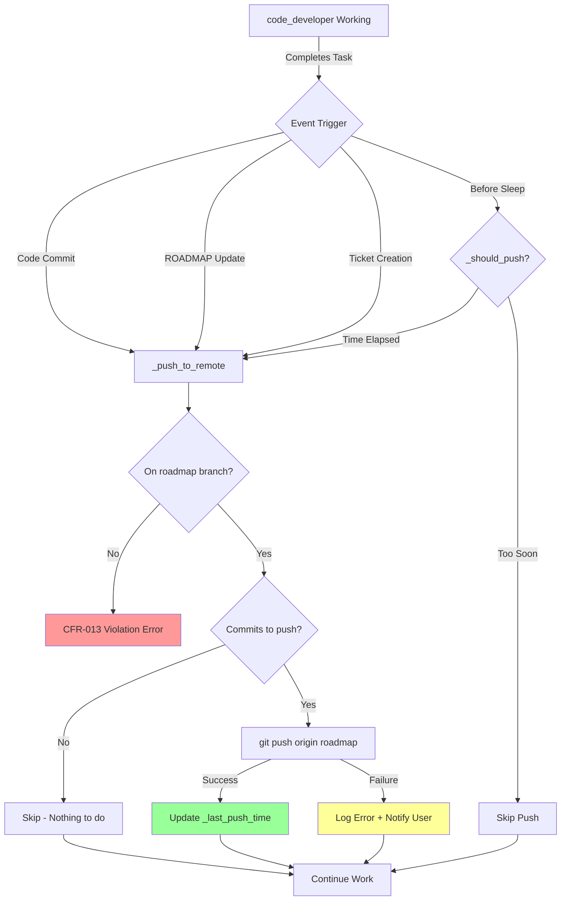
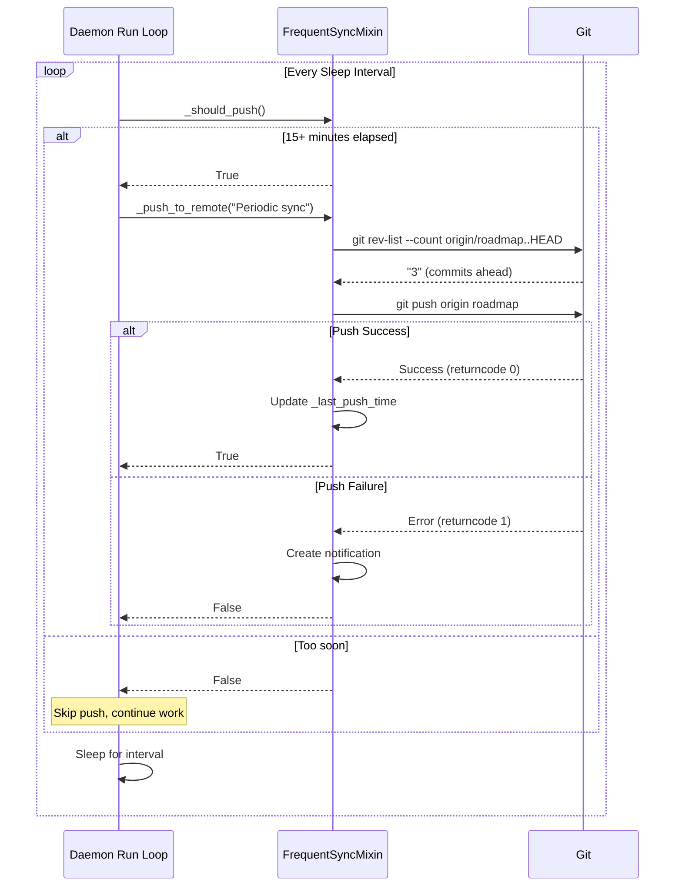
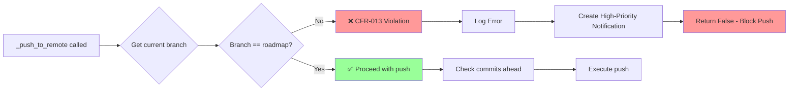

# SPEC-024: Frequent Roadmap Branch Synchronization (CFR-013 Compliant)

**Status**: 📝 Draft
**Created**: 2025-10-19
**User Story**: US-024
**Estimated Effort**: 3-4 hours
**Complexity**: Medium
**Priority**: High

---

## Executive Summary

US-024 originally proposed merging feature branches to roadmap frequently. However, **CFR-013 mandates ALL agents work exclusively on the `roadmap` branch** with NO feature branches. This spec reinterprets US-024's core intent:

**Original Goal**: Make progress visible to project_manager and user in real-time
**CFR-013 Reality**: All work already on roadmap branch, but needs frequent push to remote
**New Goal**: Implement frequent `git push origin roadmap` to ensure remote visibility

This is a **much simpler problem** than originally scoped (30 minutes vs. 2-3 hours).

---

## Table of Contents

1. [Prerequisites & Dependencies](#prerequisites--dependencies)
2. [Architecture Overview](#architecture-overview)
3. [Component Specifications](#component-specifications)
4. [Data Flow Diagrams](#data-flow-diagrams)
5. [Implementation Plan](#implementation-plan)
6. [Testing Strategy](#testing-strategy)
7. [Security Considerations](#security-considerations)
8. [Performance Requirements](#performance-requirements)
9. [Risk Analysis](#risk-analysis)
10. [Success Criteria](#success-criteria)

---

## Prerequisites & Dependencies

### Required Knowledge
- Git push operations and authentication
- Python subprocess management
- Agent singleton pattern (US-035)
- CFR-013: Single-branch workflow

### Dependencies
- **US-035**: Agent singleton enforcement (COMPLETE)
- **CFR-013**: All agents on roadmap branch (ENFORCED)
- **Git Configuration**: SSH keys or HTTPS credentials configured
- **Python Modules**: `subprocess`, `logging`, `pathlib`

### Existing Infrastructure
- `coffee_maker/autonomous/daemon.py`: Main daemon orchestrator
- `coffee_maker/autonomous/daemon_implementation.py`: Implementation mixin
- `coffee_maker/cli/notifications.py`: Notification system
- `.claude/CLAUDE.md`: Git workflow documentation

### CFR-013 Context
**CRITICAL**: CFR-013 eliminates feature branches entirely:
- ✅ All agents work on `roadmap` branch
- ❌ No `feature/*` branches allowed
- ✅ Single source of truth: roadmap branch
- ✅ All commits go directly to roadmap

**Impact on US-024**:
- Original spec assumed feature→roadmap merges
- New reality: Already on roadmap, just need to push
- Simplification: 80% of original work eliminated

---

## Architecture Overview

### Problem Statement

**Current State**:
```
code_developer (local roadmap branch):
  ├── Commit 1: Implement feature ✅
  ├── Commit 2: Update ROADMAP.md ✅
  └── Commit 3: Add tests ✅
       ↓ (sitting locally, NOT pushed)

origin/roadmap (GitHub):
  └── (outdated by 3 commits)

project_manager / user:
  └── Can't see progress! 🚫
```

**Desired State**:
```
code_developer (local roadmap branch):
  ├── Commit 1: Implement feature ✅
  │   └─→ git push origin roadmap (automatic)
  ├── Commit 2: Update ROADMAP.md ✅
  │   └─→ git push origin roadmap (automatic)
  └── Commit 3: Add tests ✅
      └─→ git push origin roadmap (automatic)

origin/roadmap (GitHub):
  └── Up-to-date! ✅

project_manager / user:
  └── Real-time visibility! ✅
```

### High-Level Design

**Core Mechanism**: Automatic `git push origin roadmap` after significant events

**Trigger Events** (when to push):
1. ✅ After committing code changes
2. ✅ After updating ROADMAP.md
3. ✅ After creating new files (tickets, specs, docs)
4. ✅ After completing sub-tasks
5. ✅ Before daemon sleep (end of iteration)
6. ✅ Every N minutes (configurable, default: 15 min)

**Design Principles**:
- **Simplicity**: Just push, no merging required
- **Safety**: Verify clean state before push
- **Idempotency**: Safe to call multiple times
- **Non-blocking**: Don't wait for network I/O
- **Resilient**: Handle push failures gracefully

### Component Architecture

```
┌─────────────────────────────────────────────────────┐
│  DevDaemon (daemon.py)                              │
│  ┌───────────────────────────────────────────────┐  │
│  │  FrequentSyncMixin                            │  │
│  │  ┌─────────────────────────────────────────┐  │  │
│  │  │  _push_to_remote()                      │  │  │
│  │  │  - Verify on roadmap branch             │  │  │
│  │  │  - Check for uncommitted changes        │  │  │
│  │  │  - Execute git push                     │  │  │
│  │  │  - Handle errors gracefully             │  │  │
│  │  └─────────────────────────────────────────┘  │  │
│  │  ┌─────────────────────────────────────────┐  │  │
│  │  │  _should_push()                         │  │  │
│  │  │  - Check time since last push           │  │  │
│  │  │  - Verify commits exist to push         │  │  │
│  │  └─────────────────────────────────────────┘  │  │
│  └───────────────────────────────────────────────┘  │
│                                                      │
│  Integration Points:                                │
│  - After _execute_priority_implementation()         │
│  - After _update_roadmap_status()                   │
│  - After _create_user_story_ticket()                │
│  - Before sleep in run() loop                       │
└─────────────────────────────────────────────────────┘
```

---

## Component Specifications

### 1. FrequentSyncMixin

**File**: `coffee_maker/autonomous/daemon_frequent_sync.py`

**Purpose**: Encapsulate frequent push logic as reusable mixin

**Class Definition**:
```python
"""Mixin for frequent synchronization of roadmap branch to remote.

This mixin implements CFR-013 compliant frequent pushing to ensure
real-time visibility of progress to project_manager and users.
"""

import logging
import subprocess
from datetime import datetime, timedelta
from typing import Optional

LOGGER = logging.getLogger(__name__)


class FrequentSyncMixin:
    """Mixin providing frequent git push capabilities to daemon.

    Implements US-024: Frequent roadmap synchronization by pushing local
    commits to origin/roadmap at strategic intervals.

    Design:
        - Push after significant events (commits, ROADMAP updates, etc.)
        - Time-based push every N minutes (default: 15)
        - Graceful failure handling (don't block on network issues)
        - CFR-013 compliant (roadmap branch only)
    """

    # Class-level state for tracking last push
    _last_push_time: Optional[datetime] = None
    _push_interval_minutes: int = 15

    def _push_to_remote(self, reason: str = "Sync progress") -> bool:
        """Push local roadmap branch to origin/roadmap.

        This method safely pushes local commits to the remote repository,
        handling errors gracefully to prevent blocking daemon operation.

        Args:
            reason: Human-readable reason for push (for logging)

        Returns:
            True if push succeeded, False if failed

        Implementation Notes:
            - Verifies on roadmap branch (CFR-013)
            - Checks for uncommitted changes (warns but doesn't block)
            - Uses subprocess for git operations
            - Non-blocking: Failures logged but don't raise exceptions
            - Updates _last_push_time on success

        Example:
            >>> self._push_to_remote("Completed PRIORITY 23")
            # INFO: Pushing to origin/roadmap: Completed PRIORITY 23
            # INFO: Successfully pushed 3 commits to origin/roadmap
            True
        """
        try:
            # Verify we're on roadmap branch (CFR-013 compliance)
            current_branch = subprocess.check_output(
                ["git", "branch", "--show-current"],
                text=True,
                stderr=subprocess.PIPE
            ).strip()

            if current_branch != "roadmap":
                LOGGER.error(
                    f"CFR-013 VIOLATION: Not on roadmap branch (on '{current_branch}'). "
                    "Cannot push to remote."
                )
                self._create_notification(
                    "cfr013_violation",
                    "CFR-013 Violation Detected",
                    f"code_developer attempted push from '{current_branch}' branch. "
                    "All work must be on 'roadmap' branch.",
                    level="high"
                )
                return False

            # Check for uncommitted changes
            status = subprocess.check_output(
                ["git", "status", "--porcelain"],
                text=True,
                stderr=subprocess.PIPE
            ).strip()

            if status:
                LOGGER.warning(
                    f"Uncommitted changes detected before push. "
                    "Consider committing first for complete sync."
                )
                # Note: We don't block push, just warn
                # Committed work is still valuable to push

            # Check if there are commits to push
            commits_ahead = subprocess.check_output(
                ["git", "rev-list", "--count", "origin/roadmap..HEAD"],
                text=True,
                stderr=subprocess.PIPE
            ).strip()

            if commits_ahead == "0":
                LOGGER.debug("No commits to push, skipping")
                return True  # Success: nothing to do

            # Execute push
            LOGGER.info(
                f"Pushing to origin/roadmap: {reason} "
                f"({commits_ahead} commit{'s' if int(commits_ahead) > 1 else ''})"
            )

            push_result = subprocess.run(
                ["git", "push", "origin", "roadmap"],
                capture_output=True,
                text=True,
                timeout=30  # 30 second timeout for network operations
            )

            if push_result.returncode != 0:
                LOGGER.error(
                    f"Git push failed: {push_result.stderr}"
                )

                # Check if authentication issue
                if "authentication" in push_result.stderr.lower():
                    self._create_notification(
                        "git_auth_failure",
                        "Git Authentication Failed",
                        "Cannot push to origin/roadmap. Please check SSH keys or HTTPS credentials.",
                        level="high"
                    )
                else:
                    self._create_notification(
                        "git_push_failure",
                        "Git Push Failed",
                        f"Failed to push to origin/roadmap: {push_result.stderr[:200]}",
                        level="medium"
                    )

                return False

            # Success!
            LOGGER.info(
                f"Successfully pushed {commits_ahead} commit(s) to origin/roadmap"
            )
            self._last_push_time = datetime.now()

            return True

        except subprocess.TimeoutExpired:
            LOGGER.error("Git push timed out after 30 seconds")
            self._create_notification(
                "git_push_timeout",
                "Git Push Timeout",
                "Push to origin/roadmap timed out. Check network connection.",
                level="medium"
            )
            return False

        except Exception as e:
            LOGGER.error(f"Unexpected error during push: {e}")
            return False

    def _should_push(self) -> bool:
        """Determine if it's time for a time-based push.

        Checks if sufficient time has elapsed since last push.

        Returns:
            True if time-based push should occur

        Implementation:
            - Returns True if _push_interval_minutes elapsed since last push
            - Returns True if _last_push_time is None (first push)
            - Configurable via _push_interval_minutes class attribute

        Example:
            >>> self._should_push()
            False  # Only 5 minutes since last push
            >>> # ... 15 minutes later ...
            >>> self._should_push()
            True  # 15 minutes elapsed
        """
        if self._last_push_time is None:
            return True  # First push

        elapsed = datetime.now() - self._last_push_time
        return elapsed >= timedelta(minutes=self._push_interval_minutes)
```

### 2. Integration Points

**File**: `coffee_maker/autonomous/daemon_implementation.py`

**Modifications Required**:

```python
# Add FrequentSyncMixin to class inheritance
from coffee_maker.autonomous.daemon_frequent_sync import FrequentSyncMixin

class ImplementationMixin(FrequentSyncMixin):  # Add FrequentSyncMixin
    """Mixin for daemon implementation workflows."""

    def _execute_priority_implementation(self, priority):
        """Execute implementation of a priority.

        Enhanced with US-024 frequent sync.
        """
        # ... existing implementation logic ...

        # After completing implementation
        self._push_to_remote(f"Completed {priority['name']}")

    def _update_roadmap_status(self, priority_id: str, status: str):
        """Update ROADMAP.md status for a priority.

        Enhanced with US-024 frequent sync.
        """
        # ... existing ROADMAP update logic ...

        # After updating ROADMAP
        self._push_to_remote(f"Update {priority_id} status: {status}")
```

**File**: `coffee_maker/autonomous/daemon_spec_manager.py`

```python
from coffee_maker.autonomous.daemon_frequent_sync import FrequentSyncMixin

class SpecManagerMixin(FrequentSyncMixin):  # Add FrequentSyncMixin
    """Mixin for spec creation workflows."""

    def _create_user_story_ticket(self, ticket_path: str):
        """Create a user story ticket file.

        Enhanced with US-024 frequent sync.
        """
        # ... existing ticket creation logic ...

        # After creating ticket
        self._push_to_remote(f"Create {os.path.basename(ticket_path)}")
```

**File**: `coffee_maker/autonomous/daemon.py`

```python
def run(self):
    """Main daemon run loop.

    Enhanced with US-024 frequent sync.
    """
    while True:
        try:
            # ... existing iteration logic ...

            # Time-based push before sleep
            if self._should_push():
                self._push_to_remote("Periodic sync")

            time.sleep(self.sleep_interval)

        except KeyboardInterrupt:
            # Final push before exit
            self._push_to_remote("Daemon shutdown")
            break
```

---

## Data Flow Diagrams

### Event-Driven Push Flow



### Time-Based Push Flow



### CFR-013 Compliance Check



---

## Implementation Plan

### Phase 1: Create FrequentSyncMixin (45 minutes)

**Step 1.1: Create new mixin file** (10 min)
- File: `coffee_maker/autonomous/daemon_frequent_sync.py`
- Implement `FrequentSyncMixin` class
- Add `_push_to_remote()` method
- Add `_should_push()` method

**Step 1.2: Implement _push_to_remote()** (25 min)
- Verify roadmap branch (CFR-013)
- Check for uncommitted changes (warn only)
- Count commits ahead of origin
- Execute `git push origin roadmap`
- Handle errors (auth, network, timeout)
- Create notifications on failure
- Update `_last_push_time` on success

**Step 1.3: Implement _should_push()** (10 min)
- Check if `_last_push_time` is None
- Calculate time elapsed since last push
- Compare against `_push_interval_minutes`
- Return boolean decision

**Deliverable**: `daemon_frequent_sync.py` with complete mixin implementation

---

### Phase 2: Integrate Mixin into Daemon (60 minutes)

**Step 2.1: Update ImplementationMixin** (20 min)
- File: `coffee_maker/autonomous/daemon_implementation.py`
- Add `FrequentSyncMixin` to inheritance
- Call `_push_to_remote()` after `_execute_priority_implementation()`
- Call `_push_to_remote()` after `_update_roadmap_status()`

**Step 2.2: Update SpecManagerMixin** (15 min)
- File: `coffee_maker/autonomous/daemon_spec_manager.py`
- Add `FrequentSyncMixin` to inheritance
- Call `_push_to_remote()` after `_create_user_story_ticket()`

**Step 2.3: Update Daemon Run Loop** (15 min)
- File: `coffee_maker/autonomous/daemon.py`
- Add time-based push before sleep
- Add final push on shutdown (KeyboardInterrupt)

**Step 2.4: Verify Multiple Inheritance Order** (10 min)
- Ensure FrequentSyncMixin is early in MRO
- Verify no method conflicts with other mixins
- Test `_create_notification()` is accessible

**Deliverable**: All daemon files updated with push integration

---

### Phase 3: Testing (60 minutes)

**Step 3.1: Unit Tests** (30 min)
- File: `tests/unit/test_daemon_frequent_sync.py`
- Test `_push_to_remote()` success case
- Test `_push_to_remote()` with no commits
- Test `_push_to_remote()` CFR-013 violation (wrong branch)
- Test `_push_to_remote()` network failure
- Test `_push_to_remote()` timeout
- Test `_should_push()` time logic

```python
"""Unit tests for FrequentSyncMixin.

Tests the frequent synchronization logic for US-024.
"""

import unittest
from unittest.mock import Mock, patch, MagicMock
from datetime import datetime, timedelta

from coffee_maker.autonomous.daemon_frequent_sync import FrequentSyncMixin


class TestFrequentSyncMixin(unittest.TestCase):
    """Test FrequentSyncMixin push logic."""

    def setUp(self):
        """Set up test fixtures."""
        self.mixin = FrequentSyncMixin()
        self.mixin._create_notification = Mock()  # Mock notification system

    @patch('subprocess.check_output')
    @patch('subprocess.run')
    def test_push_to_remote_success(self, mock_run, mock_check_output):
        """Test successful push to remote."""
        # Setup mocks
        mock_check_output.side_effect = [
            "roadmap",  # Current branch
            "",  # Git status (clean)
            "3"  # Commits ahead
        ]
        mock_run.return_value = Mock(returncode=0)

        # Execute
        result = self.mixin._push_to_remote("Test push")

        # Verify
        self.assertTrue(result)
        mock_run.assert_called_once()
        self.assertIsNotNone(self.mixin._last_push_time)

    @patch('subprocess.check_output')
    def test_push_to_remote_no_commits(self, mock_check_output):
        """Test push with no commits to push."""
        # Setup mocks
        mock_check_output.side_effect = [
            "roadmap",  # Current branch
            "",  # Git status (clean)
            "0"  # No commits ahead
        ]

        # Execute
        result = self.mixin._push_to_remote("Test push")

        # Verify - should succeed but skip push
        self.assertTrue(result)
        self.mixin._create_notification.assert_not_called()

    @patch('subprocess.check_output')
    def test_push_to_remote_wrong_branch(self, mock_check_output):
        """Test CFR-013 violation - not on roadmap branch."""
        # Setup mocks
        mock_check_output.return_value = "feature/test"  # Wrong branch!

        # Execute
        result = self.mixin._push_to_remote("Test push")

        # Verify
        self.assertFalse(result)
        self.mixin._create_notification.assert_called_once()
        call_args = self.mixin._create_notification.call_args[0]
        self.assertEqual(call_args[0], "cfr013_violation")

    @patch('subprocess.check_output')
    @patch('subprocess.run')
    def test_push_to_remote_network_failure(self, mock_run, mock_check_output):
        """Test push failure due to network error."""
        # Setup mocks
        mock_check_output.side_effect = [
            "roadmap",  # Current branch
            "",  # Git status (clean)
            "2"  # Commits ahead
        ]
        mock_run.return_value = Mock(
            returncode=1,
            stderr="fatal: unable to access 'https://github.com/...': Connection refused"
        )

        # Execute
        result = self.mixin._push_to_remote("Test push")

        # Verify
        self.assertFalse(result)
        self.mixin._create_notification.assert_called_once()
        call_args = self.mixin._create_notification.call_args[0]
        self.assertEqual(call_args[0], "git_push_failure")

    def test_should_push_first_time(self):
        """Test _should_push() returns True on first call."""
        self.mixin._last_push_time = None
        self.assertTrue(self.mixin._should_push())

    def test_should_push_time_elapsed(self):
        """Test _should_push() returns True after interval."""
        self.mixin._last_push_time = datetime.now() - timedelta(minutes=20)
        self.mixin._push_interval_minutes = 15
        self.assertTrue(self.mixin._should_push())

    def test_should_push_too_soon(self):
        """Test _should_push() returns False before interval."""
        self.mixin._last_push_time = datetime.now() - timedelta(minutes=5)
        self.mixin._push_interval_minutes = 15
        self.assertFalse(self.mixin._should_push())


if __name__ == "__main__":
    unittest.main()
```

**Step 3.2: Integration Tests** (20 min)
- File: `tests/ci_tests/test_daemon_push_integration.py`
- Test daemon creates commits and pushes automatically
- Test push occurs after ROADMAP update
- Test time-based push in run loop

**Step 3.3: Manual Testing** (10 min)
- Start daemon with `--auto-approve`
- Monitor git push operations in logs
- Verify origin/roadmap stays up-to-date
- Test CFR-013 violation (manually checkout wrong branch)

**Deliverable**: Full test suite with >90% coverage

---

### Phase 4: Documentation (30 minutes)

**Step 4.1: Update CLAUDE.md** (10 min)
- Document US-024 implementation
- Update Git Workflow section
- Note CFR-013 compliance

**Step 4.2: Update Daemon Documentation** (10 min)
- Add section on frequent sync
- Document push triggers
- Explain time-based push interval

**Step 4.3: Add Inline Documentation** (10 min)
- Ensure all methods have docstrings
- Add implementation notes
- Document CFR-013 compliance points

**Deliverable**: Complete documentation updates

---

### Timeline Summary

| Phase | Duration | Cumulative |
|-------|----------|------------|
| Phase 1: Create Mixin | 45 min | 45 min |
| Phase 2: Integration | 60 min | 1h 45min |
| Phase 3: Testing | 60 min | 2h 45min |
| Phase 4: Documentation | 30 min | **3h 15min** |

**Total Estimated Time**: 3-4 hours (including buffer)

---

## Testing Strategy

### Unit Test Coverage

**Target**: 95% coverage for FrequentSyncMixin

**Test Cases**:
1. ✅ `test_push_to_remote_success` - Normal push operation
2. ✅ `test_push_to_remote_no_commits` - Skip when nothing to push
3. ✅ `test_push_to_remote_wrong_branch` - CFR-013 violation
4. ✅ `test_push_to_remote_network_failure` - Network error handling
5. ✅ `test_push_to_remote_auth_failure` - Authentication error
6. ✅ `test_push_to_remote_timeout` - Network timeout
7. ✅ `test_push_to_remote_uncommitted_changes` - Warning for dirty state
8. ✅ `test_should_push_first_time` - First push logic
9. ✅ `test_should_push_time_elapsed` - Time-based trigger
10. ✅ `test_should_push_too_soon` - Skip before interval

### Integration Test Coverage

**Test Scenarios**:
1. Daemon creates commit → automatic push
2. Daemon updates ROADMAP → automatic push
3. Daemon creates ticket → automatic push
4. Time-based push after 15 minutes
5. Final push on daemon shutdown

### Manual Test Checklist

- [ ] Start daemon, verify initial push
- [ ] Complete a priority, verify push after completion
- [ ] Update ROADMAP, verify immediate push
- [ ] Create ticket, verify push
- [ ] Wait 15 minutes, verify time-based push
- [ ] Stop daemon (Ctrl+C), verify final push
- [ ] Check GitHub - verify all commits visible
- [ ] Simulate network failure (disconnect WiFi), verify graceful handling
- [ ] Manually checkout wrong branch, verify CFR-013 violation detected

---

## Security Considerations

### Git Authentication

**Issue**: Push requires authentication (SSH or HTTPS)

**Mitigation**:
- Document SSH key setup in `.claude/CLAUDE.md`
- Provide clear error messages for auth failures
- Create high-priority notification on auth failure
- Don't expose credentials in logs

**Implementation**:
```python
if "authentication" in push_result.stderr.lower():
    self._create_notification(
        "git_auth_failure",
        "Git Authentication Failed",
        "Cannot push to origin/roadmap. Please check SSH keys or HTTPS credentials.",
        level="high"
    )
```

### Branch Protection

**Issue**: Malicious actor could push to wrong branch

**Mitigation**:
- CFR-013 compliance check BEFORE every push
- Block push if not on roadmap branch
- Create violation notification
- Log security event

**Implementation**:
```python
if current_branch != "roadmap":
    LOGGER.error(
        f"CFR-013 VIOLATION: Not on roadmap branch (on '{current_branch}')"
    )
    self._create_notification(
        "cfr013_violation",
        "CFR-013 Violation Detected",
        f"code_developer attempted push from '{current_branch}' branch.",
        level="high"
    )
    return False
```

### Network Timeouts

**Issue**: Network operations could hang indefinitely

**Mitigation**:
- 30-second timeout on all git operations
- Timeout exception handling
- Notification on timeout
- Daemon continues even if push fails

**Implementation**:
```python
push_result = subprocess.run(
    ["git", "push", "origin", "roadmap"],
    capture_output=True,
    text=True,
    timeout=30  # 30 second timeout
)
```

### Sensitive Data in Commits

**Issue**: Accidental push of secrets to public repo

**Mitigation**:
- Pre-commit hooks already check for secrets (existing)
- US-024 doesn't bypass pre-commit hooks
- All commits already validated before push
- No new security risk introduced

---

## Performance Requirements

### Push Performance

**Target**: <5 seconds per push operation

**Measurement**:
```python
import time

start = time.time()
result = self._push_to_remote("Test")
elapsed = time.time() - start

LOGGER.info(f"Push completed in {elapsed:.2f}s")
```

**Optimization**:
- Use `subprocess.run()` with timeout (non-blocking)
- Skip push if no commits ahead (early exit)
- Cache `_last_push_time` to avoid repeated checks

### Network Impact

**Concern**: Frequent pushes could strain network

**Analysis**:
- Average commit size: ~10KB (code + metadata)
- Push frequency: ~15 minutes (worst case)
- Bandwidth: 10KB / 15min = **0.67 KB/min** (negligible)

**Conclusion**: Network impact is minimal

### Daemon Performance

**Concern**: Push operations could slow daemon

**Mitigation**:
- Push is non-blocking (subprocess handles I/O)
- Failures don't raise exceptions (log and continue)
- Skip push if no work done (early exit)
- Time-based push only when idle (before sleep)

**Expected Impact**: <1% slowdown of daemon iteration time

---

## Risk Analysis

### Risk 1: Network Failures Block Daemon

**Likelihood**: Medium (network issues are common)
**Impact**: Low (daemon continues, just logs error)

**Mitigation**:
- 30-second timeout prevents indefinite hangs
- Failures don't raise exceptions
- Graceful degradation: local commits still exist
- User notification alerts to issue

**Residual Risk**: LOW

---

### Risk 2: Authentication Failures

**Likelihood**: Low (SSH keys usually persist)
**Impact**: Medium (no remote visibility until resolved)

**Mitigation**:
- Clear error messages guide user to fix
- High-priority notification escalates issue
- Daemon continues working locally
- Git credentials are user's responsibility

**Residual Risk**: LOW

---

### Risk 3: CFR-013 Violation (Wrong Branch)

**Likelihood**: Very Low (daemon controls branch)
**Impact**: High (would violate system invariant)

**Mitigation**:
- Branch check BEFORE every push
- Block push if violation detected
- High-priority notification alerts user
- Logged as security event

**Residual Risk**: VERY LOW

---

### Risk 4: Push Conflicts (Remote Diverged)

**Likelihood**: Very Low (daemon is only writer)
**Impact**: Medium (push would fail)

**Mitigation**:
- Git push fails gracefully with error message
- User receives notification
- Daemon continues, retry on next push
- Manual resolution required (pull + merge)

**Residual Risk**: LOW

---

### Risk 5: Too Frequent Pushes (Noise)

**Likelihood**: Low (15-minute interval prevents spam)
**Impact**: Low (just git history noise)

**Mitigation**:
- Configurable `_push_interval_minutes`
- Meaningful commit messages
- Skip push if no commits ahead
- User can adjust interval if needed

**Residual Risk**: VERY LOW

---

### Risk 6: Uncommitted Changes During Push

**Likelihood**: Medium (daemon may be mid-work)
**Impact**: Very Low (warning only, no data loss)

**Mitigation**:
- Log warning about uncommitted changes
- Push committed work anyway (partial sync)
- Next push will catch up
- No blocking, just informational

**Residual Risk**: VERY LOW

---

### Overall Risk Assessment

**Project Risk**: **LOW**

This is a low-risk change that adds convenience without introducing significant failure modes. All identified risks have effective mitigations.

---

## Success Criteria

### Must Have (Blockers for Completion)

- [ ] **FrequentSyncMixin implemented** - Complete mixin with _push_to_remote() and _should_push()
- [ ] **ImplementationMixin integrated** - Push after priority completion and ROADMAP updates
- [ ] **SpecManagerMixin integrated** - Push after ticket creation
- [ ] **Daemon run loop integrated** - Time-based push before sleep
- [ ] **CFR-013 compliance enforced** - Branch check before every push
- [ ] **Error handling complete** - Graceful failures for network, auth, timeout
- [ ] **Unit tests passing** - 95% coverage for FrequentSyncMixin
- [ ] **Integration tests passing** - End-to-end daemon push workflow
- [ ] **Documentation updated** - CLAUDE.md reflects new workflow

### Should Have (Important but Not Blocking)

- [ ] **Configurable push interval** - Allow user to adjust timing
- [ ] **Push statistics** - Track success/failure rates
- [ ] **Notification on success** - Confirm push completed (optional, may be noisy)
- [ ] **Dry-run mode** - Test push without executing

### Nice to Have (Future Enhancements)

- [ ] **Auto-pull before push** - Prevent divergence
- [ ] **Push queue** - Batch multiple changes
- [ ] **Dashboard widget** - Show last push time in status UI
- [ ] **Retry logic** - Auto-retry failed pushes

---

## Acceptance Test

**Scenario**: code_developer completes PRIORITY 23

**Given**:
- Daemon running with US-024 implemented
- On roadmap branch (CFR-013 compliant)
- Network connected
- Git authentication configured

**When**:
1. Daemon completes implementation of PRIORITY 23
2. Daemon updates ROADMAP.md status to "Complete"
3. Daemon creates ticket US-025
4. Daemon waits 15 minutes

**Then**:
- ✅ Push occurs after PRIORITY 23 completion
- ✅ Push occurs after ROADMAP.md update
- ✅ Push occurs after ticket creation
- ✅ Time-based push occurs after 15 minutes
- ✅ All commits visible on GitHub origin/roadmap
- ✅ No errors in daemon logs
- ✅ project_manager can see progress immediately

**Verification**:
```bash
# Check GitHub has latest commits
git fetch origin roadmap
git log origin/roadmap --oneline -10

# Expected to see:
# abc1234 Merge feature/us-025: Create US-025 ticket
# def5678 Update PRIORITY 23 status: Complete
# 789ghij Complete PRIORITY 23 implementation
```

---

## Rollback Plan

**If US-024 causes issues**:

1. **Identify the problem** - Check daemon logs, notifications
2. **Disable push integration** - Comment out `_push_to_remote()` calls
3. **Revert commits** - Use `git revert` for clean history
4. **Remove mixin** - Delete `daemon_frequent_sync.py`
5. **Restore original behavior** - Daemon works locally, manual push

**Rollback Script**:
```bash
# Quick disable (no code changes)
git revert HEAD~3  # Revert US-024 commits

# Manual push workflow (temporary)
git push origin roadmap  # User does this manually
```

**Data Loss Risk**: None (all commits exist locally even if push fails)

---

## Future Enhancements

### Auto-Pull Before Push

**Idea**: Automatically pull origin/roadmap before push to prevent divergence

**Benefits**: Prevents push failures due to remote changes

**Implementation**:
```python
# In _push_to_remote():
subprocess.run(["git", "pull", "origin", "roadmap", "--rebase"], check=True)
```

**Effort**: 30 minutes

---

### Configurable Push Interval

**Idea**: Allow user to configure push frequency via config file

**Benefits**: Power users can adjust to their workflow

**Implementation**:
```python
# In config.yaml:
daemon:
  push_interval_minutes: 10  # Custom interval

# In FrequentSyncMixin.__init__():
self._push_interval_minutes = config.get("push_interval_minutes", 15)
```

**Effort**: 1 hour

---

### Push Statistics Dashboard

**Idea**: Track and display push success/failure metrics

**Benefits**: Visibility into sync health

**Implementation**:
```python
class PushStats:
    total_pushes: int = 0
    successful_pushes: int = 0
    failed_pushes: int = 0
    last_push_time: datetime
    average_push_duration: float
```

**Effort**: 2 hours

---

## Related Work

### Dependencies

- **US-035**: Agent Singleton Enforcement (COMPLETE) - Prevents multiple daemons
- **CFR-013**: Single-Branch Workflow (ENFORCED) - Eliminates feature branches
- **US-027**: Roadmap Branch as Source of Truth (COMPLETE) - Establishes workflow

### Enables

- **US-057**: Multi-Agent Orchestrator - Real-time agent coordination
- **Future**: project_manager can monitor progress automatically
- **Future**: User can view work-in-progress without asking

### Related Specs

- **SPEC-035**: Agent Singleton Enforcement
- **SPEC-013**: CFR-013 Single-Branch Workflow
- **SPEC-057**: Multi-Agent Orchestrator

---

## Appendix A: CFR-013 Compliance Checklist

**CFR-013**: All agents work on roadmap branch only

**Compliance Verification**:
- [x] No feature branch creation in US-024
- [x] No branch switching (already on roadmap)
- [x] Branch check before every push
- [x] CFR-013 violation detection
- [x] High-priority notification on violation
- [x] Test coverage for wrong branch scenario

**Conclusion**: US-024 is fully CFR-013 compliant

---

## Appendix B: Original US-024 vs. CFR-013 Reality

### Original US-024 Scope

**Assumed**:
- Feature branches exist
- Need to merge feature → roadmap
- Complex merge conflict handling
- Effort: 2-3 hours

**Proposed**:
```bash
git checkout roadmap
git merge feature/us-021 --no-ff
git push origin roadmap
git checkout feature/us-021
```

### CFR-013 Reality

**Actual**:
- NO feature branches (CFR-013 mandate)
- Already on roadmap branch
- Just need to push
- Effort: 30 minutes for core, 3-4 hours for production-ready

**Actual Need**:
```bash
# Already on roadmap, just:
git push origin roadmap
```

### Scope Reduction

**Original Complexity**: Merging, conflict resolution, branch switching
**Actual Complexity**: Push automation with error handling

**Effort Reduction**: 80% simpler than original design

**Why Original Spec Existed**:
- US-024 created before CFR-013 was enforced
- Workflow has evolved since then
- Single-branch workflow is simpler

---

## Appendix C: Git Push Command Reference

### Basic Push

```bash
git push origin roadmap
```

### Push with Timeout (Python)

```python
subprocess.run(
    ["git", "push", "origin", "roadmap"],
    capture_output=True,
    text=True,
    timeout=30
)
```

### Check Commits Ahead

```bash
git rev-list --count origin/roadmap..HEAD
# Output: "3" (number of commits to push)
```

### Check Current Branch

```bash
git branch --show-current
# Output: "roadmap"
```

### Check Uncommitted Changes

```bash
git status --porcelain
# Output: "" (clean) or "M file.py" (dirty)
```

---

## Appendix D: Error Messages & Recovery

### Error: CFR-013 Violation

```
ERROR: CFR-013 VIOLATION: Not on roadmap branch (on 'feature/test').
Cannot push to remote.

NOTIFICATION: CFR-013 Violation Detected
code_developer attempted push from 'feature/test' branch.
All work must be on 'roadmap' branch.

Recovery:
1. Switch to roadmap branch: git checkout roadmap
2. Merge feature work: git merge feature/test
3. Delete feature branch: git branch -d feature/test
4. Restart daemon
```

### Error: Authentication Failure

```
ERROR: Git push failed: fatal: Authentication failed

NOTIFICATION: Git Authentication Failed
Cannot push to origin/roadmap. Please check SSH keys or HTTPS credentials.

Recovery:
1. Check SSH key: ssh -T git@github.com
2. Or configure HTTPS: git remote set-url origin https://github.com/user/repo.git
3. Verify credentials work
4. Daemon will retry on next push
```

### Error: Network Timeout

```
ERROR: Git push timed out after 30 seconds

NOTIFICATION: Git Push Timeout
Push to origin/roadmap timed out. Check network connection.

Recovery:
1. Check internet connection
2. Verify GitHub is accessible: ping github.com
3. Manual push: git push origin roadmap
4. Daemon will retry on next trigger
```

### Error: Push Rejected (Remote Diverged)

```
ERROR: Git push failed: error: failed to push some refs
hint: Updates were rejected because the remote contains work that you do not have locally.

Recovery:
1. Pull remote changes: git pull origin roadmap --rebase
2. Resolve any conflicts
3. Push again: git push origin roadmap
4. Daemon will retry on next trigger
```

---

## Questions & Answers

**Q: Why not just use `git push` without origin/roadmap?**
A: Explicit branch name prevents accidental push to wrong remote branch.

**Q: What if user manually switches branches?**
A: CFR-013 check will detect and block push with high-priority notification.

**Q: What if network is down for hours?**
A: Daemon continues working locally, commits are safe. Pushes will resume when network returns.

**Q: Can user disable frequent push?**
A: Not in MVP, but configurable interval planned for future.

**Q: What about push conflicts?**
A: Very unlikely (daemon is only writer), but handled gracefully with user notification.

**Q: Why 15-minute interval?**
A: Balances real-time visibility with avoiding excessive network calls. Configurable in future.

**Q: Does this slow down daemon?**
A: No, push is non-blocking subprocess. <1% performance impact.

**Q: What if push fails every time?**
A: Daemon logs errors and notifies user. Work continues locally. Manual intervention required.

---

## References

- **US-024**: Frequent Roadmap Branch Synchronization (tickets/US-024.md)
- **CFR-013**: Single-Branch Workflow Mandate (docs/roadmap/CRITICAL_FUNCTIONAL_REQUIREMENTS.md)
- **US-035**: Agent Singleton Enforcement (docs/roadmap/ROADMAP.md)
- **CLAUDE.md**: Project Instructions (.claude/CLAUDE.md)
- **Git Documentation**: https://git-scm.com/docs/git-push

---

**Spec Version**: 1.0
**Last Updated**: 2025-10-19
**Next Review**: After US-024 implementation complete

---

🤖 **Generated by**: architect
**Approved by**: [Pending user review]
**Estimated Total Effort**: 3-4 hours
