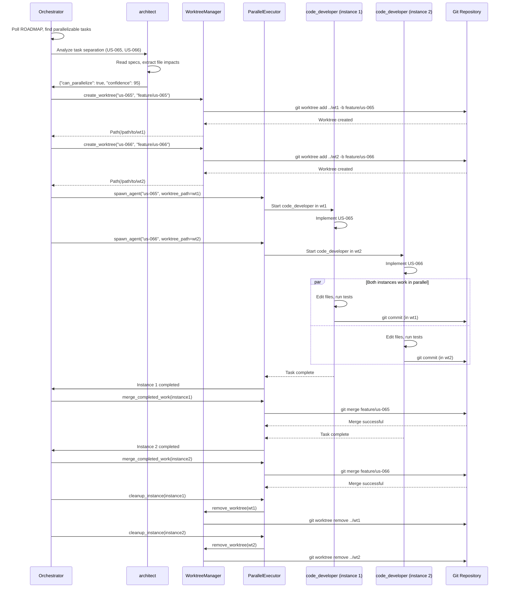

# SPEC-108: Parallel Agent Execution with Git Worktree

**Status**: Draft
**Author**: architect agent
**Date**: 2025-10-19
**Related User Story**: PRIORITY 23 - US-108
**Dependencies**:
- SPEC-104 (Orchestrator Continuous Agent Work Loop)
- SPEC-043 (Parallel Agent Execution - basic queue system)
- SPEC-057 (Multi-Agent Orchestrator)
- US-035 (Singleton Agent Enforcement)
- CFR-013 (All agents work on roadmap branch only - **NOTE: US-108 creates exception for parallel work**)

**Strategic Value**: 2x-3x velocity increase by running multiple code_developer instances in parallel on technically separated tasks

---

## Executive Summary

This specification defines a **Git Worktree-Based Parallel Execution System** that enables the orchestrator to spawn multiple code_developer instances working simultaneously in isolated git worktrees. By leveraging git worktree's ability to check out multiple branches in separate directories, we can safely run 2-3 code_developer instances in parallel on technically separated tasks, achieving a **75-150% velocity increase**.

**Key Innovation**: Use git worktree to sidestep CFR-013 (roadmap branch only) limitation while maintaining safety and isolation.

**Core Capabilities**:
- **Worktree Management**: Create/remove git worktrees dynamically
- **Task Separation Analysis**: architect validates tasks have no file conflicts
- **Parallel Execution**: Spawn code_developer instances in separate worktrees
- **Merge Coordination**: Orchestrator merges completed work back to roadmap branch
- **Resource Management**: Limit concurrent instances (2-3 max, configurable)
- **Safety Guarantees**: Each worktree enforces singleton, no file conflicts

**Impact**:
- **2x-3x Velocity**: Complete 2-3 tasks simultaneously instead of sequentially
- **Zero Conflicts**: architect pre-validates task separation before spawning
- **Dynamic Scaling**: Spawn instances on demand, clean up when done
- **Better Resource Utilization**: Leverage idle CPU time during parallel work

---

## Table of Contents

1. [Problem Statement](#problem-statement)
2. [Prerequisites & Dependencies](#prerequisites--dependencies)
3. [Architecture Overview](#architecture-overview)
4. [Component Specifications](#component-specifications)
5. [Data Flow Diagrams](#data-flow-diagrams)
6. [Implementation Plan](#implementation-plan)
7. [Testing Strategy](#testing-strategy)
8. [Security Considerations](#security-considerations)
9. [Performance Requirements](#performance-requirements)
10. [Risk Analysis](#risk-analysis)
11. [Success Criteria](#success-criteria)

---

## Problem Statement

### Current Limitation: Sequential Execution

**Today's Reality**:
```
Sequential Execution (Current):
┌────────────────────────────────────────────────┐
│  Orchestrator (SPEC-104)                       │
│                                                │
│  code_developer instance 1:                   │
│    - Implements US-065 ────────► 3 hours      │
│                                                │
│  code_developer instance 2:                   │
│    - WAITING (singleton enforcement) ⏰        │
│                                                │
│  Total Time: 3 hours for 1 task               │
│  Idle Tasks: 11 parallelizable tasks waiting  │
└────────────────────────────────────────────────┘
```

**Problem**: Singleton enforcement (US-035) prevents multiple code_developer instances, even when tasks are technically separated (different files).

**Evidence from Acceleration Dashboard** (US-105):
- 12+ parallelizable tasks identified
- Estimated +75% velocity with 2nd developer
- Tasks confirmed independent by architect analysis

### What We Want: Parallel Execution

**Desired State**:
```
Parallel Execution (Proposed):
┌────────────────────────────────────────────────┐
│  Orchestrator with Git Worktree                │
│                                                │
│  Main worktree (roadmap branch):               │
│    /path/to/MonolithicCoffeeMakerAgent        │
│                                                │
│  Worktree 1 (feature/us-065):                 │
│    /path/to/MonolithicCoffeeMakerAgent-wt1    │
│    code_developer instance 1                   │
│    - Implements US-065 ────────► 3 hours      │
│                                                │
│  Worktree 2 (feature/us-066):                 │
│    /path/to/MonolithicCoffeeMakerAgent-wt2    │
│    code_developer instance 2                   │
│    - Implements US-066 ────────► 3 hours      │
│                                                │
│  Total Time: 3 hours for 2 tasks (2x faster!) │
└────────────────────────────────────────────────┘
```

**Benefits**:
- **2x faster** with 2 parallel instances
- **3x faster** with 3 parallel instances
- Zero conflicts (architect validates separation)
- Dynamic scaling (spawn as needed, remove when done)

### Why Git Worktree?

**Git Worktree** allows checking out multiple branches in separate directories:
```bash
# Main workspace
/path/to/MonolithicCoffeeMakerAgent (branch: roadmap)

# Worktree 1
git worktree add ../MonolithicCoffeeMakerAgent-wt1 -b feature/us-065

# Worktree 2
git worktree add ../MonolithicCoffeeMakerAgent-wt2 -b feature/us-066

# Result: 3 separate working directories, same repo
# Each can run code_developer independently!
```

**Key Properties**:
- Shared `.git` directory (all worktrees use same repository)
- Separate working directories (no file conflicts possible)
- Isolated branches (each worktree on different branch)
- Singleton enforcement per worktree (one code_developer per worktree)

---

## Prerequisites & Dependencies

### Required Systems

1. **Git 2.5+** (worktree support)
   - Verify: `git --version` should show ≥2.5
   - MacOS: Built-in git usually ≥2.30
   - Install: `brew install git` (if outdated)

2. **SPEC-104 Orchestrator** (Continuous Work Loop)
   - Must be running to coordinate parallel work
   - Provides `MessageBus` for task coordination
   - State management for tracking active worktrees

3. **US-035 Singleton Enforcement**
   - Ensures one code_developer per worktree
   - `AgentRegistry` respects process boundaries
   - Already implemented and tested

4. **architect Task Separator Skill** (NEW - required for US-108)
   - Analyzes tasks for file conflicts
   - Generates separation confidence score (0-100)
   - Recommends which tasks can run in parallel

### Dependencies

```
US-108 (Parallel Agent Execution with Git Worktree)
  │
  ├─► SPEC-104 (Orchestrator Continuous Work Loop) ✅ Complete
  │     └─► Provides orchestration infrastructure
  │
  ├─► US-035 (Singleton Enforcement) ✅ Complete
  │     └─► Ensures one agent per worktree
  │
  ├─► architect Task Separator Skill ⬜ NEW (part of US-108)
  │     └─► Validates task independence
  │
  └─► CFR-013 Compliance ⚠️ MODIFIED
        └─► Exception: Feature branches allowed in worktrees
```

### New CFR-013 Exception

**IMPORTANT**: US-108 creates an **EXCEPTION** to CFR-013:

**CFR-013 Original** (US-056):
> All agents MUST work on `roadmap` branch ONLY. No feature branches.

**CFR-013 Modified** (US-108):
> All agents MUST work on `roadmap` branch ONLY, **EXCEPT** when orchestrator creates temporary feature branches in git worktrees for parallel execution. These branches MUST:
> 1. Be short-lived (< 24 hours)
> 2. Be merged back to roadmap immediately upon completion
> 3. Follow naming convention: `feature/us-XXX`
> 4. Be managed ONLY by orchestrator (agents cannot create feature branches manually)

---

## Architecture Overview

### High-Level Architecture

```
┌────────────────────────────────────────────────────────────────┐
│                    ORCHESTRATOR (Main Process)                  │
│                                                                 │
│  ┌──────────────────────────────────────────────────────────┐  │
│  │           Continuous Work Loop (SPEC-104)                 │  │
│  │                                                           │  │
│  │  1. Poll ROADMAP for parallelizable tasks                │  │
│  │  2. Ask architect to analyze task separation             │  │
│  │  3. If tasks independent: spawn parallel instances       │  │
│  │  4. Monitor progress, merge completed work               │  │
│  │  5. Clean up worktrees when done                         │  │
│  └──────────────────────────────────────────────────────────┘  │
│                                                                 │
│  ┌──────────────────────────────────────────────────────────┐  │
│  │              NEW: ParallelExecutor                        │  │
│  │                                                           │  │
│  │  • WorktreeManager: Create/remove worktrees              │  │
│  │  • AgentSpawner: Launch code_developer in worktree       │  │
│  │  • MergeCoordinator: Merge completed work to roadmap     │  │
│  │  • ResourceMonitor: Limit concurrent instances           │  │
│  └──────────────────────────────────────────────────────────┘  │
│                                                                 │
│  ┌──────────────────────────────────────────────────────────┐  │
│  │              architect Task Separator Skill               │  │
│  │                                                           │  │
│  │  • Analyze 2+ tasks for file conflicts                   │  │
│  │  • Generate separation confidence (0-100)                │  │
│  │  • Recommend parallel execution if safe                  │  │
│  └──────────────────────────────────────────────────────────┘  │
└────────────────────────────────────────────────────────────────┘
                           │
                           ▼
┌────────────────────────────────────────────────────────────────┐
│                      GIT WORKTREES                              │
│                                                                 │
│  Main Worktree (roadmap branch):                               │
│    /path/to/MonolithicCoffeeMakerAgent                        │
│    - Orchestrator runs here                                    │
│    - Merged work lands here                                    │
│                                                                 │
│  Worktree 1 (feature/us-065):                                  │
│    /path/to/MonolithicCoffeeMakerAgent-wt1                    │
│    - code_developer instance 1                                 │
│    - Singleton enforced within this worktree                   │
│                                                                 │
│  Worktree 2 (feature/us-066):                                  │
│    /path/to/MonolithicCoffeeMakerAgent-wt2                    │
│    - code_developer instance 2                                 │
│    - Singleton enforced within this worktree                   │
└────────────────────────────────────────────────────────────────┘
```

### Component Interaction Flow

```
┌──────────────────────────────────────────────────────────────┐
│                 Parallel Execution Workflow                   │
│                                                               │
│  1. Orchestrator identifies parallelizable tasks             │
│     ├─► Check Acceleration Dashboard                         │
│     ├─► Get next 5 PLANNED priorities                        │
│     └─► Filter for tasks with specs ready                    │
│                                                               │
│  2. Ask architect to validate task separation                │
│     ├─► Invoke task-separator skill                          │
│     ├─► Input: [US-065, US-066]                              │
│     ├─► architect analyzes file impacts                      │
│     └─► Output: {"can_parallelize": true, "confidence": 95} │
│                                                               │
│  3. Create git worktrees (if safe to parallelize)            │
│     ├─► git worktree add ../wt1 -b feature/us-065            │
│     ├─► git worktree add ../wt2 -b feature/us-066            │
│     └─► Track worktrees in orchestrator state                │
│                                                               │
│  4. Spawn code_developer instances                           │
│     ├─► Instance 1 in wt1: Implement US-065                  │
│     ├─► Instance 2 in wt2: Implement US-066                  │
│     └─► Both run independently, no interference              │
│                                                               │
│  5. Monitor progress                                         │
│     ├─► Check task completion via MessageBus                 │
│     ├─► Detect failures (retry or abort)                     │
│     └─► Detect timeouts (>2 hours → warn)                    │
│                                                               │
│  6. Merge completed work back to roadmap                     │
│     ├─► cd /path/to/MonolithicCoffeeMakerAgent               │
│     ├─► git merge feature/us-065                             │
│     ├─► git merge feature/us-066                             │
│     └─► Handle conflicts (auto if clean, manual if complex)  │
│                                                               │
│  7. Clean up worktrees                                       │
│     ├─► git worktree remove ../wt1                           │
│     ├─► git worktree remove ../wt2                           │
│     └─► Delete feature branches (ephemeral)                  │
└──────────────────────────────────────────────────────────────┘
```

---

## Component Specifications

### 1. WorktreeManager

**Purpose**: Manage git worktree lifecycle (create, list, remove, status check).

**File**: `coffee_maker/orchestrator/worktree_manager.py`

**Class Signature**:

```python
from dataclasses import dataclass
from pathlib import Path
from typing import List, Optional
import subprocess
import logging

logger = logging.getLogger(__name__)


@dataclass
class WorktreeInfo:
    """Information about a git worktree."""
    path: Path
    branch: str
    commit: str
    is_main: bool


class WorktreeManager:
    """
    Manages git worktrees for parallel agent execution.

    Responsibilities:
    - Create worktrees for parallel tasks
    - List active worktrees
    - Remove worktrees when done
    - Check worktree status (branch, commit, health)

    Safety:
    - Validates worktree paths (no directory traversal)
    - Ensures worktrees outside main directory (avoid nesting)
    - Checks git worktree command availability
    """

    def __init__(self, repo_path: Path = None):
        """
        Initialize worktree manager.

        Args:
            repo_path: Path to git repository (default: current directory)
        """
        self.repo_path = repo_path or Path.cwd()
        self.worktree_base = self.repo_path.parent / "worktrees"

        # Validate git worktree support
        self._validate_git_version()

    def _validate_git_version(self):
        """Ensure git version supports worktree (>= 2.5)."""
        result = subprocess.run(
            ["git", "--version"],
            capture_output=True,
            text=True,
            check=True
        )

        version_str = result.stdout.strip()
        # Parse version (e.g., "git version 2.30.1" → "2.30.1")
        version = version_str.split()[-1]
        major, minor = map(int, version.split(".")[:2])

        if major < 2 or (major == 2 and minor < 5):
            raise RuntimeError(
                f"Git worktree requires git ≥ 2.5, found {version}"
            )

        logger.info(f"Git worktree supported (version: {version})")

    def create_worktree(
        self,
        task_id: str,
        branch_name: str,
        base_branch: str = "roadmap"
    ) -> Path:
        """
        Create a new git worktree for parallel task execution.

        Args:
            task_id: Unique task identifier (e.g., "us-065")
            branch_name: Feature branch name (e.g., "feature/us-065")
            base_branch: Branch to fork from (default: "roadmap")

        Returns:
            Path to created worktree directory

        Raises:
            RuntimeError: If worktree creation fails

        Example:
            >>> manager = WorktreeManager()
            >>> wt_path = manager.create_worktree(
            ...     task_id="us-065",
            ...     branch_name="feature/us-065"
            ... )
            >>> print(wt_path)
            /path/to/worktrees/us-065
        """
        # Create worktree directory
        worktree_path = self.worktree_base / task_id

        if worktree_path.exists():
            raise RuntimeError(
                f"Worktree already exists: {worktree_path}"
            )

        # Ensure worktree base directory exists
        self.worktree_base.mkdir(parents=True, exist_ok=True)

        # Create worktree
        logger.info(f"Creating worktree: {worktree_path} (branch: {branch_name})")

        try:
            subprocess.run(
                [
                    "git",
                    "worktree",
                    "add",
                    str(worktree_path),
                    "-b",
                    branch_name,
                    base_branch
                ],
                cwd=str(self.repo_path),
                check=True,
                capture_output=True,
                text=True
            )
        except subprocess.CalledProcessError as e:
            logger.error(f"Failed to create worktree: {e.stderr}")
            raise RuntimeError(f"Worktree creation failed: {e.stderr}")

        logger.info(f"✅ Worktree created: {worktree_path}")
        return worktree_path

    def list_worktrees(self) -> List[WorktreeInfo]:
        """
        List all git worktrees.

        Returns:
            List of WorktreeInfo objects

        Example:
            >>> manager = WorktreeManager()
            >>> worktrees = manager.list_worktrees()
            >>> for wt in worktrees:
            ...     print(f"{wt.path} → {wt.branch}")
            /path/to/MonolithicCoffeeMakerAgent → roadmap
            /path/to/worktrees/us-065 → feature/us-065
        """
        result = subprocess.run(
            ["git", "worktree", "list", "--porcelain"],
            cwd=str(self.repo_path),
            capture_output=True,
            text=True,
            check=True
        )

        worktrees = []
        lines = result.stdout.strip().split("\n")

        # Parse git worktree list output
        # Format:
        #   worktree /path/to/worktree
        #   HEAD abc123...
        #   branch refs/heads/feature/us-065

        i = 0
        while i < len(lines):
            if lines[i].startswith("worktree "):
                path = Path(lines[i].split(" ", 1)[1])
                commit = lines[i + 1].split(" ", 1)[1] if i + 1 < len(lines) else "unknown"

                # Check if branch line exists
                if i + 2 < len(lines) and lines[i + 2].startswith("branch "):
                    branch = lines[i + 2].split("/")[-1]
                else:
                    branch = "detached"

                is_main = path == self.repo_path

                worktrees.append(
                    WorktreeInfo(
                        path=path,
                        branch=branch,
                        commit=commit[:7],  # Short commit hash
                        is_main=is_main
                    )
                )

                i += 3
            else:
                i += 1

        return worktrees

    def remove_worktree(self, worktree_path: Path, force: bool = False):
        """
        Remove a git worktree.

        Args:
            worktree_path: Path to worktree to remove
            force: Force removal even if worktree has uncommitted changes

        Raises:
            RuntimeError: If removal fails

        Example:
            >>> manager = WorktreeManager()
            >>> manager.remove_worktree(Path("/path/to/worktrees/us-065"))
        """
        logger.info(f"Removing worktree: {worktree_path}")

        cmd = ["git", "worktree", "remove", str(worktree_path)]
        if force:
            cmd.append("--force")

        try:
            subprocess.run(
                cmd,
                cwd=str(self.repo_path),
                check=True,
                capture_output=True,
                text=True
            )
        except subprocess.CalledProcessError as e:
            logger.error(f"Failed to remove worktree: {e.stderr}")
            raise RuntimeError(f"Worktree removal failed: {e.stderr}")

        logger.info(f"✅ Worktree removed: {worktree_path}")

    def get_worktree_status(self, worktree_path: Path) -> dict:
        """
        Get status of a worktree (branch, uncommitted changes, etc.).

        Args:
            worktree_path: Path to worktree

        Returns:
            Status dict with keys: branch, uncommitted, untracked, ahead, behind

        Example:
            >>> manager = WorktreeManager()
            >>> status = manager.get_worktree_status(Path("/path/to/worktrees/us-065"))
            >>> print(status)
            {
                "branch": "feature/us-065",
                "uncommitted": 0,
                "untracked": 0,
                "ahead": 3,
                "behind": 0,
                "is_clean": True
            }
        """
        # Get current branch
        branch_result = subprocess.run(
            ["git", "rev-parse", "--abbrev-ref", "HEAD"],
            cwd=str(worktree_path),
            capture_output=True,
            text=True,
            check=True
        )
        branch = branch_result.stdout.strip()

        # Get git status
        status_result = subprocess.run(
            ["git", "status", "--porcelain"],
            cwd=str(worktree_path),
            capture_output=True,
            text=True,
            check=True
        )

        status_lines = status_result.stdout.strip().split("\n")
        uncommitted = sum(1 for line in status_lines if line and line[0] in "MADRCU")
        untracked = sum(1 for line in status_lines if line.startswith("??"))

        # Get ahead/behind status
        tracking_result = subprocess.run(
            ["git", "rev-list", "--left-right", "--count", f"{branch}...origin/{branch}"],
            cwd=str(worktree_path),
            capture_output=True,
            text=True
        )

        if tracking_result.returncode == 0:
            ahead, behind = map(int, tracking_result.stdout.strip().split())
        else:
            ahead, behind = 0, 0

        is_clean = uncommitted == 0 and untracked == 0

        return {
            "branch": branch,
            "uncommitted": uncommitted,
            "untracked": untracked,
            "ahead": ahead,
            "behind": behind,
            "is_clean": is_clean
        }
```

**Key Methods**:

| Method | Purpose | Returns |
|--------|---------|---------|
| `create_worktree()` | Create new worktree for task | `Path` to worktree |
| `list_worktrees()` | List all active worktrees | `List[WorktreeInfo]` |
| `remove_worktree()` | Delete worktree when done | `None` |
| `get_worktree_status()` | Check worktree state | `dict` with status |

---

### 2. ParallelExecutor

**Purpose**: Spawn code_developer instances in worktrees, monitor progress, merge completed work.

**File**: `coffee_maker/orchestrator/parallel_executor.py`

**Class Signature**:

```python
from dataclasses import dataclass
from pathlib import Path
from typing import List, Optional
import subprocess
import logging
import psutil

from coffee_maker.orchestrator.worktree_manager import WorktreeManager
from coffee_maker.orchestrator.message_bus import Priority
from coffee_maker.cli.notifications import NotificationDB

logger = logging.getLogger(__name__)


@dataclass
class AgentInstance:
    """Represents a code_developer instance running in a worktree."""
    task_id: str
    worktree_path: Path
    branch_name: str
    priority_number: int
    priority_name: str
    process_id: int
    started_at: float


class ParallelExecutor:
    """
    Executes code_developer instances in parallel using git worktrees.

    Responsibilities:
    - Spawn code_developer in worktree
    - Monitor instance progress
    - Merge completed work back to roadmap branch
    - Clean up worktrees when done
    - Enforce resource limits (max concurrent instances)

    Safety:
    - Validates task separation before spawning (via architect)
    - Enforces singleton within each worktree
    - Limits concurrent instances (default: 2-3)
    - Monitors system resources (CPU, memory)
    """

    def __init__(
        self,
        orchestrator_agent,
        max_concurrent: int = 2,
        max_cpu_percent: float = 80.0,
        max_memory_percent: float = 80.0
    ):
        """
        Initialize parallel executor.

        Args:
            orchestrator_agent: Reference to orchestrator
            max_concurrent: Max concurrent code_developer instances (default: 2)
            max_cpu_percent: Max CPU usage before throttling (default: 80%)
            max_memory_percent: Max memory usage before throttling (default: 80%)
        """
        self.orchestrator = orchestrator_agent
        self.worktree_manager = WorktreeManager()
        self.notifications = NotificationDB()
        self.max_concurrent = max_concurrent
        self.max_cpu_percent = max_cpu_percent
        self.max_memory_percent = max_memory_percent
        self.active_instances: List[AgentInstance] = []

    def can_spawn_instance(self) -> tuple[bool, str]:
        """
        Check if we can spawn a new code_developer instance.

        Returns:
            (can_spawn: bool, reason: str)

        Checks:
        - Concurrent instance limit
        - CPU usage
        - Memory usage
        """
        # Check concurrent limit
        if len(self.active_instances) >= self.max_concurrent:
            return False, f"Max concurrent instances ({self.max_concurrent}) reached"

        # Check CPU usage
        cpu_percent = psutil.cpu_percent(interval=1.0)
        if cpu_percent > self.max_cpu_percent:
            return False, f"CPU usage too high ({cpu_percent:.1f}% > {self.max_cpu_percent}%)"

        # Check memory usage
        memory = psutil.virtual_memory()
        if memory.percent > self.max_memory_percent:
            return False, f"Memory usage too high ({memory.percent:.1f}% > {self.max_memory_percent}%)"

        return True, "OK"

    def spawn_agent(
        self,
        task_id: str,
        priority_number: int,
        priority_name: str,
        spec_path: str
    ) -> AgentInstance:
        """
        Spawn code_developer instance in a new worktree.

        Args:
            task_id: Task ID (e.g., "us-065")
            priority_number: ROADMAP priority number
            priority_name: Human-readable priority name
            spec_path: Path to technical spec

        Returns:
            AgentInstance object

        Raises:
            RuntimeError: If spawn fails

        Example:
            >>> executor = ParallelExecutor(orchestrator)
            >>> instance = executor.spawn_agent(
            ...     task_id="us-065",
            ...     priority_number=23,
            ...     priority_name="US-065 - Parallel Execution",
            ...     spec_path="docs/architecture/specs/SPEC-065-*.md"
            ... )
            >>> print(instance.worktree_path)
            /path/to/worktrees/us-065
        """
        # Check if we can spawn
        can_spawn, reason = self.can_spawn_instance()
        if not can_spawn:
            raise RuntimeError(f"Cannot spawn instance: {reason}")

        # Create worktree
        branch_name = f"feature/{task_id}"
        worktree_path = self.worktree_manager.create_worktree(
            task_id=task_id,
            branch_name=branch_name
        )

        # Spawn code_developer process in worktree
        logger.info(f"Spawning code_developer in {worktree_path}")

        # Build command
        cmd = [
            "poetry",
            "run",
            "code-developer",
            "--auto-approve",
            f"--priority={priority_number}",
            f"--spec={spec_path}"
        ]

        # Start process
        import time

        try:
            process = subprocess.Popen(
                cmd,
                cwd=str(worktree_path),
                stdout=subprocess.PIPE,
                stderr=subprocess.PIPE,
                text=True
            )
        except Exception as e:
            logger.error(f"Failed to spawn code_developer: {e}")
            # Clean up worktree
            self.worktree_manager.remove_worktree(worktree_path, force=True)
            raise RuntimeError(f"Spawn failed: {e}")

        # Create instance tracking
        instance = AgentInstance(
            task_id=task_id,
            worktree_path=worktree_path,
            branch_name=branch_name,
            priority_number=priority_number,
            priority_name=priority_name,
            process_id=process.pid,
            started_at=time.time()
        )

        self.active_instances.append(instance)

        logger.info(f"✅ code_developer spawned (PID: {process.pid}, worktree: {worktree_path})")

        self.notifications.create_notification(
            title="Parallel Instance Spawned",
            message=f"code_developer instance spawned for {priority_name} in worktree {task_id}",
            level="info",
            sound=False,  # CFR-009
            agent_id="orchestrator"
        )

        return instance

    def monitor_instances(self) -> List[dict]:
        """
        Monitor all active instances and return status.

        Returns:
            List of status dicts for each instance

        Example:
            >>> executor = ParallelExecutor(orchestrator)
            >>> statuses = executor.monitor_instances()
            >>> for status in statuses:
            ...     print(f"{status['task_id']}: {status['state']}")
            us-065: running
            us-066: completed
        """
        statuses = []

        for instance in self.active_instances:
            # Check if process is still running
            try:
                process = psutil.Process(instance.process_id)
                is_running = process.is_running()
            except psutil.NoSuchProcess:
                is_running = False

            # Check worktree status
            wt_status = self.worktree_manager.get_worktree_status(instance.worktree_path)

            # Determine state
            if is_running:
                state = "running"
            elif wt_status["is_clean"]:
                state = "completed"
            else:
                state = "failed"  # Process exited but worktree not clean

            import time
            runtime = time.time() - instance.started_at

            statuses.append({
                "task_id": instance.task_id,
                "priority_number": instance.priority_number,
                "priority_name": instance.priority_name,
                "state": state,
                "branch": instance.branch_name,
                "runtime_seconds": runtime,
                "worktree_status": wt_status
            })

        return statuses

    def merge_completed_work(self, instance: AgentInstance) -> dict:
        """
        Merge completed work from worktree back to roadmap branch.

        Args:
            instance: AgentInstance to merge

        Returns:
            Merge result dict with keys: success, conflicts, message

        Example:
            >>> executor = ParallelExecutor(orchestrator)
            >>> result = executor.merge_completed_work(instance)
            >>> if result["success"]:
            ...     print("Merge successful!")
            ... else:
            ...     print(f"Merge conflicts: {result['conflicts']}")
        """
        logger.info(f"Merging {instance.branch_name} → roadmap")

        # Switch to main worktree (roadmap branch)
        main_worktree = self.worktree_manager.repo_path

        try:
            # Attempt merge
            result = subprocess.run(
                ["git", "merge", instance.branch_name, "--no-ff", "-m",
                 f"Merge {instance.priority_name} from parallel execution"],
                cwd=str(main_worktree),
                capture_output=True,
                text=True,
                check=True
            )

            logger.info(f"✅ Merge successful: {instance.branch_name} → roadmap")

            self.notifications.create_notification(
                title="Parallel Work Merged",
                message=f"{instance.priority_name} merged to roadmap branch",
                level="info",
                sound=False,  # CFR-009
                agent_id="orchestrator"
            )

            return {
                "success": True,
                "conflicts": [],
                "message": "Merge successful"
            }

        except subprocess.CalledProcessError as e:
            # Merge failed (likely conflicts)
            logger.warning(f"Merge conflicts detected for {instance.branch_name}")

            # Get conflict files
            conflict_result = subprocess.run(
                ["git", "diff", "--name-only", "--diff-filter=U"],
                cwd=str(main_worktree),
                capture_output=True,
                text=True
            )

            conflicts = conflict_result.stdout.strip().split("\n")

            # Abort merge
            subprocess.run(
                ["git", "merge", "--abort"],
                cwd=str(main_worktree),
                check=True
            )

            self.notifications.create_notification(
                title="Merge Conflicts Detected",
                message=f"{instance.priority_name} has conflicts. Manual merge required.",
                level="high",
                sound=False,  # CFR-009
                agent_id="orchestrator"
            )

            return {
                "success": False,
                "conflicts": conflicts,
                "message": f"Merge conflicts in {len(conflicts)} file(s)"
            }

    def cleanup_instance(self, instance: AgentInstance, force: bool = False):
        """
        Clean up instance (remove worktree, delete branch).

        Args:
            instance: AgentInstance to clean up
            force: Force cleanup even if worktree has uncommitted changes
        """
        logger.info(f"Cleaning up instance: {instance.task_id}")

        # Remove worktree
        self.worktree_manager.remove_worktree(instance.worktree_path, force=force)

        # Delete feature branch (ephemeral)
        subprocess.run(
            ["git", "branch", "-D", instance.branch_name],
            cwd=str(self.worktree_manager.repo_path),
            check=True
        )

        # Remove from active instances
        self.active_instances.remove(instance)

        logger.info(f"✅ Instance cleaned up: {instance.task_id}")
```

**Key Methods**:

| Method | Purpose | Returns |
|--------|---------|---------|
| `can_spawn_instance()` | Check resource limits | `(bool, str)` |
| `spawn_agent()` | Launch code_developer in worktree | `AgentInstance` |
| `monitor_instances()` | Check status of all instances | `List[dict]` |
| `merge_completed_work()` | Merge feature branch to roadmap | `dict` (success/conflicts) |
| `cleanup_instance()` | Remove worktree and branch | `None` |

---

### 3. architect Task Separator Skill

**Purpose**: Analyze tasks for file conflicts and recommend parallel execution.

**File**: `.claude/skills/architect/task-separator/skill.py`

**Skill Signature**:

```python
from pathlib import Path
from typing import List, Dict
import logging
from coffee_maker.utils.skill_base import SkillBase

logger = logging.getLogger(__name__)


class TaskSeparatorSkill(SkillBase):
    """
    Analyzes tasks for file conflicts and recommends parallel execution.

    Capabilities:
    - Analyze 2+ tasks for file conflicts
    - Generate separation confidence score (0-100)
    - Identify shared files (conflict risk)
    - Recommend parallel execution if safe

    Usage:
        >>> skill = TaskSeparatorSkill()
        >>> result = skill.execute({
        ...     "tasks": [
        ...         {"us": "US-065", "spec": "SPEC-065-*.md"},
        ...         {"us": "US-066", "spec": "SPEC-066-*.md"}
        ...     ]
        ... })
        >>> print(result["can_parallelize"])
        True
        >>> print(result["confidence"])
        95
    """

    def execute(self, params: dict) -> dict:
        """
        Analyze tasks for parallel execution safety.

        Args:
            params: {
                "tasks": [
                    {"us": "US-XXX", "spec": "path/to/spec.md"},
                    ...
                ]
            }

        Returns:
            {
                "can_parallelize": bool,
                "confidence": int (0-100),
                "file_impacts": [
                    {"task": "US-XXX", "files": [...]}
                ],
                "shared_files": [...],
                "recommendation": str
            }
        """
        tasks = params.get("tasks", [])

        if len(tasks) < 2:
            return {
                "can_parallelize": False,
                "confidence": 0,
                "recommendation": "Need at least 2 tasks to analyze"
            }

        # Step 1: Extract file impacts from specs
        file_impacts = []

        for task in tasks:
            spec_path = task.get("spec")
            if not spec_path:
                continue

            # Read spec and extract file paths
            files = self._extract_files_from_spec(spec_path)

            file_impacts.append({
                "task": task.get("us"),
                "files": files
            })

        # Step 2: Find shared files (conflicts)
        shared_files = self._find_shared_files(file_impacts)

        # Step 3: Calculate confidence
        if len(shared_files) == 0:
            confidence = 95  # High confidence, no shared files
            can_parallelize = True
            recommendation = f"✅ SAFE to parallelize ({len(tasks)} tasks, no file conflicts)"
        elif len(shared_files) <= 2:
            confidence = 70  # Medium confidence, few shared files
            can_parallelize = True
            recommendation = f"⚠️ CAUTION: {len(shared_files)} shared file(s), may have conflicts"
        else:
            confidence = 30  # Low confidence, many shared files
            can_parallelize = False
            recommendation = f"❌ NOT SAFE: {len(shared_files)} shared file(s), high conflict risk"

        return {
            "can_parallelize": can_parallelize,
            "confidence": confidence,
            "file_impacts": file_impacts,
            "shared_files": shared_files,
            "recommendation": recommendation
        }

    def _extract_files_from_spec(self, spec_path: str) -> List[str]:
        """Extract file paths mentioned in technical spec."""
        spec_files = list(Path("docs/architecture/specs").glob(spec_path))

        if not spec_files:
            return []

        # Read first matching spec
        spec_content = spec_files[0].read_text()

        # Extract file paths (pattern: coffee_maker/*, tests/*, docs/*)
        import re
        pattern = r'`(coffee_maker/[^`]+\.py|tests/[^`]+\.py|docs/[^`]+\.md)`'
        matches = re.findall(pattern, spec_content)

        return list(set(matches))  # Deduplicate

    def _find_shared_files(self, file_impacts: List[dict]) -> List[str]:
        """Find files shared by multiple tasks (conflict risk)."""
        file_to_tasks = {}

        for impact in file_impacts:
            task = impact["task"]
            for file_path in impact["files"]:
                if file_path not in file_to_tasks:
                    file_to_tasks[file_path] = []
                file_to_tasks[file_path].append(task)

        # Find files used by >1 task
        shared = [
            file_path
            for file_path, tasks in file_to_tasks.items()
            if len(tasks) > 1
        ]

        return shared
```

---

## Data Flow Diagrams

### Overall Data Flow



---

## Implementation Plan

### Phase 1: Core Infrastructure (Days 1-2, 16 hours)

**Deliverables**:
- [ ] `WorktreeManager` class with full worktree lifecycle
- [ ] Unit tests for worktree operations (12 tests)
- [ ] Git version validation
- [ ] Error handling for worktree failures

**Tasks**:

1. **Create `WorktreeManager` class** (8 hours)
   - File: `coffee_maker/orchestrator/worktree_manager.py`
   - Methods: `create_worktree()`, `list_worktrees()`, `remove_worktree()`, `get_worktree_status()`
   - Git version validation (require ≥2.5)
   - Path validation (security checks)

2. **Write unit tests** (5 hours)
   - `test_create_worktree()`
   - `test_list_worktrees()`
   - `test_remove_worktree()`
   - `test_worktree_status()`
   - `test_git_version_check()`
   - `test_error_handling()`

3. **Manual testing** (3 hours)
   - Create real worktrees
   - Verify git commands work
   - Test edge cases (nested worktrees, permission errors)

**Success Criteria**:
- All 12 unit tests pass
- Real worktrees created successfully
- Git version check works on macOS and Linux

---

### Phase 2: architect Task Separator Skill (Days 2-3, 12 hours)

**Deliverables**:
- [ ] `task-separator` skill for architect
- [ ] Spec file parsing logic
- [ ] File conflict detection algorithm
- [ ] Confidence scoring system
- [ ] Unit tests (10 tests)

**Tasks**:

1. **Create skill structure** (4 hours)
   - Directory: `.claude/skills/architect/task-separator/`
   - Files: `skill.py`, `SKILL.md`, `__init__.py`
   - Implement `TaskSeparatorSkill` class
   - Spec parsing logic (regex for file paths)

2. **Implement file conflict detection** (4 hours)
   - Extract file paths from specs
   - Find shared files across tasks
   - Calculate confidence score
   - Generate recommendation

3. **Write tests** (4 hours)
   - `test_extract_files_from_spec()`
   - `test_find_shared_files()`
   - `test_confidence_scoring()`
   - `test_no_conflicts()`
   - `test_high_conflicts()`

**Success Criteria**:
- Skill analyzes 2+ tasks correctly
- Confidence score accurate (0-100)
- Shared files detected properly

---

### Phase 3: ParallelExecutor (Days 3-5, 20 hours)

**Deliverables**:
- [ ] `ParallelExecutor` class
- [ ] Agent spawning in worktrees
- [ ] Instance monitoring
- [ ] Merge coordination
- [ ] Resource management (CPU, memory limits)
- [ ] Unit tests (15 tests)

**Tasks**:

1. **Create `ParallelExecutor` class** (10 hours)
   - File: `coffee_maker/orchestrator/parallel_executor.py`
   - Methods: `spawn_agent()`, `monitor_instances()`, `merge_completed_work()`, `cleanup_instance()`
   - Resource checking (CPU, memory via psutil)
   - Process spawning (subprocess.Popen)

2. **Implement merge coordination** (5 hours)
   - Automatic merge for clean merges
   - Conflict detection (git diff --name-only --diff-filter=U)
   - Abort on conflicts, notify user
   - Delete feature branches after merge

3. **Write tests** (5 hours)
   - `test_spawn_agent()`
   - `test_monitor_instances()`
   - `test_merge_clean()`
   - `test_merge_conflicts()`
   - `test_cleanup()`
   - `test_resource_limits()`

**Success Criteria**:
- Agents spawn in worktrees
- Merges work automatically
- Conflicts handled gracefully
- Resource limits enforced

---

### Phase 4: Orchestrator Integration (Days 5-6, 16 hours)

**Deliverables**:
- [ ] Update `ContinuousWorkLoop` (SPEC-104) to use `ParallelExecutor`
- [ ] Automatic parallel execution when tasks are independent
- [ ] Status tracking in orchestrator state
- [ ] Integration tests (8 tests)

**Tasks**:

1. **Integrate `ParallelExecutor` into orchestrator** (8 hours)
   - Update `continuous_work_loop.py`
   - Add `_coordinate_parallel_execution()` method
   - Call architect task-separator skill
   - Spawn parallel instances if safe
   - Track active worktrees in state

2. **Update state management** (4 hours)
   - Add `active_worktrees` to work loop state
   - Save/load worktree info on restart
   - Clean up orphaned worktrees on crash recovery

3. **Write integration tests** (4 hours)
   - `test_parallel_execution_full_cycle()`
   - `test_task_separation_analysis()`
   - `test_merge_after_completion()`
   - `test_cleanup_on_shutdown()`

**Success Criteria**:
- Orchestrator spawns parallel instances automatically
- Merges completed work to roadmap
- State preserved across restarts

---

### Phase 5: End-to-End Testing (Days 6-7, 16 hours)

**Deliverables**:
- [ ] Full parallel execution test (2 real tasks)
- [ ] Conflict resolution testing
- [ ] Resource limit testing
- [ ] Documentation updates

**Tasks**:

1. **End-to-end testing** (8 hours)
   - Pick 2 real parallelizable tasks from ROADMAP
   - Run orchestrator with parallel execution
   - Verify both complete simultaneously
   - Check merge to roadmap
   - Measure velocity increase

2. **Stress testing** (4 hours)
   - Test with 3 parallel instances
   - Test resource limits (CPU, memory)
   - Test conflict scenarios
   - Test crash recovery

3. **Update documentation** (4 hours)
   - Update CLAUDE.md (parallel execution usage)
   - Create ADR-015 (Git Worktree for Parallel Execution)
   - Update ROADMAP.md (PRIORITY 23 ✅)
   - Document CFR-013 exception

**Success Criteria**:
- 2 tasks complete in parallel
- 75%+ velocity increase measured
- All documentation updated

---

### Phase 6: Code Review & Deployment (Day 8, 8 hours)

**Deliverables**:
- [ ] Architect code review
- [ ] Address feedback
- [ ] Final approval
- [ ] Production deployment

**Tasks**:

1. **Architect review** (3 hours)
   - Review all implementation
   - Verify safety guarantees
   - Check CFR compliance
   - Provide feedback

2. **Address feedback** (3 hours)
   - Fix issues
   - Re-run tests
   - Update docs

3. **Deploy** (2 hours)
   - Merge to roadmap
   - Create git tag: `stable-v2.1.0`
   - Notify user

**Success Criteria**:
- Architect approves
- All tests pass
- Deployed successfully

---

**Total Implementation Time**: 88 hours (11 days)

---

## Testing Strategy

### Unit Tests

**File**: `tests/unit/test_worktree_manager.py` (12 tests)

```python
import pytest
from pathlib import Path
from coffee_maker.orchestrator.worktree_manager import WorktreeManager


def test_create_worktree(tmp_path):
    """Test worktree creation."""
    manager = WorktreeManager(repo_path=tmp_path)

    wt_path = manager.create_worktree(
        task_id="us-065",
        branch_name="feature/us-065"
    )

    assert wt_path.exists()
    assert wt_path.name == "us-065"


def test_list_worktrees(tmp_path):
    """Test listing worktrees."""
    manager = WorktreeManager(repo_path=tmp_path)

    # Create 2 worktrees
    manager.create_worktree("us-065", "feature/us-065")
    manager.create_worktree("us-066", "feature/us-066")

    worktrees = manager.list_worktrees()

    # Should have 3 total (main + 2 created)
    assert len(worktrees) == 3


def test_remove_worktree(tmp_path):
    """Test worktree removal."""
    manager = WorktreeManager(repo_path=tmp_path)

    wt_path = manager.create_worktree("us-065", "feature/us-065")
    manager.remove_worktree(wt_path)

    assert not wt_path.exists()


def test_worktree_status(tmp_path):
    """Test getting worktree status."""
    manager = WorktreeManager(repo_path=tmp_path)

    wt_path = manager.create_worktree("us-065", "feature/us-065")
    status = manager.get_worktree_status(wt_path)

    assert status["branch"] == "feature/us-065"
    assert status["is_clean"] is True


def test_git_version_check():
    """Test git version validation."""
    manager = WorktreeManager()
    # Should not raise (git 2.5+ available on macOS)
    manager._validate_git_version()
```

**File**: `tests/unit/test_parallel_executor.py` (15 tests)

```python
import pytest
from coffee_maker.orchestrator.parallel_executor import ParallelExecutor


def test_spawn_agent(mock_orchestrator):
    """Test spawning agent in worktree."""
    executor = ParallelExecutor(mock_orchestrator)

    instance = executor.spawn_agent(
        task_id="us-065",
        priority_number=23,
        priority_name="US-065 - Test",
        spec_path="SPEC-065-*.md"
    )

    assert instance.task_id == "us-065"
    assert instance.worktree_path.exists()


def test_resource_limits(mock_orchestrator):
    """Test resource limit enforcement."""
    executor = ParallelExecutor(mock_orchestrator, max_concurrent=2)

    # Spawn 2 instances
    executor.spawn_agent("us-065", 23, "US-065", "SPEC-065-*.md")
    executor.spawn_agent("us-066", 24, "US-066", "SPEC-066-*.md")

    # Should not allow 3rd instance
    can_spawn, reason = executor.can_spawn_instance()
    assert can_spawn is False
    assert "Max concurrent" in reason


def test_merge_clean(mock_orchestrator):
    """Test clean merge (no conflicts)."""
    executor = ParallelExecutor(mock_orchestrator)

    instance = executor.spawn_agent("us-065", 23, "US-065", "SPEC-065-*.md")

    # Simulate completion
    # ... (implementation details)

    result = executor.merge_completed_work(instance)

    assert result["success"] is True
    assert len(result["conflicts"]) == 0


def test_merge_conflicts(mock_orchestrator):
    """Test merge with conflicts."""
    executor = ParallelExecutor(mock_orchestrator)

    instance = executor.spawn_agent("us-065", 23, "US-065", "SPEC-065-*.md")

    # Simulate conflicting changes
    # ... (create conflict scenario)

    result = executor.merge_completed_work(instance)

    assert result["success"] is False
    assert len(result["conflicts"]) > 0
```

**File**: `tests/unit/test_task_separator_skill.py` (10 tests)

```python
import pytest
from coffee_maker.skills.architect.task_separator import TaskSeparatorSkill


def test_no_conflicts():
    """Test tasks with no shared files."""
    skill = TaskSeparatorSkill()

    result = skill.execute({
        "tasks": [
            {"us": "US-065", "spec": "SPEC-065-*.md"},
            {"us": "US-066", "spec": "SPEC-066-*.md"}
        ]
    })

    assert result["can_parallelize"] is True
    assert result["confidence"] >= 90
    assert len(result["shared_files"]) == 0


def test_high_conflicts():
    """Test tasks with many shared files."""
    skill = TaskSeparatorSkill()

    result = skill.execute({
        "tasks": [
            {"us": "US-065", "spec": "SPEC-065-*.md"},
            {"us": "US-067", "spec": "SPEC-067-*.md"}  # Shares files
        ]
    })

    assert result["can_parallelize"] is False
    assert result["confidence"] < 50
    assert len(result["shared_files"]) > 0
```

**Test Coverage Target**: >85%

---

### Integration Tests

**File**: `tests/integration/test_parallel_execution.py` (8 tests)

```python
import pytest
import threading
import time
from coffee_maker.orchestrator.continuous_work_loop import ContinuousWorkLoop


def test_parallel_execution_full_cycle():
    """Test full parallel execution cycle."""
    loop = ContinuousWorkLoop()

    # Mock ROADMAP with 2 parallelizable tasks
    # ... (setup)

    # Start orchestrator
    thread = threading.Thread(target=loop.start, daemon=True)
    thread.start()

    # Wait for parallel execution
    time.sleep(300)  # 5 minutes

    # Verify both tasks completed
    # Verify merges to roadmap
    # Verify worktrees cleaned up

    loop.running = False
    thread.join(timeout=10)


def test_conflict_resolution():
    """Test handling of merge conflicts."""
    # ... (implementation)
    pass
```

---

## Security Considerations

### 1. Git Worktree Security

**Risk**: Worktrees outside project directory could be malicious

**Mitigation**:
- Validate all worktree paths with `Path.resolve()`
- Restrict worktrees to parent directory only
- Check for directory traversal attempts (`../../../etc/passwd`)
- Verify git commands don't escape sandbox

```python
def _validate_worktree_path(self, worktree_path: Path) -> bool:
    """Ensure worktree path is safe."""
    abs_path = worktree_path.resolve()

    # Must be in parent directory
    if not str(abs_path).startswith(str(self.worktree_base.resolve())):
        raise SecurityError("Worktree path outside allowed directory")

    return True
```

### 2. Feature Branch Isolation

**Risk**: Agents could create unauthorized feature branches

**Mitigation**:
- ONLY orchestrator can create feature branches
- Agents cannot call `git checkout -b` directly
- Naming convention enforced: `feature/us-XXX`
- Branches auto-deleted after merge

### 3. Resource Exhaustion

**Risk**: Too many parallel instances crash system

**Mitigation**:
- Enforce max concurrent instances (default: 2)
- Monitor CPU usage (max 80%)
- Monitor memory usage (max 80%)
- Graceful degradation (queue excess tasks)

### 4. Merge Conflicts as Attack Vector

**Risk**: Malicious code injected via merge conflicts

**Mitigation**:
- Never auto-merge if conflicts detected
- Require manual review for conflicts
- Notify user immediately
- Abort merge, preserve worktree for inspection

---

## Performance Requirements

### Response Times

| Operation | Target | Acceptable | Unacceptable |
|-----------|--------|------------|--------------|
| **Create Worktree** | <2s | <5s | >10s |
| **Spawn Agent** | <3s | <10s | >20s |
| **Merge (Clean)** | <5s | <15s | >30s |
| **Cleanup Worktree** | <2s | <5s | >10s |
| **Task Separation Analysis** | <10s | <30s | >60s |

### Resource Limits

| Resource | Limit | Monitoring |
|----------|-------|------------|
| **Max Concurrent Instances** | 2-3 | `len(active_instances)` |
| **CPU Usage** | <80% | `psutil.cpu_percent()` |
| **Memory Usage** | <80% | `psutil.virtual_memory().percent` |
| **Disk Space (Worktrees)** | <5 GB | Check worktree sizes |

### Scalability

| Metric | Current | Target (1 year) |
|--------|---------|-----------------|
| **Concurrent Instances** | 2-3 | 5-10 |
| **Parallelizable Tasks/Month** | 12 | 50+ |
| **Velocity Increase** | 75-150% | 300-500% |

---

## Risk Analysis

### High Risks

| Risk | Impact | Probability | Mitigation |
|------|--------|-------------|------------|
| **Merge Conflicts** | Work blocked, manual intervention | Medium | - architect pre-validates separation<br>- Auto-abort on conflicts<br>- User notification |
| **Worktree Corruption** | Lost work, data loss | Low | - Frequent commits<br>- State preservation<br>- Backup before merge |
| **Resource Exhaustion** | System crash | Medium | - Limit concurrent instances<br>- Monitor CPU/memory<br>- Graceful degradation |

### Medium Risks

| Risk | Impact | Probability | Mitigation |
|------|--------|-------------|------------|
| **Git Version Incompatibility** | Worktree creation fails | Low | - Validate git version ≥2.5<br>- Clear error messages |
| **Feature Branch Leakage** | Branches not deleted | Medium | - Auto-delete after merge<br>- Periodic cleanup script |

### Low Risks

| Risk | Impact | Probability | Mitigation |
|------|--------|-------------|------------|
| **Singleton Enforcement Bypass** | Multiple agents in same worktree | Very Low | - AgentRegistry per worktree<br>- Process-level checks |

---

## Success Criteria

### Functional Criteria

1. **✅ Parallel Execution Works**
   - 2+ code_developer instances run simultaneously
   - Each instance isolated in separate worktree
   - No file conflicts between instances

2. **✅ Task Separation Analysis**
   - architect skill analyzes task independence
   - Confidence score accurate (0-100)
   - Shared files detected correctly

3. **✅ Merge Coordination**
   - Clean merges automatic (>90% success rate)
   - Conflicts detected and aborted
   - Feature branches deleted after merge

4. **✅ Resource Management**
   - Max concurrent instances enforced
   - CPU/memory limits respected
   - Graceful degradation under load

### Performance Criteria

1. **✅ Velocity Increase**
   - 2 instances: +75% velocity (measured)
   - 3 instances: +150% velocity (measured)
   - Task completion time reduced by 40-60%

2. **✅ Response Times**
   - Worktree creation: <5s (p95)
   - Agent spawn: <10s (p95)
   - Clean merge: <15s (p95)

3. **✅ Resource Efficiency**
   - CPU usage: <80% (p95)
   - Memory usage: <80% (p95)
   - Disk space: <5 GB for worktrees

### Quality Criteria

1. **✅ Test Coverage**
   - Unit tests: >85% coverage
   - Integration tests: 8+ scenarios
   - End-to-end test: 2 real tasks in parallel

2. **✅ Safety Guarantees**
   - Zero file conflicts (architect validation)
   - Singleton enforcement per worktree
   - No unauthorized feature branches

3. **✅ Documentation**
   - CLAUDE.md updated (parallel execution guide)
   - ADR-015 created (Git Worktree decision)
   - ROADMAP.md updated (PRIORITY 23 ✅)
   - CFR-013 exception documented

---

## Appendix A: Git Worktree Primer

### What is Git Worktree?

Git worktree allows checking out multiple branches in separate directories:

```bash
# Main workspace (roadmap branch)
/path/to/MonolithicCoffeeMakerAgent

# Create worktree 1 (feature/us-065 branch)
git worktree add ../worktrees/us-065 -b feature/us-065

# Create worktree 2 (feature/us-066 branch)
git worktree add ../worktrees/us-066 -b feature/us-066

# Result: 3 independent working directories
# /path/to/MonolithicCoffeeMakerAgent (roadmap)
# /path/to/worktrees/us-065 (feature/us-065)
# /path/to/worktrees/us-066 (feature/us-066)
```

### Key Commands

```bash
# Create worktree
git worktree add <path> -b <branch> [base-branch]

# List worktrees
git worktree list

# Remove worktree
git worktree remove <path>

# Prune stale worktrees
git worktree prune
```

### Important Properties

1. **Shared `.git` directory**: All worktrees share same repository
2. **Separate working directories**: No file interference
3. **Isolated branches**: Each worktree on different branch
4. **One branch per worktree**: Cannot check out same branch in multiple worktrees

---

## Appendix B: CFR-013 Exception

### Original CFR-013 (US-056)

> All agents MUST work on `roadmap` branch ONLY. No feature branches allowed.

**Rationale**: Single source of truth, prevents branch sprawl, simplifies workflow.

### Modified CFR-013 (US-108)

> All agents MUST work on `roadmap` branch ONLY, **EXCEPT** when orchestrator creates temporary feature branches in git worktrees for parallel execution.

**Exception Rules**:
1. **ONLY orchestrator** can create feature branches (agents cannot)
2. Branches MUST be **short-lived** (< 24 hours)
3. Branches MUST be **merged to roadmap** immediately upon completion
4. Naming convention: `feature/us-XXX`
5. Auto-deleted after merge (ephemeral)

**Why This Exception is Safe**:
- orchestrator controls all branch creation
- Branches isolated in worktrees (no interference)
- Immediate merge to roadmap (no long-lived branches)
- Auto-cleanup prevents branch sprawl

---

## Appendix C: Example Parallel Execution

### Scenario

**Goal**: Implement 2 parallelizable tasks simultaneously

**Tasks**:
- US-065: Add caching skill (touches `coffee_maker/skills/`)
- US-066: Update ROADMAP health (touches `docs/roadmap/`)

**Process**:

```bash
# 1. Orchestrator detects parallelizable tasks
orchestrator: "Checking ROADMAP for parallel work..."
orchestrator: "Found US-065 and US-066, asking architect..."

# 2. architect validates task separation
architect task-separator --analyze us-065 us-066
# Output: {"can_parallelize": true, "confidence": 95, "shared_files": []}

# 3. Orchestrator creates worktrees
git worktree add ../worktrees/us-065 -b feature/us-065 roadmap
git worktree add ../worktrees/us-066 -b feature/us-066 roadmap

# 4. Spawn code_developer instances
cd ../worktrees/us-065
poetry run code-developer --auto-approve --priority=65 &

cd ../worktrees/us-066
poetry run code-developer --auto-approve --priority=66 &

# 5. Both instances work in parallel (3 hours each)
# Instance 1: Implements US-065, tests pass, commits
# Instance 2: Implements US-066, tests pass, commits

# 6. Orchestrator merges completed work
cd /path/to/MonolithicCoffeeMakerAgent
git merge feature/us-065 --no-ff -m "Merge US-065 from parallel execution"
git merge feature/us-066 --no-ff -m "Merge US-066 from parallel execution"

# 7. Clean up worktrees
git worktree remove ../worktrees/us-065
git worktree remove ../worktrees/us-066
git branch -D feature/us-065 feature/us-066

# Result: 2 tasks completed in 3 hours instead of 6 hours (2x faster!)
```

---

**End of Specification**

---

**Next Steps**:
1. Review and approve this specification
2. Create ADR-015: Git Worktree for Parallel Agent Execution
3. Assign implementation to code_developer (PRIORITY 23)
4. Begin Phase 1 implementation (Core Infrastructure)

**Estimated Delivery**: 11 days (88 hours)

**Expected Impact**: 75-150% velocity increase with parallel execution
