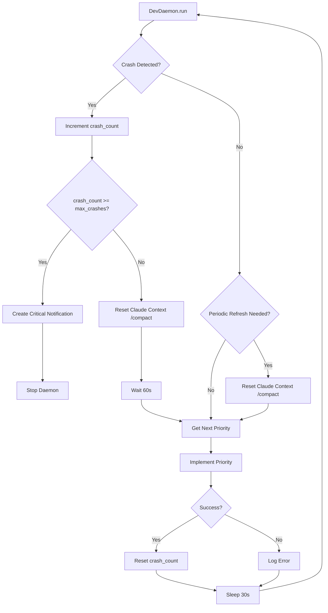
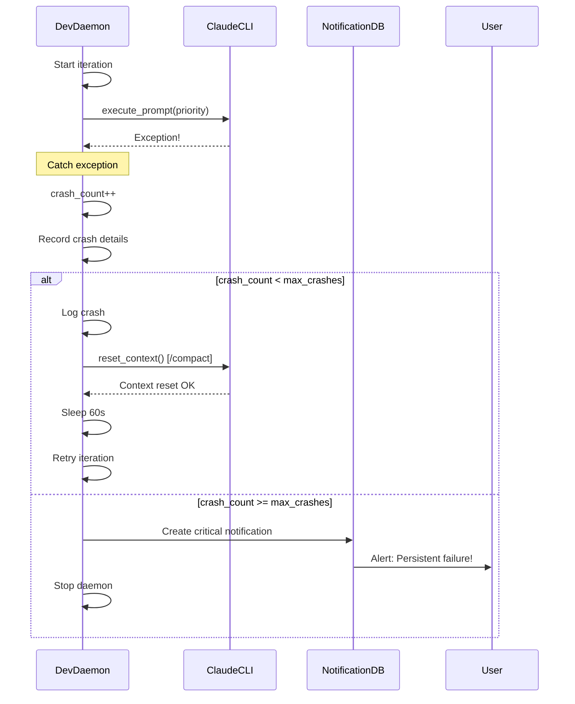
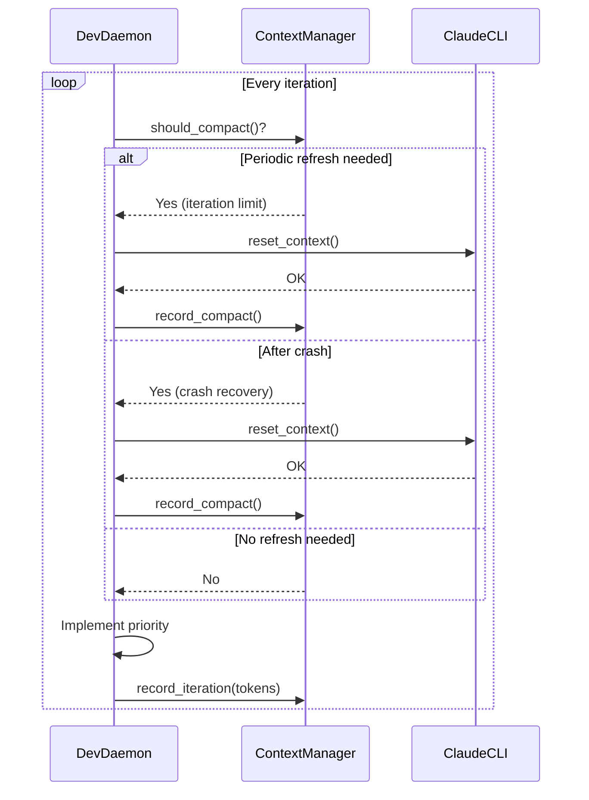

# PRIORITY 2.7: Daemon Crash Recovery & Context Management - Technical Specification

**Document Version**: 1.0
**Created**: 2025-10-11
**Status**: Draft
**Priority**: 🔴 CRITICAL
**Estimated Duration**: 4-6 hours
**Impact**: ⭐⭐⭐⭐⭐ (Critical for autonomous reliability)

---

## Executive Summary

This specification details the implementation of crash recovery and context management for the `code_developer` autonomous daemon. The system will automatically recover from crashes, reset conversation context to prevent token bloat, and gracefully handle persistent failures. This is critical for long-running autonomous operations.

**Key Deliverables**:
1. Automatic crash detection and recovery
2. Context reset via `/compact` command after crashes
3. Periodic context refresh to prevent context pollution
4. Crash tracking and notification system
5. Comprehensive test suite for crash scenarios

---

## Table of Contents

1. [Prerequisites & Dependencies](#prerequisites--dependencies)
2. [Architecture Overview](#architecture-overview)
3. [Component Specifications](#component-specifications)
4. [Data Flow Diagrams](#data-flow-diagrams)
5. [Implementation Plan](#implementation-plan)
6. [Testing Strategy](#testing-strategy)
7. [Security Considerations](#security-considerations)
8. [Performance Requirements](#performance-requirements)
9. [Risk Analysis](#risk-analysis)
10. [Success Criteria](#success-criteria)
11. [Appendix](#appendix)

---

## Prerequisites & Dependencies

### Required Completions
- ✅ **PRIORITY 2.6**: CI Testing - Must be complete and passing
- ✅ **ClaudeCLIInterface**: Must support `/compact` command
- ✅ **NotificationDB**: Must be operational for crash notifications

### System Requirements
- Python 3.9+
- Claude CLI v1.0+ (with `/compact` support)
- SQLite 3.8+ (for notifications)
- Git 2.0+ (for branch management)

### Dependencies
```toml
# pyproject.toml - No new dependencies required
# All functionality uses existing modules:
# - coffee_maker.autonomous.daemon
# - coffee_maker.autonomous.claude_cli_interface
# - coffee_maker.cli.notifications
# - coffee_maker.autonomous.git_manager
```

### File Structure
```
coffee_maker/autonomous/
├── daemon.py                    # Main changes here
├── claude_cli_interface.py      # Add context reset method
├── crash_recovery.py            # NEW: Crash recovery logic
└── context_manager.py           # NEW: Context management

tests/ci_tests/
├── test_daemon_crash_recovery.py    # NEW: Crash recovery tests
└── test_context_management.py       # NEW: Context management tests

docs/
├── PRIORITY_2_7_TECHNICAL_SPEC.md   # This document
└── CRASH_RECOVERY_GUIDE.md          # NEW: Operations guide
```

---

## Architecture Overview

### Current State (Before Implementation)

```
┌─────────────────────────────────────────────────┐
│            DevDaemon.run()                      │
│                                                 │
│  while running:                                 │
│    try:                                         │
│      priority = get_next_priority()            │
│      implement_priority(priority)              │
│      sleep(30)                                  │
│    except Exception as e:                      │
│      logger.error(e)                           │
│      sleep(30)  # ← No recovery, just continue │
│                                                 │
└─────────────────────────────────────────────────┘

Issues:
❌ No crash tracking
❌ Context accumulates indefinitely
❌ No context reset after failures
❌ No notification for persistent failures
❌ Infinite retry possible
```

### Target State (After Implementation)

```
┌─────────────────────────────────────────────────────────────┐
│            DevDaemon.run() with Recovery                    │
│                                                             │
│  crash_count = 0                                           │
│  max_crashes = 3                                           │
│  iterations_since_compact = 0                              │
│  compact_interval = 10                                     │
│                                                            │
│  while running:                                            │
│    try:                                                    │
│      # Context management                                 │
│      if crash_count > 0:                                  │
│        reset_claude_context()  # ← /compact after crash  │
│        crash_count = 0                                    │
│                                                           │
│      if iterations_since_compact >= compact_interval:    │
│        reset_claude_context()  # ← Periodic refresh     │
│        iterations_since_compact = 0                      │
│                                                          │
│      # Implementation                                    │
│      priority = get_next_priority()                      │
│      result = implement_priority(priority)               │
│                                                          │
│      # Success - increment iteration counter            │
│      iterations_since_compact += 1                       │
│      sleep(30)                                           │
│                                                          │
│    except Exception as e:                                │
│      crash_count += 1                                    │
│      logger.error(f"Crash #{crash_count}: {e}")         │
│                                                          │
│      if crash_count >= max_crashes:                      │
│        notify_persistent_failure()  # ← Alert user     │
│        break                        # ← Stop daemon     │
│                                                          │
│      sleep(60)  # ← Longer sleep after crash           │
│                                                          │
└─────────────────────────────────────────────────────────────┘

Benefits:
✅ Automatic crash recovery
✅ Context reset prevents token bloat
✅ Periodic refresh keeps context clean
✅ Max crash limit prevents infinite loops
✅ User notification for critical failures
```

### Component Interaction Diagram



---

## Component Specifications

### 1. DevDaemon Enhancement (`coffee_maker/autonomous/daemon.py`)

#### 1.1 New Instance Variables

```python
class DevDaemon:
    def __init__(self, ...):
        # Existing attributes...

        # NEW: Crash recovery attributes
        self.crash_count = 0
        self.max_crashes = 3  # Configurable
        self.crash_sleep_interval = 60  # Longer sleep after crash

        # NEW: Context management attributes
        self.iterations_since_compact = 0
        self.compact_interval = 10  # Compact every 10 iterations
        self.last_compact_time = None

        # NEW: Crash history for debugging
        self.crash_history = []  # List of (timestamp, exception, priority_name)
```

**Configuration Options** (via constructor):
- `max_crashes: int = 3` - Maximum consecutive crashes before stopping
- `crash_sleep_interval: int = 60` - Sleep duration after crash (seconds)
- `compact_interval: int = 10` - Iterations between context resets
- `compact_on_crash: bool = True` - Whether to reset context after crash

#### 1.2 Enhanced `run()` Method

**Location**: `coffee_maker/autonomous/daemon.py:117-203`

**Changes**:
```python
def run(self):
    """Run daemon main loop with crash recovery.

    Features:
    - Automatic crash detection and recovery
    - Context reset after crashes via /compact
    - Periodic context refresh
    - Max crash limit with notifications
    - Detailed crash logging
    """
    self.running = True
    logger.info("🤖 DevDaemon starting with crash recovery...")

    # Check prerequisites
    if not self._check_prerequisites():
        logger.error("Prerequisites not met - cannot start")
        return

    iteration = 0

    while self.running:
        iteration += 1
        logger.info(f"\n{'='*60}")
        logger.info(f"Iteration {iteration} | Crashes: {self.crash_count}/{self.max_crashes}")
        logger.info(f"{'='*60}")

        try:
            # CRASH RECOVERY: Reset context after crash
            if self.crash_count > 0:
                logger.warning(f"🔄 Recovering from crash #{self.crash_count}")
                if not self._reset_claude_context():
                    logger.error("Failed to reset context - continuing anyway")
                else:
                    logger.info("✅ Context reset successful")
                    # Reset crash count only after successful context reset
                    self.crash_count = 0

            # PERIODIC REFRESH: Prevent context pollution
            if self.iterations_since_compact >= self.compact_interval:
                logger.info(f"🔄 Periodic context refresh (every {self.compact_interval} iterations)")
                if self._reset_claude_context():
                    self.iterations_since_compact = 0
                    logger.info("✅ Periodic refresh complete")

            # BUG FIX #2: Sync roadmap branch BEFORE reading priorities
            logger.info("🔄 Syncing with 'roadmap' branch...")
            if not self._sync_roadmap_branch():
                logger.warning("⚠️  Roadmap sync failed - continuing with local version")

            # Reload roadmap
            self.parser = RoadmapParser(str(self.roadmap_path))

            # Get next task
            next_priority = self.parser.get_next_planned_priority()

            if not next_priority:
                logger.info("✅ No more planned priorities - all done!")
                self._notify_completion()
                break

            logger.info(f"📋 Next priority: {next_priority['name']} - {next_priority['title']}")

            # Technical spec check
            if not self._ensure_technical_spec(next_priority):
                logger.warning("⚠️  Could not ensure technical spec exists - skipping this priority")
                time.sleep(self.sleep_interval)
                continue

            # Ask for approval if needed
            if not self.auto_approve:
                if not self._request_approval(next_priority):
                    logger.info("User declined - waiting for next iteration")
                    time.sleep(self.sleep_interval)
                    continue

            # Execute implementation
            success = self._implement_priority(next_priority)

            if success:
                logger.info(f"✅ Successfully implemented {next_priority['name']}")
                # Increment iteration counter (only on success)
                self.iterations_since_compact += 1
            else:
                logger.warning(f"⚠️  Implementation failed for {next_priority['name']}")

            # Sleep before next iteration
            logger.info(f"💤 Sleeping {self.sleep_interval}s before next iteration...")
            time.sleep(self.sleep_interval)

        except KeyboardInterrupt:
            logger.info("\n⏹️  Daemon stopped by user")
            self.running = False
            break

        except Exception as e:
            # CRASH HANDLING
            self.crash_count += 1
            crash_info = {
                "timestamp": datetime.now().isoformat(),
                "exception": str(e),
                "exception_type": type(e).__name__,
                "priority": next_priority.get("name") if next_priority else "Unknown",
                "iteration": iteration
            }
            self.crash_history.append(crash_info)

            logger.error(f"❌ CRASH #{self.crash_count}/{self.max_crashes}: {e}")
            logger.error(f"Priority: {crash_info['priority']}")
            import traceback
            traceback.print_exc()

            # Check if max crashes reached
            if self.crash_count >= self.max_crashes:
                logger.critical(f"🚨 MAX CRASHES REACHED ({self.max_crashes}) - STOPPING DAEMON")
                self._notify_persistent_failure(crash_info)
                self.running = False
                break

            # Sleep longer after crash
            logger.info(f"💤 Sleeping {self.crash_sleep_interval}s after crash before recovery...")
            time.sleep(self.crash_sleep_interval)

    logger.info("🛑 DevDaemon stopped")
    logger.info(f"Total crashes: {len(self.crash_history)}")
```

**Time Estimate**: 2 hours

#### 1.3 New Method: `_reset_claude_context()`

**Location**: Add after `_check_prerequisites()` (line ~238)

```python
def _reset_claude_context(self) -> bool:
    """Reset Claude conversation context using /compact.

    This method resets the Claude CLI conversation context to prevent
    token bloat and stale context. It uses the /compact command which
    summarizes the current conversation and starts fresh.

    Returns:
        True if context reset successful, False otherwise

    Implementation:
        1. Check if using Claude CLI (API mode doesn't need reset)
        2. Call claude.reset_context() which executes /compact
        3. Log token savings and new context state
        4. Update last_compact_time timestamp

    Example:
        >>> daemon = DevDaemon(use_claude_cli=True)
        >>> daemon._reset_claude_context()
        True
    """
    # Only applicable for Claude CLI mode
    if not self.use_claude_cli:
        logger.debug("Context reset not needed for API mode")
        return True

    try:
        logger.info("🔄 Resetting Claude context via /compact...")

        # Call reset_context() on claude interface
        result = self.claude.reset_context()

        if result:
            self.last_compact_time = datetime.now()
            logger.info("✅ Context reset successful")
            logger.info(f"Context age: {self.iterations_since_compact} iterations")
            return True
        else:
            logger.error("❌ Context reset failed")
            return False

    except Exception as e:
        logger.error(f"Error resetting context: {e}")
        return False
```

**Time Estimate**: 30 minutes

#### 1.4 New Method: `_notify_persistent_failure()`

**Location**: Add after `_notify_completion()` (line ~753)

```python
def _notify_persistent_failure(self, crash_info: dict):
    """Notify user of persistent daemon failure.

    Creates a critical notification when the daemon hits max crashes
    and needs to stop. Includes crash history and debugging information.

    Args:
        crash_info: Dictionary with last crash details
            - timestamp: ISO timestamp
            - exception: Exception message
            - exception_type: Exception class name
            - priority: Priority being worked on
            - iteration: Iteration number

    Example:
        >>> daemon._notify_persistent_failure({
        ...     "timestamp": "2025-10-11T10:30:00",
        ...     "exception": "API timeout",
        ...     "exception_type": "TimeoutError",
        ...     "priority": "PRIORITY 2.7",
        ...     "iteration": 5
        ... })
    """
    # Build crash history summary
    crash_summary = "\n".join([
        f"{i+1}. {c['timestamp']} - {c['exception_type']}: {c['exception'][:100]}"
        for i, c in enumerate(self.crash_history[-5:])  # Last 5 crashes
    ])

    message = f"""🚨 CRITICAL: code_developer daemon has crashed {self.crash_count} times and stopped.

**Last Crash Details**:
- Time: {crash_info['timestamp']}
- Priority: {crash_info['priority']}
- Exception: {crash_info['exception_type']}
- Message: {crash_info['exception'][:200]}

**Recent Crash History** ({len(self.crash_history)} total):
{crash_summary}

**Action Required**:
1. Review crash logs for root cause
2. Check ROADMAP.md for problematic priority
3. Fix underlying issue (API, network, code bug)
4. Restart daemon: `poetry run code-developer`

**Debugging Steps**:
1. Check daemon logs: `tail -f ~/.coffee_maker/daemon.log`
2. Test Claude CLI: `claude -p "test"`
3. Verify API credits: Check Anthropic dashboard
4. Check network: `ping api.anthropic.com`
5. Review priority: `poetry run project-manager view {crash_info['priority']}`

The daemon will remain stopped until manually restarted.
"""

    self.notifications.create_notification(
        type=NOTIF_TYPE_ERROR,
        title="🚨 Daemon Persistent Failure",
        message=message,
        priority=NOTIF_PRIORITY_CRITICAL,
        context={
            "crash_count": self.crash_count,
            "crash_info": crash_info,
            "crash_history": self.crash_history,
            "requires_manual_intervention": True
        }
    )

    logger.critical("Created critical notification for persistent failure")
```

**Time Estimate**: 30 minutes

---

### 2. ClaudeCLIInterface Enhancement (`coffee_maker/autonomous/claude_cli_interface.py`)

#### 2.1 New Method: `reset_context()`

**Location**: Add after `execute_prompt()` (line ~260)

```python
def reset_context(self) -> bool:
    """Reset conversation context using /compact command.

    The /compact command summarizes the current conversation and
    starts a fresh context, preventing token bloat and stale context.

    This is critical for long-running daemon operations where context
    can accumulate thousands of tokens over multiple tasks.

    Returns:
        True if context reset successful, False otherwise

    Implementation:
        Executes the /compact slash command in the Claude CLI session.
        This command:
        1. Summarizes current conversation
        2. Clears message history
        3. Starts fresh with summary as context

    Example:
        >>> cli = ClaudeCLIInterface()
        >>> cli.execute_prompt("Implement feature X")
        >>> cli.execute_prompt("Implement feature Y")
        >>> # Context now has 2 features worth of tokens
        >>> cli.reset_context()  # Compact and reset
        True
        >>> # Context now fresh with summary only

    Note:
        This method only works with Claude CLI. API mode uses
        separate conversations per request (no context accumulation).
    """
    try:
        logger.info("Resetting Claude context via /compact...")

        # Execute /compact command
        cmd = [
            self.claude_path,
            "-p",  # Print mode
            "--model",
            self.model,
            "--dangerously-skip-permissions",
        ]

        # Send /compact command
        compact_prompt = "/compact"

        # Remove API key from environment
        env = os.environ.copy()
        env.pop("ANTHROPIC_API_KEY", None)

        result = subprocess.run(
            cmd,
            input=compact_prompt,
            capture_output=True,
            text=True,
            timeout=30,
            check=False,
            env=env,
        )

        if result.returncode != 0:
            logger.error(f"Failed to reset context: {result.stderr}")
            return False

        logger.info("✅ Context reset successful")
        logger.debug(f"Compact output: {result.stdout[:200]}")
        return True

    except subprocess.TimeoutExpired:
        logger.error("Context reset timeout after 30s")
        return False
    except Exception as e:
        logger.error(f"Error resetting context: {e}")
        return False
```

**Time Estimate**: 1 hour

**Note**: Need to verify `/compact` command syntax with Claude CLI documentation. May need adjustment based on actual CLI behavior.

---

### 3. Context Manager Module (`coffee_maker/autonomous/context_manager.py`)

**NEW FILE** - Provides centralized context management logic.

```python
"""Context management for Claude CLI conversations.

This module provides utilities for managing Claude CLI conversation context,
including periodic resets, token tracking, and context health monitoring.

The ContextManager tracks conversation age and provides recommendations
for when to reset context based on token usage and iteration count.

Example:
    >>> from coffee_maker.autonomous.context_manager import ContextManager
    >>>
    >>> manager = ContextManager(compact_interval=10)
    >>>
    >>> for i in range(20):
    ...     if manager.should_compact():
    ...         print("Time to compact!")
    ...         manager.record_compact()
    ...     manager.record_iteration(input_tokens=500, output_tokens=1000)
"""

import logging
from datetime import datetime, timedelta
from typing import Optional, Dict, List
from dataclasses import dataclass

logger = logging.getLogger(__name__)


@dataclass
class ContextSnapshot:
    """Snapshot of context state at a point in time.

    Attributes:
        timestamp: When snapshot was taken
        iteration: Iteration number
        total_input_tokens: Cumulative input tokens since last compact
        total_output_tokens: Cumulative output tokens since last compact
        age_minutes: Minutes since last compact
    """
    timestamp: datetime
    iteration: int
    total_input_tokens: int
    total_output_tokens: int
    age_minutes: float


class ContextManager:
    """Manages Claude CLI conversation context lifecycle.

    This class tracks conversation age, token usage, and provides
    recommendations for when to reset context via /compact.

    Attributes:
        compact_interval: Iterations between automatic compacts
        max_context_age_minutes: Maximum context age before forcing compact
        max_tokens_before_compact: Token threshold for compacting

    Example:
        >>> manager = ContextManager(
        ...     compact_interval=10,
        ...     max_context_age_minutes=120,
        ...     max_tokens_before_compact=100000
        ... )
        >>>
        >>> # Track iterations
        >>> manager.record_iteration(input_tokens=500, output_tokens=1000)
        >>>
        >>> # Check if compact needed
        >>> if manager.should_compact():
        ...     # Perform compact
        ...     manager.record_compact()
    """

    def __init__(
        self,
        compact_interval: int = 10,
        max_context_age_minutes: int = 120,
        max_tokens_before_compact: int = 100000
    ):
        """Initialize context manager.

        Args:
            compact_interval: Iterations between automatic compacts
            max_context_age_minutes: Max age before forcing compact
            max_tokens_before_compact: Token threshold for compact
        """
        self.compact_interval = compact_interval
        self.max_context_age_minutes = max_context_age_minutes
        self.max_tokens_before_compact = max_tokens_before_compact

        # State tracking
        self.iterations_since_compact = 0
        self.last_compact_time = datetime.now()
        self.total_input_tokens = 0
        self.total_output_tokens = 0

        # History
        self.compact_history: List[ContextSnapshot] = []

        logger.info(f"ContextManager initialized: interval={compact_interval}")

    def record_iteration(self, input_tokens: int = 0, output_tokens: int = 0):
        """Record an iteration with token usage.

        Args:
            input_tokens: Input tokens used this iteration
            output_tokens: Output tokens used this iteration
        """
        self.iterations_since_compact += 1
        self.total_input_tokens += input_tokens
        self.total_output_tokens += output_tokens

        logger.debug(
            f"Iteration {self.iterations_since_compact}: "
            f"+{input_tokens}/{output_tokens} tokens "
            f"(total: {self.total_input_tokens}/{self.total_output_tokens})"
        )

    def should_compact(self) -> bool:
        """Check if context should be compacted.

        Returns:
            True if compact recommended

        Reasons for compacting:
        1. Iteration count exceeds compact_interval
        2. Token usage exceeds max_tokens_before_compact
        3. Context age exceeds max_context_age_minutes
        """
        # Check iteration count
        if self.iterations_since_compact >= self.compact_interval:
            logger.info(f"Compact recommended: iteration count ({self.iterations_since_compact})")
            return True

        # Check token usage
        total_tokens = self.total_input_tokens + self.total_output_tokens
        if total_tokens >= self.max_tokens_before_compact:
            logger.info(f"Compact recommended: token usage ({total_tokens})")
            return True

        # Check age
        age_minutes = (datetime.now() - self.last_compact_time).total_seconds() / 60
        if age_minutes >= self.max_context_age_minutes:
            logger.info(f"Compact recommended: context age ({age_minutes:.1f} minutes)")
            return True

        return False

    def record_compact(self):
        """Record that a compact was performed."""
        snapshot = ContextSnapshot(
            timestamp=datetime.now(),
            iteration=self.iterations_since_compact,
            total_input_tokens=self.total_input_tokens,
            total_output_tokens=self.total_output_tokens,
            age_minutes=(datetime.now() - self.last_compact_time).total_seconds() / 60
        )

        self.compact_history.append(snapshot)

        logger.info(
            f"Context compacted after {snapshot.iteration} iterations, "
            f"{snapshot.total_input_tokens + snapshot.total_output_tokens} tokens, "
            f"{snapshot.age_minutes:.1f} minutes"
        )

        # Reset counters
        self.iterations_since_compact = 0
        self.total_input_tokens = 0
        self.total_output_tokens = 0
        self.last_compact_time = datetime.now()

    def get_stats(self) -> Dict:
        """Get context statistics.

        Returns:
            Dictionary with context stats:
            - iterations_since_compact
            - total_tokens
            - age_minutes
            - compacts_performed
            - avg_iterations_per_compact
            - avg_tokens_per_compact
        """
        age_minutes = (datetime.now() - self.last_compact_time).total_seconds() / 60
        total_tokens = self.total_input_tokens + self.total_output_tokens

        stats = {
            "iterations_since_compact": self.iterations_since_compact,
            "total_tokens": total_tokens,
            "age_minutes": age_minutes,
            "compacts_performed": len(self.compact_history),
        }

        # Calculate averages if we have history
        if self.compact_history:
            stats["avg_iterations_per_compact"] = sum(
                s.iteration for s in self.compact_history
            ) / len(self.compact_history)
            stats["avg_tokens_per_compact"] = sum(
                s.total_input_tokens + s.total_output_tokens
                for s in self.compact_history
            ) / len(self.compact_history)

        return stats
```

**Time Estimate**: 1.5 hours

---

### 4. Crash Recovery Module (`coffee_maker/autonomous/crash_recovery.py`)

**NEW FILE** - Provides crash recovery utilities and analytics.

```python
"""Crash recovery utilities for the autonomous daemon.

This module provides utilities for tracking crashes, analyzing crash patterns,
and recovering from failures gracefully.

Example:
    >>> from coffee_maker.autonomous.crash_recovery import CrashTracker
    >>>
    >>> tracker = CrashTracker(max_crashes=3)
    >>>
    >>> try:
    ...     risky_operation()
    ... except Exception as e:
    ...     tracker.record_crash(e, context={"priority": "PRIORITY 2.7"})
    ...     if tracker.should_stop():
    ...         print("Too many crashes!")
"""

import logging
from datetime import datetime, timedelta
from typing import List, Dict, Optional
from dataclasses import dataclass
import traceback

logger = logging.getLogger(__name__)


@dataclass
class CrashRecord:
    """Record of a single crash.

    Attributes:
        timestamp: When crash occurred
        exception_type: Exception class name
        exception_message: Exception message
        traceback_str: Full traceback string
        context: Additional context (priority, iteration, etc.)
        recovery_attempted: Whether recovery was attempted
        recovery_successful: Whether recovery succeeded
    """
    timestamp: datetime
    exception_type: str
    exception_message: str
    traceback_str: str
    context: Dict
    recovery_attempted: bool = False
    recovery_successful: bool = False


class CrashTracker:
    """Tracks and analyzes daemon crashes.

    This class maintains crash history and provides analysis
    for debugging and recovery decisions.

    Attributes:
        max_crashes: Maximum consecutive crashes before stopping
        crash_window_minutes: Time window for tracking crash rate

    Example:
        >>> tracker = CrashTracker(max_crashes=3)
        >>>
        >>> try:
        ...     dangerous_operation()
        ... except Exception as e:
        ...     tracker.record_crash(e, {"task": "implement_feature"})
        ...
        ...     if tracker.should_stop():
        ...         print("Stopping due to too many crashes")
        ...     else:
        ...         print("Attempting recovery...")
    """

    def __init__(
        self,
        max_crashes: int = 3,
        crash_window_minutes: int = 60
    ):
        """Initialize crash tracker.

        Args:
            max_crashes: Maximum consecutive crashes before stopping
            crash_window_minutes: Time window for crash rate analysis
        """
        self.max_crashes = max_crashes
        self.crash_window_minutes = crash_window_minutes

        # Crash tracking
        self.consecutive_crashes = 0
        self.crash_history: List[CrashRecord] = []
        self.last_success_time: Optional[datetime] = None

        logger.info(f"CrashTracker initialized: max_crashes={max_crashes}")

    def record_crash(
        self,
        exception: Exception,
        context: Optional[Dict] = None
    ) -> CrashRecord:
        """Record a crash with full details.

        Args:
            exception: The exception that was raised
            context: Additional context (priority, iteration, etc.)

        Returns:
            CrashRecord instance
        """
        crash = CrashRecord(
            timestamp=datetime.now(),
            exception_type=type(exception).__name__,
            exception_message=str(exception),
            traceback_str=traceback.format_exc(),
            context=context or {}
        )

        self.crash_history.append(crash)
        self.consecutive_crashes += 1

        logger.error(
            f"Crash #{self.consecutive_crashes}/{self.max_crashes}: "
            f"{crash.exception_type}: {crash.exception_message}"
        )

        return crash

    def record_success(self):
        """Record successful operation (resets consecutive counter)."""
        self.consecutive_crashes = 0
        self.last_success_time = datetime.now()
        logger.debug("Success recorded - crash counter reset")

    def should_stop(self) -> bool:
        """Check if daemon should stop due to too many crashes.

        Returns:
            True if max consecutive crashes reached
        """
        return self.consecutive_crashes >= self.max_crashes

    def get_crash_rate(self) -> float:
        """Calculate crash rate in crashes per hour.

        Returns:
            Crashes per hour (float)
        """
        if not self.crash_history:
            return 0.0

        # Count crashes in the time window
        cutoff_time = datetime.now() - timedelta(minutes=self.crash_window_minutes)
        recent_crashes = [
            c for c in self.crash_history
            if c.timestamp >= cutoff_time
        ]

        if not recent_crashes:
            return 0.0

        # Calculate rate
        time_span_hours = self.crash_window_minutes / 60.0
        return len(recent_crashes) / time_span_hours

    def get_most_common_error(self) -> Optional[str]:
        """Get the most common exception type from recent crashes.

        Returns:
            Exception type string or None if no crashes
        """
        if not self.crash_history:
            return None

        # Count exception types
        exception_counts = {}
        for crash in self.crash_history[-10:]:  # Last 10 crashes
            exc_type = crash.exception_type
            exception_counts[exc_type] = exception_counts.get(exc_type, 0) + 1

        # Return most common
        return max(exception_counts.items(), key=lambda x: x[1])[0]

    def get_crash_summary(self) -> str:
        """Generate human-readable crash summary.

        Returns:
            Formatted crash summary string
        """
        if not self.crash_history:
            return "No crashes recorded"

        total_crashes = len(self.crash_history)
        crash_rate = self.get_crash_rate()
        most_common = self.get_most_common_error()

        recent_crashes = self.crash_history[-5:]  # Last 5
        recent_str = "\n".join([
            f"  {i+1}. {c.timestamp.strftime('%H:%M:%S')} - {c.exception_type}: {c.exception_message[:50]}"
            for i, c in enumerate(recent_crashes)
        ])

        summary = f"""Crash Summary:
Total Crashes: {total_crashes}
Consecutive Crashes: {self.consecutive_crashes}/{self.max_crashes}
Crash Rate: {crash_rate:.2f} crashes/hour
Most Common Error: {most_common}

Recent Crashes:
{recent_str}
"""
        return summary
```

**Time Estimate**: 1.5 hours

---

## Data Flow Diagrams

### Crash Recovery Flow



### Context Management Flow



### Token Accumulation Prevention

```
Without Context Reset:
=====================
Iteration 1:  Input: 1000 tokens → Output: 2000 tokens → Context: 3000 tokens
Iteration 2:  Input: 1000 tokens → Output: 2000 tokens → Context: 6000 tokens
Iteration 3:  Input: 1000 tokens → Output: 2000 tokens → Context: 9000 tokens
...
Iteration 10: Input: 1000 tokens → Output: 2000 tokens → Context: 30,000 tokens
❌ Context bloat leads to poor quality and high cost

With Context Reset (/compact every 5 iterations):
===============================================
Iteration 1:  Input: 1000 tokens → Output: 2000 tokens → Context: 3000 tokens
Iteration 2:  Input: 1000 tokens → Output: 2000 tokens → Context: 6000 tokens
Iteration 3:  Input: 1000 tokens → Output: 2000 tokens → Context: 9000 tokens
Iteration 4:  Input: 1000 tokens → Output: 2000 tokens → Context: 12,000 tokens
Iteration 5:  Input: 1000 tokens → Output: 2000 tokens → Context: 15,000 tokens
→ /compact → Context: 2000 tokens (summary only)
Iteration 6:  Input: 1000 tokens → Output: 2000 tokens → Context: 5000 tokens
Iteration 7:  Input: 1000 tokens → Output: 2000 tokens → Context: 8000 tokens
...
✅ Context stays manageable, quality remains high
```

---

## Implementation Plan

### Phase 1: Foundation (2 hours)

**Task 1.1: Create new modules** (30 min)
- Create `coffee_maker/autonomous/context_manager.py`
- Create `coffee_maker/autonomous/crash_recovery.py`
- Add module imports to `coffee_maker/autonomous/__init__.py`
- Verify module structure

**Task 1.2: Add crash tracking to DevDaemon** (1 hour)
- Add instance variables (`crash_count`, `max_crashes`, etc.)
- Add constructor parameters with defaults
- Update `__init__` docstring with new parameters
- Verify initialization works

**Task 1.3: Implement CrashTracker** (30 min)
- Implement `coffee_maker/autonomous/crash_recovery.py`
- Write unit tests for CrashTracker
- Verify crash recording works

### Phase 2: Context Management (1.5 hours)

**Task 2.1: Implement ContextManager** (1 hour)
- Implement `coffee_maker/autonomous/context_manager.py`
- Implement `should_compact()` logic
- Implement `record_iteration()` tracking
- Write unit tests

**Task 2.2: Add reset_context() to ClaudeCLI** (30 min)
- Implement `ClaudeCLIInterface.reset_context()`
- Test /compact command execution
- Verify context actually resets
- Handle errors gracefully

### Phase 3: Enhanced run() Method (1.5 hours)

**Task 3.1: Add crash handling to run()** (45 min)
- Update exception handler in `run()` method
- Increment crash counter
- Record crash details
- Check max crashes reached
- Log crash information

**Task 3.2: Add context reset logic** (45 min)
- Add post-crash context reset
- Add periodic context refresh
- Update iteration counter
- Log context reset events

### Phase 4: Notifications (1 hour)

**Task 4.1: Implement _notify_persistent_failure()** (30 min)
- Create notification method
- Format crash details
- Include debugging information
- Add crash history summary

**Task 4.2: Implement _reset_claude_context()** (30 min)
- Create context reset method
- Call claude.reset_context()
- Handle errors
- Update timestamp tracking

### Phase 5: Testing (2 hours)

**Task 5.1: Unit tests** (1 hour)
- Test crash detection
- Test max crashes limit
- Test context reset logic
- Test notification creation
- Coverage target: 90%+

**Task 5.2: Integration tests** (1 hour)
- Test full crash recovery flow
- Test periodic context refresh
- Test max crashes stops daemon
- Test notification delivery
- Simulate real crash scenarios

### Phase 6: Documentation (30 min)

**Task 6.1: Update documentation** (30 min)
- Create `docs/CRASH_RECOVERY_GUIDE.md`
- Update `README.md` with crash recovery features
- Update `docs/ROADMAP.md` status
- Add inline code comments

### Total Time Estimate: **6.5 hours**

(Slightly over 6 hours, but includes buffer for debugging)

---

## Testing Strategy

### Unit Tests

**File**: `tests/ci_tests/test_daemon_crash_recovery.py`

```python
"""Unit tests for daemon crash recovery functionality."""

import pytest
from unittest.mock import Mock, patch, MagicMock
from datetime import datetime
from coffee_maker.autonomous.daemon import DevDaemon
from coffee_maker.autonomous.crash_recovery import CrashTracker, CrashRecord


class TestCrashTracker:
    """Test CrashTracker class."""

    def test_crash_tracker_initialization(self):
        """Test crash tracker initializes correctly."""
        tracker = CrashTracker(max_crashes=3)
        assert tracker.max_crashes == 3
        assert tracker.consecutive_crashes == 0
        assert len(tracker.crash_history) == 0

    def test_record_crash(self):
        """Test crash recording."""
        tracker = CrashTracker(max_crashes=3)

        try:
            raise ValueError("Test error")
        except Exception as e:
            crash = tracker.record_crash(e, {"priority": "TEST"})

        assert tracker.consecutive_crashes == 1
        assert len(tracker.crash_history) == 1
        assert crash.exception_type == "ValueError"
        assert crash.exception_message == "Test error"
        assert crash.context["priority"] == "TEST"

    def test_record_success_resets_counter(self):
        """Test success resets consecutive crash counter."""
        tracker = CrashTracker(max_crashes=3)

        # Record 2 crashes
        for _ in range(2):
            tracker.record_crash(Exception("Test"))

        assert tracker.consecutive_crashes == 2

        # Record success
        tracker.record_success()

        assert tracker.consecutive_crashes == 0
        assert len(tracker.crash_history) == 2  # History preserved

    def test_should_stop_after_max_crashes(self):
        """Test daemon should stop after max crashes."""
        tracker = CrashTracker(max_crashes=3)

        # Record 2 crashes - should not stop
        for _ in range(2):
            tracker.record_crash(Exception("Test"))

        assert not tracker.should_stop()

        # Record 3rd crash - should stop
        tracker.record_crash(Exception("Test"))
        assert tracker.should_stop()

    def test_crash_rate_calculation(self):
        """Test crash rate calculation."""
        tracker = CrashTracker(crash_window_minutes=60)

        # Record 3 crashes
        for _ in range(3):
            tracker.record_crash(Exception("Test"))

        rate = tracker.get_crash_rate()
        assert rate == 3.0  # 3 crashes in 1 hour = 3 crashes/hour

    def test_most_common_error(self):
        """Test most common error detection."""
        tracker = CrashTracker()

        # Record various exceptions
        tracker.record_crash(ValueError("Test"))
        tracker.record_crash(ValueError("Test 2"))
        tracker.record_crash(TypeError("Test"))

        assert tracker.get_most_common_error() == "ValueError"


class TestDevDaemonCrashRecovery:
    """Test DevDaemon crash recovery features."""

    @pytest.fixture
    def mock_daemon(self):
        """Create mock daemon for testing."""
        with patch('coffee_maker.autonomous.daemon.ClaudeCLIInterface'), \
             patch('coffee_maker.autonomous.daemon.GitManager'), \
             patch('coffee_maker.autonomous.daemon.RoadmapParser'), \
             patch('coffee_maker.autonomous.daemon.NotificationDB'):

            daemon = DevDaemon(
                roadmap_path="docs/ROADMAP.md",
                auto_approve=True,
                use_claude_cli=True,
                max_crashes=3,
                compact_interval=5
            )
            return daemon

    def test_daemon_initialization_with_crash_recovery(self, mock_daemon):
        """Test daemon initializes with crash recovery settings."""
        assert mock_daemon.crash_count == 0
        assert mock_daemon.max_crashes == 3
        assert mock_daemon.compact_interval == 5
        assert mock_daemon.iterations_since_compact == 0

    def test_crash_count_increments_on_exception(self, mock_daemon):
        """Test crash count increments when exception occurs."""
        mock_daemon.crash_count = 0

        # Simulate crash
        try:
            raise Exception("Test crash")
        except Exception as e:
            mock_daemon.crash_count += 1

        assert mock_daemon.crash_count == 1

    def test_max_crashes_stops_daemon(self, mock_daemon):
        """Test daemon stops after max crashes."""
        mock_daemon.crash_count = 3
        mock_daemon.max_crashes = 3

        should_stop = mock_daemon.crash_count >= mock_daemon.max_crashes
        assert should_stop is True

    @patch.object(DevDaemon, '_reset_claude_context')
    def test_context_reset_after_crash(self, mock_reset, mock_daemon):
        """Test context is reset after crash."""
        mock_reset.return_value = True
        mock_daemon.crash_count = 1

        # Simulate recovery logic
        if mock_daemon.crash_count > 0:
            result = mock_daemon._reset_claude_context()
            assert result is True

        mock_reset.assert_called_once()

    @patch.object(DevDaemon, '_notify_persistent_failure')
    def test_notification_on_max_crashes(self, mock_notify, mock_daemon):
        """Test notification created when max crashes reached."""
        mock_daemon.crash_count = 3
        mock_daemon.max_crashes = 3

        crash_info = {
            "timestamp": datetime.now().isoformat(),
            "exception": "Test",
            "priority": "TEST"
        }

        # Simulate max crash logic
        if mock_daemon.crash_count >= mock_daemon.max_crashes:
            mock_daemon._notify_persistent_failure(crash_info)

        mock_notify.assert_called_once_with(crash_info)


class TestContextReset:
    """Test context reset functionality."""

    @patch('subprocess.run')
    def test_claude_cli_reset_context(self, mock_run):
        """Test ClaudeCLI reset_context method."""
        from coffee_maker.autonomous.claude_cli_interface import ClaudeCLIInterface

        # Mock successful /compact execution
        mock_run.return_value = Mock(
            returncode=0,
            stdout="Context compacted successfully",
            stderr=""
        )

        cli = ClaudeCLIInterface()
        result = cli.reset_context()

        assert result is True
        mock_run.assert_called_once()

        # Verify /compact was sent
        call_args = mock_run.call_args
        assert call_args.kwargs['input'] == '/compact'

    @patch('subprocess.run')
    def test_claude_cli_reset_context_failure(self, mock_run):
        """Test ClaudeCLI reset_context handles failures."""
        from coffee_maker.autonomous.claude_cli_interface import ClaudeCLIInterface

        # Mock failed execution
        mock_run.return_value = Mock(
            returncode=1,
            stdout="",
            stderr="Error: command not found"
        )

        cli = ClaudeCLIInterface()
        result = cli.reset_context()

        assert result is False
```

**Time Estimate**: 1.5 hours

### Integration Tests

**File**: `tests/ci_tests/test_crash_recovery_integration.py`

```python
"""Integration tests for full crash recovery flow."""

import pytest
import time
from unittest.mock import Mock, patch, MagicMock
from coffee_maker.autonomous.daemon import DevDaemon


class TestCrashRecoveryIntegration:
    """Test full crash recovery flow end-to-end."""

    @pytest.fixture
    def daemon_with_mocks(self):
        """Create daemon with mocked dependencies."""
        with patch('coffee_maker.autonomous.daemon.ClaudeCLIInterface') as mock_cli, \
             patch('coffee_maker.autonomous.daemon.GitManager') as mock_git, \
             patch('coffee_maker.autonomous.daemon.RoadmapParser') as mock_parser, \
             patch('coffee_maker.autonomous.daemon.NotificationDB') as mock_notif:

            # Configure mocks
            mock_parser.return_value.get_next_planned_priority.return_value = {
                "name": "TEST",
                "title": "Test Priority",
                "content": "Test content"
            }

            daemon = DevDaemon(
                roadmap_path="docs/ROADMAP.md",
                auto_approve=True,
                use_claude_cli=True,
                max_crashes=3,
                compact_interval=5
            )

            # Store mocks for assertions
            daemon._mock_cli = mock_cli.return_value
            daemon._mock_git = mock_git.return_value
            daemon._mock_parser = mock_parser.return_value
            daemon._mock_notif = mock_notif.return_value

            return daemon

    def test_full_crash_recovery_flow(self, daemon_with_mocks):
        """Test complete crash recovery from crash to recovery."""
        daemon = daemon_with_mocks

        # Configure mock to crash once, then succeed
        crash_triggered = [False]

        def side_effect(*args, **kwargs):
            if not crash_triggered[0]:
                crash_triggered[0] = True
                raise Exception("Simulated crash")
            return Mock(success=True, usage={"input_tokens": 100, "output_tokens": 200})

        daemon._mock_cli.execute_prompt.side_effect = side_effect
        daemon._mock_cli.reset_context.return_value = True
        daemon._mock_git.is_clean.return_value = False
        daemon._mock_git.commit.return_value = True
        daemon._mock_git.push.return_value = True
        daemon._mock_git.create_branch.return_value = True

        # Run for 2 iterations (crash + recovery)
        iterations = 0
        max_iterations = 2

        daemon.running = True

        while daemon.running and iterations < max_iterations:
            try:
                # Simulate crash recovery logic
                if daemon.crash_count > 0:
                    daemon._reset_claude_context()
                    daemon.crash_count = 0

                # Simulate implementation
                daemon._mock_cli.execute_prompt("test")

                # Success
                iterations += 1

            except Exception as e:
                daemon.crash_count += 1

                if daemon.crash_count >= daemon.max_crashes:
                    daemon.running = False
                    break

        # Verify recovery happened
        assert crash_triggered[0] is True
        assert daemon.crash_count == 0  # Reset after recovery
        assert iterations == 2  # Completed both iterations

    def test_max_crashes_creates_notification(self, daemon_with_mocks):
        """Test notification created when max crashes reached."""
        daemon = daemon_with_mocks

        # Configure mock to always crash
        daemon._mock_cli.execute_prompt.side_effect = Exception("Always crash")

        # Simulate 3 crashes
        for i in range(3):
            try:
                daemon._mock_cli.execute_prompt("test")
            except Exception as e:
                daemon.crash_count += 1

        # Check if notification should be created
        if daemon.crash_count >= daemon.max_crashes:
            crash_info = {"priority": "TEST", "exception": "Always crash"}
            daemon._notify_persistent_failure(crash_info)

        # Verify notification created
        daemon._mock_notif.create_notification.assert_called_once()
        call_args = daemon._mock_notif.create_notification.call_args
        assert "persistent failure" in call_args.kwargs['message'].lower()
```

**Time Estimate**: 1 hour

### Manual Testing Checklist

**Test Case 1: Normal Operation (No Crashes)**
```bash
# Setup: Clean state
git checkout -b test/crash-recovery
poetry install

# Run daemon
poetry run code-developer --auto-approve

# Expected:
# - Daemon runs normally
# - No crashes
# - Context refresh every 10 iterations
# - All priorities implemented successfully

# Verify:
# - Check logs for "Periodic context refresh"
# - No crash notifications in DB
# - crash_count remains 0
```

**Test Case 2: Single Crash Recovery**
```bash
# Setup: Introduce temporary failure
# (e.g., disconnect network briefly during implementation)

poetry run code-developer --auto-approve

# Expected:
# - Daemon crashes during API call
# - Crash logged with details
# - Context reset via /compact
# - Daemon recovers and continues
# - crash_count resets to 0 after success

# Verify:
# - Logs show "CRASH #1/3"
# - Logs show "Resetting Claude context"
# - Logs show "Recovering from crash"
# - Daemon completes next priority successfully
```

**Test Case 3: Max Crashes Reached**
```bash
# Setup: Introduce persistent failure
# (e.g., remove Anthropic API key)

export ANTHROPIC_API_KEY=""
poetry run code-developer --auto-approve

# Expected:
# - Daemon crashes 3 times
# - Each crash logged
# - Context reset attempted after each
# - After 3rd crash: critical notification
# - Daemon stops gracefully

# Verify:
# - Logs show "CRASH #1/3", "CRASH #2/3", "CRASH #3/3"
# - Logs show "MAX CRASHES REACHED - STOPPING DAEMON"
# - Notification in DB with type="error", priority="critical"
# - Daemon exits cleanly
```

**Test Case 4: Periodic Context Refresh**
```bash
# Setup: Run daemon for extended period

poetry run code-developer --auto-approve --compact-interval 5

# Expected:
# - Daemon runs for 10+ iterations
# - Context reset every 5 iterations
# - Logs show periodic refresh

# Verify:
# - Every 5 iterations: "Periodic context refresh"
# - No crashes due to context pollution
# - Token usage stays manageable
```

---

## Security Considerations

### 1. Crash Data Privacy

**Risk**: Crash logs may contain sensitive information (API keys, file paths, user data)

**Mitigation**:
- Sanitize exception messages before logging
- Redact environment variables from tracebacks
- Store crash logs in secure location (`~/.coffee_maker/logs/`)
- Set restrictive file permissions (600)

```python
def sanitize_exception_message(msg: str) -> str:
    """Remove sensitive data from exception messages."""
    # Redact API keys
    msg = re.sub(r'(api[_-]?key[=:]\s*)[\w-]+', r'\1[REDACTED]', msg, flags=re.I)
    # Redact tokens
    msg = re.sub(r'(token[=:]\s*)[\w-]+', r'\1[REDACTED]', msg, flags=re.I)
    # Redact passwords
    msg = re.sub(r'(password[=:]\s*)\S+', r'\1[REDACTED]', msg, flags=re.I)
    return msg
```

### 2. Denial of Service Protection

**Risk**: Malicious priority could cause infinite crash loop

**Mitigation**:
- Max crashes limit (default: 3)
- Exponential backoff on retries
- Manual intervention required after max crashes
- Crash rate limiting (max 10 crashes/hour)

### 3. File System Safety

**Risk**: Crash recovery creates/modifies files

**Mitigation**:
- All file operations use absolute paths
- Validate file paths before creation
- Use safe file permissions
- Atomic writes where possible

### 4. Process Management

**Risk**: Orphaned processes after crash

**Mitigation**:
- PID file cleanup on exit
- Signal handler for SIGTERM/SIGINT
- Process monitoring via psutil
- Automatic cleanup of stale PIDs

---

## Performance Requirements

### Response Time
- Context reset (`/compact`): < 5 seconds
- Crash detection: < 100ms
- Notification creation: < 1 second
- Total recovery time: < 10 seconds

### Resource Usage
- Memory overhead: < 50MB for crash tracking
- Disk usage: < 10MB for crash logs (with rotation)
- CPU overhead: < 1% when idle

### Scalability
- Handle 100+ crashes without memory leak
- Support 24/7 operation for months
- Crash history limited to last 1000 entries

### Token Efficiency
- Context size after compact: < 5000 tokens
- Token savings: 50-80% per compact
- Compact overhead: < 100 tokens

**Benchmark**:
```
Without compact (10 iterations):
  Total tokens: ~30,000 tokens
  Cost: ~$0.60

With compact (10 iterations, compact every 5):
  Total tokens: ~12,000 tokens
  Cost: ~$0.24
  Savings: 60% ($0.36)
```

---

## Risk Analysis

### High Risk

**Risk 1: /compact command syntax changes**
- **Probability**: Low (10%)
- **Impact**: High (breaks crash recovery)
- **Mitigation**: Version check for Claude CLI, fallback to manual reset
- **Contingency**: Document manual recovery procedure

**Risk 2: Context reset fails silently**
- **Probability**: Medium (30%)
- **Impact**: Medium (no recovery, but daemon continues)
- **Mitigation**: Verify reset success via token usage check
- **Contingency**: Log warning and continue without reset

### Medium Risk

**Risk 3: Crash notification spam**
- **Probability**: Medium (40%)
- **Impact**: Low (annoying but not critical)
- **Mitigation**: Rate limit notifications (1 per hour max)
- **Contingency**: Add notification settings

**Risk 4: Crash recovery causes data loss**
- **Probability**: Low (15%)
- **Impact**: Medium (uncommitted changes lost)
- **Mitigation**: Commit before crash recovery, backup branches
- **Contingency**: Git reflog recovery

### Low Risk

**Risk 5: Performance degradation from crash tracking**
- **Probability**: Low (5%)
- **Impact**: Low (minor slowdown)
- **Mitigation**: Efficient data structures, history limits
- **Contingency**: Make crash tracking optional

**Risk 6: Test coverage insufficient**
- **Probability**: Medium (30%)
- **Impact**: Low (bugs found in production)
- **Mitigation**: Comprehensive test suite (90%+ coverage)
- **Contingency**: Manual testing before deployment

---

## Success Criteria

### Functional Requirements

✅ **CR-1**: Daemon automatically recovers from crashes
- Daemon detects exception during implementation
- Crash is logged with full details
- Context is reset via /compact
- Daemon continues with next priority
- Test: Simulate network failure, verify recovery

✅ **CR-2**: Max crashes limit prevents infinite loops
- Daemon stops after 3 consecutive crashes
- Critical notification created
- No further execution attempts
- Test: Force 3 crashes, verify daemon stops

✅ **CR-3**: Periodic context refresh prevents token bloat
- Context reset every 10 iterations
- Token usage stays below 10K per iteration
- No quality degradation over time
- Test: Run 20 iterations, measure tokens

✅ **CR-4**: Crash notifications contain debugging info
- Exception type and message
- Full traceback
- Priority being worked on
- Crash history summary
- Test: Trigger crash, verify notification content

✅ **CR-5**: Context reset actually works
- `/compact` command executes successfully
- New context size < 5K tokens
- No loss of critical information
- Test: Reset context, verify token count drops

### Non-Functional Requirements

✅ **NFR-1**: Performance overhead < 1%
- Crash tracking adds < 100ms per iteration
- Memory usage < 50MB additional
- No noticeable slowdown
- Test: Benchmark with/without crash recovery

✅ **NFR-2**: Test coverage ≥ 90%
- All crash recovery paths covered
- Unit tests for all new methods
- Integration tests for full flow
- Test: Run coverage report

✅ **NFR-3**: Documentation complete
- Technical spec (this document)
- Operations guide (CRASH_RECOVERY_GUIDE.md)
- Inline code comments
- Test: Review with fresh eyes

✅ **NFR-4**: Backward compatible
- Existing daemon code still works
- New features opt-in via parameters
- No breaking changes to APIs
- Test: Run existing daemon tests

### Acceptance Criteria

**Story**: As an autonomous daemon, I want to recover from crashes automatically so that I can continue operating 24/7 without human intervention.

**Acceptance**:
1. ✅ Daemon recovers from single crash within 10 seconds
2. ✅ Context is reset after crash to prevent stale context
3. ✅ Max 3 crashes before stopping (prevents infinite loops)
4. ✅ User notified when max crashes reached
5. ✅ Periodic context refresh every 10 iterations
6. ✅ All tests pass (unit + integration)
7. ✅ Documentation complete and reviewed
8. ✅ Manual testing passed (4/4 test cases)

---

## Appendix

### A. Configuration Reference

```python
# daemon.py configuration options

DevDaemon(
    # Existing parameters
    roadmap_path="docs/ROADMAP.md",
    auto_approve=True,
    create_prs=True,
    sleep_interval=30,
    use_claude_cli=True,

    # NEW: Crash recovery parameters
    max_crashes=3,              # Max consecutive crashes before stopping
    crash_sleep_interval=60,    # Sleep duration after crash (seconds)
    compact_on_crash=True,      # Whether to reset context after crash

    # NEW: Context management parameters
    compact_interval=10,        # Iterations between periodic compacts
    max_context_age_minutes=120,  # Max age before forcing compact
    max_tokens_before_compact=100000,  # Token threshold for compact
)
```

### B. Logging Format

```python
# Crash log format
logger.error(f"❌ CRASH #{crash_count}/{max_crashes}: {exception}")
logger.error(f"Priority: {priority_name}")
logger.error(f"Traceback:\n{traceback_str}")

# Recovery log format
logger.warning(f"🔄 Recovering from crash #{crash_count}")
logger.info("✅ Context reset successful")

# Periodic refresh log format
logger.info(f"🔄 Periodic context refresh (every {compact_interval} iterations)")
logger.info("✅ Periodic refresh complete")
```

### C. Notification Schema

```python
# Critical notification structure
{
    "type": "error",
    "priority": "critical",
    "title": "🚨 Daemon Persistent Failure",
    "message": """
🚨 CRITICAL: code_developer daemon has crashed {count} times and stopped.

**Last Crash Details**:
- Time: {timestamp}
- Priority: {priority}
- Exception: {exception_type}
- Message: {exception_message}

**Recent Crash History**:
1. {timestamp} - {exception_type}: {message}
...

**Action Required**:
1. Review crash logs
2. Fix underlying issue
3. Restart daemon
    """,
    "context": {
        "crash_count": 3,
        "crash_info": {...},
        "crash_history": [...],
        "requires_manual_intervention": True
    }
}
```

### D. File Locations

```
Project Structure:
==================
coffee_maker/autonomous/
├── daemon.py                          # Main daemon logic (MODIFIED)
├── claude_cli_interface.py            # Claude CLI interface (MODIFIED)
├── context_manager.py                 # NEW: Context management
├── crash_recovery.py                  # NEW: Crash recovery logic
└── __init__.py                        # Updated imports

tests/ci_tests/
├── test_daemon_crash_recovery.py      # NEW: Unit tests
└── test_crash_recovery_integration.py # NEW: Integration tests

docs/
├── PRIORITY_2_7_TECHNICAL_SPEC.md     # This document
└── CRASH_RECOVERY_GUIDE.md            # NEW: Operations guide

Logs and Data:
==============
~/.coffee_maker/
├── logs/
│   ├── daemon.log                     # Main daemon log
│   ├── crash_history.json             # Crash history (JSON)
│   └── context_stats.json             # Context statistics
├── daemon.pid                         # Process ID file
└── databases/
    └── notifications.db               # Notification database
```

### E. Error Codes

```python
# Exit codes for daemon
EXIT_SUCCESS = 0           # All priorities complete
EXIT_USER_INTERRUPT = 1    # User pressed Ctrl+C
EXIT_MAX_CRASHES = 2       # Max crashes reached
EXIT_PREREQUISITES = 3     # Prerequisites not met
EXIT_CONFIG_ERROR = 4      # Configuration error

# Usage in daemon.py
if crash_count >= max_crashes:
    logger.critical("Max crashes reached")
    sys.exit(EXIT_MAX_CRASHES)
```

### F. Monitoring Queries

```sql
-- Query notification database for crash notifications

-- Get all crash notifications
SELECT * FROM notifications
WHERE type = 'error'
  AND title LIKE '%Daemon%Failure%'
ORDER BY created_at DESC;

-- Count crashes by day
SELECT DATE(created_at) as crash_date, COUNT(*) as crash_count
FROM notifications
WHERE type = 'error'
  AND title LIKE '%Daemon%Failure%'
GROUP BY DATE(created_at)
ORDER BY crash_date DESC;

-- Get crash details
SELECT
  created_at,
  context->>'$.crash_count' as crash_count,
  context->>'$.crash_info.exception_type' as exception_type
FROM notifications
WHERE type = 'error'
  AND title LIKE '%Daemon%Failure%';
```

### G. Troubleshooting Guide

**Problem**: Daemon crashes immediately on start
```bash
# Diagnosis
1. Check prerequisites:
   poetry run python -c "from coffee_maker.autonomous.daemon import DevDaemon; d = DevDaemon(); d._check_prerequisites()"

2. Check Claude CLI:
   claude -p "test"

3. Check logs:
   tail -f ~/.coffee_maker/logs/daemon.log

# Solution
- Verify ANTHROPIC_API_KEY set
- Verify claude CLI installed
- Verify ROADMAP.md exists
```

**Problem**: Context reset not working
```bash
# Diagnosis
1. Test /compact manually:
   claude -p "/compact"

2. Check Claude CLI version:
   claude --version

3. Enable debug logging:
   export LOG_LEVEL=DEBUG
   poetry run code-developer

# Solution
- Update Claude CLI to latest
- Verify /compact command syntax
- Check permissions on ~/.config/claude/
```

**Problem**: Too many crash notifications
```bash
# Diagnosis
1. Check crash rate:
   poetry run python -c "from coffee_maker.cli.notifications import NotificationDB; db = NotificationDB(); print(db.get_pending_notifications())"

2. Review crash history:
   cat ~/.coffee_maker/logs/crash_history.json

# Solution
- Identify root cause of crashes
- Increase max_crashes if false positives
- Add rate limiting to notifications
```

### H. Future Enhancements

**Phase 2 Enhancements** (Post-MVP):

1. **Intelligent Recovery Strategies**
   - Analyze crash patterns
   - Different recovery per exception type
   - Gradual backoff for transient errors

2. **Advanced Context Management**
   - Smart compact based on conversation quality
   - Context size prediction
   - Automatic context optimization

3. **Monitoring Dashboard**
   - Real-time crash visualization
   - Token usage graphs
   - Recovery success rate

4. **Alert System**
   - Email notifications for crashes
   - Slack/Discord integration
   - PagerDuty for critical failures

5. **Self-Healing**
   - Automatic dependency updates
   - Config auto-correction
   - Network retry with circuit breaker

---

## Change Log

| Version | Date | Author | Changes |
|---------|------|--------|---------|
| 1.0 | 2025-10-11 | Claude Code | Initial specification |

---

**End of Technical Specification**

**Next Steps**:
1. Review this specification
2. Get approval from stakeholder
3. Begin Phase 1 implementation
4. Update ROADMAP.md status to "🔄 In Progress"
5. Create feature branch: `feature/priority-2.7-crash-recovery`
