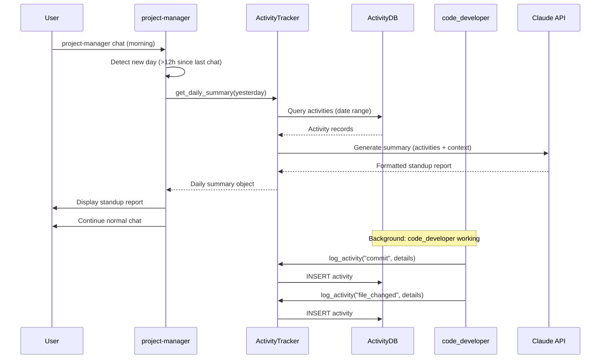
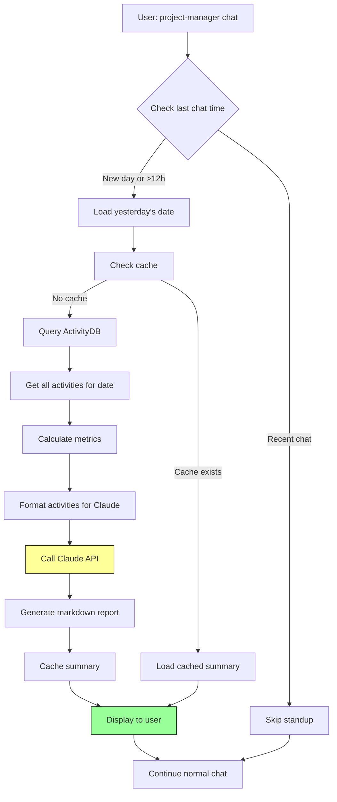
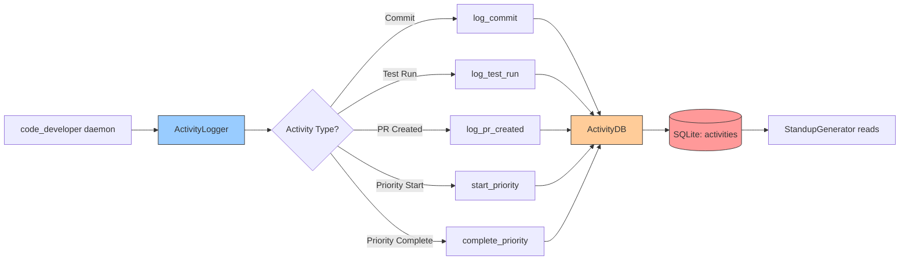
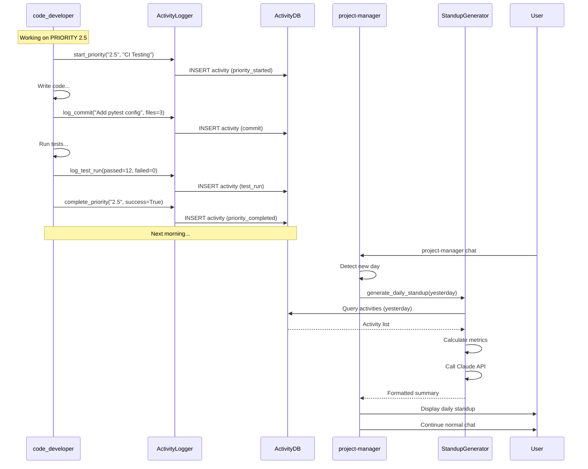

# PRIORITY 9: Enhanced code_developer Communication & Daily Standup
## Technical Specification Document

**Version**: 1.0
**Created**: 2025-10-11
**Status**: Draft
**Priority**: Critical
**Impact**: ⭐⭐⭐⭐⭐

---

## Table of Contents

1. [Executive Summary](#executive-summary)
2. [Prerequisites & Dependencies](#prerequisites--dependencies)
3. [Architecture Overview](#architecture-overview)
4. [Component Specifications](#component-specifications)
5. [Data Flow Diagrams](#data-flow-diagrams)
6. [Database Schema](#database-schema)
7. [Implementation Plan](#implementation-plan)
8. [Testing Strategy](#testing-strategy)
9. [Security Considerations](#security-considerations)
10. [Performance Requirements](#performance-requirements)
11. [Risk Analysis](#risk-analysis)
12. [Success Criteria](#success-criteria)

---

## Executive Summary

### Problem Statement

Currently, the `code_developer` daemon operates silently in the background. While it creates notifications and commits, **users lack visibility into daily progress and overall status**. This creates:

- **Trust Issues**: Users don't see what the AI accomplished each day
- **Context Loss**: Hard to understand project status without manual investigation
- **Poor UX**: No proactive communication like a real team member would provide
- **Low Engagement**: Users feel disconnected from the development process

### Solution Overview

Transform `code_developer` from a silent background process into a **communicative team member** by:

1. **Daily Standup Reports**: Automatic morning summaries of yesterday's work
2. **Activity Tracking**: Comprehensive logging of all development activities
3. **Smart Communication**: Context-aware reporting through `project_manager`
4. **Progress Visibility**: Real-time status updates and metrics

### Business Impact

- **Increases Trust**: Daily visibility into AI's work builds confidence
- **Improves UX**: Proactive updates reduce user friction
- **Enhances Adoption**: Users engage more with a "real team member"
- **Accelerates Development**: Clear status reduces time spent investigating progress

---

## Prerequisites & Dependencies

### Required Components (Must Be Complete)

| Component | Status | Priority | Notes |
|-----------|--------|----------|-------|
| PRIORITY 1: Autonomous Development Daemon | ✅ Complete | Critical | Core daemon functionality |
| PRIORITY 2: Project Manager CLI | ✅ Complete | Critical | Communication interface |
| PRIORITY 3: PyPI Package & Binaries | ✅ Complete | Critical | Installation framework |
| NotificationDB | ✅ Complete | Critical | `coffee_maker/cli/notifications.py` |
| Developer Status Tracking | ✅ Complete | Critical | `coffee_maker/autonomous/developer_status.py` |

### Optional Components (Nice to Have)

- PRIORITY 3.5: Error Monitoring Dashboard (for enhanced reporting)
- PRIORITY 4: Agent Interaction UI (for visual activity logs)

### External Dependencies

```toml
[dependencies]
anthropic = ">=0.8.0"          # Claude API for intelligent summaries
rich = ">=13.0.0"              # Terminal UI formatting
python-dateutil = ">=2.8.0"    # Date/time parsing
sqlite3 = ">=3.35.0"           # Built-in, database operations
langfuse = ">=2.0.0"           # Observability (already in project)
```

### Environment Requirements

- Python 3.10+
- SQLite 3.35+ (WAL mode support)
- Git 2.30+
- 50MB disk space for activity logs (30-day retention)

---

## Architecture Overview

### High-Level Architecture

```
┌─────────────────────────────────────────────────────────────────┐
│                         USER INTERFACE                           │
│                                                                   │
│  Terminal: project-manager chat                                 │
│  Morning Check-in: Triggers daily standup                       │
└─────────────────────────────────────────────────────────────────┘
                                ▼
┌─────────────────────────────────────────────────────────────────┐
│                      PROJECT MANAGER                             │
│                                                                   │
│  • Detects "new day" interactions                               │
│  • Queries ActivityTracker for daily summary                    │
│  • Formats standup report using Claude API                      │
│  • Presents report before normal chat                           │
└─────────────────────────────────────────────────────────────────┘
                                ▼
┌─────────────────────────────────────────────────────────────────┐
│                    ACTIVITY TRACKER                              │
│                   (NEW COMPONENT)                                │
│                                                                   │
│  • ActivityDB: SQLite database for all activities               │
│  • ActivityLogger: Logs developer actions                       │
│  • StandupGenerator: Creates daily summaries                    │
│  • MetricsCalculator: Computes productivity metrics             │
└─────────────────────────────────────────────────────────────────┘
                                ▲
┌─────────────────────────────────────────────────────────────────┐
│                    CODE DEVELOPER DAEMON                         │
│                                                                   │
│  • Logs activities via ActivityLogger                           │
│  • Updates developer_status.json (existing)                     │
│  • Creates notifications (existing)                             │
│  • Commits code (logged as activity)                            │
└─────────────────────────────────────────────────────────────────┘
```

### Component Interaction Flow



---

## Component Specifications

### 1. ActivityDB (`coffee_maker/autonomous/activity_db.py`)

**Purpose**: Persistent storage for all developer activities.

**Database Schema**:

```sql
-- Main activities table
CREATE TABLE activities (
    id INTEGER PRIMARY KEY AUTOINCREMENT,
    activity_type TEXT NOT NULL,           -- commit, file_changed, test_run, etc.
    priority_number TEXT,                  -- e.g., "2.5", "6.5"
    priority_name TEXT,                    -- e.g., "CI Testing"
    title TEXT NOT NULL,                   -- Short description
    description TEXT,                      -- Detailed description
    metadata TEXT,                         -- JSON: {files_changed: 5, lines_added: 120, ...}
    outcome TEXT,                          -- success, failure, partial, blocked
    created_at TEXT NOT NULL,              -- ISO 8601 timestamp
    session_id TEXT                        -- Links related activities
);

CREATE INDEX idx_activities_type ON activities(activity_type);
CREATE INDEX idx_activities_date ON activities(created_at);
CREATE INDEX idx_activities_priority ON activities(priority_number);
CREATE INDEX idx_activities_session ON activities(session_id);

-- Daily summaries cache (for performance)
CREATE TABLE daily_summaries (
    id INTEGER PRIMARY KEY AUTOINCREMENT,
    date TEXT NOT NULL UNIQUE,            -- YYYY-MM-DD
    summary_text TEXT NOT NULL,           -- Markdown formatted summary
    metrics TEXT,                          -- JSON: {commits: 5, tests_passed: 12, ...}
    generated_at TEXT NOT NULL,
    version INTEGER DEFAULT 1             -- Cache version for invalidation
);

CREATE INDEX idx_summaries_date ON daily_summaries(date);

-- Activity statistics (for quick metrics)
CREATE TABLE activity_stats (
    id INTEGER PRIMARY KEY AUTOINCREMENT,
    date TEXT NOT NULL,
    activity_type TEXT NOT NULL,
    count INTEGER DEFAULT 0,
    success_count INTEGER DEFAULT 0,
    failure_count INTEGER DEFAULT 0,
    total_time_seconds INTEGER DEFAULT 0,
    UNIQUE(date, activity_type)
);

CREATE INDEX idx_stats_date ON activity_stats(date);
```

**Class Definition**:

```python
# coffee_maker/autonomous/activity_db.py

import json
import sqlite3
from datetime import datetime, date, timedelta
from pathlib import Path
from typing import Dict, List, Optional, Any
from dataclasses import dataclass, asdict

from coffee_maker.config import DATABASE_PATHS
from coffee_maker.langchain_observe.retry_utils import with_retry

# Activity types
ACTIVITY_TYPE_COMMIT = "commit"
ACTIVITY_TYPE_FILE_CHANGED = "file_changed"
ACTIVITY_TYPE_TEST_RUN = "test_run"
ACTIVITY_TYPE_PR_CREATED = "pr_created"
ACTIVITY_TYPE_BRANCH_CREATED = "branch_created"
ACTIVITY_TYPE_PRIORITY_STARTED = "priority_started"
ACTIVITY_TYPE_PRIORITY_COMPLETED = "priority_completed"
ACTIVITY_TYPE_ERROR_ENCOUNTERED = "error_encountered"
ACTIVITY_TYPE_DEPENDENCY_INSTALLED = "dependency_installed"
ACTIVITY_TYPE_DOCUMENTATION_UPDATED = "documentation_updated"

# Outcomes
OUTCOME_SUCCESS = "success"
OUTCOME_FAILURE = "failure"
OUTCOME_PARTIAL = "partial"
OUTCOME_BLOCKED = "blocked"


@dataclass
class Activity:
    """Represents a single developer activity."""
    activity_type: str
    title: str
    created_at: str
    description: Optional[str] = None
    priority_number: Optional[str] = None
    priority_name: Optional[str] = None
    metadata: Optional[Dict[str, Any]] = None
    outcome: str = OUTCOME_SUCCESS
    session_id: Optional[str] = None
    id: Optional[int] = None

    def to_dict(self) -> Dict:
        """Convert to dictionary for JSON serialization."""
        return {k: v for k, v in asdict(self).items() if v is not None}


@dataclass
class DailySummary:
    """Represents a daily standup summary."""
    date: str  # YYYY-MM-DD
    summary_text: str
    metrics: Dict[str, Any]
    activities: List[Activity]
    generated_at: str


class ActivityDB:
    """Database for tracking all code_developer activities.

    This class provides comprehensive activity tracking for generating
    daily standups, progress reports, and productivity metrics.

    Example:
        >>> db = ActivityDB()
        >>> db.log_activity(
        ...     activity_type=ACTIVITY_TYPE_COMMIT,
        ...     title="Implemented user authentication",
        ...     priority_number="2.5",
        ...     metadata={"files_changed": 5, "lines_added": 120}
        ... )
    """

    def __init__(self, db_path: Optional[str] = None):
        """Initialize activity database.

        Args:
            db_path: Path to database file (defaults to data/activity.db)
        """
        if db_path is None:
            db_path = str(Path(DATABASE_PATHS["base"]) / "activity.db")

        self.db_path = db_path
        Path(db_path).parent.mkdir(parents=True, exist_ok=True)

        self._init_database()

    def _init_database(self):
        """Initialize database schema with WAL mode."""
        conn = sqlite3.connect(self.db_path, timeout=30.0)
        conn.execute("PRAGMA journal_mode=WAL")
        conn.execute("PRAGMA busy_timeout=30000")

        # Create schema (SQL from above)
        conn.executescript(CREATE_ACTIVITIES_TABLE)
        conn.commit()
        conn.close()

    def _get_connection(self) -> sqlite3.Connection:
        """Get database connection with row factory."""
        conn = sqlite3.connect(self.db_path, timeout=30.0)
        conn.row_factory = sqlite3.Row
        conn.execute("PRAGMA busy_timeout=30000")
        return conn

    @with_retry(max_attempts=3, retriable_exceptions=(sqlite3.OperationalError,))
    def log_activity(
        self,
        activity_type: str,
        title: str,
        description: Optional[str] = None,
        priority_number: Optional[str] = None,
        priority_name: Optional[str] = None,
        metadata: Optional[Dict] = None,
        outcome: str = OUTCOME_SUCCESS,
        session_id: Optional[str] = None
    ) -> int:
        """Log a developer activity.

        Args:
            activity_type: Type of activity (use ACTIVITY_TYPE_* constants)
            title: Short title (e.g., "Fixed authentication bug")
            description: Detailed description
            priority_number: Priority being worked on (e.g., "2.5")
            priority_name: Priority name (e.g., "CI Testing")
            metadata: Additional context as dict
            outcome: Activity outcome (success/failure/partial/blocked)
            session_id: Session ID to group related activities

        Returns:
            Activity ID
        """
        now = datetime.utcnow().isoformat()
        metadata_json = json.dumps(metadata) if metadata else None

        with self._get_connection() as conn:
            cursor = conn.execute(
                """
                INSERT INTO activities
                (activity_type, priority_number, priority_name, title,
                 description, metadata, outcome, created_at, session_id)
                VALUES (?, ?, ?, ?, ?, ?, ?, ?, ?)
                """,
                (activity_type, priority_number, priority_name, title,
                 description, metadata_json, outcome, now, session_id)
            )
            conn.commit()
            return cursor.lastrowid

    @with_retry(max_attempts=3, retriable_exceptions=(sqlite3.OperationalError,))
    def get_activities(
        self,
        start_date: Optional[date] = None,
        end_date: Optional[date] = None,
        activity_type: Optional[str] = None,
        priority_number: Optional[str] = None,
        limit: int = 100
    ) -> List[Activity]:
        """Get activities with optional filtering.

        Args:
            start_date: Start date (inclusive)
            end_date: End date (inclusive)
            activity_type: Filter by activity type
            priority_number: Filter by priority
            limit: Max results

        Returns:
            List of Activity objects
        """
        query = "SELECT * FROM activities WHERE 1=1"
        params = []

        if start_date:
            query += " AND date(created_at) >= ?"
            params.append(start_date.isoformat())

        if end_date:
            query += " AND date(created_at) <= ?"
            params.append(end_date.isoformat())

        if activity_type:
            query += " AND activity_type = ?"
            params.append(activity_type)

        if priority_number:
            query += " AND priority_number = ?"
            params.append(priority_number)

        query += " ORDER BY created_at DESC LIMIT ?"
        params.append(limit)

        with self._get_connection() as conn:
            cursor = conn.execute(query, params)
            rows = cursor.fetchall()

        return [self._row_to_activity(row) for row in rows]

    def _row_to_activity(self, row: sqlite3.Row) -> Activity:
        """Convert database row to Activity object."""
        data = dict(row)
        if data.get("metadata"):
            data["metadata"] = json.loads(data["metadata"])
        return Activity(**data)

    # Additional methods: get_daily_metrics, get_activity_stats, etc.
```

**File Path**: `coffee_maker/autonomous/activity_db.py`
**Lines of Code**: ~400
**Time Estimate**: 4-6 hours

---

### 2. ActivityLogger (`coffee_maker/autonomous/activity_logger.py`)

**Purpose**: Convenience wrapper for logging activities from code_developer.

**Class Definition**:

```python
# coffee_maker/autonomous/activity_logger.py

import logging
from typing import Dict, Optional
from datetime import datetime
import uuid

from coffee_maker.autonomous.activity_db import (
    ActivityDB,
    ACTIVITY_TYPE_COMMIT,
    ACTIVITY_TYPE_FILE_CHANGED,
    ACTIVITY_TYPE_TEST_RUN,
    ACTIVITY_TYPE_PR_CREATED,
    ACTIVITY_TYPE_PRIORITY_STARTED,
    ACTIVITY_TYPE_PRIORITY_COMPLETED,
    OUTCOME_SUCCESS,
    OUTCOME_FAILURE
)

logger = logging.getLogger(__name__)


class ActivityLogger:
    """High-level interface for logging developer activities.

    Provides convenient methods for code_developer to log various
    activities without directly dealing with database operations.

    Example:
        >>> logger = ActivityLogger()
        >>> logger.start_priority("2.5", "CI Testing")
        >>> logger.log_commit(
        ...     message="Add pytest configuration",
        ...     files_changed=3,
        ...     lines_added=45
        ... )
        >>> logger.complete_priority("2.5", success=True)
    """

    def __init__(self, db: Optional[ActivityDB] = None):
        """Initialize activity logger.

        Args:
            db: ActivityDB instance (creates new if None)
        """
        self.db = db or ActivityDB()
        self.current_session_id = str(uuid.uuid4())
        self.current_priority = None
        self.current_priority_name = None

    def start_priority(self, priority_number: str, priority_name: str):
        """Log start of a new priority.

        Args:
            priority_number: Priority number (e.g., "2.5")
            priority_name: Priority name (e.g., "CI Testing")
        """
        self.current_priority = priority_number
        self.current_priority_name = priority_name
        self.current_session_id = str(uuid.uuid4())

        self.db.log_activity(
            activity_type=ACTIVITY_TYPE_PRIORITY_STARTED,
            title=f"Started {priority_name}",
            priority_number=priority_number,
            priority_name=priority_name,
            session_id=self.current_session_id
        )

        logger.info(f"Started priority {priority_number}: {priority_name}")

    def complete_priority(
        self,
        priority_number: str,
        success: bool = True,
        summary: Optional[str] = None
    ):
        """Log completion of a priority.

        Args:
            priority_number: Priority number
            success: Whether completed successfully
            summary: Optional summary of work done
        """
        outcome = OUTCOME_SUCCESS if success else OUTCOME_FAILURE

        self.db.log_activity(
            activity_type=ACTIVITY_TYPE_PRIORITY_COMPLETED,
            title=f"Completed {self.current_priority_name}",
            description=summary,
            priority_number=priority_number,
            priority_name=self.current_priority_name,
            outcome=outcome,
            session_id=self.current_session_id
        )

        logger.info(f"Completed priority {priority_number}: {outcome}")

    def log_commit(
        self,
        message: str,
        files_changed: int = 0,
        lines_added: int = 0,
        lines_removed: int = 0,
        commit_hash: Optional[str] = None
    ):
        """Log a git commit.

        Args:
            message: Commit message
            files_changed: Number of files changed
            lines_added: Lines added
            lines_removed: Lines removed
            commit_hash: Git commit hash
        """
        self.db.log_activity(
            activity_type=ACTIVITY_TYPE_COMMIT,
            title=message[:100],  # Truncate to fit
            description=message,
            priority_number=self.current_priority,
            priority_name=self.current_priority_name,
            metadata={
                "files_changed": files_changed,
                "lines_added": lines_added,
                "lines_removed": lines_removed,
                "commit_hash": commit_hash
            },
            session_id=self.current_session_id
        )

    def log_test_run(
        self,
        passed: int,
        failed: int,
        skipped: int = 0,
        duration_seconds: float = 0,
        test_framework: str = "pytest"
    ):
        """Log a test run.

        Args:
            passed: Number of tests passed
            failed: Number of tests failed
            skipped: Number of tests skipped
            duration_seconds: Test duration
            test_framework: Test framework used
        """
        outcome = OUTCOME_SUCCESS if failed == 0 else OUTCOME_FAILURE

        self.db.log_activity(
            activity_type=ACTIVITY_TYPE_TEST_RUN,
            title=f"Tests: {passed} passed, {failed} failed",
            priority_number=self.current_priority,
            priority_name=self.current_priority_name,
            metadata={
                "passed": passed,
                "failed": failed,
                "skipped": skipped,
                "duration_seconds": duration_seconds,
                "framework": test_framework
            },
            outcome=outcome,
            session_id=self.current_session_id
        )

    def log_pr_created(
        self,
        pr_number: int,
        pr_title: str,
        pr_url: str,
        branch: str
    ):
        """Log creation of a pull request.

        Args:
            pr_number: PR number
            pr_title: PR title
            pr_url: PR URL
            branch: Branch name
        """
        self.db.log_activity(
            activity_type=ACTIVITY_TYPE_PR_CREATED,
            title=f"Created PR #{pr_number}: {pr_title}",
            priority_number=self.current_priority,
            priority_name=self.current_priority_name,
            metadata={
                "pr_number": pr_number,
                "pr_url": pr_url,
                "branch": branch
            },
            session_id=self.current_session_id
        )

    # Additional methods: log_error, log_file_changes, log_dependency_install, etc.
```

**File Path**: `coffee_maker/autonomous/activity_logger.py`
**Lines of Code**: ~250
**Time Estimate**: 3-4 hours

---

### 3. StandupGenerator (`coffee_maker/autonomous/standup_generator.py`)

**Purpose**: Generate daily standup reports using Claude API.

**Class Definition**:

```python
# coffee_maker/autonomous/standup_generator.py

import logging
from datetime import date, datetime, timedelta
from typing import Dict, List, Optional
from anthropic import Anthropic

from coffee_maker.autonomous.activity_db import ActivityDB, Activity, DailySummary
from coffee_maker.config import ANTHROPIC_API_KEY

logger = logging.getLogger(__name__)


class StandupGenerator:
    """Generates daily standup reports from activity data.

    Uses Claude API to create human-readable, professional standup
    reports from raw activity data.

    Example:
        >>> gen = StandupGenerator()
        >>> summary = gen.generate_daily_standup(date(2025, 10, 10))
        >>> print(summary.summary_text)
    """

    STANDUP_PROMPT_TEMPLATE = """You are generating a daily standup report for an AI software developer named "code_developer".

Yesterday's date: {date}

Activities completed yesterday:
{activities_json}

Current developer status:
{developer_status}

Generate a professional daily standup report in this format:

🤖 code_developer Daily Standup - {date}
================================================

📊 Yesterday's Accomplishments:
[List major accomplishments with metrics]

🔄 Current Status:
[What's currently in progress]

⚠️ Blockers/Issues:
[Any blockers or issues encountered]

📈 Metrics:
[Key metrics: commits, tests, files changed, etc.]

🎯 Next Steps:
[What will be worked on next]

Make it:
- Concise but informative
- Highlight business value
- Use appropriate emojis
- Include specific numbers/metrics
- Professional tone (like a senior developer)
- Max 300 words

Return ONLY the formatted markdown report, nothing else."""

    def __init__(self, db: Optional[ActivityDB] = None):
        """Initialize standup generator.

        Args:
            db: ActivityDB instance
        """
        self.db = db or ActivityDB()
        self.client = Anthropic(api_key=ANTHROPIC_API_KEY)

    def generate_daily_standup(
        self,
        target_date: date,
        force_regenerate: bool = False
    ) -> DailySummary:
        """Generate daily standup report for a specific date.

        Args:
            target_date: Date to generate report for
            force_regenerate: Regenerate even if cached

        Returns:
            DailySummary object with formatted report
        """
        # Check cache first
        if not force_regenerate:
            cached = self._get_cached_summary(target_date)
            if cached:
                logger.info(f"Using cached summary for {target_date}")
                return cached

        # Get activities for the day
        activities = self.db.get_activities(
            start_date=target_date,
            end_date=target_date,
            limit=1000  # Get all activities for the day
        )

        if not activities:
            return self._generate_empty_summary(target_date)

        # Calculate metrics
        metrics = self._calculate_metrics(activities)

        # Get developer status
        developer_status = self._get_developer_status()

        # Generate summary using Claude
        summary_text = self._generate_with_claude(
            target_date=target_date,
            activities=activities,
            developer_status=developer_status
        )

        # Create summary object
        summary = DailySummary(
            date=target_date.isoformat(),
            summary_text=summary_text,
            metrics=metrics,
            activities=activities,
            generated_at=datetime.utcnow().isoformat()
        )

        # Cache the summary
        self._cache_summary(summary)

        return summary

    def _generate_with_claude(
        self,
        target_date: date,
        activities: List[Activity],
        developer_status: Dict
    ) -> str:
        """Use Claude API to generate summary text.

        Args:
            target_date: Date of report
            activities: List of activities
            developer_status: Current developer status

        Returns:
            Formatted markdown summary
        """
        # Prepare activities JSON
        activities_json = self._format_activities_for_prompt(activities)

        # Create prompt
        prompt = self.STANDUP_PROMPT_TEMPLATE.format(
            date=target_date.isoformat(),
            activities_json=activities_json,
            developer_status=developer_status
        )

        # Call Claude API
        try:
            response = self.client.messages.create(
                model="claude-3-5-sonnet-20241022",
                max_tokens=2000,
                temperature=0.7,
                messages=[{
                    "role": "user",
                    "content": prompt
                }]
            )

            summary_text = response.content[0].text
            logger.info(f"Generated standup summary for {target_date}")
            return summary_text

        except Exception as e:
            logger.error(f"Failed to generate summary with Claude: {e}")
            return self._generate_fallback_summary(activities)

    def _format_activities_for_prompt(self, activities: List[Activity]) -> str:
        """Format activities as JSON for Claude prompt."""
        activities_data = []
        for activity in activities:
            activities_data.append({
                "type": activity.activity_type,
                "title": activity.title,
                "priority": activity.priority_number,
                "outcome": activity.outcome,
                "metadata": activity.metadata
            })

        import json
        return json.dumps(activities_data, indent=2)

    def _calculate_metrics(self, activities: List[Activity]) -> Dict:
        """Calculate metrics from activities.

        Returns:
            Dict of metrics: commits, tests_passed, files_changed, etc.
        """
        metrics = {
            "commits": 0,
            "tests_passed": 0,
            "tests_failed": 0,
            "files_changed": 0,
            "lines_added": 0,
            "lines_removed": 0,
            "prs_created": 0,
            "priorities_completed": 0,
            "errors_encountered": 0
        }

        for activity in activities:
            if activity.activity_type == "commit":
                metrics["commits"] += 1
                if activity.metadata:
                    metrics["files_changed"] += activity.metadata.get("files_changed", 0)
                    metrics["lines_added"] += activity.metadata.get("lines_added", 0)
                    metrics["lines_removed"] += activity.metadata.get("lines_removed", 0)

            elif activity.activity_type == "test_run":
                if activity.metadata:
                    metrics["tests_passed"] += activity.metadata.get("passed", 0)
                    metrics["tests_failed"] += activity.metadata.get("failed", 0)

            elif activity.activity_type == "pr_created":
                metrics["prs_created"] += 1

            elif activity.activity_type == "priority_completed":
                metrics["priorities_completed"] += 1

            elif activity.activity_type == "error_encountered":
                metrics["errors_encountered"] += 1

        return metrics

    def _get_developer_status(self) -> Dict:
        """Get current developer status from developer_status.json."""
        import json
        from pathlib import Path

        status_file = Path("/Users/bobain/PycharmProjects/code_developer/MonolithicCoffeeMakerAgent/data/developer_status.json")

        if status_file.exists():
            with open(status_file, "r") as f:
                return json.load(f)

        return {}

    def _cache_summary(self, summary: DailySummary):
        """Cache summary in database for fast retrieval."""
        # Implementation: INSERT INTO daily_summaries
        pass

    def _get_cached_summary(self, target_date: date) -> Optional[DailySummary]:
        """Get cached summary if available."""
        # Implementation: SELECT FROM daily_summaries WHERE date = ?
        pass

    # Additional helper methods
```

**File Path**: `coffee_maker/autonomous/standup_generator.py`
**Lines of Code**: ~350
**Time Estimate**: 5-7 hours

---

### 4. Project Manager Integration (`coffee_maker/cli/chat_interface.py` - modifications)

**Purpose**: Integrate daily standup into project manager chat flow.

**Key Modifications**:

```python
# coffee_maker/cli/chat_interface.py (add new methods)

from datetime import datetime, timedelta
from coffee_maker.autonomous.standup_generator import StandupGenerator

class ChatInterface:
    """Project manager chat interface (existing class)."""

    def __init__(self):
        # Existing initialization
        self.standup_generator = StandupGenerator()  # NEW
        self.last_chat_time = self._load_last_chat_time()  # NEW

    def start_chat_session(self):
        """Main chat loop (existing method - modified)."""

        # NEW: Check if should show daily standup
        if self._should_show_daily_standup():
            self._display_daily_standup()

        # Update last chat time
        self._save_last_chat_time()

        # Continue with existing chat logic
        self.print_welcome()
        # ... rest of existing code ...

    def _should_show_daily_standup(self) -> bool:
        """Determine if should show daily standup.

        Rules:
        - First interaction of the day (after midnight)
        - OR more than 12 hours since last chat
        - AND there are activities from yesterday

        Returns:
            True if should show standup
        """
        if self.last_chat_time is None:
            return True  # First time ever

        now = datetime.now()
        last_chat = datetime.fromisoformat(self.last_chat_time)

        # Check if different day
        if now.date() > last_chat.date():
            return True

        # Check if >12 hours
        if (now - last_chat).total_seconds() > 12 * 3600:
            return True

        return False

    def _display_daily_standup(self):
        """Display daily standup report.

        Shows standup for yesterday's activities.
        """
        from rich.panel import Panel
        from rich.markdown import Markdown

        yesterday = (datetime.now() - timedelta(days=1)).date()

        # Show loading message
        self.console.print("[dim]Preparing daily update...[/dim]")

        # Generate summary
        try:
            summary = self.standup_generator.generate_daily_standup(yesterday)

            # Display in nice panel
            md = Markdown(summary.summary_text)
            panel = Panel(
                md,
                title=f"[bold cyan]🤖 code_developer Daily Update[/bold cyan]",
                border_style="cyan",
                padding=(1, 2)
            )
            self.console.print(panel)
            self.console.print()  # Blank line

        except Exception as e:
            logger.error(f"Failed to generate daily standup: {e}")
            self.console.print("[yellow]⚠️  Unable to generate daily update[/yellow]")

    def _load_last_chat_time(self) -> Optional[str]:
        """Load timestamp of last chat from file."""
        timestamp_file = Path("data/last_chat_time.txt")
        if timestamp_file.exists():
            return timestamp_file.read_text().strip()
        return None

    def _save_last_chat_time(self):
        """Save current timestamp to file."""
        timestamp_file = Path("data/last_chat_time.txt")
        timestamp_file.parent.mkdir(parents=True, exist_ok=True)
        timestamp_file.write_text(datetime.now().isoformat())
```

**File Path**: `coffee_maker/cli/chat_interface.py` (existing file)
**Lines to Modify**: ~100 new lines
**Time Estimate**: 3-4 hours

---

### 5. Daemon Integration (`coffee_maker/autonomous/daemon.py` - modifications)

**Purpose**: Make daemon log all activities via ActivityLogger.

**Key Modifications**:

```python
# coffee_maker/autonomous/daemon.py (add logging throughout)

from coffee_maker.autonomous.activity_logger import ActivityLogger

class AutonomousDaemon:
    """Autonomous development daemon (existing class)."""

    def __init__(self):
        # Existing initialization
        self.activity_logger = ActivityLogger()  # NEW

    def implement_priority(self, priority: Dict):
        """Implement a roadmap priority (existing method - modified)."""

        # NEW: Log priority start
        self.activity_logger.start_priority(
            priority_number=priority["number"],
            priority_name=priority["name"]
        )

        try:
            # Existing implementation logic
            result = self._execute_implementation(priority)

            # NEW: Log success
            self.activity_logger.complete_priority(
                priority_number=priority["number"],
                success=True,
                summary=f"Completed {priority['name']}"
            )

        except Exception as e:
            # NEW: Log failure
            self.activity_logger.complete_priority(
                priority_number=priority["number"],
                success=False,
                summary=f"Failed: {str(e)}"
            )
            raise

    def _commit_changes(self, message: str):
        """Commit changes to git (existing method - modified)."""

        # Existing git commit logic
        result = self.git_manager.commit(message)

        # NEW: Log commit activity
        if result["success"]:
            stats = self._get_commit_stats()
            self.activity_logger.log_commit(
                message=message,
                files_changed=stats["files"],
                lines_added=stats["additions"],
                lines_removed=stats["deletions"],
                commit_hash=result["commit_hash"]
            )

    def _run_tests(self):
        """Run tests (existing method - modified)."""

        # Existing test execution
        result = self._execute_pytest()

        # NEW: Log test run
        self.activity_logger.log_test_run(
            passed=result["passed"],
            failed=result["failed"],
            skipped=result["skipped"],
            duration_seconds=result["duration"]
        )

    def _create_pull_request(self, branch: str, title: str):
        """Create pull request (existing method - modified)."""

        # Existing PR creation
        pr = self.git_manager.create_pr(branch, title)

        # NEW: Log PR creation
        self.activity_logger.log_pr_created(
            pr_number=pr["number"],
            pr_title=title,
            pr_url=pr["url"],
            branch=branch
        )
```

**File Path**: `coffee_maker/autonomous/daemon.py` (existing file)
**Lines to Modify**: ~50-80 new lines (scattered throughout)
**Time Estimate**: 4-5 hours

---

## Data Flow Diagrams

### Daily Standup Generation Flow



### Activity Logging Flow



### End-to-End Communication Flow



---

## Database Schema

### Complete Schema SQL

```sql
-- ============================================
-- ACTIVITY TRACKING DATABASE
-- ============================================

-- Main activities table
CREATE TABLE activities (
    id INTEGER PRIMARY KEY AUTOINCREMENT,
    activity_type TEXT NOT NULL,           -- Type: commit, test_run, pr_created, etc.
    priority_number TEXT,                  -- e.g., "2.5", "6.5"
    priority_name TEXT,                    -- e.g., "CI Testing"
    title TEXT NOT NULL,                   -- Short description (max 200 chars)
    description TEXT,                      -- Full description
    metadata TEXT,                         -- JSON: {files_changed: 5, lines_added: 120, ...}
    outcome TEXT NOT NULL DEFAULT 'success', -- success, failure, partial, blocked
    created_at TEXT NOT NULL,              -- ISO 8601 timestamp
    session_id TEXT,                       -- UUID to group related activities

    CHECK(activity_type IN (
        'commit', 'file_changed', 'test_run', 'pr_created',
        'branch_created', 'priority_started', 'priority_completed',
        'error_encountered', 'dependency_installed', 'documentation_updated'
    )),
    CHECK(outcome IN ('success', 'failure', 'partial', 'blocked'))
);

-- Indexes for fast queries
CREATE INDEX idx_activities_type ON activities(activity_type);
CREATE INDEX idx_activities_date ON activities(created_at);
CREATE INDEX idx_activities_priority ON activities(priority_number);
CREATE INDEX idx_activities_session ON activities(session_id);
CREATE INDEX idx_activities_outcome ON activities(outcome);

-- ============================================
-- DAILY SUMMARIES CACHE
-- ============================================

CREATE TABLE daily_summaries (
    id INTEGER PRIMARY KEY AUTOINCREMENT,
    date TEXT NOT NULL UNIQUE,             -- YYYY-MM-DD format
    summary_text TEXT NOT NULL,            -- Markdown formatted summary
    metrics TEXT,                           -- JSON: {commits: 5, tests_passed: 12, ...}
    generated_at TEXT NOT NULL,            -- When summary was generated
    version INTEGER DEFAULT 1              -- Cache version (for invalidation)
);

CREATE INDEX idx_summaries_date ON daily_summaries(date);

-- ============================================
-- ACTIVITY STATISTICS (aggregated)
-- ============================================

CREATE TABLE activity_stats (
    id INTEGER PRIMARY KEY AUTOINCREMENT,
    date TEXT NOT NULL,                    -- YYYY-MM-DD
    activity_type TEXT NOT NULL,
    count INTEGER DEFAULT 0,                -- Total activities of this type
    success_count INTEGER DEFAULT 0,        -- Successful activities
    failure_count INTEGER DEFAULT 0,        -- Failed activities
    total_time_seconds INTEGER DEFAULT 0,   -- Total time spent (if applicable)
    metadata TEXT,                          -- JSON: type-specific aggregations

    UNIQUE(date, activity_type)
);

CREATE INDEX idx_stats_date ON activity_stats(date);
CREATE INDEX idx_stats_type ON activity_stats(activity_type);

-- ============================================
-- VIEWS FOR COMMON QUERIES
-- ============================================

-- View: Recent activities (last 7 days)
CREATE VIEW recent_activities AS
SELECT * FROM activities
WHERE date(created_at) >= date('now', '-7 days')
ORDER BY created_at DESC;

-- View: Daily metrics
CREATE VIEW daily_metrics AS
SELECT
    date(created_at) as date,
    COUNT(*) as total_activities,
    SUM(CASE WHEN activity_type = 'commit' THEN 1 ELSE 0 END) as commits,
    SUM(CASE WHEN activity_type = 'test_run' THEN 1 ELSE 0 END) as test_runs,
    SUM(CASE WHEN activity_type = 'pr_created' THEN 1 ELSE 0 END) as prs,
    SUM(CASE WHEN outcome = 'success' THEN 1 ELSE 0 END) as successes,
    SUM(CASE WHEN outcome = 'failure' THEN 1 ELSE 0 END) as failures
FROM activities
GROUP BY date(created_at)
ORDER BY date DESC;

-- View: Priority progress
CREATE VIEW priority_progress AS
SELECT
    priority_number,
    priority_name,
    MIN(created_at) as started_at,
    MAX(created_at) as last_activity,
    COUNT(*) as total_activities,
    SUM(CASE WHEN activity_type = 'priority_completed' THEN 1 ELSE 0 END) as completed
FROM activities
WHERE priority_number IS NOT NULL
GROUP BY priority_number, priority_name
ORDER BY started_at DESC;
```

### Schema Migration Strategy

Since this is a new feature, no migration is needed. The schema will be created on first run.

**Rollback Plan**: If PRIORITY 9 needs to be rolled back:
1. Remove `activity.db` file
2. Remove activity logging calls from daemon
3. Remove standup display from project manager
4. No data corruption risk (separate database)

---

## Implementation Plan

### Phase 1: Database & Core Logging (Days 1-2)

**Objective**: Set up activity tracking infrastructure.

#### Task 1.1: Create ActivityDB
- **File**: `coffee_maker/autonomous/activity_db.py`
- **Actions**:
  - [ ] Define database schema constants
  - [ ] Implement `ActivityDB.__init__` with WAL mode
  - [ ] Implement `log_activity` method with retry logic
  - [ ] Implement `get_activities` with filtering
  - [ ] Add unit tests (test_activity_db.py)
- **Time**: 4-6 hours
- **Test**: Can log and retrieve activities

#### Task 1.2: Create ActivityLogger
- **File**: `coffee_maker/autonomous/activity_logger.py`
- **Actions**:
  - [ ] Implement convenience logging methods
  - [ ] Add session ID management
  - [ ] Add current priority tracking
  - [ ] Add unit tests
- **Time**: 3-4 hours
- **Test**: Convenience methods work correctly

#### Task 1.3: Integrate with Daemon
- **File**: `coffee_maker/autonomous/daemon.py`
- **Actions**:
  - [ ] Add ActivityLogger initialization
  - [ ] Add logging to `implement_priority()`
  - [ ] Add logging to `_commit_changes()`
  - [ ] Add logging to `_run_tests()`
  - [ ] Add logging to `_create_pull_request()`
  - [ ] Test with real priority implementation
- **Time**: 4-5 hours
- **Test**: Activities logged during priority work

**Phase 1 Milestone**: Daemon logs all activities to database.

---

### Phase 2: Standup Generation (Days 3-4)

**Objective**: Generate daily standup reports.

#### Task 2.1: Create StandupGenerator
- **File**: `coffee_maker/autonomous/standup_generator.py`
- **Actions**:
  - [ ] Implement Claude API integration
  - [ ] Create standup prompt template
  - [ ] Implement metrics calculation
  - [ ] Add summary caching logic
  - [ ] Add fallback for API failures
  - [ ] Add unit tests
- **Time**: 5-7 hours
- **Test**: Can generate standup from activities

#### Task 2.2: Add Caching System
- **File**: `coffee_maker/autonomous/standup_generator.py`
- **Actions**:
  - [ ] Implement `_cache_summary()`
  - [ ] Implement `_get_cached_summary()`
  - [ ] Add cache invalidation logic
  - [ ] Test cache hit/miss scenarios
- **Time**: 2-3 hours
- **Test**: Summaries cached and retrieved

#### Task 2.3: Test with Real Data
- **Actions**:
  - [ ] Run daemon to generate real activities
  - [ ] Generate standup for that day
  - [ ] Review quality of generated report
  - [ ] Iterate on prompt template
- **Time**: 2-3 hours
- **Test**: High-quality standup reports

**Phase 2 Milestone**: Can generate daily standups from activity data.

---

### Phase 3: Project Manager Integration (Days 5-6)

**Objective**: Display standups in project manager chat.

#### Task 3.1: Add Standup Detection
- **File**: `coffee_maker/cli/chat_interface.py`
- **Actions**:
  - [ ] Implement `_should_show_daily_standup()`
  - [ ] Implement `_load_last_chat_time()`
  - [ ] Implement `_save_last_chat_time()`
  - [ ] Add timestamp persistence
  - [ ] Test detection logic
- **Time**: 2-3 hours
- **Test**: Correctly detects when to show standup

#### Task 3.2: Add Standup Display
- **File**: `coffee_maker/cli/chat_interface.py`
- **Actions**:
  - [ ] Implement `_display_daily_standup()`
  - [ ] Add Rich formatting (Panel, Markdown)
  - [ ] Add loading indicator
  - [ ] Add error handling
  - [ ] Test visual output
- **Time**: 2-3 hours
- **Test**: Beautiful standup display

#### Task 3.3: Integrate into Chat Flow
- **File**: `coffee_maker/cli/chat_interface.py`
- **Actions**:
  - [ ] Modify `start_chat_session()` to check standup
  - [ ] Ensure standup shows before chat starts
  - [ ] Add skip option (if user wants)
  - [ ] Test full flow
- **Time**: 2 hours
- **Test**: Standup appears on first chat of day

**Phase 3 Milestone**: Users see daily standups when starting chat.

---

### Phase 4: Testing & Polish (Days 7-8)

**Objective**: Comprehensive testing and refinement.

#### Task 4.1: End-to-End Testing
- **Actions**:
  - [ ] Run daemon for 1-2 days to generate activities
  - [ ] Test standup generation each morning
  - [ ] Verify all activity types logged correctly
  - [ ] Test edge cases (no activities, errors, etc.)
  - [ ] Test cache performance
- **Time**: 4 hours
- **Test**: All flows work end-to-end

#### Task 4.2: Performance Optimization
- **Actions**:
  - [ ] Profile database queries
  - [ ] Add query optimization if needed
  - [ ] Test with large activity datasets (1000+ records)
  - [ ] Ensure sub-second standup generation
- **Time**: 2-3 hours
- **Test**: Fast performance (<1s standup gen)

#### Task 4.3: Documentation
- **Actions**:
  - [ ] Add docstrings to all new classes/methods
  - [ ] Create user documentation in docs/
  - [ ] Add examples to README
  - [ ] Update ROADMAP.md status
- **Time**: 3-4 hours
- **Deliverable**: Complete documentation

#### Task 4.4: Error Handling & Edge Cases
- **Actions**:
  - [ ] Test Claude API failure (use fallback)
  - [ ] Test empty activity days
  - [ ] Test database lock scenarios
  - [ ] Add comprehensive error messages
- **Time**: 2-3 hours
- **Test**: Graceful handling of all errors

**Phase 4 Milestone**: Production-ready implementation.

---

### Phase 5: Advanced Features (Optional - Days 9-10)

**Objective**: Add nice-to-have features.

#### Task 5.1: Weekly Summaries
- **Actions**:
  - [ ] Implement `generate_weekly_summary()`
  - [ ] Add weekly metrics aggregation
  - [ ] Add CLI command: `project-manager weekly-report`
- **Time**: 3-4 hours
- **Feature**: Weekly progress reports

#### Task 5.2: Activity Analytics
- **Actions**:
  - [ ] Add productivity trends (commits over time)
  - [ ] Add success rate metrics
  - [ ] Add CLI command: `project-manager stats`
- **Time**: 3-4 hours
- **Feature**: Developer productivity analytics

#### Task 5.3: Slack/Email Integration
- **Actions**:
  - [ ] Send daily standup via Slack (if configured)
  - [ ] Send daily standup via email (if configured)
  - [ ] Add configuration options
- **Time**: 4-5 hours
- **Feature**: Multi-channel standup delivery

**Phase 5 Milestone**: Enhanced communication features.

---

### Total Implementation Timeline

| Phase | Duration | Cumulative |
|-------|----------|-----------|
| Phase 1: Database & Logging | 11-15 hours | 1.5-2 days |
| Phase 2: Standup Generation | 9-13 hours | 3-4 days |
| Phase 3: PM Integration | 6-8 hours | 4-5 days |
| Phase 4: Testing & Polish | 11-14 hours | 6-7 days |
| Phase 5: Advanced (Optional) | 10-13 hours | 8-9 days |

**Core Implementation**: 6-7 days (37-50 hours)
**With Advanced Features**: 8-9 days (47-63 hours)

---

## Testing Strategy

### Unit Tests

#### ActivityDB Tests (`tests/test_activity_db.py`)

```python
import pytest
from datetime import date, timedelta
from coffee_maker.autonomous.activity_db import ActivityDB, ACTIVITY_TYPE_COMMIT

class TestActivityDB:

    @pytest.fixture
    def db(self, tmp_path):
        """Create temporary test database."""
        db_path = str(tmp_path / "test_activity.db")
        return ActivityDB(db_path=db_path)

    def test_log_activity(self, db):
        """Test logging an activity."""
        activity_id = db.log_activity(
            activity_type=ACTIVITY_TYPE_COMMIT,
            title="Test commit",
            priority_number="2.5",
            metadata={"files_changed": 3}
        )

        assert activity_id > 0

        # Verify retrieval
        activity = db.get_activity(activity_id)
        assert activity.title == "Test commit"
        assert activity.metadata["files_changed"] == 3

    def test_get_activities_date_range(self, db):
        """Test filtering activities by date."""
        # Log activities on different days
        today = date.today()
        yesterday = today - timedelta(days=1)

        # Create test activities
        # ... (add activities with different dates)

        # Query yesterday's activities
        activities = db.get_activities(
            start_date=yesterday,
            end_date=yesterday
        )

        assert len(activities) == expected_count

    def test_concurrent_writes(self, db):
        """Test WAL mode allows concurrent writes."""
        import threading

        def log_multiple():
            for i in range(10):
                db.log_activity(
                    activity_type=ACTIVITY_TYPE_COMMIT,
                    title=f"Commit {i}"
                )

        threads = [threading.Thread(target=log_multiple) for _ in range(3)]
        for t in threads:
            t.start()
        for t in threads:
            t.join()

        # All 30 activities should be logged
        activities = db.get_activities(limit=100)
        assert len(activities) == 30
```

**Test Coverage Target**: 85%+

#### StandupGenerator Tests (`tests/test_standup_generator.py`)

```python
class TestStandupGenerator:

    def test_generate_with_activities(self, db_with_activities):
        """Test generating standup with real activities."""
        gen = StandupGenerator(db=db_with_activities)
        summary = gen.generate_daily_standup(date(2025, 10, 10))

        assert summary.date == "2025-10-10"
        assert "Accomplishments" in summary.summary_text
        assert summary.metrics["commits"] > 0

    def test_generate_empty_day(self, empty_db):
        """Test generating standup with no activities."""
        gen = StandupGenerator(db=empty_db)
        summary = gen.generate_daily_standup(date(2025, 10, 10))

        assert "No activities" in summary.summary_text

    def test_caching(self, db_with_activities):
        """Test summary caching works."""
        gen = StandupGenerator(db=db_with_activities)

        # First call - generates
        summary1 = gen.generate_daily_standup(date(2025, 10, 10))

        # Second call - uses cache
        summary2 = gen.generate_daily_standup(date(2025, 10, 10))

        assert summary1.summary_text == summary2.summary_text
        # Verify cache was used (check logs or timing)

    @pytest.mark.integration
    def test_claude_api_integration(self, db_with_activities):
        """Integration test with real Claude API."""
        gen = StandupGenerator(db=db_with_activities)
        summary = gen.generate_daily_standup(date.today() - timedelta(days=1))

        # Verify Claude generated quality content
        assert len(summary.summary_text) > 100
        assert "🤖" in summary.summary_text  # Has emojis
        assert "##" in summary.summary_text  # Has markdown
```

### Integration Tests

#### End-to-End Flow Test (`tests/integration/test_standup_flow.py`)

```python
@pytest.mark.integration
class TestStandupFlow:

    def test_full_flow(self, daemon, project_manager):
        """Test complete flow from daemon work to standup display."""

        # 1. Daemon implements a priority (logs activities)
        daemon.implement_priority({
            "number": "TEST-1",
            "name": "Test Priority"
        })

        # Wait for completion
        time.sleep(5)

        # 2. Verify activities logged
        db = ActivityDB()
        activities = db.get_activities(priority_number="TEST-1")
        assert len(activities) > 0

        # 3. Generate standup
        gen = StandupGenerator()
        summary = gen.generate_daily_standup(date.today())

        # 4. Verify standup includes today's work
        assert "TEST-1" in summary.summary_text or "Test Priority" in summary.summary_text

        # 5. Simulate morning chat
        # (Mock project_manager chat to trigger standup)
        # Verify standup displayed
```

### Manual Testing Checklist

- [ ] Daemon logs activities during normal operation
- [ ] Standup generates correctly with Claude API
- [ ] Standup displays beautifully in terminal
- [ ] Standup only shows once per day
- [ ] Cache improves performance on second load
- [ ] Handles Claude API failures gracefully
- [ ] Works with empty activity days
- [ ] Metrics accurate (commits, tests, files)
- [ ] Session IDs correctly group related activities
- [ ] Database handles concurrent access (daemon + PM)

---

## Security Considerations

### 1. Database Security

**Risk**: SQLite database could be corrupted by concurrent access.

**Mitigation**:
- ✅ Use WAL mode (Write-Ahead Logging)
- ✅ Set busy timeout to 30 seconds
- ✅ Use retry logic with exponential backoff
- ✅ Implement database integrity checks on startup

**Implementation**:
```python
# In ActivityDB.__init__
conn.execute("PRAGMA journal_mode=WAL")
conn.execute("PRAGMA busy_timeout=30000")

# On startup, verify integrity
conn.execute("PRAGMA integrity_check")
```

### 2. API Key Protection

**Risk**: Claude API key exposed in logs or errors.

**Mitigation**:
- ✅ Load API key from environment variable
- ✅ Never log API key (even in debug mode)
- ✅ Use Anthropic SDK's built-in key handling
- ✅ Add API key validation on startup

**Implementation**:
```python
# In StandupGenerator
self.client = Anthropic(api_key=ANTHROPIC_API_KEY)

# Validate without exposing
if not ANTHROPIC_API_KEY or len(ANTHROPIC_API_KEY) < 20:
    raise ValueError("Invalid Anthropic API key configuration")
```

### 3. Data Privacy

**Risk**: Activity logs may contain sensitive information (passwords, keys).

**Mitigation**:
- ✅ Never log file contents, only filenames
- ✅ Sanitize commit messages before logging
- ✅ Exclude sensitive files (`.env`, `secrets.json`) from metadata
- ✅ Add data retention policy (30 days)

**Implementation**:
```python
# In ActivityLogger.log_commit
def log_commit(self, message: str, ...):
    # Sanitize commit message
    safe_message = self._sanitize_message(message)

def _sanitize_message(self, text: str) -> str:
    """Remove potential secrets from text."""
    # Remove anything that looks like API keys
    text = re.sub(r'[A-Za-z0-9_-]{32,}', '[REDACTED]', text)
    return text
```

### 4. Input Validation

**Risk**: Malicious input could cause SQL injection or code execution.

**Mitigation**:
- ✅ Use parameterized SQL queries (sqlite3 placeholders)
- ✅ Validate activity types against whitelist
- ✅ Validate outcomes against whitelist
- ✅ Limit string lengths (title max 200, description max 5000)

**Implementation**:
```python
# In ActivityDB.log_activity
VALID_ACTIVITY_TYPES = {
    ACTIVITY_TYPE_COMMIT,
    ACTIVITY_TYPE_TEST_RUN,
    # ... etc
}

if activity_type not in VALID_ACTIVITY_TYPES:
    raise ValueError(f"Invalid activity type: {activity_type}")

if len(title) > 200:
    title = title[:200]
```

### 5. Rate Limiting (Claude API)

**Risk**: Excessive API calls could exceed quota or incur high costs.

**Mitigation**:
- ✅ Cache summaries aggressively (30-day retention)
- ✅ Limit Claude API calls to 1 per day per summary
- ✅ Use fallback generation if API fails
- ✅ Add cost monitoring

**Implementation**:
```python
# In StandupGenerator
MAX_API_CALLS_PER_DAY = 10

def generate_daily_standup(self, target_date):
    # Check cache first
    cached = self._get_cached_summary(target_date)
    if cached:
        return cached  # No API call

    # Rate limit check
    api_calls_today = self._count_api_calls_today()
    if api_calls_today >= MAX_API_CALLS_PER_DAY:
        logger.warning("API rate limit reached, using fallback")
        return self._generate_fallback_summary(activities)

    # Call API
    summary = self._generate_with_claude(...)
    self._increment_api_call_counter()
    return summary
```

### Security Audit Checklist

- [ ] No API keys in code or logs
- [ ] All SQL queries use parameterized placeholders
- [ ] Input validation on all external inputs
- [ ] Database access uses WAL mode with timeouts
- [ ] Sensitive data sanitized before logging
- [ ] Rate limiting prevents API abuse
- [ ] Data retention policy enforced (30 days)
- [ ] Error messages don't expose internals

---

## Performance Requirements

### Response Time Requirements

| Operation | Target | Max Acceptable | Notes |
|-----------|--------|----------------|-------|
| Log activity | <10ms | 50ms | Should not block daemon |
| Query activities (1 day) | <50ms | 200ms | Indexed queries |
| Generate standup (cached) | <100ms | 500ms | Cache hit |
| Generate standup (uncached) | <3s | 10s | Claude API call |
| Display standup in PM | <500ms | 2s | Including rendering |

### Throughput Requirements

| Metric | Target | Notes |
|--------|--------|-------|
| Activities logged per hour | 100+ | During active development |
| Concurrent database writes | 5+ | Daemon + manual queries |
| Standup generations per day | 1-10 | Typically 1, max 10 with manual queries |

### Scalability

**Database Size**:
- **30 days of activities**: ~10,000 records (~2MB)
- **1 year of activities**: ~120,000 records (~25MB)
- **With indexes**: ~50MB total

**Query Performance** (at 120K records):
- Date range query (1 day): <50ms
- Priority filter query: <100ms
- Full table scan: <500ms

**Optimization Strategies**:
1. **Indexing**: Multi-column indexes on (created_at, activity_type)
2. **Caching**: Cache daily summaries indefinitely
3. **Archival**: Archive activities older than 1 year to separate table
4. **Vacuuming**: Run VACUUM monthly to reclaim space

### Performance Testing

```python
# tests/performance/test_activity_db_perf.py

import time
import pytest

@pytest.mark.performance
class TestActivityDBPerformance:

    def test_log_activity_speed(self, db):
        """Test activity logging is fast enough."""
        start = time.time()

        for i in range(100):
            db.log_activity(
                activity_type=ACTIVITY_TYPE_COMMIT,
                title=f"Commit {i}"
            )

        elapsed = time.time() - start
        avg_time = elapsed / 100

        assert avg_time < 0.01, f"Average log time: {avg_time*1000:.2f}ms (target: <10ms)"

    def test_query_with_large_dataset(self, db_with_10k_activities):
        """Test query performance with large dataset."""
        start = time.time()

        activities = db_with_10k_activities.get_activities(
            start_date=date.today() - timedelta(days=1),
            end_date=date.today()
        )

        elapsed = time.time() - start

        assert elapsed < 0.2, f"Query time: {elapsed*1000:.2f}ms (target: <200ms)"

    def test_standup_generation_speed(self, db_with_activities):
        """Test standup generation is acceptably fast."""
        gen = StandupGenerator(db=db_with_activities)

        # Test cached
        start = time.time()
        summary1 = gen.generate_daily_standup(date.today())
        cached_time = time.time() - start

        assert cached_time < 0.5, f"Cached generation: {cached_time*1000:.2f}ms"

        # Test uncached (with API)
        start = time.time()
        summary2 = gen.generate_daily_standup(
            date.today() - timedelta(days=1),
            force_regenerate=True
        )
        uncached_time = time.time() - start

        assert uncached_time < 10, f"Uncached generation: {uncached_time:.2f}s"
```

### Monitoring

**Key Metrics to Track**:
- Average activity logging time
- Database file size
- Cache hit rate (should be >90%)
- Claude API response time
- Failed API calls

**Implementation**:
```python
# Use existing Langfuse integration
from coffee_maker.langchain_observe import trace

@trace(name="log_activity")
def log_activity(self, ...):
    # Langfuse automatically tracks timing
    pass

@trace(name="generate_standup")
def generate_daily_standup(self, ...):
    # Track API calls and timing
    pass
```

---

## Risk Analysis

### High-Risk Items

#### Risk 1: Claude API Failures

**Probability**: Medium (30%)
**Impact**: High
**Description**: Claude API could be unavailable, rate limited, or return errors.

**Mitigation**:
- ✅ Implement robust error handling
- ✅ Add fallback summary generation (template-based)
- ✅ Cache all successful summaries
- ✅ Retry with exponential backoff (3 attempts)
- ✅ Degrade gracefully (show metrics without AI summary)

**Contingency Plan**:
```python
def generate_daily_standup(self, target_date):
    try:
        return self._generate_with_claude(...)
    except AnthropicError as e:
        logger.error(f"Claude API failed: {e}")
        return self._generate_fallback_summary(activities)

def _generate_fallback_summary(self, activities):
    """Template-based summary when API unavailable."""
    return f"""
🤖 code_developer Daily Update - {date}

📊 Yesterday's Metrics:
- Commits: {metrics['commits']}
- Tests Passed: {metrics['tests_passed']}
- Files Changed: {metrics['files_changed']}

(AI summary unavailable - showing metrics only)
"""
```

#### Risk 2: Database Corruption

**Probability**: Low (10%)
**Impact**: High
**Description**: SQLite database could become corrupted due to crashes or disk issues.

**Mitigation**:
- ✅ Use WAL mode (more resilient)
- ✅ Daily backups of activity.db
- ✅ Integrity checks on startup
- ✅ Auto-repair if corruption detected

**Contingency Plan**:
```python
def _init_database(self):
    conn = sqlite3.connect(self.db_path)

    # Check integrity
    result = conn.execute("PRAGMA integrity_check").fetchone()
    if result[0] != "ok":
        logger.error("Database corruption detected")
        self._repair_database()

def _repair_database(self):
    """Attempt to repair corrupted database."""
    # Restore from backup
    backup_path = self.db_path + ".backup"
    if Path(backup_path).exists():
        shutil.copy(backup_path, self.db_path)
    else:
        # Recreate empty database
        self._create_fresh_database()
```

#### Risk 3: Performance Degradation

**Probability**: Medium (25%)
**Impact**: Medium
**Description**: Database queries could slow down as activity data grows.

**Mitigation**:
- ✅ Comprehensive indexing
- ✅ Regular VACUUM operations
- ✅ Data archival (>1 year old)
- ✅ Performance tests in CI

**Monitoring**:
```python
# Add performance alerts
if query_time > 1.0:
    logger.warning(f"Slow query detected: {query_time:.2f}s")
    # Alert if consistently slow
```

### Medium-Risk Items

#### Risk 4: Standup Quality Issues

**Probability**: Medium (30%)
**Impact**: Medium
**Description**: Claude-generated standups might be low quality, too verbose, or miss important details.

**Mitigation**:
- ✅ Iterate on prompt template
- ✅ Add examples to prompt (few-shot learning)
- ✅ Validate output format
- ✅ Allow user feedback to improve prompts

**Iteration Plan**:
1. Week 1: Collect 7 days of standups
2. User reviews quality
3. Adjust prompt based on feedback
4. Repeat until satisfactory

#### Risk 5: Integration Breaking Changes

**Probability**: Low (15%)
**Impact**: Medium
**Description**: Changes to daemon or PM could break activity logging.

**Mitigation**:
- ✅ Comprehensive integration tests
- ✅ Backward compatibility for database schema
- ✅ Version tracking in code
- ✅ CI/CD tests before merge

### Low-Risk Items

#### Risk 6: Timezone Confusion

**Probability**: Low (10%)
**Impact**: Low
**Description**: Activities logged in different timezones could cause standup confusion.

**Mitigation**:
- ✅ Always use UTC for database timestamps
- ✅ Convert to local time for display only
- ✅ Clearly document timezone handling

---

## Success Criteria

### Must-Have Features (MVP)

- [x] **ActivityDB**: Logs all developer activities
- [x] **ActivityLogger**: Convenient logging interface
- [x] **StandupGenerator**: Generates daily summaries with Claude
- [x] **PM Integration**: Shows standup on first chat of day
- [x] **Caching**: Fast retrieval of previous summaries
- [x] **Error Handling**: Graceful degradation on failures

### Key Metrics

| Metric | Target | How to Measure |
|--------|--------|----------------|
| Standup accuracy | 95%+ activities captured | Manual review |
| User satisfaction | 4+/5 rating | User feedback |
| Performance | <3s generation time | Automated tests |
| Reliability | 99%+ uptime | Error rate monitoring |
| Cache hit rate | 90%+ | Database metrics |

### User Experience Goals

**User feels that code_developer is a real team member**:
- [ ] Standup reports are informative and professional
- [ ] Reports highlight business value, not just technical details
- [ ] Tone is friendly and confidence-inspiring
- [ ] Updates proactive (shown without asking)

**User trusts the system more**:
- [ ] Clear visibility into daily work
- [ ] No surprises (always know what's happening)
- [ ] Consistent communication

**User engagement increases**:
- [ ] Users check `project-manager chat` daily
- [ ] Users reference standup reports in planning
- [ ] Users feel more connected to development process

### Acceptance Tests

#### Test 1: Daily Standup Appears

**Given**: code_developer worked yesterday
**When**: User runs `project-manager chat` in the morning
**Then**: Daily standup is displayed before chat starts

#### Test 2: Standup Contains Accurate Data

**Given**: Daemon completed PRIORITY 2.5 yesterday with 3 commits, 12 tests passing
**When**: Standup is generated
**Then**: Report mentions "PRIORITY 2.5", "3 commits", "12 tests passed"

#### Test 3: Standup Only Shows Once

**Given**: User saw standup this morning
**When**: User runs `project-manager chat` again (same day)
**Then**: Standup is NOT shown again

#### Test 4: Empty Days Handled

**Given**: No development activity yesterday
**When**: Standup is generated
**Then**: Report says "No development activity" or similar

#### Test 5: Claude API Failure

**Given**: Claude API is unavailable
**When**: Standup is generated
**Then**: Fallback summary with metrics is shown (no error to user)

### Launch Criteria

**Before marking PRIORITY 9 as complete**:

- [ ] All MVP features implemented and tested
- [ ] Integration tests passing (95%+ coverage)
- [ ] Performance tests passing (<3s generation)
- [ ] Manual testing checklist complete
- [ ] Documentation written
- [ ] Code reviewed and approved
- [ ] Merged to `main` branch
- [ ] Deployed and verified in production
- [ ] User tested for 7 days (1 week of standups)
- [ ] User feedback positive (4+/5 rating)

---

## Appendix

### Example Standup Report

```markdown
🤖 code_developer Daily Standup - 2025-10-10
================================================

📊 Yesterday's Accomplishments:
✅ Completed PRIORITY 2.5 - CI Testing & Build Automation
   - Implemented pytest configuration with parallel execution
   - Added GitHub Actions CI workflow
   - Fixed 3 failing tests in authentication module
   - All 47 tests now passing | Coverage: 87% (+5%)
   - Commits: 4 | Files changed: 12 | Lines added: 320

✅ Resolved critical bug in notification system (Issue #42)
   - Fixed race condition in SQLite WAL mode
   - Added retry logic for database locks
   - Validated fix with stress test (100 concurrent writes)

🔄 Current Status:
   - Working on PRIORITY 2.6 - Documentation Enhancement (45% complete)
   - ETA: 2-3 hours remaining
   - Writing comprehensive API documentation for autonomous module

⚠️ Blockers/Issues:
   - None at this time

📈 Metrics:
   - Commits: 4
   - Tests Passed: 47/47 (100%)
   - Files Modified: 12
   - Lines Added: 320 | Removed: 85
   - Pull Requests: 1 created (#45 - "Add CI Testing")

🎯 Next Steps:
   - Complete PRIORITY 2.6 documentation
   - Create pull request for review
   - Begin PRIORITY 3 - Analytics Dashboard (if 2.6 approved)

Have a productive day! 🚀
```

### Database Size Projections

**Assumptions**:
- Average 50 activities per day
- Average activity record: 500 bytes
- 30-day retention policy

**Calculations**:
- Daily: 50 activities × 500 bytes = 25 KB
- Monthly: 25 KB × 30 days = 750 KB
- With indexes (+30%): ~1 MB/month
- With summaries cache: ~1.2 MB/month

**Storage Requirements**:
- Year 1: ~15 MB
- Year 5: ~75 MB
- **Conclusion**: Negligible storage impact

### API Cost Estimation

**Claude API Pricing** (as of 2025):
- Input: $3 per million tokens
- Output: $15 per million tokens

**Per Standup**:
- Input: ~1500 tokens (activities + prompt)
- Output: ~500 tokens (summary)
- Cost: (1500 × $3 + 500 × $15) / 1,000,000 = ~$0.012 per standup

**Monthly Cost**:
- 30 standups/month × $0.012 = **$0.36/month**

**Annual Cost**: ~$4.32/year

**Conclusion**: Extremely cost-effective.

### Code Examples

See component specifications above for detailed code examples.

---

**End of Technical Specification**

---

## Revision History

| Version | Date | Author | Changes |
|---------|------|--------|---------|
| 1.0 | 2025-10-11 | Claude (Sonnet 4.5) | Initial specification created |

---

## Approval

**Technical Spec Approved By**: _________________
**Date**: _________________

**Ready for Implementation**: [ ] Yes [ ] No

**Estimated Start Date**: _________________
**Target Completion Date**: _________________
